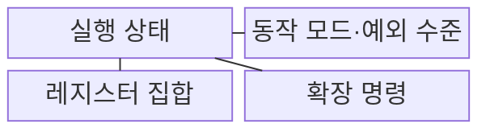
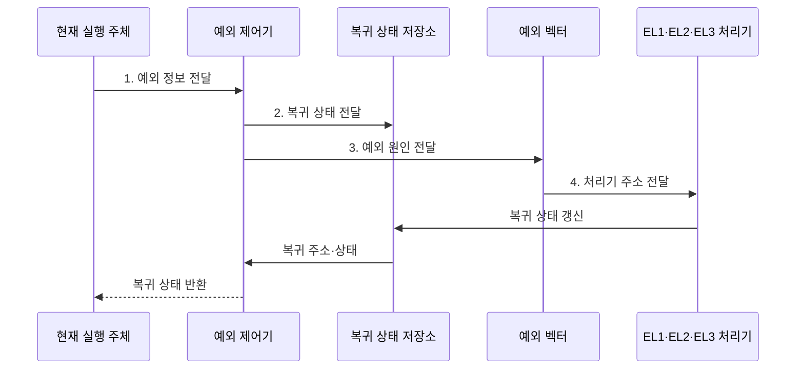

---
sidebar:
  order: 5
  label: "005. ARM 프로세서 아키텍처·동작 모드 (ARM Architecture)"
  badge:
    text: "기출 · 50%"
    variant: note
title: "ARM 프로세서 아키텍처·동작 모드 (ARM Architecture)"
date: "2026-08-02T09:08:00+09:00"
tags:
  - "notes-hardware"
weight: 5
extra:
  question_no: "005"
  source_status: "기출"
  source_history: "126회"
  priority: 50
  priority_note: "임베디드·모바일 설계 기반"
---

## Ⅰ. 개요

핵심 용어

- **Arm 아키텍처**는 로드·스토어 구조에 실행 상태·권한 수준·명령 확장을 결합한 ISA이다.
- **ISA**는 프로세서가 제공하는 명령어·레지스터·데이터 형식과 실행 환경을 소프트웨어에 규정한다.

- 정의/개념: **실행 상태·권한·명령 확장**을 조합한 ISA
- 배경/필요성: 단일 권한•명령 환경으로는 **격리•벡터 연산** 동시 지원 곤란

### 쉽게 이해하기 (학습용)
- Arm은 실행 상태·권한·확장을 조합해 임베디드부터 서버까지 서로 다른 요구를 지원한다.

## Ⅱ. 특징

핵심 용어

- **로드·스토어 구조**는 메모리 접근을 전용 명령으로 처리하고 일반 연산은 레지스터 사이에서 수행한다.
- **코어 IP**는 검증된 프로세서 설계를 다른 SoC에 재사용할 수 있도록 제공하는 설계 블록이다.

- **로드·스토어 구조**로 메모리 접근과 레지스터 연산 분리
- **실행 상태·예외 수준** 조합으로 용도별 코어 분화
- ISA 규격과 **코어 IP** 구현의 분리 공급

### 쉽게 이해하기 (학습용)
- 동일 Arm ISA도 코어 마이크로아키텍처와 지원 확장에 따라 성능·전력 특성이 달라진다.

## Ⅲ. 구조 및 구성요소

핵심 용어

- **AArch64와 AArch32**는 각각 A64 명령어와 A32·T32 명령어를 실행하는 Arm의 64비트 및 32비트 실행 상태이다.
- **예외 수준**은 AArch64의 권한을 응용·커널·하이퍼바이저·보안 모니터 수준으로 구분한다.
- **NEON과 SVE**는 하나의 명령으로 여러 데이터 원소를 처리하는 Arm의 벡터 연산 확장이다.

| 구성요소 | 책임 |
|:---|:---|
| 실행 상태 | 명령 집합·레지스터 폭·**실행 환경** 규정 |
| 동작 모드·예외 수준 | AArch32 모드·AArch64 **EL 격리** |
| 레지스터 집합 | 연산 데이터·주소·상태 **고속 보관** |
| 확장 명령 | **NEON·SVE** 벡터 연산 제공 |

### 쉽게 이해하기 (학습용)
- 실행 상태가 명령과 레지스터 폭을 정하고 예외 수준과 확장 명령이 권한과 병렬 연산을 제공한다.

## Ⅳ. 흐름도

핵심 용어

- **트랩**은 시스템 호출이나 오류를 현재 실행 주체보다 높은 예외 수준의 처리기로 넘기는 제어 전환이다.
- **예외 벡터**는 예외 종류와 실행 수준에 따라 호출할 처리 루틴의 시작 주소를 모아 둔 표이다.
- **복귀 상태**는 예외 처리가 끝난 뒤 원래 흐름으로 돌아가기 위해 보관하는 프로그램 카운터와 상태값이다.

**동작 원리**

- **1. 예외 정보 전달**: 트랩 원인과 현재 실행 수준 제공
- **2. 복귀 상태 전달**: 복귀 주소·상태 보관
- **3. 예외 원인 전달**: 라우팅 규칙으로 대상 EL 선택
- **4. 처리기 주소 전달**: 선택한 EL의 예외 처리기 실행

### 쉽게 이해하기 (학습용)
- 예외가 발생하면 복귀 상태를 저장하고 대상 EL 처리기를 실행한 뒤 원래 흐름으로 돌아간다.

## Ⅴ. 종류 및 비교

핵심 용어

- **SoC**는 프로세서·메모리 제어기·주변장치를 하나의 칩에 통합한 반도체이다.
- **x86-64**는 기존 x86 프로그램과의 호환성을 유지하면서 주소와 레지스터를 64비트로 확장한 ISA이다.
- **레거시 부담**은 이전 세대 명령과 소프트웨어의 호환성을 유지하기 위해 해독 회로와 설계가 복잡해지는 비용이다.

| 명령어 집합 구조 | Arm | x86-64 |
|:---|:---|:---|
| 적용 기준 | 전력 제약·**SoC 통합** | 기존 **x86 바이너리** 호환 |
| 핵심 특징 | **로드·스토어**·정형 인코딩 | **가변 길이 명령**·호환 모드 |
| 한계 | 대상 **ISA·ABI**별 재빌드 | 해독 회로·**레거시** 부담 |

> 요약: 전력·통합성과 기존 바이너리 호환성 비교

### 쉽게 이해하기 (학습용)
- Arm은 SoC 통합과 전력 효율에, x86-64는 기존 바이너리 호환에 강점이 있다.

## Ⅵ. 실무 고려사항 및 대책

핵심 용어

- **ABI**는 함수 인자·반환값에 사용할 레지스터와 스택 및 바이너리 형식을 정의한다.
- **네이티브 라이브러리**는 특정 ISA와 ABI의 기계어로 컴파일되므로 다른 구조로 이식할 때 다시 빌드해야 한다.
- **런타임 기능 탐지**는 실행 중인 코어가 NEON·SVE 등의 확장을 지원하는지 확인하여 적합한 코드 경로를 선택한다.

| 고려사항 | 대책 | 효과 |
|:---|:---|:---|
| 이식 후 **네이티브 라이브러리** 실행 실패 | 대상 **ISA•ABI 재빌드**와 의존성 목록화 | **바이너리 호환 문제** 예방 |
| **예외 수준** 설정 오류로 권한 침범 | EL별 **최소 권한•트랩 경로** 검증 | **커널•가상화 격리** 유지 |
| 배포 장비의 **NEON•SVE** 기능 누락 | **런타임 기능 탐지•대체 코드** 제공 | 다양한 코어의 **실행 호환성** 보장 |
| 기대한 **전력 효율** 미달 | 실제 **SoC•부하별 벤치마크** | **코어•가속기 구성** 최적화 |

### 쉽게 이해하기 (학습용)
- ISA·ABI 호환성, 예외 수준 격리, 확장 지원과 실제 전력 효율을 함께 검증해야 ARM 이식 위험을 줄일 수 있다.

## Ⅶ. 결론

핵심 용어

- **전력 효율**은 같은 작업을 처리하는 데 소비하는 에너지를 기준으로 평가하며 실제 SoC와 부하에서 측정해야 한다.

- 전력•SoC 통합은 **Arm**, 기존 바이너리는 **x86-64** 선택

### 쉽게 이해하기 (학습용)
- 전력·SoC 통합이 중요하면 Arm을 검토하고 네이티브 라이브러리 재빌드 비용을 함께 산정한다.
