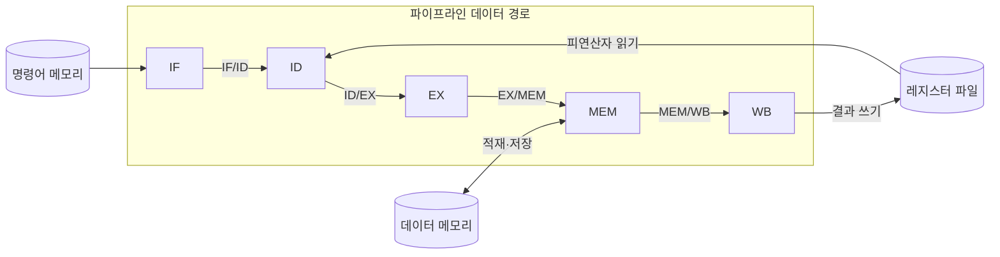

---
sidebar:
  order: 6
  label: "006. 파이프라이닝 기본 구조 5단계 (Pipelining)"
  badge:
    text: "기출 · 50%"
    variant: note
title: "파이프라이닝 기본 구조 5단계 (Pipelining)"
date: "2026-07-28T12:34:29+09:00"
tags:
  - "notes-hardware"
weight: 6
extra:
  question_no: "006"
  source_status: "기출"
  source_history: "122회"
  priority: 50
  priority_note: "처리량 향상과 단계 병목의 기본 구조"
---

## 미리 알고가기

- **파이프라이닝(Pipelining)**: 명령어 처리를 여러 단계로 분할하고 서로 다른 명령어의 각 단계를 중첩 실행하여 처리량을 높이는 CPU 구조
- **명령어 인출(Instruction Fetch, IF)**: 메모리에서 다음 명령어를 가져오는 파이프라인 단계
- **명령어 해독(Instruction Decode, ID)**: 명령어를 해석하고 필요한 피연산자를 읽는 파이프라인 단계
- **실행(Execute, EX)**: 산술·논리 연산 또는 메모리 주소 계산을 수행하는 파이프라인 단계
- **메모리 접근(Memory Access, MEM)**: 적재·저장 명령어가 데이터 메모리를 읽거나 쓰는 파이프라인 단계
- **결과 기록(Write Back, WB)**: 연산 또는 메모리 읽기 결과를 목적 레지스터에 기록하는 파이프라인 단계
- **파이프라인 레지스터(Pipeline Register)**: 각 단계 사이에 놓여 클록이 바뀔 때 중간 결과와 제어 신호를 다음 단계로 넘겨 주는 걸쇠이며, 도식의 `IF/ID`·`ID/EX`처럼 앞뒤 단계 이름을 빗금으로 이어 부른다
- **레지스터 파일(Register File)**: 범용 레지스터를 한데 모아 ID 단계가 피연산자를 읽고 WB 단계가 결과를 적는 저장 구조
- **데이터 경로(Data Path)**: 명령 처리에 필요한 값이 메모리·레지스터·연산기 사이를 실제로 흘러가는 하드웨어 배선 전체
- **클록 주기(Clock Cycle)**: 파이프라인이 한 칸씩 움직이는 기준 시간이며, 가장 오래 걸리는 단계에 맞춰 정해진다
- **지연시간(Latency)**: 명령 하나가 인출부터 결과 기록까지 끝나는 데 걸리는 시간이며, 단계를 나눠도 이 값 자체는 줄지 않는다
- **처리량(Throughput)**: 단위 시간에 끝나는 명령 개수이며 파이프라이닝이 실제로 늘리는 것은 이쪽이다
- **해저드(Hazard)**: 같은 회로를 두 명령이 동시에 쓰려 하거나 앞 명령의 결과를 기다려야 해서 다음 단계로 못 넘어가는 충돌 상태
- **버블(Bubble)**: 해저드 때문에 유효한 명령을 넣지 못해 파이프라인 안에 생기는 빈 칸이며, 그 클록만큼 아무것도 완료되지 않는다
- **파이프라인 플러시(Pipeline Flush)**: 분기를 잘못 예측했을 때 이미 들여보낸 명령을 통째로 무효화하고 올바른 주소부터 다시 채우는 동작
- **포워딩(Forwarding)**: 앞 명령의 결과를 레지스터에 기록될 때까지 기다리지 않고 연산기 출구에서 곧장 뒤 명령의 입력으로 넘겨 대기를 없애는 기법
- **분기 예측(Branch Prediction)**: 분기 결과가 확정되기 전에 어느 쪽으로 갈지 미리 찍어 다음 명령 인출을 멈추지 않게 하는 기법
- **RISC-V**: 단순하고 규칙적인 명령어 형식으로 5단계 파이프라인 구현에 널리 사용하는 개방형 명령어 집합 규격
- **비파이프라인 구조(Non-pipelined Architecture)**: 명령 하나의 다섯 단계를 모두 끝낸 뒤에야 다음 명령을 시작해 겹침이 전혀 없는 실행 구조

## Ⅰ. 개요

- 정의/개념: 명령 단계를 중첩 실행해 **처리량**을 높이는 실행 구조
- 기존 한계: 단일 명령 완료 전에는 후속 명령 **단계 진입 불가**

### 쉽게 이해하기 (학습용)
- 세탁기 한 대로 빨래를 돌리면서 그 빨래를 다 개기 전에는 다음 빨래를 넣지 않는 집을 떠올리면 세탁기와 건조기가 번갈아 놀고 있는 셈인데, 답안이 배경 자리에 이 놀고 있는 회로를 적은 이유는 파이프라이닝이 회로를 더 빠르게 만드는 기술이 아니라 이미 있는 회로를 놀리지 않는 기술이기 때문이다

## Ⅱ. 특징

- 단계 중첩으로 정상 상태 **클록당 1명령 완료**
- **최장 단계** 지연이 전체 클록 주기 좌우
- 개별 명령 지연시간보다 전체 **처리량 향상**에 초점

### 쉽게 이해하기 (학습용)
- 빨래 한 무더기가 세탁부터 개기까지 걸리는 시간은 자리를 나눠도 그대로지만 자리마다 다른 빨래가 돌아가므로 한 시간에 끝나는 무더기 수가 늘고, 대신 전체 박자는 가장 오래 걸리는 자리에 맞춰지므로 건조기가 느리면 세탁기가 아무리 빨라도 그 박자를 따라가야 한다

## Ⅲ. 아키텍처 및 구성요소

| 설계 요소 | 입력·상태 | 역할 |
|:---|:---|:---|
| IF | 프로그램 카운터 | 다음 명령어 인출 |
| ID | 명령어·레지스터 상태 | 명령 해독과 피연산자 확보 |
| EX | 피연산자·연산 코드 | 산술논리 연산·메모리 주소 계산 |
| MEM | 주소·저장값 | 데이터 메모리 읽기·쓰기 |
| WB | 연산·적재 결과 | 목적 레지스터 기록 |

> 요약: 단계 사이 **파이프라인 레지스터**가 중간 결과 보존

### 쉽게 이해하기 (학습용)
- 단계 사이 파이프라인 레지스터가 중간 결과와 제어 신호를 분리해 여러 명령이 서로 다른 단계를 동시에 점유하게 한다.

## Ⅳ. 운영 고려사항

| 실패 징후 | 완화 방안 | 기대 효과 |
|:---|:---|:---|
| 데이터 의존으로 버블 증가 | 포워딩·해저드 검출·명령 스케줄링 | 데이터 대기 감소 |
| 분기 오예측으로 플러시 증가 | 분기 예측기 개선·분기 조기 판정 | 제어 해저드 손실 감소 |
| 특정 단계가 클록 주기를 지배 | 단계 분할·회로 재배치 | 최장 단계 지연 단축 |
| 파이프라인 심화에도 처리량 정체 | IPC·버블·플러시·단계 사용률 측정 | 유효한 단수와 병목 식별 |

### 쉽게 이해하기 (학습용)
- 파이프라인 단수뿐 아니라 버블·플러시와 최장 단계 지연을 함께 줄여야 실제 명령 처리량이 증가한다.

## Ⅴ. 종류 및 비교

| 명령 실행 구조 | 5단계 파이프라인 | 비파이프라인 |
|:---|:---|:---|
| 적용 기준 | 연속 명령의 **처리량**이 중요한 경우 | 회로 면적과 **제어 단순성**이 중요한 경우 |
| 핵심 특징 | 서로 다른 명령의 **단계 동시 점유** | 한 명령의 전 단계 **순차 완료** |
| 한계 | **해저드** 발생 시 버블·플러시 손실 | 전 경로 지연을 합친 **긴 클록 주기** |

> 요약: 파이프라인의 **해저드 손실**을 감수해야 처리량 확보

### 쉽게 이해하기 (학습용)
- 두 칸을 견주면 무엇을 내주고 무엇을 얻는지가 드러나는데, 자리를 안 나눈 쪽은 멈출 일이 없는 대신 한 박자가 다섯 자리를 합친 만큼 길어지고, 자리를 나눈 쪽은 박자를 짧게 줄이는 대신 앞사람 결과를 기다리거나 길을 잘못 들어 빈 박자를 버리는 손실을 떠안는다

## Ⅵ. 실무 사례

1. RISC-V 코어에서 **EX 단계 분할**로 최장 지연 단축

### 쉽게 이해하기 (학습용)
- 다섯 자리 중 곱셈 회로가 든 실행 자리만 유독 오래 걸리면 전체 박자가 거기에 묶이므로, 그 자리를 둘로 쪼개 여섯 자리로 만들면 박자가 짧아져 초당 끝나는 명령 수가 늘어난다

## Ⅶ. 결론

- 단계 지연·해저드 비용이 작으면 **파이프라이닝** 적용

### 쉽게 이해하기 (학습용)
- 단수를 늘린다고 저절로 빨라지지 않고 가장 느린 자리를 쪼개 박자를 줄인 다음, 앞 결과를 곧장 넘겨 주고 갈림길을 미리 찍어 멈추거나 버리는 박자를 없애야 늘린 단수만큼 값을 한다
