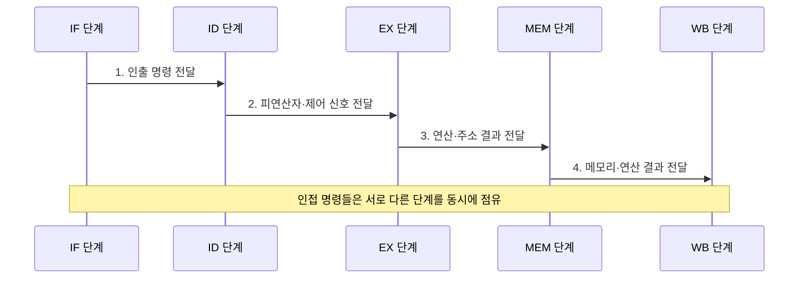

---
sidebar:
  order: 6
  label: "006. 파이프라이닝 기본 구조 5단계 (Pipelining)"
  badge:
    text: "기출 · 50%"
    variant: note
title: "파이프라이닝 기본 구조 5단계 (Pipelining)"
date: "2026-07-30T21:20:28+09:00"
tags:
  - "notes-hardware"
weight: 6
extra:
  question_no: "006"
  source_status: "기출"
  source_history: "122회"
  priority: 50
  priority_note: "처리량 향상과 단계 병목의 기본 구조"
---

## 미리 알고가기

- **파이프라이닝(Pipelining)**: 명령어 처리를 여러 단계로 분할하고 서로 다른 명령어의 각 단계를 중첩 실행하여 처리량을 높이는 CPU 구조
- **명령어 인출(Instruction Fetch, IF)**: 메모리에서 다음 명령어를 가져오는 파이프라인 단계
- **명령어 해독(Instruction Decode, ID)**: 명령어를 해석하고 필요한 피연산자를 읽는 파이프라인 단계
- **실행(Execute, EX)**: 산술·논리 연산 또는 메모리 주소 계산을 수행하는 파이프라인 단계
- **메모리 접근(Memory Access, MEM)**: 적재·저장 명령어가 데이터 메모리를 읽거나 쓰는 파이프라인 단계
- **결과 기록(Write Back, WB)**: 연산 또는 메모리 읽기 결과를 목적 레지스터에 기록하는 파이프라인 단계
- **파이프라인 레지스터(Pipeline Register)**: 각 단계 사이에 놓여 클록이 바뀔 때 중간 결과와 제어 신호를 다음 단계로 넘겨 주는 걸쇠이며, 도식의 `IF/ID`·`ID/EX`처럼 앞뒤 단계 이름을 빗금으로 이어 부른다
- **레지스터 파일(Register File)**: 범용 레지스터를 한데 모아 ID 단계가 피연산자를 읽고 WB 단계가 결과를 적는 저장 구조
- **데이터 경로(Data Path)**: 명령 처리에 필요한 값이 메모리·레지스터·연산기 사이를 실제로 흘러가는 하드웨어 배선 전체
- **클록 주기(Clock Cycle)**: 파이프라인이 한 칸씩 움직이는 기준 시간이며, 가장 오래 걸리는 단계에 맞춰 정해진다
- **지연시간(Latency)**: 명령 하나가 인출부터 결과 기록까지 끝나는 데 걸리는 시간이며, 단계를 나눠도 이 값 자체는 줄지 않는다
- **처리량(Throughput)**: 단위 시간에 끝나는 명령 개수이며 파이프라이닝이 실제로 늘리는 것은 이쪽이다
- **해저드(Hazard)**: 같은 회로를 두 명령이 동시에 쓰려 하거나 앞 명령의 결과를 기다려야 해서 다음 단계로 못 넘어가는 충돌 상태
- **버블(Bubble)**: 해저드 때문에 유효한 명령을 넣지 못해 파이프라인 안에 생기는 빈 칸이며, 그 클록만큼 아무것도 완료되지 않는다
- **파이프라인 플러시(Pipeline Flush)**: 분기를 잘못 예측했을 때 이미 들여보낸 명령을 통째로 무효화하고 올바른 주소부터 다시 채우는 동작
- **포워딩(Forwarding)**: 앞 명령의 결과를 레지스터에 기록될 때까지 기다리지 않고 연산기 출구에서 곧장 뒤 명령의 입력으로 넘겨 대기를 없애는 기법
- **분기 예측(Branch Prediction)**: 분기 결과가 확정되기 전에 어느 쪽으로 갈지 미리 찍어 다음 명령 인출을 멈추지 않게 하는 기법
- **RISC-V**: 단순하고 규칙적인 명령어 형식으로 5단계 파이프라인 구현에 널리 사용하는 개방형 명령어 집합 규격
- **비파이프라인 구조(Non-pipelined Architecture)**: 명령 하나의 다섯 단계를 모두 끝낸 뒤에야 다음 명령을 시작해 겹침이 전혀 없는 실행 구조
- **단일 발행(Single Issue)**: 한 클록 주기에 최대 한 개의 새 명령을 파이프라인에 투입하는 구조
- **클록당 명령 수(Instructions Per Cycle, IPC)**: 프로세서가 한 클록 주기에 완료한 평균 명령어 수
- **해저드 검출기(Hazard Detection Unit)**: 명령 간 데이터·구조·제어 충돌을 찾아 정지·우회·플러시를 지시하는 제어 회로
- **명령 스케줄링(Instruction Scheduling)**: 데이터 의존성을 지키면서 실행 순서를 조정해 파이프라인 대기를 줄이는 기법
- **우회 경로(Bypass Path)**: 실행 결과를 레지스터 파일을 거치지 않고 뒤 명령의 입력으로 직접 전달하는 회로

## Ⅰ. 개요

- 정의/개념: 여러 명령의 실행 단계를 겹치는 **처리량 향상 구조**
- 배경/필요성: 비파이프라인은 한 명령 완료까지 **후속 명령 시작 불가**

### 쉽게 이해하기 (학습용)
- 파이프라이닝은 서로 다른 명령이 각 처리 단계를 동시에 사용하게 해 유휴 시간을 줄인다.

## Ⅱ. 특징

- 단계 중첩으로 이상적 단일 발행에서 **클록당 1명령 완료**
- **최장 단계** 지연이 전체 클록 주기 좌우
- 개별 명령 지연시간보다 전체 **처리량 향상**에 초점

### 쉽게 이해하기 (학습용)
- 개별 명령 지연은 줄지 않아도 단계 중첩으로 단위 시간당 완료 명령 수는 늘어난다.

## Ⅲ. 구조 및 구성요소

| 구성요소 | 책임 |
|:---|:---|
| IF | 프로그램 카운터 기반 **명령어 인출** |
| ID | 명령 해독과 **피연산자 확보** |
| EX | 산술논리 연산·**메모리 주소 계산** |
| MEM | 데이터 메모리 **읽기·쓰기** |
| WB | 목적 레지스터 **결과 기록** |

> 요약: 단계 사이 **파이프라인 레지스터**로 중간 결과 격리

### 쉽게 이해하기 (학습용)
- IF부터 WB까지 각 단계가 서로 다른 명령을 동시에 처리해 완료 처리량을 높인다.

## Ⅳ. 흐름도

**동작 원리**

- **1. 인출 명령 전달**: 명령·PC값을 IF/ID에 저장
- **2. 피연산자·제어 신호 전달**: 해독 결과를 ID/EX에 저장
- **3. 연산·주소 결과 전달**: ALU·주소 결과 저장
- **4. 메모리·연산 결과 전달**: 접근값·연산값을 목적 레지스터에 기록

### 쉽게 이해하기 (학습용)
- 단계 사이 파이프라인 레지스터가 중간 결과와 제어 신호를 분리해 여러 명령이 서로 다른 단계를 동시에 점유하게 한다.

## Ⅴ. 종류 및 비교

| 명령 실행 구조 | 5단계 파이프라인 | 비파이프라인 |
|:---|:---|:---|
| 적용 기준 | 연속 명령 **처리량** | 회로 면적·**제어 단순성** |
| 핵심 특징 | 서로 다른 명령의 **단계 중첩** | 한 명령의 전 단계 **순차 완료** |
| 한계 | 해저드의 **버블·플러시** | 전 경로를 합친 **긴 주기** |

> 요약: 처리량 이득과 해저드 손실 비교

### 쉽게 이해하기 (학습용)
- 파이프라인은 단계를 겹쳐 처리량을 높이지만 해저드가 생기면 빈 주기가 발생한다.

## Ⅵ. 실무 고려사항 및 대책

| 고려사항 | 대책 | 효과 |
|:---|:---|:---|
| **데이터 의존•버블** 증가 | **포워딩•해저드 검출**과 명령 스케줄링 | **데이터 대기** 감소 |
| **분기 오예측•플러시** 증가 | **분기 예측•조기 판정** 개선 | **제어 해저드 손실** 감소 |
| 특정 단계가 **클록 주기** 지배 | **단계 분할•회로 재배치** | **최장 단계 지연** 단축 |
| 파이프라인 심화에도 **처리량 정체** | **IPC•버블**·플러시와 단계 사용률 측정 | 유효 **파이프라인 단수•병목** 식별 |
| RISC-V 코어의 **긴 EX 지연** | EX 단계 분할·**우회 경로** 재검증 | **클록 주기** 단축 |

### 쉽게 이해하기 (학습용)
- 파이프라인 단수뿐 아니라 버블·플러시와 최장 단계 지연을 함께 줄여야 실제 명령 처리량이 증가한다.

## Ⅶ. 결론

- IPC 손실이 큰 **최장 단계•버블•플러시**부터 개선

### 쉽게 이해하기 (학습용)
- 최장 단계 지연과 버블·플러시 비용을 함께 줄여야 파이프라인 처리량이 향상된다.
