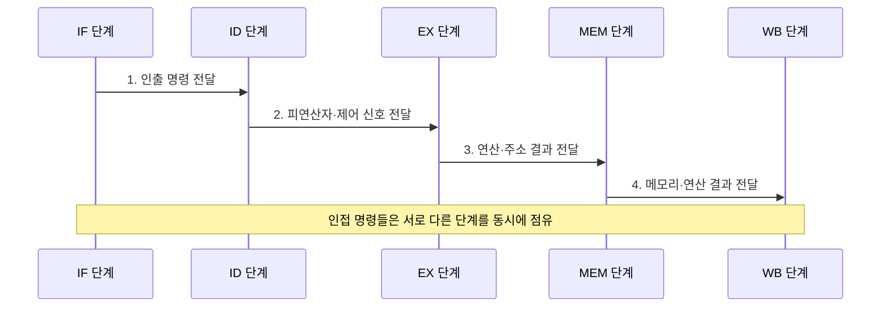

---
sidebar:
  order: 6
  label: "006. 파이프라이닝 기본 구조 5단계 (Pipelining)"
  badge:
    text: "기출 · 50%"
    variant: note
title: "파이프라이닝 기본 구조 5단계 (Pipelining)"
date: "2026-08-02T09:10:00+09:00"
tags:
  - "notes-hardware"
weight: 6
extra:
  question_no: "006"
  source_status: "기출"
  source_history: "122회"
  priority: 50
  priority_note: "처리량 향상과 단계 병목의 기본 구조"
---

## Ⅰ. 개요

핵심 용어

- **파이프라이닝**은 명령 처리를 여러 단계로 나누고 서로 다른 명령어의 단계를 겹쳐 실행하여 처리량을 높이는 CPU 구조이다.
- **비파이프라인 구조**는 한 명령어의 모든 단계를 마친 뒤 다음 명령어를 시작하므로 단계가 중첩되지 않는다.

- 정의/개념: **파이프라이닝**은 명령 처리를 단계로 나누고 서로 다른 명령의 단계를 겹쳐 실행하는 **처리량 향상 구조**
- 배경/필요성: 비파이프라인은 한 명령 완료까지 **후속 명령 시작 불가**

#### 한줄 요약
- 파이프라이닝은 서로 다른 명령이 각 처리 단계를 동시에 사용하게 해 유휴 시간을 줄인다.

## Ⅱ. 특징

핵심 용어

- **처리량**은 단위 시간에 완료하는 명령어 수이며 파이프라이닝이 직접 높이려는 성능 지표이다.
- **지연시간**은 명령어 하나가 인출부터 결과 기록까지 걸리는 시간으로, 단계 중첩만으로 반드시 줄어들지는 않는다.
- **IPC**는 프로세서가 클록 한 주기에 완료하는 평균 명령어 수이다.

- 단계 중첩으로 이상적 단일 발행에서 **클록당 1명령 완료**
- **최장 단계** 지연이 전체 클록 주기 좌우
- 개별 명령 지연시간보다 전체 **처리량 향상**에 초점

#### 한줄 요약
- 개별 명령 지연은 줄지 않아도 단계 중첩으로 단위 시간당 완료 명령 수는 늘어난다.

## Ⅲ. 구조 및 구성요소

핵심 용어

- **IF·ID·EX·MEM·WB**는 각각 명령어 인출, 해독과 피연산자 읽기, 연산과 주소 계산, 메모리 접근, 결과 기록을 담당한다.
- **파이프라인 레지스터**는 각 단계의 중간 결과와 제어 신호를 다음 클록에 후속 단계로 전달한다.

| 구성요소 | 책임 |
|:---|:---|
| IF | 프로그램 카운터 기반 **명령어 인출** |
| ID | 명령 해독과 **피연산자 확보** |
| EX | 산술논리 연산·**메모리 주소 계산** |
| MEM | 데이터 메모리 **읽기·쓰기** |
| WB | 목적 레지스터 **결과 기록** |

> 요약: 단계 사이 **파이프라인 레지스터**로 중간 결과 격리

#### 한줄 요약
- IF부터 WB까지 각 단계가 서로 다른 명령을 동시에 처리해 완료 처리량을 높인다.

## Ⅳ. 흐름도

핵심 용어

- **데이터 경로**는 명령 처리 값이 메모리·레지스터·연산기 사이를 이동하는 하드웨어 경로이다.
- **레지스터 파일**은 ID 단계에서 피연산자를 제공하고 WB 단계에서 결과를 저장하는 범용 레지스터 묶음이다.

**동작 원리**

- **1. 인출 명령 전달**: 명령·PC값을 IF/ID에 저장
- **2. 피연산자·제어 신호 전달**: 해독 결과를 ID/EX에 저장
- **3. 연산·주소 결과 전달**: ALU·주소 결과 저장
- **4. 메모리·연산 결과 전달**: 접근값·연산값을 목적 레지스터에 기록

#### 한줄 요약
- 단계 사이 파이프라인 레지스터가 중간 결과와 제어 신호를 분리해 여러 명령이 서로 다른 단계를 동시에 점유하게 한다.

## Ⅴ. 종류 및 비교

핵심 용어

- **해저드**는 자원 충돌이나 명령 간 의존성 때문에 다음 파이프라인 단계로 진행할 수 없는 상태이다.
- **버블**은 해저드로 유효한 명령을 투입하지 못해 파이프라인에 생기는 빈 처리 주기이다.
- **플러시**는 분기 예측이 빗나갔을 때 잘못 인출한 명령을 무효화하고 올바른 경로를 다시 채우는 동작이다.

| 명령 실행 구조 | 5단계 파이프라인 | 비파이프라인 |
|:---|:---|:---|
| 적용 기준 | 연속 명령 **처리량** | 회로 면적·**제어 단순성** |
| 핵심 특징 | 서로 다른 명령의 **단계 중첩** | 한 명령의 전 단계 **순차 완료** |
| 한계 | 해저드의 **버블·플러시** | 전 경로를 합친 **긴 주기** |

> 요약: 처리량 이득과 해저드 손실 비교

#### 한줄 요약
- 파이프라인은 단계를 겹쳐 처리량을 높이지만 해저드가 생기면 빈 주기가 발생한다.

## Ⅵ. 실무 고려사항 및 대책

핵심 용어

- **포워딩**은 앞 명령의 결과를 레지스터 기록 전에 뒤 명령의 입력으로 직접 전달하여 데이터 대기를 줄인다.
- **분기 예측**은 분기 결과가 확정되기 전에 다음 실행 경로를 예측하여 명령어 인출을 계속한다.
- **해저드 검출기**는 명령 간 충돌을 찾아 파이프라인 정지·우회·플러시를 제어한다.

| 문제 | 대책 | 효과 |
|:---|:---|:---|
| **데이터 의존•버블** 증가 | **포워딩•해저드 검출**과 명령 스케줄링 | **데이터 대기** 감소 |
| **분기 오예측•플러시** 증가 | **분기 예측•조기 판정** 개선 | **제어 해저드 손실** 감소 |
| 특정 단계가 **클록 주기** 지배 | **단계 분할•회로 재배치** | **최장 단계 지연** 단축 |
| 파이프라인 심화에도 **처리량 정체** | **IPC•버블**·플러시와 단계 사용률 측정 | 유효 **파이프라인 단수•병목** 식별 |
| RISC-V 코어의 **긴 EX 지연** | EX 단계 분할·**우회 경로** 재검증 | **클록 주기** 단축 |

#### 한줄 요약
- 파이프라인 단수뿐 아니라 버블·플러시와 최장 단계 지연을 함께 줄여야 실제 명령 처리량이 증가한다.

## Ⅶ. 결론

핵심 용어

- **최장 단계 지연**은 파이프라인의 최소 클록 주기를 결정하므로 버블·플러시와 함께 실제 처리량을 제한한다.

- IPC 손실이 큰 **최장 단계•버블•플러시**부터 개선

#### 한줄 요약
- 최장 단계 지연과 버블·플러시 비용을 함께 줄여야 파이프라인 처리량이 향상된다.
