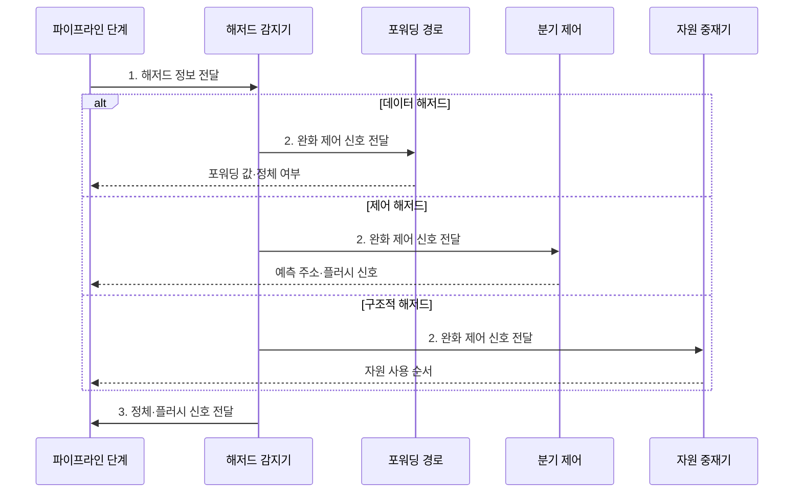

---
sidebar:
  order: 7
  label: "007. 파이프라인 해저드: 데이터·제어·구조 (Pipeline Hazards)"
  badge:
    text: "기출 · 70%"
    variant: note
title: "파이프라인 해저드: 데이터·제어·구조 (Pipeline Hazards)"
date: "2026-08-02T09:12:00+09:00"
tags:
  - "notes-hardware"
weight: 7
extra:
  question_no: "007"
  source_status: "기출"
  source_history: "122회, 135회"
  priority: 70
  priority_note: "반복 기출, 데이터·제어 대응 핵심"
---

## Ⅰ. 개요

핵심 용어

- **파이프라인 해저드**는 데이터 의존성·분기 결정 지연·자원 충돌 때문에 명령어의 중첩 실행이 지연되거나 잘못될 수 있는 조건이다.

- 정의/개념: 자원·데이터·분기 충돌로 **파이프라인이 지연되는 현상**
- 배경/필요성: 원인 분류 없이는 **포워딩•예측•중재** 대책 선택 불가

### 쉽게 이해하기 (학습용)
- 파이프라인 정체의 원인을 데이터 의존, 분기 지연, 자원 경합으로 구분해야 포워딩·예측·자원 복제 중 맞는 대응을 선택할 수 있다.

## Ⅱ. 특징

핵심 용어

- **CPI**는 명령어 하나를 완료하는 데 필요한 평균 클록 사이클 수이며 해저드로 정체가 늘면 함께 증가한다.
- **플러시**는 잘못 예측한 경로의 명령어를 무효화하고 올바른 분기 주소부터 파이프라인을 다시 채우는 동작이다.

- 단계 중첩 자체가 만드는 **의존·자원 충돌**
- 충돌 한 번이 **CPI 증가**로 처리량 직접 감소
- 분기 판정이 늦을수록 증가하는 **오경로 명령 폐기량**

### 쉽게 이해하기 (학습용)
- 단계 중첩은 의존·자원 충돌을 만들며 정체와 플러시는 평균 CPI를 높인다.

## Ⅲ. 구조 및 구성요소

핵심 용어

- **해저드 감지기**는 원천·목적 레지스터와 자원 사용을 비교하여 정체·포워딩·플러시 여부를 결정한다.
- **포워딩 경로**는 앞 명령의 결과를 레지스터 기록 전에 후속 명령의 실행 입력으로 직접 전달한다.
- **자원 중재기**는 같은 하드웨어 자원을 요구하는 명령 사이에서 사용 순서를 정한다.

| 구성요소 | 책임 |
|:---|:---|
| 파이프라인 단계 | 중첩 명령의 **데이터 경로 실행** |
| 해저드 감지기 | 의존·충돌 판정과 **정체 제어** |
| 포워딩 경로 | 레지스터 기록 전에 **후속 실행 입력으로 결과 전달** |
| 자원 중재기 | 공유 자원의 **사용 순서 결정** |
| 분기 제어 | 인출 주소 선택과 **플러시 제어** |

### 쉽게 이해하기 (학습용)
- 감지기가 원인을 판정하면 포워딩·중재·분기 제어가 파이프라인에 맞는 완화 신호를 보낸다.

## Ⅳ. 흐름도

핵심 용어

- **원천·목적 레지스터**는 명령어가 각각 읽는 피연산자 위치와 결과를 기록하는 위치이며, 이 관계로 데이터 의존성을 판정한다.
- **분기 제어**는 분기 조건과 대상을 판정하여 다음 명령어의 인출 주소와 플러시 여부를 결정한다.

**동작 원리**

- **1. 해저드 정보 전달**: 의존 레지스터·분기·자원 요구 제공
- **2. 완화 제어 신호 전달**: 포워딩·예측·중재 방식 지정
- **3. 정체·플러시 신호 전달**: 파이프라인 상태에 제어 결과 반영

### 쉽게 이해하기 (학습용)
- 해저드 제어 회로는 충돌 원인에 따라 우회·정체·중재·플러시 신호를 파이프라인에 전달한다.

## Ⅴ. 종류 및 비교

핵심 용어

- **데이터 해저드**는 앞 명령이 생성할 값을 뒤 명령이 먼저 읽으려 할 때 발생한다.
- **제어 해저드**는 분기 방향과 대상 주소가 확정되기 전에 후속 명령을 인출하여 발생한다.
- **구조적 해저드**는 여러 명령이 같은 메모리 포트나 연산기를 같은 클록에 요구하여 발생한다.

| 파이프라인 해저드 | 데이터 해저드 | 제어 해저드 | 구조적 해저드 |
|:---|:---|:---|:---|
| 적용 기준 | 후행 명령의 **선행 결과** 참조 | 분기 **방향·대상** 미확정 | 동일 **포트·연산기** 요구 |
| 핵심 특징 | **RAW** 읽기 순서 충돌 | 확정 전 **추측 인출** | 단일 자원의 **동시 경합** |
| 한계 | 적재-사용의 **잔여 정체** | 오예측 시 **플러시** | 자원 복제 전 **직렬 대기** |

> 요약: 원인별 **포워딩•예측•자원 복제**로 대응

### 쉽게 이해하기 (학습용)
- 값 지연은 포워딩, 분기 불확실성은 예측, 자원 경합은 복제·중재로 완화한다.

## Ⅵ. 실무 고려사항 및 대책

핵심 용어

- **RAW 의존**은 앞 명령이 기록할 값을 뒤 명령이 읽어야 하는 실제 데이터 의존성이다.
- **적재-사용 의존**은 메모리 적재값이 준비되기 전에 후속 명령이 이를 요구하여 포워딩 뒤에도 정체가 남는 의존성이다.
- **분기 대상 버퍼**는 이전 분기의 주소와 이동 대상을 저장하여 예측한 다음 인출 주소를 빠르게 제공한다.

| 고려사항 | 대책 | 효과 |
|:---|:---|:---|
| **RAW 의존**으로 데이터 정체 증가 | **포워딩•명령 스케줄링** 적용 | **레지스터 기록 대기** 감소 |
| **적재-사용 의존**의 잔여 버블 | **해저드 감지•독립 명령 재배치** | **Load-Use 정체** 완화 |
| **분기 오예측•플러시** 증가 | **예측기•분기 대상 버퍼**·조기 판정 개선 | **제어 해저드 비용** 감소 |
| **단일 포트•연산기 경합** 증가 | 자원 복제·**다중 포트•중재 정책** 적용 | **구조적 해저드** 감소 |
| **EX 결과**의 레지스터 기록 대기 | 후속 EX 입력으로 **결과 직접 전달** | **RAW 정체** 감소 |

### 쉽게 이해하기 (학습용)
- 해저드 유형별 발생 횟수와 추가 CPI를 측정해야 면적·전력 비용 대비 가장 큰 완화 효과를 내는 회로를 선택할 수 있다.

## Ⅶ. 결론

핵심 용어

- **명령 스케줄링**은 데이터 의존성을 지키면서 독립 명령을 재배치하여 파이프라인 정체를 줄이는 기법이다.

- RAW는 **포워딩**, 분기는 **예측**, 자원 경합은 복제 선택

### 쉽게 이해하기 (학습용)
- 해저드 완화 회로는 CPI 감소 효과와 면적·전력 비용을 함께 비교해 선택한다.
