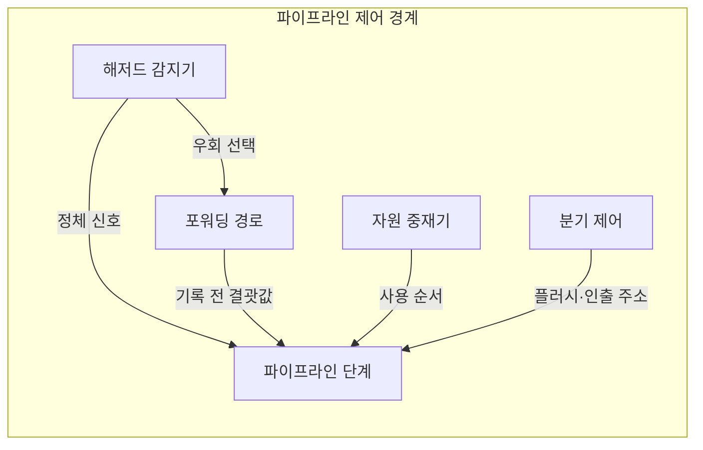

---
sidebar:
  order: 7
  label: "007. 파이프라인 해저드 — 데이터·제어·구조 (Pipeline Hazards)"
  badge:
    text: "기출 · 70%"
    variant: note
title: "파이프라인 해저드 — 데이터·제어·구조 (Pipeline Hazards)"
date: "2026-07-28T12:35:26+09:00"
tags:
  - "notes-hardware"
weight: 7
extra:
  question_no: "007"
  source_status: "기출"
  source_history: "122회, 135회"
  priority: 70
  priority_note: "반복 기출, 데이터·제어 대응 핵심"
---

## 미리 알고가기

- **파이프라인 해저드(Pipeline Hazard)**: 데이터 의존성·자원 충돌·분기 결정 지연으로 명령어의 중첩 실행이 중단되거나 잘못될 수 있는 조건
- **데이터 해저드(Data Hazard)**: 앞 명령이 만들 값을 뒤 명령이 먼저 읽으려 해서 생기는 순서 충돌
- **제어 해저드(Control Hazard)**: 분기 방향과 갈 주소가 확정되기 전에 다음 명령을 이미 인출해 버려 생기는 충돌
- **구조적 해저드(Structural Hazard)**: 여러 명령이 같은 메모리 포트나 연산기를 같은 클록에 요구해 생기는 충돌
- **쓰기 후 읽기(Read After Write, RAW)**: 앞 명령어가 기록할 값을 뒤 명령어가 읽어야 하는 실제 데이터 의존성
- **적재-사용 의존(Load-Use Dependency)**: 메모리에서 값을 읽어 오는 명령 바로 다음에 그 값을 쓰는 명령이 오는 경우이며, 값이 MEM 단계에서야 나오므로 포워딩을 써도 한 클록은 못 메운다
- **명령어당 사이클(Cycles Per Instruction, CPI)**: 명령어 하나를 완료하는 데 필요한 평균 클록 사이클 수
- **처리량(Throughput)**: 단위 시간에 끝나는 명령 개수이며 CPI가 커지면 그만큼 줄어든다
- **정체(Stall)**: 충돌이 풀릴 때까지 뒤 단계에 유효한 명령을 넣지 않고 파이프라인을 세워 두는 대응
- **파이프라인 플러시(Pipeline Flush)**: 분기를 잘못 찍었을 때 이미 들여보낸 명령을 전부 무효화하고 올바른 주소부터 다시 채우는 대응
- **포워딩 경로(Forwarding Path)**: 앞 명령의 결과를 레지스터에 적히기 전에 연산기 출구에서 곧장 뒤 명령의 입력으로 넘겨 정체를 없애는 우회 배선
- **해저드 감지기(Hazard Detector)**: 인접 명령의 원천·목적 레지스터와 자원 사용을 맞대어 보고 정체를 걸지 포워딩을 켤지 판정하는 제어 회로
- **원천·목적 레지스터(Source/Destination Register)**: 명령이 읽을 피연산자가 담긴 레지스터가 원천, 결과를 적을 레지스터가 목적이며 둘이 겹칠 때 데이터 해저드가 성립한다
- **자원 중재기(Resource Arbiter)**: 같은 자원을 요구하는 명령들 사이에서 사용 순서를 정해 구조적 해저드를 처리하는 회로
- **분기 제어(Branch Control)**: 분기 조건과 갈 주소를 판정해 다음에 인출할 명령 주소를 고르는 제어 기능
- **분기 대상(Branch Target)**: 분기가 성립했을 때 제어 흐름이 옮겨 갈 명령 주소
- **분기 예측기(Branch Predictor)**: 과거 분기 이력으로 다음 분기의 방향과 대상을 미리 찍어 인출이 멈추지 않게 하는 회로
- **실행 단계(Execute, EX)**: 산술·논리 연산과 주소 계산을 수행하여 후속 명령어에 전달할 결과를 생성하는 단계

## Ⅰ. 개요

- 정의/개념: 자원·의존·분기 충돌로 **CPI**가 증가하는 현상
- 기존 한계: 원인 구분 없이는 포워딩·예측 중 **대응 선택 불가**

### 쉽게 이해하기 (학습용)
- 파이프라인 정체의 원인을 데이터 의존, 분기 지연, 자원 경합으로 구분해야 포워딩·예측·자원 복제 중 맞는 대응을 선택할 수 있다.

## Ⅱ. 특징

- 단계 중첩 자체가 만드는 **의존·자원 충돌**
- 충돌 한 번이 **CPI 증가**로 처리량 직접 감소
- 분기 판정이 늦을수록 증가하는 **오경로 명령 폐기량**

### 쉽게 이해하기 (학습용)
- 자리를 나눠 겹쳐 일하게 만든 순간부터 앞사람 손이 아직 안 끝난 부품을 뒷사람이 집으려 드는 일이 필연으로 따라붙고, 한 번 멈출 때마다 그 클록에는 아무 명령도 완성되지 않아 초당 처리 수가 곧바로 깎이며, 라인을 길게 늘여 놓았을수록 갈림길을 잘못 들었을 때 버려야 할 사람 수가 그만큼 늘어난다

## Ⅲ. 아키텍처 및 구성요소

| 설계 요소 | 입력·상태 | 역할 |
|:---|:---|:---|
| 파이프라인 단계 | 중첩 명령·단계 상태 | 명령 데이터 경로 실행 |
| 해저드 감지기 | 원천·목적 레지스터·자원 상태 | 의존·충돌 판정과 정체 제어 |
| 포워딩 경로 | 기록 전 결과 | 후속 명령 실행 입력으로 우회 |
| 자원 중재기 | 동시 자원 요청 | 공유 자원의 사용 순서 결정 |
| 분기 제어 | 분기 조건·대상 | 인출 주소 선택과 플러시 제어 |

> 요약: **해저드 감지기** 판정에 따라 우회·정체·중재 경로 분기

### 쉽게 이해하기 (학습용)
- 그림에서 화살표가 대부분 파이프라인 한 칸으로 꽂히는 이유는 이 회로들이 스스로 계산을 하는 것이 아니라 흐르는 명령을 세우거나 값을 옆길로 넣어 주는 감독 역할만 하기 때문이며, 그중에서도 감지기 하나가 먼저 원인을 가려 준 뒤에야 옆길을 열지 아예 세울지가 갈린다

## Ⅳ. 운영 고려사항

| 실패 징후 | 완화 방안 | 기대 효과 |
|:---|:---|:---|
| RAW 의존으로 데이터 정체 증가 | 포워딩 경로·컴파일러 명령 스케줄링 | 레지스터 기록 대기 감소 |
| 적재 직후 사용에서 잔여 버블 | 해저드 감지·명령 재배치·비차단 캐시 검토 | Load-Use 정체 완화 |
| 분기 오예측 플러시 증가 | 예측기·분기 대상 버퍼·조기 판정 개선 | 제어 해저드 비용 감소 |
| 단일 포트·연산기 경합 증가 | 자원 복제·다중 포트·중재 정책 조정 | 구조적 해저드 감소 |

### 쉽게 이해하기 (학습용)
- 해저드 유형별 발생 횟수와 추가 CPI를 측정해야 면적·전력 비용 대비 가장 큰 완화 효과를 내는 회로를 선택할 수 있다.

## Ⅴ. 종류 및 비교

| 파이프라인 해저드 | 데이터 해저드 | 제어 해저드 | 구조적 해저드 |
|:---|:---|:---|:---|
| 적용 기준 | 후행 명령이 선행 **연산 결과**를 읽는 경우 | 조건 분기의 **분기 대상**이 미확정인 경우 | 같은 **포트·연산기**를 동시에 요구하는 경우 |
| 핵심 특징 | **RAW** 의존에 따른 읽기 순서 충돌 | 대상 확정 전 **선행 인출** 진행 | 단일 포트·연산기 **자원 경합** |
| 한계 | **적재-사용 의존**은 포워딩으로도 잔여 정체 | 오예측 시 **플러시**로 오경로 인출분 폐기 | 자원 복제 없이는 **직렬 대기** 불가피 |

> 요약: 원인이 달라 **포워딩·분기 예측·자원 복제**로 각각 대응

### 쉽게 이해하기 (학습용)
- 세 칸을 가로로 읽으면 왜 대응 회로를 하나로 합칠 수 없는지가 보이는데, 값이 늦게 나오는 문제는 옆길을 뚫어야 하고 길을 모르는 문제는 미리 찍어야 하며 도구가 하나뿐인 문제는 도구를 더 사야 하는 것이라, 옆길을 아무리 넓혀도 드라이버가 한 자루면 두 사람은 여전히 기다린다

## Ⅵ. 실무 사례

1. 프로세서 데이터 경로에서 **EX 결과**를 후속 입력으로 우회

### 쉽게 이해하기 (학습용)
- 앞 명령이 방금 계산해 낸 값을 굳이 레지스터에 적었다가 다시 꺼내 오면 두세 박자를 버리게 되므로, 연산기 출구에서 곧장 뒤 명령의 입력단으로 선을 하나 더 뽑아 그 사이를 건너뛴다

## Ⅶ. 결론

- 원인별 **포워딩·예측·자원 복제**로 해저드 완화

### 쉽게 이해하기 (학습용)
- 옆길 배선도 예측표도 공짜가 아니라 칩 면적과 전력을 먹으므로, 그 회로를 넣어 줄어드는 평균 클록 수가 늘어나는 면적·전력 값을 넘는지 계산해 본 뒤에만 넣는다
