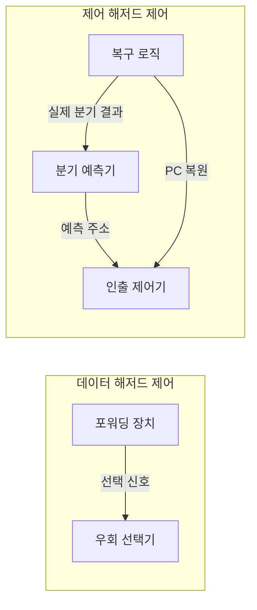
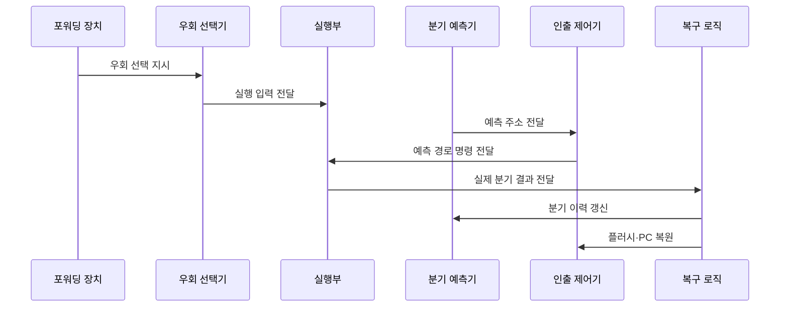

---
sidebar:
  order: 8
  label: "008. 파이프라인 포워딩·분기 예측 (Pipeline Forwarding Branch Prediction)"
  badge:
    text: "기출 · 50%"
    variant: note
title: "파이프라인 포워딩·분기 예측 (Pipeline Forwarding Branch Prediction)"
date: "2026-07-27T23:59:59+09:00"
tags:
  - "notes-hardware"
weight: 8
extra:
  question_no: "008"
  source_status: "기출"
  source_history: "122회"
  priority: 50
  priority_note: "포워딩·분기 예측 처리량 분석"
---

## 미리 알고가기

- **포워딩·분기 예측(Forwarding and Branch Prediction)**: 앞사람이 방금 깎아 낸 부품을 창고에 넣었다 꺼내지 않고 곧바로 옆 작업대에 건네주는 것이 포워딩이고, 갈림길 표지판이 아직 안 켜졌어도 늘 가던 쪽으로 미리 사람을 보내 두는 것이 분기 예측이며, 파이프라인이 서 있는 두 가지 이유를 각각 없애는 짝지은 기법이다
- **명령어 파이프라인(Instruction Pipeline)**: 여러 명령의 처리 단계를 겹쳐 실행해 처리량을 높이는 구조이며, 이 두 기법이 줄이려는 대기가 바로 여기서 생긴다
- **포워딩(Forwarding)**: 앞 명령의 결과를 레지스터에 적히기 전에 뒤 명령의 실행 입력으로 곧장 넘겨 대기를 없애는 기법
- **분기 예측(Branch Prediction)**: 분기 결과가 확정되기 전에 방향과 갈 주소를 미리 찍어 명령 인출을 멈추지 않게 하는 기법
- **쓰기 후 읽기(Read After Write, RAW)**: ‘로우’로 읽고 영문 머리글자를 단어처럼 읽는 약어이며, 앞 명령이 쓸 값을 뒤 명령이 읽는 의존이다
- **적재-사용 의존(Load-Use Dependency)**: 메모리에서 값을 읽는 명령 바로 뒤에 그 값을 쓰는 명령이 오는 경우이며, 값이 메모리 접근 단계에서야 나오므로 포워딩을 켜도 한 클록은 못 메운다
- **원천·목적 레지스터(Source/Destination Register)**: 명령이 읽을 값이 담긴 레지스터가 원천, 결과를 적을 레지스터가 목적이며 두 번호가 겹치는지로 의존을 판정한다
- **분기 방향·분기 대상(Branch Direction/Target)**: 분기를 실제로 뛰는지 여부와 뛴다면 갈 명령 주소이며, 예측기가 찍은 값과 실행부가 확정한 값을 이 둘로 맞대어 본다
- **분기 이력(Branch History)**: 같은 분기가 지난번에 어느 쪽으로 갔는지를 적어 둔 기록이며 다음 예측의 근거가 된다
- **오예측(Misprediction)**: 예측한 방향·대상이 실제와 달라 이미 인출해 둔 명령이 전부 헛일이 되는 상황
- **플러시(Flush)**: 오예측 경로에서 인출한 명령을 무효화하고 올바른 주소부터 다시 채우는 동작
- **우회 선택기(Bypass Multiplexer)**: 레지스터에서 읽은 값과 앞 단계에서 막 나온 결과 중 어느 쪽을 실행부에 넣을지 고르는 회로
- **포워딩 장치(Forwarding Unit)**: 인접 명령의 레지스터 번호를 맞대어 보고 우회를 켤지 세울지 선택 신호를 만드는 회로
- **복구 로직(Recovery Logic)**: 예측이 틀렸을 때 잘못 인출한 명령을 무효화하고 프로그램 카운터를 올바른 주소로 되돌리는 회로
- **프로그램 카운터(Program Counter, PC)**: ‘피시’로 읽고 영문 머리글자를 딴 약어이며, 다음 명령 주소를 담아 오예측 복구 기준이 되는 레지스터
- **실행부(Execution Unit)**: 산술·논리 연산을 수행해 결과를 만들어 내는 회로이며 포워딩이 값을 꺼내 오는 출발점이다
- **명령당 클록 주기 수(Cycles Per Instruction, CPI)**: ‘씨피아이’로 읽고 영문 머리글자를 딴 약어이며, 명령 하나를 끝내는 데 드는 평균 클록 수다

## Ⅰ. 개요

- 정의/개념: 값 우회·경로 예측으로 파이프라인 정체를 줄이는 **해저드 대응 기법**
- 기존 한계: 기록 완료·분기 확정을 기다리면 의존마다 **버블 삽입**

### 쉽게 이해하기 (학습용)
- 규칙대로만 하면 앞사람이 부품을 창고에 넣고 장부에 적을 때까지 뒷사람은 손을 놓고 있어야 하고 갈림길 표지판이 켜질 때까지 아무도 앞으로 못 가는데, 답안이 배경 자리에 이 강제 대기를 적은 이유는 두 기법이 새 연산을 더하는 것이 아니라 이 기다림만 걷어 내는 회로이기 때문이다

## Ⅱ. 특징

- **포워딩**으로 기록 대기 없는 선행 결과 재사용
- **분기 예측**으로 분기 확정 전 인출 지속
- 분기 판정이 늦을수록 증가하는 **오경로 명령 폐기량**

### 쉽게 이해하기 (학습용)
- 두 기법은 방향이 반대인데 하나는 이미 나와 있는 값을 빨리 건네 확실한 이득만 얻는 반면 다른 하나는 아직 모르는 것을 찍어 이득을 미리 당겨 쓰는 도박이라, 라인이 길수록 맞혔을 때 벌어 놓는 박자도 커지지만 틀렸을 때 버려야 할 사람 수도 함께 늘어난다

## Ⅲ. 아키텍처 및 구성요소

| 설계 요소 | 설명 |
|:---|:---|
| 포워딩 장치 | **원천·목적 레지스터** 겹침 비교와 선택 신호 생성 |
| 우회 선택기 | 레지스터값·선행 결과 중 **실행 입력** 선택 |
| 분기 예측기 | **분기 이력**으로 방향·분기 대상 추정 |
| 인출 제어기 | 예측·복구 주소에 따른 **다음 명령** 인출 |
| 복구 로직 | 오예측 경로 무효화와 **PC 복원** |

> 요약: 데이터 대기는 **우회 선택**, 제어 대기는 **예측·복구**가 분담

### 쉽게 이해하기 (학습용)
- 그림이 두 상자로 갈라져 있고 둘 사이에 선이 하나도 없는 것이 이 절의 요지인데, 값이 늦는 문제는 옆길과 그 길을 고르는 스위치만으로 끝나지만 길을 모르는 문제는 찍는 회로와 틀렸을 때 되돌리는 회로가 짝을 이뤄야만 성립하므로 두 대응은 부품도 개수도 서로 다르다

## Ⅳ. 원리 및 절차 흐름도

| 절차 | 설명 |
|:---|:---|
| 우회 선택 지시 | **원천·목적 레지스터** 겹침 판정 결과 전달 |
| 실행 입력 전달 | 기록 전 선행 결과의 **실행 입력** 공급 |
| 예측 주소 전달 | **분기 이력** 기반 방향·대상 주소 전달 |
| 예측 경로 명령 전달 | 예측 주소에서 인출한 명령을 **실행 경로**에 투입 |
| 실제 분기 결과 전달 | 실행부가 확정한 **분기 방향·대상** 전달 |
| 분기 이력 갱신 | 실제 결과로 다음 예측용 **이력 상태** 갱신 |
| 플러시·PC 복원 | 잘못 인출한 명령 무효화 후 **인출 재개** |

> 요약: 포워딩은 **확정값 전달**, 분기 예측은 **사후 검증**으로 성립

### 쉽게 이해하기 (학습용)
- 위 두 줄과 아래 네 줄의 길이가 다른 것이 곧 두 기법의 성격 차이인데, 값을 건네는 쪽은 이미 나온 결과를 옮기는 일이라 확인이 필요 없어 두 걸음에 끝나지만 길을 찍는 쪽은 찍고 → 가 보고 → 맞았는지 대조하고 → 틀렸으면 되돌리는 네 걸음을 반드시 거쳐야 한다

## Ⅴ. 종류 및 비교

| 해저드 대응 기법 | 포워딩 | 분기 예측 |
|:---|:---|:---|
| 적용 기준 | **RAW** 결과를 기록 전에 써야 할 때 | 분기 방향·대상이 미확정일 때 |
| 핵심 특징 | 확정된 결과의 **실행 입력** 우회 | **분기 이력** 기반 경로 선인출 |
| 한계 | **적재-사용 의존**에는 1주기 정체 잔존 | 오예측 시 **오경로 인출분 폐기** |

> 요약: 확정값 전달은 손실이 없고 **경로 추정**만 실패 비용 부담

### 쉽게 이해하기 (학습용)
- 두 한계 칸을 견주면 왜 하나는 늘 켜 두고 다른 하나는 정확도를 끌어올려야 하는지가 보이는데, 옆길로 값을 건네는 쪽은 최악이어도 원래 기다릴 한 박자를 못 줄이는 데서 그치지만 길을 찍는 쪽은 틀리는 순간 이미 채워 넣은 명령을 통째로 버려 안 찍은 것보다 손해가 커진다

## Ⅵ. 실무 사례

1. 컴파일러는 적재-사용 사이에 **독립 명령**을 배치해 정체 제거
2. 반복 분기 코드는 **분기 이력** 기록으로 오예측 폐기 축소

### 쉽게 이해하기 (학습용)
- 메모리에서 값을 꺼내 오는 명령 바로 뒤에 그 값을 쓰는 명령을 두면 회로가 반드시 한 박자를 쉬므로, 컴파일러가 그 사이에 아무 상관 없는 명령 하나를 끼워 넣어 쉬는 박자를 일하는 박자로 바꾼다
- 반복문 끝의 조건 분기는 마지막 한 번만 빼고 늘 같은 쪽으로 가므로, 지난 결과를 표에 적어 두고 그쪽을 먼저 채우면 버리는 명령이 반복 횟수당 한 번으로 줄어든다

## Ⅶ. 결론

- **CPI 감소량**이 우회 배선·예측기 비용을 넘을 때 적용

### 쉽게 이해하기 (학습용)
- 옆길 배선도 예측표도 칩 면적과 전력을 먹으므로, 그 회로로 줄어드는 평균 클록 수가 늘어나는 면적·전력을 넘는지 재 보고 넘을 때만 넣는다
