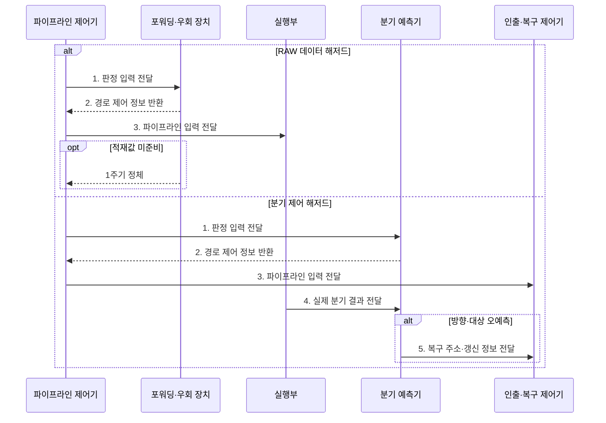

---
sidebar:
  order: 8
  label: "008. 파이프라인 포워딩·분기 예측 (Pipeline Forwarding Branch Prediction)"
  badge:
    text: "기출 · 50%"
    variant: note
title: "파이프라인 포워딩·분기 예측 (Pipeline Forwarding Branch Prediction)"
date: "2026-07-31T10:24:00+09:00"
tags:
  - "notes-hardware"
weight: 8
extra:
  question_no: "008"
  source_status: "기출"
  source_history: "122회"
  priority: 50
  priority_note: "포워딩·분기 예측 처리량 분석"
---

## 미리 알고가기

- **포워딩·분기 예측(Forwarding and Branch Prediction)**: 결과 직접 전달과 경로 예측으로 데이터·제어 대기를 줄이는 기법
- **명령어 파이프라인(Instruction Pipeline)**: 여러 명령의 처리 단계를 겹쳐 실행하는 구조
- **포워딩(Forwarding)**: 앞 명령의 결과를 레지스터 기록 전에 뒤 명령의 실행 입력으로 전달해 대기를 줄이는 기법
- **분기 예측(Branch Prediction)**: 분기 결과가 확정되기 전에 방향과 갈 주소를 미리 찍어 명령 인출을 멈추지 않게 하는 기법
- **쓰기 후 읽기(Read After Write, RAW)**: 앞 명령어의 결과를 뒤 명령어가 피연산자로 읽어야 하는 실제 데이터 의존성
- **적재-사용 의존(Load-Use Dependency)**: 일반적인 5단계 파이프라인에서 적재값 생성 전 후속 명령이 이를 요구해 포워딩 후에도 정체가 남는 의존성
- **원천·목적 레지스터(Source/Destination Register)**: 명령이 읽을 값이 담긴 레지스터가 원천, 결과를 적을 레지스터가 목적이며 두 번호가 겹치는지로 의존을 판정한다
- **분기 방향·분기 대상(Branch Direction/Target)**: 분기 여부와 이동할 명령 주소
- **분기 이력(Branch History)**: 과거 분기 결과를 저장한 예측 근거
- **오예측(Misprediction)**: 예측한 방향·대상이 실제와 달라 이미 인출해 둔 명령이 전부 헛일이 되는 상황
- **플러시(Flush)**: 오예측 경로에서 인출한 명령을 무효화하고 올바른 주소부터 다시 채우는 동작
- **우회 선택기(Bypass Multiplexer)**: 레지스터에서 읽은 값과 앞 단계에서 막 나온 결과 중 어느 쪽을 실행부에 넣을지 고르는 회로
- **포워딩 장치(Forwarding Unit)**: 인접 명령의 레지스터 번호를 맞대어 보고 우회를 켤지 세울지 선택 신호를 만드는 회로
- **복구 로직(Recovery Logic)**: 예측이 틀렸을 때 잘못 인출한 명령을 무효화하고 프로그램 카운터를 올바른 주소로 되돌리는 회로
- **프로그램 카운터(Program Counter, PC)**: 다음 명령어 주소를 저장하고 분기 오예측 시 복구 지점을 제공하는 레지스터
- **실행부(Execution Unit)**: 산술·논리 연산을 수행해 결과를 만들어 내는 회로이며 포워딩이 값을 꺼내 오는 출발점이다
- **명령당 클록 주기 수(Cycles Per Instruction, CPI)**: 명령어 하나를 완료하는 데 필요한 평균 클록 사이클 수
- **분기 대상 버퍼(Branch Target Buffer, BTB)**: 분기 명령 주소와 이전에 이동한 대상 주소를 저장해 예측 인출 주소를 빠르게 제공하는 캐시
- **커밋(Commit)**: 명령 실행 결과를 되돌릴 수 없는 아키텍처 상태로 최종 반영하는 단계
- **정밀 예외(Precise Exception)**: 예외가 발생한 명령 이전 결과만 커밋되고 이후 명령의 효과는 보이지 않도록 상태를 복원하는 성질

> **키워드:** 파이프라인 포워딩·분기 예측 (Pipeline Forwarding Branch Prediction)

## Ⅰ. 개요

- 정의/개념: **결과 직접 전달과 분기 예측**으로 해저드를 줄이는 기법
- 배경/필요성: 레지스터 기록·분기 확정 대기로 **버블•CPI 증가**

### 쉽게 이해하기 (학습용)
- 포워딩은 데이터 대기를 줄이고 분기 예측은 제어 대기를 줄여 평균 CPI를 낮춘다.

## Ⅱ. 특징

- **포워딩**으로 기록 전 선행 결과를 후속 실행 입력에 전달
- **분기 예측**으로 분기 확정 전 인출 지속
- 분기 판정이 늦을수록 증가하는 **오경로 명령 폐기량**

### 쉽게 이해하기 (학습용)
- 포워딩은 확정값을 우회하고 분기 예측은 미확정 경로를 추정하므로 오예측에만 복구 비용이 발생한다.

## Ⅲ. 구조 및 구성요소

| 구성요소 | 책임 |
|:---|:---|
| 포워딩 장치 | 의존 비교와 **우회 선택 신호** 생성 |
| 우회 선택기 | 실행부의 **피연산자 출처** 선택 |
| 분기 예측기 | 분기 방향과 **대상 주소** 추정 |
| 인출 제어기 | 예측·복구 주소의 **명령어 인출** |
| 복구 로직 | 오경로 무효화와 **PC 복원** |

### 쉽게 이해하기 (학습용)
- 포워딩 장치가 준비된 값을 우회하고 분기 예측기와 복구 로직이 추측 경로를 관리한다.

## Ⅳ. 흐름도

**동작 원리**

- **1. 판정 입력 전달**: 레지스터 번호·분기 PC·이력 제공
- **2. 경로 제어 정보 반환**: 우회 선택 또는 예측 주소 제공
- **3. 파이프라인 입력 전달**: 피연산자 또는 인출 주소 공급
- **4. 실제 분기 결과 전달**: 방향·대상을 예측값과 대조
- **5. 복구 주소·갱신 정보 전달**: 플러시와 PC·이력·BTB 갱신

### 쉽게 이해하기 (학습용)
- 데이터 해저드는 우회 경로가, 제어 해저드는 예측기와 복구 로직이 각각 처리한다.

## Ⅴ. 종류 및 비교

| 해저드 대응 기법 | 포워딩 | 분기 예측 |
|:---|:---|:---|
| 적용 기준 | 기록 전 **RAW 결과** 사용 | 분기 **방향·대상** 미확정 |
| 핵심 특징 | 확정 결과를 **레지스터 기록 전 실행 입력에 전달** | **분기 이력** 기반 선인출 |
| 한계 | 적재-사용의 **잔여 정체** | 오예측의 **경로 폐기** |

> 요약: 값 전달과 경로 추정을 구분해 적용

### 쉽게 이해하기 (학습용)
- 포워딩은 준비된 값을 바로 전달하고 분기 예측은 다음 실행 경로를 미리 선택한다.

## Ⅵ. 실무 고려사항 및 대책

| 고려사항 | 대책 | 효과 |
|:---|:---|:---|
| 포워딩 후 **Load-Use 정체** 잔존 | **독립 명령 재배치•해저드 감지** | 잘못된 값 방지와 **버블 최소화** |
| 특정 분기의 **오예측 반복** | 이력 길이·예측기·**분기 대상 버퍼** 조정 | **예측 정확도** 향상 |
| 오예측 시 **아키텍처 상태 오염** | **커밋 지연•플러시 복구** 검증 | **정밀 예외•상태 정확성** 확보 |
| 대응 회로의 **면적•전력 증가** | 감소 CPI 대비 **회로 비용 벤치마크** | **성능•전력 효율** 균형 |

### 쉽게 이해하기 (학습용)
- 포워딩 적중·잔여 정체와 분기 예측 정확도·오예측 페널티를 각각 측정해야 두 기법의 CPI 개선 효과를 판단할 수 있다.

## Ⅶ. 결론

- RAW 대기는 **포워딩**, 분기 대기는 **예측•복구** 적용

### 쉽게 이해하기 (학습용)
- 포워딩·예측 회로는 CPI 감소와 면적·전력 비용을 비교해 적용한다.
