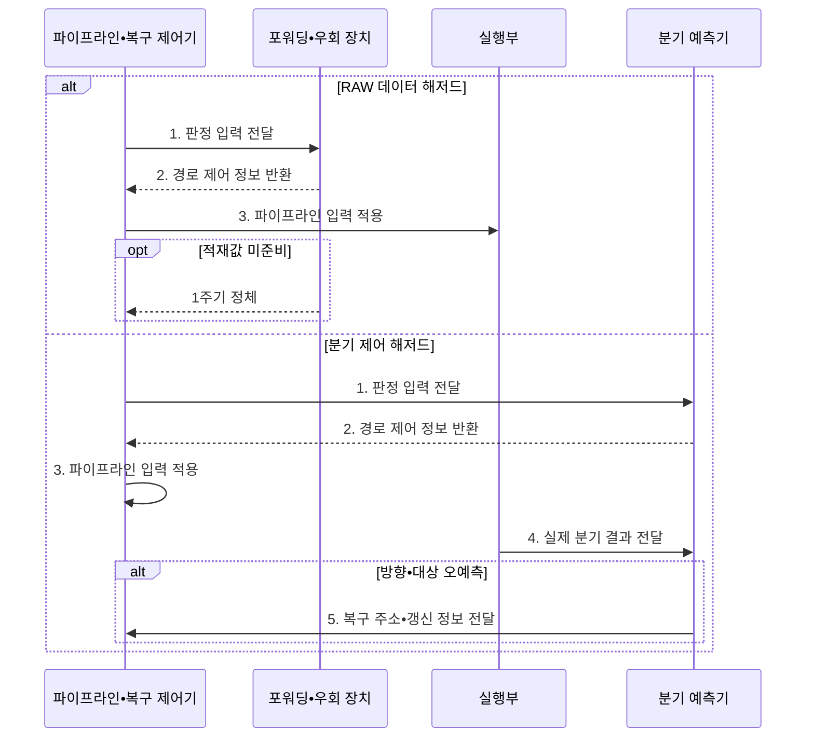

---
sidebar:
  order: 8
  label: "008. 파이프라인 포워딩•분기 예측 (Pipeline Forwarding Branch Prediction)"
  badge:
    text: "기출 • 50%"
    variant: note
title: "파이프라인 포워딩•분기 예측 (Pipeline Forwarding Branch Prediction)"
date: "2026-08-05T01:15:00+09:00"
tags:
  - "notes-hardware"
weight: 8
extra:
  question_no: "008"
  source_status: "기출"
  source_history: "122회"
  priority: 50
  priority_note: "포워딩•분기 예측 처리량 분석"
---

## Ⅰ. 개요

<details>
<summary>핵심 용어</summary>

- **포워딩** 은 앞 명령의 결과를 레지스터 기록 전에 후속 명령의 실행 입력으로 직접 전달하여 데이터 대기를 줄인다.
- **분기 예측** 은 분기 결과가 확정되기 전에 방향과 대상 주소를 추정하여 명령어 인출을 계속한다.
- **버블** 은 데이터나 제어 대기로 유효한 명령이 처리되지 않는 빈 파이프라인 주기이다.
- **명령어당 사이클 수(Cycles Per Instruction, CPI)**: 명령어 하나를 완료하는 데 필요한 평균 클록 수

</details>

- 정의/개념: **포워딩과 분기 예측** 은 각각 연산 결과를 실행부로 우회 전달하고 다음 인출 경로를 미리 선택해 데이터•제어 해저드 정체를 줄이는 **파이프라인 제어 기법**
- 배경/필요성: 레지스터 기록•분기 확정 대기로 **버블•CPI 증가**

#### 한줄 요약
- 포워딩은 데이터 대기를 줄이고 분기 예측은 제어 대기를 줄여 평균 CPI를 낮춘다.

## Ⅱ. 특징

<details>
<summary>핵심 용어</summary>

- **분기 오예측** 은 예측한 방향이나 대상이 실제 결과와 달라 이미 인출한 명령어를 폐기해야 하는 상황이다.
- **오경로 명령 폐기량** 은 오예측 뒤 무효화해야 하는 명령 수로 분기 판정이 늦을수록 커진다.

</details>

- **포워딩** 으로 기록 전 선행 결과를 후속 실행 입력에 전달
- **분기 예측** 으로 분기 확정 전 인출 지속
- 분기 판정이 늦을수록 증가하는 **오경로 명령 폐기량**

#### 한줄 요약
- 포워딩은 확정값을 우회하고 분기 예측은 미확정 경로를 추정하므로 오예측에만 복구 비용이 발생한다.

## Ⅲ. 구조 및 구성요소

<details>
<summary>핵심 용어</summary>

- **포워딩 장치** 는 인접 명령의 레지스터 번호를 비교하여 실행 입력의 우회 여부를 결정한다.
- **우회 선택기** 는 레지스터 값과 앞 단계의 실행 결과 중 실행부에 공급할 값을 선택한다.
- **복구 로직** 은 오예측 명령을 무효화하고 프로그램 카운터를 올바른 주소로 되돌린다.
- **분기 예측기** 는 분기의 과거 이력 등을 이용해 다음 방향과 대상 주소를 추정한다.
- **인출 제어기** 는 예측 주소나 복구 주소를 프로그램 카운터에 반영해 다음 명령을 가져온다.
- **프로그램 카운터(Program Counter, PC)**: 다음에 인출할 명령어 주소를 보관하는 레지스터
- **PC 복원**: 오예측 뒤 PC를 실제 분기 경로의 주소로 되돌리는 동작

</details>

```text
[포워딩 장치] -- [우회 선택기]

[분기 예측기] -- [인출 제어기]
       \              /
           [복구 로직]
```

선의 의미: 위 선은 포워딩 판단과 피연산자 선택의 연결이고, 아래 선은 예측•인출•복구 회로가 PC 주소를 공유하는 정적 네트워크 관계다.

| 구성요소 | 책임 |
|:---|:---|
| 포워딩 장치 | 의존 비교와 **우회 선택 신호** 생성 |
| 우회 선택기 | 실행부의 **피연산자 출처** 선택 |
| 분기 예측기 | 분기 방향과 **대상 주소** 추정 |
| 인출 제어기 | 예측•복구 주소의 **명령어 인출** |
| 복구 로직 | 오경로 무효화와 **PC 복원** |

#### 한줄 요약
- 포워딩 장치가 준비된 값을 우회하고 분기 예측기와 복구 로직이 추측 경로를 관리한다.

## Ⅳ. 흐름도

<details>
<summary>핵심 용어</summary>

- **분기 이력** 은 과거 분기의 실제 방향을 저장하여 이후 분기 예측의 근거로 사용한다.
- **분기 대상 버퍼(Branch Target Buffer, BTB)**: 분기 명령과 대상 주소를 저장하는 예측용 버퍼
- **플러시** 는 오예측 경로에서 인출한 명령을 무효화하고 올바른 주소부터 다시 채우는 동작이다.
- **쓰기 후 읽기(Read After Write, RAW) 데이터 해저드**: 앞 명령의 기록 전에 후속 명령이 같은 위치를 읽는 충돌
- **BTB 갱신** 은 실제 분기 대상 주소를 분기 대상 버퍼에 반영해 이후 예측에 사용하는 동작이다.
- **적재값 미준비 정체** 는 메모리에서 읽은 값이 아직 나오지 않아 포워딩할 수 없을 때 파이프라인을 멈추는 처리이다.

</details>



**동작 원리**

- **1. 판정 입력 전달**: 레지스터 번호•분기 PC•이력 제공
- **2. 경로 제어 정보 반환**: 우회 선택 또는 예측 주소 제공
- **3. 파이프라인 입력 적용**: 피연산자 선택 또는 예측 주소 인출
- **4. 실제 분기 결과 전달**: 방향•대상을 예측값과 대조
- **5. 복구 주소•갱신 정보 전달**: 플러시와 PC•이력•BTB 갱신

#### 한줄 요약
- 데이터 해저드는 우회 경로가, 제어 해저드는 예측기와 복구 로직이 각각 처리한다.

## Ⅴ. 종류 및 비교

<details>
<summary>핵심 용어</summary>

- **적재-사용 의존** 은 적재값이 준비되기 전에 후속 명령이 이를 요구하여 포워딩 후에도 정체가 남는 의존성이다.
- **분기 이력 기반 선인출** 은 과거 방향 정보를 바탕으로 분기 결과 확정 전에 예상 경로의 명령을 가져오는 방식이다.
- **경로 폐기** 는 오예측한 경로에서 들어온 명령을 무효화하는 복구 동작이다.

</details>

| 해저드 대응 기법 | 포워딩 | 분기 예측 |
|:---|:---|:---|
| 적용 기준 | 기록 전 **RAW 결과** 사용 | 분기 **방향•대상** 미확정 |
| 핵심 특징 | 확정 결과를 **레지스터 기록 전 실행 입력에 전달** | **분기 이력** 기반 선인출 |
| 한계 | 적재-사용의 **잔여 정체** | 오예측의 **경로 폐기** |

> 요약: 값 전달과 경로 추정을 구분해 적용

#### 한줄 요약
- 포워딩은 준비된 값을 바로 전달하고 분기 예측은 다음 실행 경로를 미리 선택한다.

## Ⅵ. 실무 고려사항 및 대책

<details>
<summary>핵심 용어</summary>

- **커밋** 은 명령 실행 결과를 되돌릴 수 없는 아키텍처 상태로 최종 반영하는 단계이다.
- **정밀 예외** 는 예외 명령 이전 결과만 커밋하고 이후 명령의 효과는 제거하여 정확한 상태를 복원하는 성질이다.
- **독립 명령 재배치** 는 데이터 의존성이 없는 명령을 적재 대기 구간에 옮겨 버블을 줄이는 기법이다.
- **플러시 복구** 는 잘못 실행한 명령을 제거하고 올바른 PC와 아키텍처 상태로 되돌리는 절차이다.
- **회로 비용 벤치마크** 는 제어 회로가 줄인 CPI와 늘어난 면적•전력을 실제 부하에서 비교하는 평가이다.

</details>

| 문제 | 대책 | 효과 |
|:---|:---|:---|
| 포워딩 후 **적재-사용 정체** 잔존 | **독립 명령 재배치•해저드 감지** | 잘못된 값 방지와 **버블 최소화** |
| 특정 분기의 **오예측 반복** | 이력 길이•예측기•**분기 대상 버퍼** 조정 | **예측 정확도** 향상 |
| 오예측 시 **아키텍처 상태 오염** | **커밋 지연•플러시 복구** 검증 | **정밀 예외•상태 정확성** 확보 |
| 대응 회로의 **면적•전력 증가** | 감소 CPI 대비 **회로 비용 벤치마크** | **성능•전력 효율** 균형 |

#### 한줄 요약
- 포워딩 적중•잔여 정체와 분기 예측 정확도•오예측 페널티를 각각 측정해야 두 기법의 CPI 개선 효과를 판단할 수 있다.

## Ⅶ. 결론

<details>
<summary>핵심 용어</summary>

- **오예측 페널티** 는 잘못 인출한 명령을 폐기하고 올바른 경로를 다시 채우는 동안 잃는 클록 수이다.
- **면적•전력 비용** 은 포워딩•예측 회로 추가로 늘어나는 칩 공간과 에너지 소비이다.

</details>

- RAW 대기는 **포워딩**, 분기 대기는 **예측•복구** 적용

#### 한줄 요약
- 포워딩•예측 회로는 CPI 감소와 면적•전력 비용을 비교해 적용한다.
