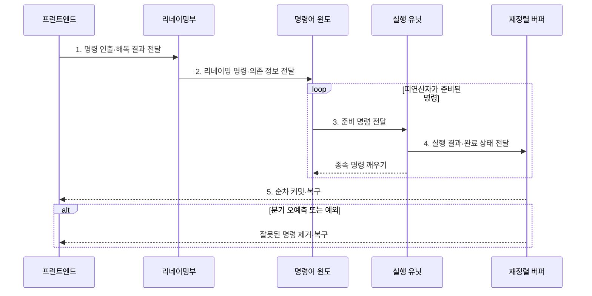

---
sidebar:
  order: 9
  label: "009. 명령어 수준 병렬성 ILP (Instruction-Level Parallelism)"
  badge:
    text: "미출 · 50%"
    variant: note
title: "명령어 수준 병렬성 ILP (Instruction-Level Parallelism)"
date: "2026-07-31T10:26:00+09:00"
tags:
  - "notes-hardware"
weight: 9
extra:
  question_no: "009"
  source_status: "미출"
  source_history: ""
  priority: 50
  priority_note: "병렬성 수준별 선택 기준을 묻는 핵심 주제"
---

## 미리 알고가기

- **명령어 수준 병렬성(Instruction-Level Parallelism, ILP)**: 한 스레드에서 데이터 의존성이 없는 여러 명령어를 중첩 또는 동시 실행하는 병렬성
- **사이클당 명령어 수(Instructions Per Cycle, IPC)**: 한 사이클에 처리한 평균 명령 수를 나타내는 지표다.
- **기록 후 읽기(Read After Write, RAW)**: 앞 명령 결과를 뒤 명령이 읽는 실제 의존성이다.
- **읽기 후 기록(Write After Read, WAR)·기록 후 기록(Write After Write, WAW)**: 레지스터 이름 재사용으로 생기는 가짜 의존성이다.
- **제어 의존성(Control Dependency)**: 분기 결과가 다음 실행 경로를 정하는 관계
- **파이프라이닝(Pipelining)**: 명령어 처리 단계를 겹쳐 수행하는 기법
- **슈퍼스칼라(Superscalar)**: 한 클록 주기에 여러 명령을 발행할 수 있도록 복수 실행 경로를 둔 프로세서 구조
- **비순서 실행(Out-of-Order Execution, OoO Execution)**: 준비된 명령부터 실행하고 결과는 원래 순서로 확정하는 방식
- **레지스터 리네이밍(Register Renaming)**: 논리 레지스터를 물리 레지스터에 매핑해 가짜 의존을 없애는 기법
- **매우 긴 명령어 워드(Very Long Instruction Word, VLIW)**: 컴파일러가 독립 연산을 여러 슬롯에 배치한 명령어
- **재정렬 버퍼(Reorder Buffer, ROB)**: 비순서 실행 결과를 프로그램 순서로 확정·복구하는 버퍼
- **스레드·데이터 수준 병렬성(TLP·DLP)**: 여러 스레드 또는 데이터를 병렬 처리하는 방식
- **임계 경로(Critical Path)**: ILP 상한을 정하는 가장 긴 실제 의존 사슬
- **실제 의존성(True Dependency)·가짜 의존성(False Dependency)**: 실제 의존성은 앞 명령의 값이 뒤 명령에 필요하고 가짜 의존성은 같은 레지스터 이름만 겹치는 관계로, 각각 ILP의 본질적 한계와 리네이밍으로 제거할 한계를 구분한다.
- **발행 슬롯·발행 폭(Issue Slot·Issue Width)**: 한 주기에 실행 유닛으로 보낼 수 있는 명령 자리와 그 최대 개수로 독립 명령이 부족하면 슬롯이 비어 IPC가 낮아진다.
- **명령어 윈도(Instruction Window)**: 해독·리네이밍한 명령의 피연산자 준비 상태를 추적하다 실행 가능한 명령을 선택하는 대기 영역
- **프런트엔드(Front End)**: 분기 예측, 명령 인출과 해독을 수행해 명령어 윈도에 실행 후보를 공급하는 프로세서 앞단
- **실행 유닛(Execution Unit)**: 발행된 명령의 산술·논리·메모리 연산을 수행하는 하드웨어
- **동적 ILP·정적 ILP**: 동적 ILP는 하드웨어가 실행 중 명령 순서를 정하고 정적 ILP는 컴파일러가 실행 전에 독립 연산을 배치하는 방식
- **바이너리(Binary)**: 기계가 실행할 수 있도록 명령어가 이진 형식으로 저장된 프로그램으로 동적 ILP가 재컴파일 없이 지원하는 대상
- **분기 발산(Branch Divergence)**: 함께 처리하던 데이터가 서로 다른 분기 경로를 택해 순차 실행이 늘어나는 DLP의 위험
- **공유 자원 경합(Resource Contention)**: 여러 스레드가 같은 실행 장치·캐시·메모리를 동시에 요구해 대기하는 TLP의 위험
- **다중 누산기(Multiple Accumulators)**: 합산 결과를 여러 독립 레지스터에 나눠 기록해 하나의 연속 RAW 의존 사슬을 짧게 만드는 기법
- **벡터 유닛(Vector Unit)**: 하나의 명령으로 여러 데이터 요소에 같은 연산을 수행해 DLP를 활용하는 실행 장치
- **아키텍처 상태(Architectural State)**: 프로그램에서 관찰할 수 있는 레지스터·메모리·상태 플래그의 확정된 값
- **순차 커밋(In-Order Commit)**: 비순서로 끝난 명령의 결과를 원래 프로그램 순서대로 아키텍처 상태에 반영하는 절차
- **정밀 복구(Precise Recovery)**: 예외나 분기 오예측 시 해당 명령 이전까지의 상태만 보존하고 잘못 실행한 이후 명령을 제거하는 절차
- **클록 게이팅(Clock Gating)**: 사용하지 않는 회로 블록의 클록 공급을 차단해 동적 전력을 줄이는 기법
- **컴파일러 스케줄링(Compiler Scheduling)**: 컴파일러가 의존성과 실행 지연을 분석해 독립 명령의 배치 순서를 조정하는 기법

> **키워드:** 명령어 수준 병렬성 ILP (Instruction-Level Parallelism)

## Ⅰ. 개요

- 정의/개념: 독립 명령을 겹쳐 실행하는 **단일 스레드 병렬성**
- 배경/필요성: 순차 발행은 독립 명령에도 **실행 유닛 유휴** 발생

### 쉽게 이해하기 (학습용)
- 앞 단계를 기다리지 않는 작업을 양손으로 함께 처리한다

## Ⅱ. 특징

- 의존 사슬·분기 실패·메모리 지연이 **발행 슬롯 활용률** 제한
- 복수 발행 **슈퍼스칼라**로 동시 실행 폭 확대
- **비순서 실행•순차 커밋**으로 아키텍처 상태 보존

### 쉽게 이해하기 (학습용)
- 손이 많아도 선후 관계나 재료 대기가 남으면 동시 작업은 늘지 않는다

## Ⅲ. 구조 및 구성요소

| 구성요소 | 책임 |
|:---|:---|
| 프런트엔드 | 예측·인출·해독으로 **후보 공급** |
| 레지스터 리네이밍 | WAR·WAW **가짜 의존 제거** |
| 명령어 윈도 | 실행 가능한 **발행 대상 선택** |
| 실행 유닛 | 산술·메모리 **연산 수행** |
| 재정렬 버퍼 | 순차 확정과 **정밀 복구** |

### 쉽게 이해하기 (학습용)
- 프런트엔드가 후보를 공급하고 리네이밍·윈도·실행 유닛이 병렬 처리하며 재정렬 버퍼가 순서를 복원한다.

## Ⅳ. 흐름도

**동작 원리**

- **1. 명령 인출·해독 결과 전달**: 예측 경로 명령 전달
- **2. 리네이밍 명령·의존 정보 전달**: 가짜 의존 제거
- **3. 준비 명령 전달**: 준비 연산 비순서 발행
- **4. 실행 결과·완료 상태 전달**: 결과 기록·종속 연산 해제
- **5. 순차 커밋·복구**: 프로그램 순서대로 상태 반영 또는 결과 폐기

### 쉽게 이해하기 (학습용)
- 여러 일을 먼저 끝내도 번호표 순서대로 결과를 내놓는다

## Ⅴ. 종류 및 비교

| 판단 기준 | ILP | TLP | DLP |
|:---|:---|:---|:---|
| 적용 기준 | 독립 명령이 충분한 **단일 스레드** | 독립 **작업·요청**이 충분한 경우 | 규칙적 데이터에 **동일 연산**을 반복하는 경우 |
| 핵심 특징 | 한 스레드의 **독립 명령** | 서로 독립적인 **스레드** | 같은 연산의 여러 **데이터** |
| 한계 | 데이터·**제어 의존성** | 동기화·**공유 자원 경합** | 분기 발산·**불규칙 접근** |

> 요약: 지연은 ILP, 작업은 TLP, 배열은 DLP

| 판단 기준 | 동적 ILP | 정적 ILP |
|:---|:---|:---|
| 적용 기준 | 가변 지연과 **기존 바이너리** 대응이 필요한 경우 | 규칙적 연산을 **재컴파일**할 수 있는 경우 |
| 핵심 특징 | **하드웨어**가 실행 중 스케줄 | **컴파일러•VLIW**가 실행 전 스케줄 |
| 한계 | 탐색 회로 **면적·전력** | 빈 슬롯·**이진 호환성** |

> 요약: 가변 지연은 동적, 규칙 연산은 정적 ILP

### 쉽게 이해하기 (학습용)
- 양손 작업은 ILP, 요리사 분담은 TLP, 같은 재료 묶음은 DLP에 해당한다

## Ⅵ. 실무 고려사항 및 대책

| 고려사항 | 대책 | 효과 |
|:---|:---|:---|
| 발행 폭을 늘려도 **IPC 정체** | **의존 사슬•프런트엔드**와 메모리 병목 분석 | 유효한 **확장 지점** 식별 |
| **WAR•WAW**로 독립 명령 대기 | **물리 레지스터 리네이밍** 확대 | **가짜 의존** 제거 |
| 큰 **명령어 윈도**의 전력·면적 증가 | 윈도 크기·발행 폭·**클록 게이팅** 조정 | **성능 대비 자원 효율** 향상 |
| 오예측·예외 후 **잘못된 결과 확정** | **ROB 순차 커밋•정밀 복구** 검증 | **아키텍처 상태 정확성** 유지 |
| 누산 연산의 긴 **RAW 의존 사슬** | **다중 누산기**로 합산 후 최종 결합 | 독립 연산과 **실행 유닛 활용률** 증가 |

### 쉽게 이해하기 (학습용)
- IPC·발행 슬롯·임계 의존 사슬을 함께 측정하고, 긴 누산 의존은 여러 누산기로 나눠 실행 유닛 활용률을 높인다.

## Ⅶ. 결론

- **IPC·발행 슬롯·임계 경로** 포화 시 TLP·DLP 확대

### 쉽게 이해하기 (학습용)
- 한 사람의 동시 작업이 한계면 사람과 작업 묶음을 늘린다
