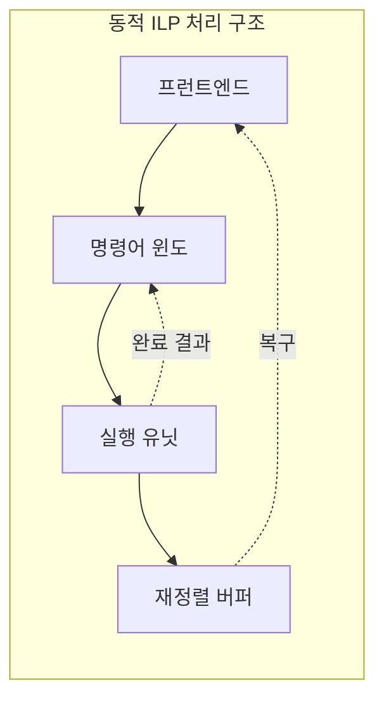

---
sidebar:
  order: 9
  label: "009. 명령어 수준 병렬성 ILP (Instruction-Level Parallelism)"
  badge:
    text: "미출 · 50%"
    variant: note
title: "명령어 수준 병렬성 ILP (Instruction-Level Parallelism)"
date: "2026-07-28T12:36:44+09:00"
tags:
  - "notes-hardware"
weight: 9
extra:
  question_no: "009"
  source_status: "미출"
  source_history: ""
  priority: 50
  priority_note: "병렬성 수준별 선택 기준을 묻는 핵심 주제"
---

## 미리 알고가기

- **명령어 수준 병렬성(Instruction-Level Parallelism, ILP)**: 한 스레드에서 데이터 의존성이 없는 여러 명령어를 중첩 또는 동시 실행하는 병렬성
- **사이클당 명령어 수(Instructions Per Cycle, IPC)**: 한 사이클에 처리한 평균 명령 수를 나타내는 지표다.
- **기록 후 읽기(Read After Write, RAW)**: 앞 명령 결과를 뒤 명령이 읽는 실제 의존성이다.
- **읽기 후 기록(Write After Read, WAR)·기록 후 기록(Write After Write, WAW)**: 레지스터 이름 재사용으로 생기는 가짜 의존성이다.
- **제어 의존성(Control Dependency)**: 분기 결과가 다음 실행 경로를 정하는 관계
- **파이프라이닝(Pipelining)**: 명령어 처리 단계를 겹쳐 수행하는 기법
- **슈퍼스칼라(Superscalar)**: 한 클록 주기에 여러 명령을 발행할 수 있도록 복수 실행 경로를 둔 프로세서 구조
- **비순서 실행(Out-of-Order Execution, OoO Execution, 아웃 오브 오더 실행)**: 영문 핵심 단어를 OoO로 줄여 표기하며 준비된 명령부터 실행하고 결과는 원래 순서대로 확정하는 방식
- **레지스터 리네이밍(Register Renaming)**: 논리 레지스터를 물리 레지스터에 매핑해 가짜 의존을 없애는 기법
- **매우 긴 명령어 워드(Very Long Instruction Word, VLIW, 브이엘아이더블유)**: 영문 각 단어의 첫 글자를 따 VLIW로 표기하며 컴파일러가 독립 연산을 슬롯에 배치한 명령어
- **재정렬 버퍼(Reorder Buffer, ROB, 알오비)**: 영문 각 단어의 첫 글자를 따 ROB로 표기하며 비순서 실행 결과를 프로그램 순서대로 확정·복구하는 버퍼
- **스레드 수준 병렬성(Thread-Level Parallelism, TLP, 티엘피)·데이터 수준 병렬성(Data-Level Parallelism, DLP, 디엘피)**: 영문 각 단어의 첫 글자를 따 TLP·DLP로 표기하며 여러 스레드 또는 데이터를 병렬 처리하는 방식
- **임계 경로(Critical Path)**: ILP 상한을 정하는 가장 긴 실제 의존 사슬
- **실제 의존성(True Dependency)·가짜 의존성(False Dependency)**: 실제 의존성은 앞 명령의 값이 뒤 명령에 필요하고 가짜 의존성은 같은 레지스터 이름만 겹치는 관계로, 각각 ILP의 본질적 한계와 리네이밍으로 제거할 한계를 구분한다.
- **발행 슬롯·발행 폭(Issue Slot·Issue Width)**: 한 주기에 실행 유닛으로 보낼 수 있는 명령 자리와 그 최대 개수로 독립 명령이 부족하면 슬롯이 비어 IPC가 낮아진다.
- **명령어 윈도(Instruction Window)**: 해독·리네이밍한 명령의 피연산자 준비 상태를 추적하다 실행 가능한 명령을 선택하는 대기 영역
- **프런트엔드(Front End)**: 분기 예측, 명령 인출과 해독을 수행해 명령어 윈도에 실행 후보를 공급하는 프로세서 앞단
- **실행 유닛(Execution Unit)**: 발행된 명령의 산술·논리·메모리 연산을 수행하는 하드웨어
- **동적 ILP·정적 ILP**: 동적 ILP는 하드웨어가 실행 중 명령 순서를 정하고 정적 ILP는 컴파일러가 실행 전에 독립 연산을 배치하는 방식
- **바이너리(Binary)**: 기계가 실행할 수 있도록 명령어가 이진 형식으로 저장된 프로그램으로 동적 ILP가 재컴파일 없이 지원하는 대상
- **분기 발산(Branch Divergence)**: 함께 처리하던 데이터가 서로 다른 분기 경로를 택해 순차 실행이 늘어나는 DLP의 위험
- **공유 자원 경합(Resource Contention)**: 여러 스레드가 같은 실행 장치·캐시·메모리를 동시에 요구해 대기하는 TLP의 위험
- **다중 누산기(Multiple Accumulators)**: 합산 결과를 여러 독립 레지스터에 나눠 기록해 하나의 연속 RAW 의존 사슬을 짧게 만드는 기법
- **벡터 유닛(Vector Unit)**: 하나의 명령으로 여러 데이터 요소에 같은 연산을 수행해 DLP를 활용하는 실행 장치

## Ⅰ. 개요

- 정의/개념: 독립 명령을 중첩 실행해 **IPC**를 높이는 병렬성
- 기존 한계: 명령 의존과 지연으로 **단일 스레드 IPC** 제한

### 쉽게 이해하기 (학습용)
- 앞 단계를 기다리지 않는 작업을 양손으로 함께 처리한다

## Ⅱ. 특징

- **의존 사슬**이 동시 실행 가능한 명령 수 제한
- 독립 명령 부족으로 **발행 슬롯·IPC** 활용률 저하
- **분기 실패·메모리 지연**으로 실행부 대기
- 넓은 **명령 윈도**에 따른 면적·전력 증가

### 쉽게 이해하기 (학습용)
- 손이 많아도 선후 관계나 재료 대기가 남으면 동시 작업은 늘지 않는다

## Ⅲ. 아키텍처 및 구성요소

| 설계 요소 | 입력·상태 | 역할 |
|:---|:---|:---|
| 프런트엔드 | 명령 주소·분기 이력 | 예측·인출·해독으로 후보 공급 |
| 명령어 윈도 | 리네이밍 명령·피연산자 준비 상태 | 실행 가능한 발행 대상 선택 |
| 실행 유닛 | 발행 명령·피연산자 | 산술·메모리 연산 수행 |
| 재정렬 버퍼 | 완료 결과·프로그램 순서 | 순차 확정과 오류 복구 |

> 요약: 프런트엔드가 후보를 공급하고 ROB가 순서를 보존한다

### 쉽게 이해하기 (학습용)
- 여러 일을 먼저 끝내도 번호표 순서대로 결과를 내놓는다

## Ⅳ. 운영 고려사항

| 실패 징후 | 완화 방안 | 기대 효과 |
|:---|:---|:---|
| 발행 폭을 늘려도 IPC 정체 | 의존 사슬·프런트엔드·메모리 병목 분석 | 유효한 확장 지점 식별 |
| WAR·WAW로 독립 명령 대기 | 물리 레지스터 리네이밍 확대 | 가짜 의존 제거 |
| 큰 명령어 윈도의 전력·면적 증가 | 윈도 크기·발행 폭·클록 게이팅 조정 | 성능 대비 자원 효율 향상 |
| 오예측·예외 후 잘못된 결과 확정 | ROB 순차 커밋·정밀 복구 검증 | 아키텍처 상태 정확성 유지 |

### 쉽게 이해하기 (학습용)
- IPC, 발행 슬롯 활용률, 임계 의존 사슬, 분기 실패와 메모리 대기를 함께 측정해야 ILP 한계를 판단할 수 있다.

## Ⅴ. 종류 및 비교

| 판단 기준 | ILP | TLP | DLP |
|:---|:---|:---|:---|
| 핵심 특징 | 한 스레드의 **독립 명령** | 서로 독립적인 **스레드** | 같은 연산의 여러 **데이터** |
| 적용 기준 | 독립 명령이 충분한 **단일 스레드** | 독립 **작업·요청**이 충분한 경우 | 규칙적 데이터에 **동일 연산**을 반복하는 경우 |
| 주요 위험 | 데이터·제어 의존성 | 동기화·공유 자원 경합 | 분기 발산·불규칙 접근 |

> 요약: 스레드 지연은 ILP, 작업은 TLP, 배열은 DLP가 적합하다

| 판단 기준 | 동적 ILP | 정적 ILP |
|:---|:---|:---|
| 핵심 특징 | **하드웨어**가 실행 중 스케줄 | **컴파일러**가 실행 전 스케줄 |
| 적용 기준 | 가변 지연과 **기존 바이너리** 대응이 필요한 경우 | 규칙적 연산을 **재컴파일**할 수 있는 경우 |
| 주요 위험 | 탐색 회로 면적·전력 | 빈 슬롯·이진 호환성 |

> 요약: 가변 지연은 동적 ILP, 규칙 연산은 VLIW가 적합하다

### 쉽게 이해하기 (학습용)
- 양손 작업은 ILP, 요리사 분담은 TLP, 같은 재료 묶음은 DLP에 해당한다

## Ⅵ. 실무 사례

1. 다중 누산기로 **의존 사슬**을 나눈 뒤 최종 합산

### 쉽게 이해하기 (학습용)
- 합계를 여러 그릇에 나눠 계산한 뒤 마지막에 합친다

## Ⅶ. 결론

- **ILP**가 포화되면 **TLP·DLP**로 병렬성 확대

### 쉽게 이해하기 (학습용)
- 한 사람의 동시 작업이 한계면 사람과 작업 묶음을 늘린다
