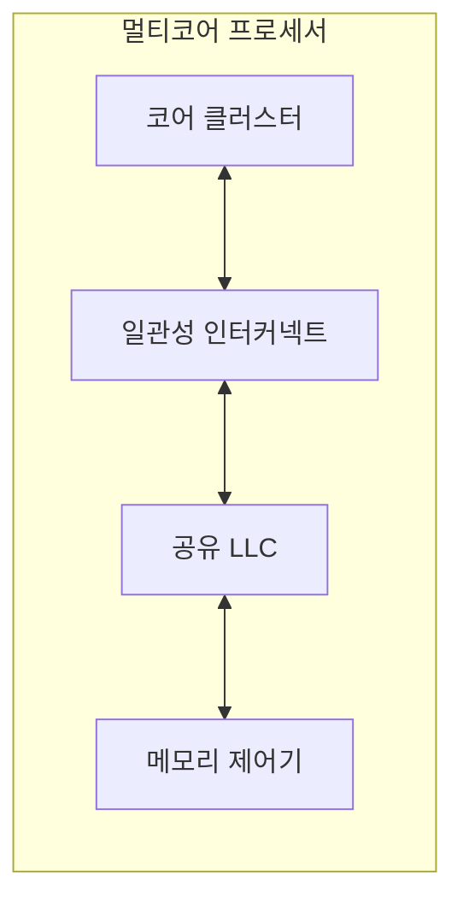

---
sidebar:
  order: 10
  label: "010. 멀티코어 프로세서 (Multicore Processor)"
  badge:
    text: "기출 · 50%"
    variant: note
title: "멀티코어 프로세서 (Multicore Processor)"
date: "2026-07-28T12:37:47+09:00"
tags:
  - "notes-hardware"
weight: 10
extra:
  question_no: "010"
  source_status: "기출"
  source_history: "132회"
  priority: 50
  priority_note: "코어 수·유형·공유 자원 선택의 핵심 주제"
---

## 미리 알고가기

- **멀티코어 프로세서(Multicore Processor)**: 하나의 칩에 여러 실행 코어를 통합하여 복수 스레드를 동시에 처리하는 프로세서 구조
- **코어(Core)·스레드(Thread)**: 코어는 명령을 실제로 실행하는 물리 처리 장치이고 스레드는 독립적으로 흘러가는 명령 실행 흐름이며, 코어 하나가 한 번에 한 스레드를 맡는 것이 기본이다
- **스레드 수준 병렬성(Thread-Level Parallelism, TLP)**: 서로 독립적인 여러 스레드를 동시에 실행하여 얻는 병렬성
- **암달의 법칙(Amdahl's Law)**: 아무리 사람을 늘려도 혼자서만 할 수 있는 구간이 남아 있으면 전체 시간이 그 구간 아래로는 내려가지 않는다는 법칙이며, 직렬 비율이 5%면 코어를 무한히 늘려도 20배가 상한이다
- **동시 멀티스레딩(Simultaneous Multithreading, SMT)**: 하나의 코어에서 여러 스레드의 명령어를 동시에 발행하여 유휴 실행 자원을 활용하는 기법
- **물리 코어·논리 스레드**: 물리 코어는 실제로 따로 있는 실행 하드웨어이고 논리 스레드는 SMT가 한 코어를 나눠 보여 주는 처리 단위이므로, 개수가 같아도 성능은 같지 않다
- **동종·이종 멀티코어(Homogeneous/Heterogeneous Multicore)**: 같은 코어만 여러 개 넣은 구성과 성능 위주 코어와 절전 위주 코어를 섞은 구성
- **성능 코어·절전 코어(Performance/Efficiency Core)**: 응답이 급한 작업을 맡는 빠른 코어와 백그라운드 작업을 낮은 전력으로 처리하는 코어이며, 이종 구성에서 스케줄러가 작업마다 골라 준다
- **사설 캐시(Private Cache)**: 코어 하나만 쓰는 캐시이며, 같은 값의 사본이 코어 수만큼 생기므로 일관성 조정 대상이 된다
- **공유 최종 단계 캐시(Shared Last-Level Cache, LLC)**: 여러 코어가 용량과 대역폭을 공유하는 최하위 캐시 단계
- **캐시 줄(Cache Line)**: 캐시와 메모리가 한 번에 주고받고 일관성도 이 단위로 관리하는 고정 크기 블록
- **캐시 일관성(Cache Coherence)**: 여러 사설 캐시에 복제된 같은 캐시 줄이 서로 다른 값을 갖지 않도록 맞추는 성질
- **일관성 프로토콜(Coherence Protocol)**: 그 캐시 줄의 최신 값과 읽기·쓰기 권한을 코어끼리 주고받으며 맞추는 상태 전이 규칙
- **거짓 공유(False Sharing)**: 서로 아무 상관 없는 변수 둘이 우연히 같은 캐시 줄에 놓여, 각 코어가 자기 변수만 고쳐도 줄 전체가 오가며 경합이 생기는 현상
- **동기화(Synchronization)**: 여러 스레드가 공유 값과 실행 순서를 맞춰 결과를 안전하게 합치도록 거는 제어
- **인터커넥트(Interconnect)**: 코어·캐시·메모리 제어기 사이에서 요청과 응답을 실어 나르는 칩 내부 통로이며, 코어가 늘수록 여기가 먼저 막힌다
- **메모리 대역폭(Memory Bandwidth)**: 단위 시간에 주기억장치와 주고받을 수 있는 데이터 양이며 모든 코어가 나눠 쓰는 공용 한도다
- **모바일 애플리케이션 프로세서(Application Processor, AP)**: 스마트폰의 운영체제와 응용 프로그램을 실행하는 통합 프로세서
- **작업 큐(Work Queue)**: 처리할 작업을 대기 순서대로 담아 두는 자료구조이며, 코어별로 따로 두면 한 줄에 몰리는 경합이 줄어든다

## Ⅰ. 개요

- 정의/개념: 한 칩의 여러 코어로 스레드를 병렬 실행하는 **처리량 확장 구조**
- 기존 한계: 주파수 상승은 **전력·발열 증가**로 성능 확장 제한

### 쉽게 이해하기 (학습용)
- 한 사람에게 계속 더 빨리 뛰라고 하면 전력과 열이 급증해 속도를 더 올리기 어려워지므로, 같은 전력 범위에서 여러 작업을 함께 처리하도록 사람과 책상을 늘린 것이 멀티코어라는 실용적 대안이다

## Ⅱ. 특징

- 코어 추가로 단일 지연이 아닌 **처리량** 확장
- **스레드 수준 병렬성**이 있어야 성립하는 성능 이득
- **암달의 법칙**대로 직렬 비율이 가속 상한 확정

### 쉽게 이해하기 (학습용)
- 책상을 열 개 놓아도 서류 한 장을 열 명이 나눠 쓸 수 없듯 따로 굴러갈 일이 실제로 있어야 사람 수가 값을 하고, 그나마도 사장 결재처럼 혼자만 할 수 있는 구간이 남아 있으면 사람을 아무리 늘려도 그 구간 길이 아래로는 절대 내려가지 않아 한 사람이 끝내는 시간 자체는 그대로다

## Ⅲ. 아키텍처 및 구성요소

| 설계 요소 | 입력·상태 | 역할 |
|:---|:---|:---|
| 코어 클러스터 | 스레드·사설 캐시 상태 | 복수 스레드의 병렬 실행 |
| 일관성 인터커넥트 | 캐시 줄 요청·상태 | 사본 일관성 조정과 요청·응답 전달 |
| 공유 LLC | 코어 공용 캐시 줄 | 메모리 접근 완충과 용량 공유 |
| 메모리 제어기 | 주기억장치 요청 | 접근 순서 중재와 대역폭 배분 |

> 요약: **일관성 인터커넥트**가 사설 캐시와 공유 계층을 잇는 단일 관문

### 쉽게 이해하기 (학습용)
- 코어별 사설 캐시의 사본은 일관성 인터커넥트가 상태를 조정하고, LLC와 메모리 제어기는 모든 코어가 공유하는 용량·대역폭을 중재한다.

## Ⅳ. 운영 고려사항

| 실패 징후 | 완화 방안 | 기대 효과 |
|:---|:---|:---|
| 코어 추가에도 처리 시간이 거의 줄지 않음 | 직렬 구간·동기화 비율 측정과 작업 재분할 | 암달 상한 완화 |
| 독립 변수 갱신에도 캐시 줄 왕복 증가 | 패딩·데이터 배치로 거짓 공유 제거 | 일관성 트래픽 감소 |
| 다수 코어가 메모리 대역폭 포화 | NUMA 인지 배치·지역성 개선·대역폭 분산 | 메모리 병목 완화 |
| 이종 코어 오배정으로 지연·전력 증가 | 작업 특성 기반 스케줄링·코어 고정 검토 | 성능 코어·절전 코어 활용 최적화 |

### 쉽게 이해하기 (학습용)
- 확장 효율, 직렬 비율, 캐시 일관성 트래픽과 메모리 대역폭을 함께 측정해야 유효한 코어 수를 결정할 수 있다.

## Ⅴ. 종류 및 비교

| 병렬 실행 방식 | 멀티코어 | SMT |
|:---|:---|:---|
| 적용 기준 | 독립 스레드가 코어 수만큼 있을 때 | 단일 스레드가 **실행 회로**를 다 못 채울 때 |
| 핵심 특징 | 복수 **물리 코어**의 독립 실행 | 한 코어를 나눈 **논리 스레드** 중첩 |
| 한계 | **거짓 공유**·공유 대역폭 경합 | 실행 유닛·**사설 캐시** 분점 |

> 요약: 일감이 많으면 **물리 코어**, 회로가 놀면 **논리 스레드**

| 멀티코어 구성 | 동종 멀티코어 | 이종 멀티코어 |
|:---|:---|:---|
| 적용 기준 | 작업 성격이 균일할 때 | 지연·전력 요구가 갈릴 때 |
| 핵심 특징 | 동일 코어 반복 배치로 **부하 분산** | **성능 코어·절전 코어** 혼합 배치 |
| 한계 | 경부하 구간의 **유휴 누설전력** | 오배정 시 **코어 이동** 비용 |

> 요약: 동종의 **유휴 전력 손실**을 이종이 절전 코어로 해소

### 쉽게 이해하기 (학습용)
- 두 표는 사람을 늘릴지 한 사람을 쪼갤지, 늘린다면 같은 사람만 뽑을지 성격이 다른 사람을 섞을지라는 서로 다른 갈림길을 다루는데, 앞 표는 일감 개수가 갈림의 기준이고 뒤 표는 일의 성격이 고른지가 기준이라 두 판단을 한 표에 합칠 수 없다

## Ⅵ. 실무 사례

1. 웹 서버는 독립 요청을 **코어별 작업 큐**로 분산

### 쉽게 이해하기 (학습용)
- 창구 하나에 줄을 세우면 손님이 몰릴 때마다 창구끼리 같은 대기표를 다투게 되므로, 창구마다 자기 줄을 따로 두면 코어끼리 큐를 놓고 싸우는 일이 사라진다

## Ⅶ. 결론

- 병렬 성능 확보를 위해 직렬 비율·부하를 검토하여 **멀티코어** 활용

### 쉽게 이해하기 (학습용)
- 코어를 몇 개 살지는 성능 욕심이 아니라 그 워크로드에서 나눌 수 없는 구간이 몇 퍼센트인지가 정해 주고, 어떤 코어를 섞을지는 그 작업이 반응 속도를 다투는 일인지 배터리를 다투는 일인지가 정해 준다
