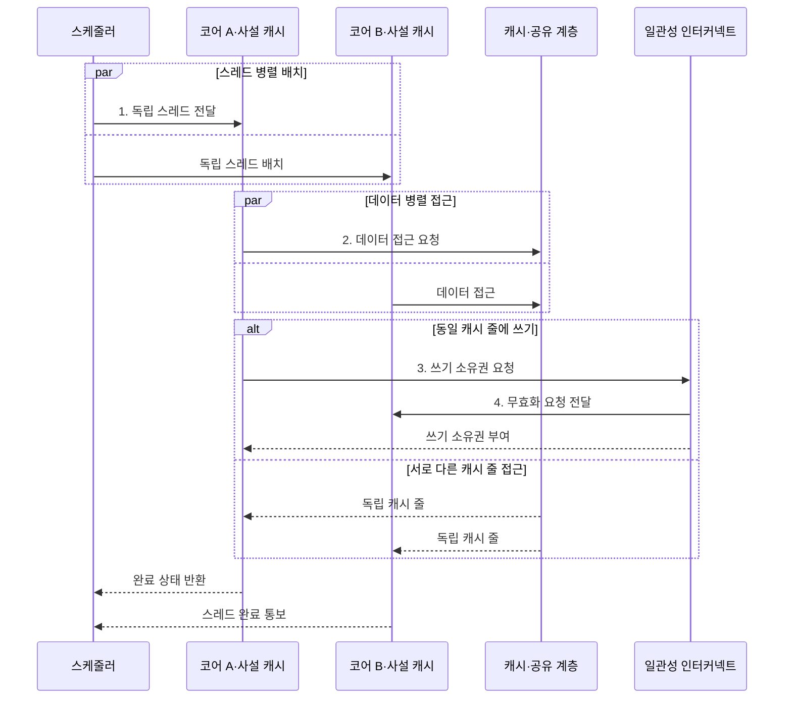

---
sidebar:
  order: 10
  label: "010. 멀티코어 프로세서 (Multicore Processor)"
  badge:
    text: "기출 · 50%"
    variant: note
title: "멀티코어 프로세서 (Multicore Processor)"
date: "2026-08-02T09:18:00+09:00"
tags:
  - "notes-hardware"
weight: 10
extra:
  question_no: "010"
  source_status: "기출"
  source_history: "132회"
  priority: 50
  priority_note: "코어 수·유형·공유 자원 선택의 핵심 주제"
---

## Ⅰ. 개요

핵심 용어

- **멀티코어 프로세서**는 하나의 칩에 여러 실행 코어를 통합하여 복수 스레드를 동시에 처리하는 프로세서 구조이다.
- **TLP**는 서로 독립적인 여러 스레드를 동시에 실행하여 처리량을 높이는 병렬성이다.

- 정의/개념: **멀티코어 프로세서**는 하나의 칩에 여러 실행 코어를 통합해 독립 스레드를 병렬 실행하는 **프로세서 구조**
- 배경/필요성: 주파수 상승의 **전력·발열 한계** 보완

#### 한줄 요약
- 멀티코어는 주파수 상승의 전력·발열 한계를 여러 스레드의 병렬 실행으로 보완한다.

## Ⅱ. 특징

핵심 용어

- **암달의 법칙**은 프로그램의 직렬 실행 비율이 코어 수를 늘려 얻을 수 있는 전체 가속의 상한을 결정한다.
- **동기화**는 여러 스레드가 공유 데이터와 실행 순서를 맞추어 결과를 안전하게 결합하도록 제어한다.

- 코어 추가로 단일 지연이 아닌 **처리량** 확장
- **스레드 수준 병렬성**이 있어야 성립하는 성능 이득
- **암달의 법칙**대로 직렬 비율이 가속 상한 확정

#### 한줄 요약
- 코어 수를 늘려도 직렬 구간과 동기화 비율이 전체 가속의 상한을 결정한다.

## Ⅲ. 구조 및 구성요소

핵심 용어

- **사설 캐시**는 각 코어가 독립적으로 사용하며 같은 데이터의 사본이 생기므로 일관성 관리가 필요하다.
- **공유 LLC**는 여러 코어에 공용 캐시 용량과 대역폭을 제공하는 최종 단계 캐시이다.
- **일관성 인터커넥트**는 코어·캐시·메모리 제어기 사이에서 요청과 캐시 상태 정보를 전달한다.

| 구성요소 | 책임 |
|:---|:---|
| 코어 클러스터 | 복수 스레드 **병렬 실행** |
| 일관성 인터커넥트 | 캐시 사본 상태와 **요청 전달** |
| 공유 LLC | 코어 공용 **캐시 용량·대역폭** 제공 |
| 메모리 제어기 | 주기억장치 **접근 순서·대역폭** 배분 |

#### 한줄 요약
- 코어가 스레드를 실행하고 인터커넥트·LLC·메모리 제어기가 공유 데이터와 대역폭을 조정한다.

## Ⅳ. 흐름도

핵심 용어

- **캐시 일관성**은 여러 사설 캐시에 복제된 같은 캐시 줄이 서로 다른 값을 갖지 않도록 보장하는 성질이다.
- **쓰기 소유권**은 코어가 캐시 줄을 수정하기 전에 다른 사본을 무효화하고 확보하는 독점 쓰기 권한이다.
- **무효화**는 다른 코어의 동일 캐시 줄 사본을 더 이상 사용할 수 없는 상태로 바꾸는 일관성 동작이다.

**동작 원리**

- **1. 독립 스레드 전달**: 코어별 실행 흐름 할당
- **2. 데이터 접근 요청**: 사설 캐시 경로로 주소 전달
- **3. 쓰기 소유권 요청**: 캐시 줄 독점 권한 요청
- **4. 무효화 요청 전달**: 다른 코어의 동일 사본 폐기

#### 한줄 요약
- 코어별 사설 캐시의 사본은 일관성 인터커넥트가 상태를 조정하고, LLC와 메모리 제어기는 모든 코어가 공유하는 용량·대역폭을 중재한다.

## Ⅴ. 종류 및 비교

핵심 용어

- **SMT**는 하나의 물리 코어에서 여러 논리 스레드의 명령을 함께 발행하여 유휴 실행 자원을 활용한다.
- **동종 멀티코어**는 같은 특성의 코어를 반복 배치하고, **이종 멀티코어**는 성능 코어와 절전 코어를 조합한다.

| 병렬 실행 방식 | 멀티코어 | SMT |
|:---|:---|:---|
| 적용 기준 | 독립 스레드가 코어 수만큼 있을 때 | 단일 스레드가 **실행 회로**를 다 못 채울 때 |
| 핵심 특징 | 복수 **물리 코어**의 독립 실행 | 한 코어를 나눈 **논리 스레드** 중첩 |
| 한계 | **거짓 공유**·공유 대역폭 경합 | 실행 유닛·**사설 캐시** 분점 |

> 요약: 일감이 많으면 **물리 코어**, 회로가 놀면 **논리 스레드**

| 멀티코어 구성 | 동종 멀티코어 | 이종 멀티코어 |
|:---|:---|:---|
| 적용 기준 | 작업 성격이 균일할 때 | 지연·전력 요구가 갈릴 때 |
| 핵심 특징 | 동일 코어 반복 배치로 **부하 분산** | **성능 코어·절전 코어** 혼합 배치 |
| 한계 | 경부하 구간의 **유휴 누설전력** | 오배정 시 **코어 이동** 비용 |

> 요약: 작업별 성능·전력 요구로 동종·이종 선택

#### 한줄 요약
- 멀티코어·SMT는 하드웨어 병렬성을, 동종·이종 구성은 코어 특성의 조합을 결정한다.

## Ⅵ. 실무 고려사항 및 대책

핵심 용어

- **거짓 공유**는 독립적인 변수가 같은 캐시 줄에 놓여 각 코어의 쓰기가 불필요한 일관성 트래픽을 만드는 현상이다.
- **NUMA**는 코어와 메모리의 물리적 위치에 따라 접근 지연이 달라지는 구조이다.
- **작업 훔치기**는 유휴 코어가 다른 코어의 작업 큐에서 대기 작업을 가져와 부하 불균형을 줄이는 기법이다.

| 문제 | 대책 | 효과 |
|:---|:---|:---|
| 코어 추가에도 **처리 시간 정체** | **직렬•동기화 비율** 측정과 재분할 | **암달 상한** 완화 |
| 독립 변수 갱신에도 **캐시 줄 왕복** | 패딩·배치로 **거짓 공유** 제거 | **일관성 트래픽** 감소 |
| 다수 코어의 **메모리 대역폭 포화** | **NUMA 인지 배치•지역성** 개선 | **메모리 병목** 완화 |
| **이종 코어 오배정** | 작업 특성 기반 **스케줄링** | **지연•전력** 최적화 |
| 웹 서버의 **공용 큐 경합** | 코어별 **작업 큐•작업 훔치기** | **경합 완화•부하 균형** |

#### 한줄 요약
- 직렬 비율, 일관성 트래픽, 메모리 대역폭을 함께 측정해 유효한 코어 수를 정한다.

## Ⅶ. 결론

핵심 용어

- **메모리 대역폭**은 단위 시간에 주기억장치와 전송할 수 있는 데이터 양이며 모든 코어가 공유하는 확장 한도이다.

- **직렬 비율•대역폭**과 일관성 트래픽 기준 코어 수 결정

#### 한줄 요약
- 병렬 가능 비율과 작업의 지연·전력 요구를 기준으로 코어 수와 구성을 선택한다.
