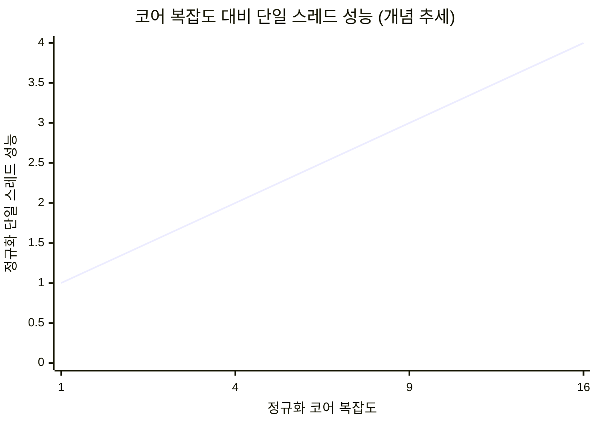
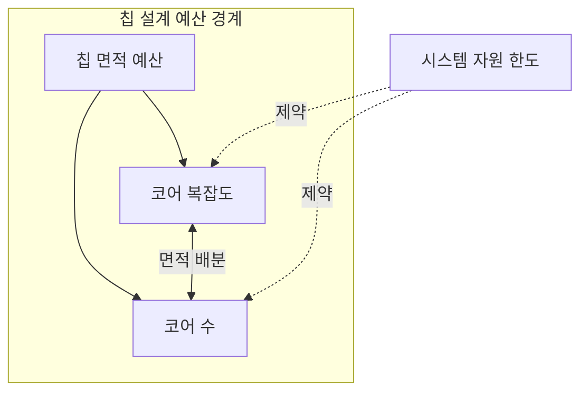
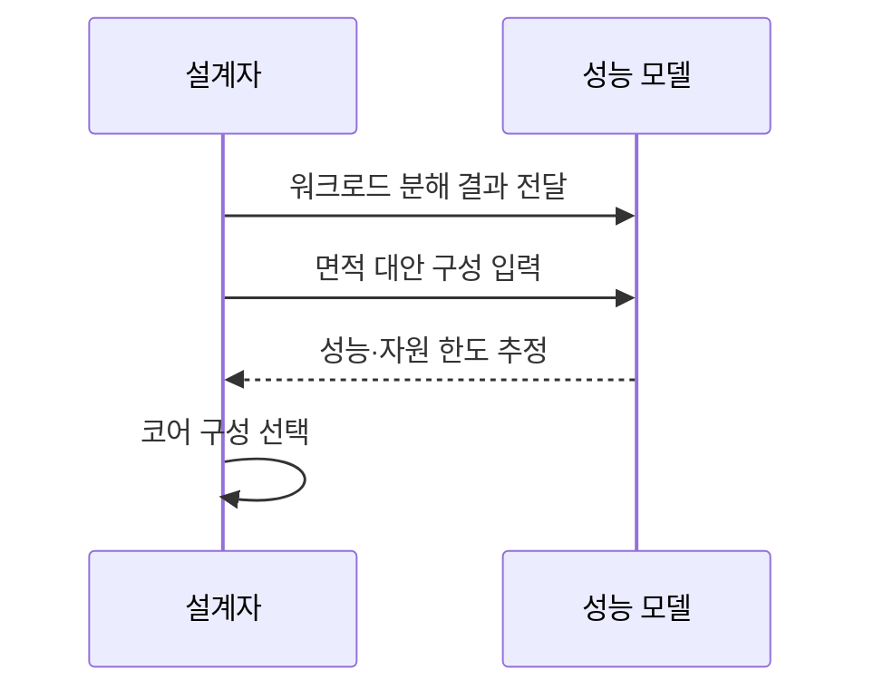

---
sidebar:
  order: 11
  label: "011. 폴락의 법칙 (Pollack's Rule)"
  badge:
    text: "기출 · 50%"
    variant: note
title: "폴락의 법칙 (Pollack's Rule)"
date: "2026-07-27T23:59:59+09:00"
tags:
  - "notes-hardware"
weight: 11
extra:
  question_no: "011"
  source_status: "기출"
  source_history: "132회"
  priority: 50
  priority_note: "코어 복잡도와 성능 수익 체감"
---

## 미리 알고가기

- **폴락의 법칙(Pollack's Rule)**: 책상을 네 배로 넓혀 줘도 한 사람이 일을 끝내는 속도는 두 배밖에 안 빨라지는 것처럼, 단일 스레드 성능이 코어에 들인 면적의 제곱근만큼만 오른다는 경험칙이며 같은 면적을 큰 코어 하나에 몰지 작은 코어 여럿에 나눌지를 가르는 근거가 된다
- **코어 복잡도(Core Complexity)**: 한 코어가 얼마나 크고 정교한지를 실행 폭·캐시 용량·예측기 규모로 본 값이며, 사실상 그 코어에 들인 면적과 같이 움직인다
- **정규화(Normalization)**: 기준이 되는 코어를 1로 놓고 나머지를 그 배수로 바꾸는 방법이며, 공정마다 다른 절대 수치 대신 증가 추세만 견주려고 쓴다
- **단일 스레드 성능(Single-thread Performance)**: 하나의 실행 흐름이 얼마나 빨리 끝나는지이며 나눌 수 없는 구간의 소요 시간을 좌우한다
- **병렬 처리량(Parallel Throughput)**: 서로 독립인 작업이 단위 시간에 몇 개나 끝나는지이며 코어 개수를 늘려 키우는 쪽이다
- **순차 임계경로(Serial Critical Path)**: 다른 작업과 겹칠 수 없어 전체 완료 시각을 혼자 결정해 버리는 가장 긴 실행 경로이며, 대형 코어를 먼저 배치할 자리다
- **워크로드(Workload)**: 시스템이 실제로 처리할 명령과 요청의 묶음이며 순차 구간과 병렬 구간의 비율을 재는 대상
- **실리콘 면적(Silicon Area)**: 칩에서 회로가 차지하는 물리 면적이며 코어 크기와 개수, 공유 캐시가 나눠 쓰는 고정 예산이다
- **반도체 공정(Process Technology)**: 트랜지스터를 만드는 세대와 방식이며 같은 복잡도라도 전력·속도·면적의 비례 계수를 바꾼다
- **메모리 대역폭(Memory Bandwidth)**: 단위 시간에 프로세서와 메모리가 주고받을 수 있는 데이터 양이며 모든 코어가 나눠 쓰는 공용 한도다
- **메모리 병목(Memory Bottleneck)**: 코어가 요청하는 속도가 이 대역폭을 넘어서서 코어를 더 넣어도 처리량이 늘지 않는 상태
- **99백분위 응답시간(p99)**: ‘피 구십구’로 읽고 percentile의 p와 백분위 수를 결합한 표기이며, 전체 요청의 99%가 끝나는 시간으로 느린 꼬리 응답을 나타낸다
- **트랜잭션 커밋(Transaction Commit)**: 데이터베이스가 변경을 최종 확정하는 구간이며 병렬화가 안 되는 순차 경로라 대형 코어 배치의 대표 사례다

## Ⅰ. 개요

- **정의/개념**: **단일 스레드 성능**이 코어 복잡도의 제곱근에 비례하는 경험칙
- **기존 한계**: 코어 면적 증가 대비 **단일 스레드 성능 수익 체감**

### 쉽게 이해하기 (학습용)

- 예산이 남았다고 책상 하나에 다 쏟아부으면 네 배 넓힌 자리에서 두 배밖에 못 벌게 되는데, 답안이 배경 자리에 이 안 늘어남을 적은 이유는 폴락의 법칙이 성능을 올려 주는 기법이 아니라 면적을 한곳에 몰면 손해라는 사실을 알려 주는 예산 배분 근거이기 때문이다

## Ⅱ. 특징

- 단일 스레드 성능의 **코어 복잡도 제곱근** 비례
- 면적 4배 투입 시 **약 2배**에 그치는 단일 성능
- 같은 면적에서 **코어 크기·개수**의 상호 배타 배분

> 복잡도가 16배로 늘어도 단일 성능은 4배에 머무는 수익 체감

### 쉽게 이해하기 (학습용)

- 가로축이 1·4·9·16으로 껑충껑충 뛰는데 세로축은 1·2·3·4로 한 칸씩만 오르는 것이 그림의 전부인데, 면적을 몇 배 부었는지에 견줘 성능이 그 제곱근만큼만 따라오므로 남은 면적을 큰 코어에 더 붓느니 작은 코어를 한 개 더 놓는 편이 언제부터 이득인지가 여기서 갈린다

## Ⅲ. 아키텍처 및 구성요소

| 설계 요소 | 설명 |
|:---|:---|
| 칩 면적 예산 | 코어와 공유 자원이 나눠 쓰는 **실리콘 면적** |
| 코어 복잡도 | 실행 폭·캐시로 정해지는 **단일 코어 규모** |
| 코어 수 | 남은 면적에 배치되는 **물리 코어 개수** |
| 시스템 자원 한도 | 전력·방열·**메모리 대역폭** 상한 |

> 요약: 코어 크기와 개수가 같은 면적을 놓고 **상호 배타 경쟁**

### 쉽게 이해하기 (학습용)

- 가운데 양방향 화살표 하나가 이 절의 전부인데, 방 크기가 정해져 있으니 책상을 넓히면 놓을 수 있는 책상 수가 줄고 책상을 늘리면 하나하나가 좁아지는 관계이며, 여기에 전기 용량과 복도 폭이라는 바깥 제약이 두 방향 모두에 위에서 한 번 더 뚜껑을 씌운다

## Ⅳ. 원리 및 절차 흐름도

| 절차 | 설명 |
|:---|:---|
| 워크로드 분해 결과 전달 | **순차 임계경로**와 병렬 비율 측정값 입력 |
| 면적 대안 구성 입력 | 같은 면적의 **코어 크기·개수** 조합 열거 |
| 성능·자원 한도 추정 | 제곱근 비례 성능과 **전력·대역폭** 동시 예측 |
| 코어 구성 선택 | 지연·처리량 목표를 만족하는 **조합 확정** |

> 요약: **워크로드 비율**을 먼저 재야 면적 배분 대안 비교 가능

### 쉽게 이해하기 (학습용)

- 순서가 뒤집히면 안 된다는 것이 이 절의 요지인데, 코어를 몇 개 넣을지부터 정하고 나중에 워크로드를 보면 나눌 수 없는 구간이 뒤늦게 튀어나와 큰 코어를 넣을 자리가 이미 없어지므로, 혼자 해야 할 일이 몇 퍼센트인지를 먼저 재고 그 숫자에 맞춰 책상 배치를 짜야 한다

## Ⅴ. 종류 및 비교

| 면적 배분 전략 | 대형 코어 집중 | 소형 코어 분산 |
|:---|:---|:---|
| 적용 기준 | **순차 임계경로**·p99 지연이 걸릴 때 | 독립 동시 요청이 코어 수를 넘길 때 |
| 핵심 특징 | 단일 스레드 **지연 단축** | 독립 스레드 **처리량 확대** |
| 한계 | 면적당 성능의 **제곱근 체감** | 코어 증가분을 삼키는 **메모리 병목** |

> 요약: 나눌 수 없는 구간에는 **대형 코어**, 나눌 수 있으면 **소형 코어**

### 쉽게 이해하기 (학습용)

- 두 한계 칸이 서로 다른 벽이라는 점이 선택을 가르는데, 큰 책상으로 밀어붙이면 돈을 부어도 속도가 제곱근으로만 오르는 벽에 먼저 부딪히고, 책상을 늘려 밀어붙이면 사람이 아무리 많아도 복도가 좁아 서류가 안 들어오는 벽에 먼저 부딪힌다

## Ⅵ. 실무 사례

1. 데이터베이스 **트랜잭션 커밋** 경로는 대형 코어로 p99 단축
2. 요청 처리 서버는 **메모리 대역폭** 포화까지 소형 코어 확장

### 쉽게 이해하기 (학습용)

- 커밋은 순서를 지켜 한 줄로 확정해야 하는 구간이라 사람을 늘려도 줄지 않으므로, 이 구간만은 가장 빠른 코어에 얹어 가장 느린 요청의 꼬리 시간을 줄인다
- 웹 요청은 서로 남남이라 코어를 늘린 만큼 처리량이 붙지만 메모리 통로가 꽉 차는 순간부터는 코어를 더 꽂아도 그대로이므로, 그 포화 지점까지만 늘린다

## Ⅶ. 결론

- 순차 경로는 **대형 코어**, 병렬은 자원 한도까지 **소형 코어**

### 쉽게 이해하기 (학습용)

- 혼자 해야만 하는 구간에는 값이 비싸도 가장 빠른 코어를 붙이고, 나눌 수 있는 일은 전력과 메모리 통로가 버티는 지점까지만 작은 코어를 늘려야 넣은 면적이 값을 한다
