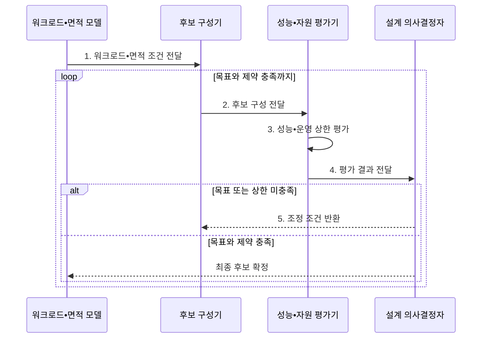

---
sidebar:
  order: 11
  label: "011. 폴락의 법칙 (Pollack's Rule)"
  badge:
    text: "기출 • 50%"
    variant: note
title: "폴락의 법칙 (Pollack's Rule)"
date: "2026-08-05T01:15:00+09:00"
tags:
  - "notes-hardware"
weight: 11
extra:
  question_no: "011"
  source_status: "기출"
  source_history: "132회"
  priority: 50
  priority_note: "코어 복잡도와 성능 수익 체감"
---

## Ⅰ. 개요

<details><summary>핵심 용어</summary>

- **폴락의 법칙(Pollack's Rule)**: 단일 코어 성능이 코어 복잡도나 면적 증가량의 제곱근에 비례한다는 프로세서 설계 경험칙
- **수익 체감**: 자원을 더 투입할수록 추가로 얻는 성능 향상 폭이 감소하는 현상
- **제곱근 비례**: 코어 복잡도나 면적을 (n)배 늘릴 때 단일 코어 성능은 대략 \(\sqrt{n}\)배 증가한다는 관계

</details>

- 정의/개념: 코어 면적 증가에 따라 단일 성능이 **제곱근 비례**하는 경험칙
- 배경/필요성: 면적•성능의 선형 가정은 **대형 코어 수익** 과대평가

#### 한줄 요약

- 폴락의 법칙은 코어 면적을 늘릴수록 단일 스레드 성능의 추가 이득이 감소함을 설명한다.

## Ⅱ. 특징

<details><summary>핵심 용어</summary>

- **코어 복잡도**: 실행 폭•캐시•예측기 규모 등 한 코어에 투입한 회로 면적의 정도
- **정규화**: 기준 코어를 1로 놓고 다른 코어의 면적과 성능을 배수로 표현하는 방법
- **단일 스레드 성능**: 하나의 실행 흐름이 얼마나 빨리 완료되는지를 나타내는 성능
- **\(C_1/C_0\)**: 비교 코어와 기준 코어의 복잡도 또는 면적 비율
- **\(P_1/P_0\)**: 비교 코어와 기준 코어의 단일 스레드 성능 비율
- **명령어 집합 아키텍처(Instruction Set Architecture, ISA)**: 소프트웨어에 공개된 프로세서 실행 규격
- **마이크로아키텍처**: ISA를 실행 폭•캐시•예측기 등의 회로로 구현한 내부 구조

</details>


> 공식 기반 파란 선은 정규화 코어 복잡도가 1→16으로 늘어도 단일 스레드 성능은 1→4로 제곱근 증가해 투자 대비 성능 이득이 둔화됨을 나타낸다.

$$
\frac{P_1}{P_0} \approx \sqrt{\frac{C_1}{C_0}}
$$

| 기호•축 | 의미 | 전제 |
|:---|:---|:---|
| \(C_1/C_0\), x축 | 기준 코어 대비 정규화한 코어 복잡도 또는 면적 비율 | 같은 공정•유사 마이크로아키텍처 계열 |
| \(P_1/P_0\), y축 | 기준 코어 대비 정규화한 단일 스레드 성능 | 같은 워크로드•성능 측정 기준 |

- 단일 스레드 성능의 **코어 복잡도 제곱근** 비례
- 면적 4배 투입 시 **약 2배** 에 그치는 단일 성능
- 같은 면적에서 **코어 크기•개수** 의 상호 배타 배분

#### 한줄 요약

- 코어 복잡도가 4배가 되어도 단일 스레드 성능은 약 2배라는 수익 체감을 나타낸다.

## Ⅲ. 구조 및 구성요소

<details><summary>핵심 용어</summary>

- **워크로드 모델**: 실제 요청의 순차•병렬 비율과 지연 목표를 표현한 분석 입력
- **실리콘 면적**: 코어 크기•개수와 공유 자원이 나누어 쓰는 칩의 고정 물리 예산
- **후보 구성**: 같은 면적 안에서 코어 크기•개수•공유 자원 비율을 달리한 설계안
- **99번째 백분위수(99th Percentile, p99)**: 전체 요청의 99%가 이 값 이하에 완료되는 지표
- **운영 가능 범위**: 전력•열•메모리 대역폭 한도를 넘지 않고 지속해서 동작할 수 있는 설계 영역

</details>

```text
[워크로드•면적 모델] -- [후보 구성기] -- [성능 모델]
                                             |
[설계 의사결정자] -- [전력•열•대역폭 검증기]
```

선의 의미: 후보 구성과 성능 추정에 필요한 모델, 운영 제약 검증 결과, 최종 설계 판단 사이의 정적 정보 의존 관계다.

| 구성요소 | 책임 |
|:---|:---|
| 워크로드•면적 모델 | 순차 비율•p99•**실리콘 면적** 제공 |
| 후보 구성기 | 면적별 **코어 복잡도•개수** 조합 생성 |
| 성능 모델 | 폴락 법칙으로 **단일 성능•처리량** 추정 |
| 전력•열•대역폭 검증기 | 후보의 **운영 가능 범위** 검증 |
| 설계 의사결정자 | 목표와 상한에 맞는 **후보 구성** 선택 |

#### 한줄 요약
- 모델과 검증기가 후보별 단일 성능•처리량과 운영 상한을 계산해 설계안을 선택한다.

## Ⅳ. 흐름도

<details><summary>핵심 용어</summary>

- **성능 추정치**: 폴락의 법칙과 코어 수를 이용해 계산한 단일 성능과 병렬 처리량
- **운영 상한**: 설계가 넘지 않아야 할 전력•열•메모리 대역폭 제한
- **후보 구성**: 고정 면적 안에서 코어 크기•개수와 공유 자원 배분을 달리한 설계안

</details>



**동작 원리**

- **1. 워크로드•면적 조건 전달**: 순차 비율•p99•면적 제공
- **2. 후보 구성 전달**: 코어 크기•개수 조합 제공
- **3. 성능•운영 상한 평가**: 단일 성능•처리량과 전력•열•대역폭 계산
- **4. 평가 결과 전달**: 목표와 자원 제약 충족 여부 제공
- **5. 조정 조건 반환**: 미충족 코어 배분 재구성

#### 한줄 요약

- 고정 면적에서 코어 하나의 복잡도를 높이면 코어 수가 줄고, 코어 수를 늘리면 단일 코어에 배분할 면적이 줄어든다.

## Ⅴ. 종류 및 비교

<details><summary>핵심 용어</summary>

- **순차 임계경로**: 병렬화할 수 없어 전체 완료 시간을 결정하는 가장 긴 실행 경로
- **병렬 처리량**: 서로 독립적인 작업을 단위 시간에 완료하는 수
- **메모리 병목**: 코어의 데이터 요구가 대역폭을 넘어 코어를 늘려도 처리량이 증가하지 않는 상태

</details>

| 면적 배분 전략 | 대형 코어 집중 | 소형 코어 분산 |
|:---|:---|:---|
| 적용 기준 | **순차 임계경로**•p99 지연이 걸릴 때 | 독립 동시 요청이 코어 수를 넘길 때 |
| 핵심 특징 | 단일 스레드 **지연 단축** | 독립 스레드 **처리량 확대** |
| 한계 | 면적당 성능의 **제곱근 체감** | 코어 증가분을 삼키는 **메모리 병목** |

> 요약: 순차 구간은 **대형**, 병렬 구간은 **소형 코어**

#### 한줄 요약

- 대형 코어는 순차 지연을 줄이고 소형 코어 다수는 병렬 처리량을 높인다.

## Ⅵ. 실무 고려사항 및 대책

<details><summary>핵심 용어</summary>

- **전력 밀도**: 칩 면적당 소비 전력으로 발열과 지속 가능한 주파수를 제약하는 값
- **공정 보정**: 실제 반도체 공정과 마이크로아키텍처 특성에 맞춰 경험식 계수를 조정하는 작업
- **인터커넥트**: 코어•캐시•메모리 제어기 사이에서 요청과 데이터를 전달하는 칩 내부 연결망
- **지속 가능 성능**: 전력과 열 한도를 넘지 않고 장시간 유지할 수 있는 처리 성능
- **그룹 커밋**: 여러 변경이나 작업 결과를 묶어 한 번에 확정해 순차 처리 비용을 줄이는 방식

</details>

| 문제 | 대책 | 효과 |
|:---|:---|:---|
| 병렬 부하에 **대형 코어 집중** | **순차•병렬 비율** 과 p99•처리량 분리 측정 | **면적 배분 적합성** 향상 |
| 소형 코어 증설 후 **처리량 정체** | **대역폭•인터커넥트**•동기화 개선 | **코어 확장 효과** 회복 |
| 면적 모델의 **전력•열 초과** | **전력 밀도•냉각**•주파수 모델링 | **지속 가능 성능** 확보 |
| 다른 **반도체 공정** 에 경험칙 재사용 | 실제 공정•**마이크로아키텍처** 로 보정 | **추정 오차** 감소 |
| 커밋 **임계경로의 p99** 증가 | **대형 코어•그룹 커밋** 적용 | **순차 지연** 완화 |

#### 한줄 요약

- 경험칙은 실제 워크로드, 공정, 전력과 메모리 한도로 보정해야 한다.

## Ⅶ. 결론

<details><summary>핵심 용어</summary>

- **대형 코어**: 높은 단일 스레드 성능으로 순차 지연을 줄이도록 넓은 면적을 배정한 코어
- **소형 코어**: 제한된 면적에 여러 개를 배치해 병렬 처리량을 높이는 코어

</details>

- 순차•p99는 **대형 코어**, 병렬 처리량은 **소형 코어** 배분

#### 한줄 요약

- 순차 지연에는 대형 코어를, 병렬 처리량에는 전력•열•대역폭 상한까지 소형 코어를 배분한다.
