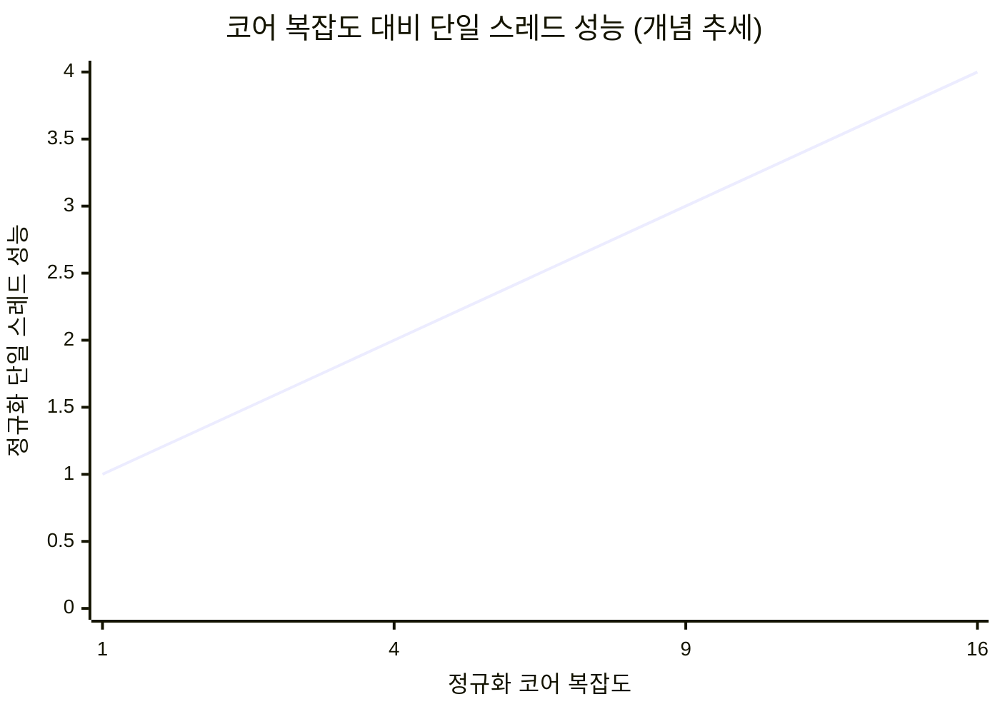
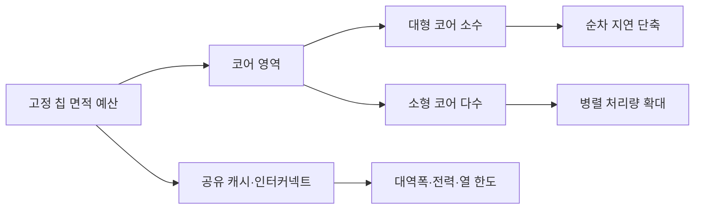
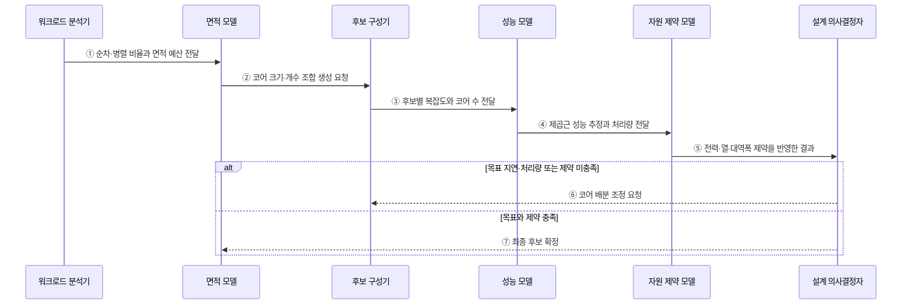

---
sidebar:
  order: 11
  label: "011. 폴락의 법칙 (Pollack's Rule)"
  badge:
    text: "기출 · 50%"
    variant: note
title: "폴락의 법칙 (Pollack's Rule)"
date: "2026-07-28T22:01:02+09:00"
tags:
  - "notes-hardware"
weight: 11
extra:
  question_no: "011"
  source_status: "기출"
  source_history: "132회"
  priority: 50
  priority_note: "코어 복잡도와 성능 수익 체감"
---

## 미리 알고가기

- **폴락의 법칙(Pollack's Rule)**: 단일 코어 성능은 코어 면적 증가량의 제곱근에 비례한다는 경험칙으로, 대형 코어와 다수 소형 코어 사이의 면적 효율을 판단하는 기준이다
- **코어 복잡도(Core Complexity)**: 한 코어가 얼마나 크고 정교한지를 실행 폭·캐시 용량·예측기 규모로 본 값이며, 사실상 그 코어에 들인 면적과 같이 움직인다
- **정규화(Normalization)**: 기준이 되는 코어를 1로 놓고 나머지를 그 배수로 바꾸는 방법이며, 공정마다 다른 절대 수치 대신 증가 추세만 견주려고 쓴다
- **단일 스레드 성능(Single-thread Performance)**: 하나의 실행 흐름이 얼마나 빨리 끝나는지이며 나눌 수 없는 구간의 소요 시간을 좌우한다
- **병렬 처리량(Parallel Throughput)**: 서로 독립인 작업이 단위 시간에 몇 개나 끝나는지이며 코어 개수를 늘려 키우는 쪽이다
- **순차 임계경로(Serial Critical Path)**: 다른 작업과 겹칠 수 없어 전체 완료 시각을 혼자 결정해 버리는 가장 긴 실행 경로이며, 대형 코어를 먼저 배치할 자리다
- **워크로드(Workload)**: 시스템이 실제로 처리할 명령과 요청의 묶음이며 순차 구간과 병렬 구간의 비율을 재는 대상
- **실리콘 면적(Silicon Area)**: 칩에서 회로가 차지하는 물리 면적이며 코어 크기와 개수, 공유 캐시가 나눠 쓰는 고정 예산이다
- **반도체 공정(Process Technology)**: 트랜지스터를 만드는 세대와 방식이며 같은 복잡도라도 전력·속도·면적의 비례 계수를 바꾼다
- **메모리 대역폭(Memory Bandwidth)**: 단위 시간에 프로세서와 메모리가 주고받을 수 있는 데이터 양이며 모든 코어가 나눠 쓰는 공용 한도다
- **메모리 병목(Memory Bottleneck)**: 코어가 요청하는 속도가 이 대역폭을 넘어서서 코어를 더 넣어도 처리량이 늘지 않는 상태
- **99백분위 응답시간(p99)**: 측정 요청의 99%가 이 값 이하에 완료되는 꼬리 지연 지표
- **트랜잭션 커밋(Transaction Commit)**: 데이터베이스 변경을 최종 확정하며 내구성·순서 제약으로 순차 임계경로가 될 수 있는 구간
- **후보 구성(Candidate Configuration)**: 동일한 칩 면적 예산 안에서 코어 크기·개수·공유 자원 비율을 달리한 비교 대상
- **자원 제약 모델(Resource Constraint Model)**: 후보 구성이 전력·열·메모리 대역폭 한도를 넘는지 함께 평가하는 모델

## Ⅰ. 개요

- 정의/개념: **단일 스레드 성능**이 코어 복잡도의 제곱근에 비례하는 경험칙
- 기존 한계: 코어 면적 증가 대비 **단일 스레드 성능 수익 체감**

### 쉽게 이해하기 (학습용)

- 폴락의 법칙은 코어 면적을 늘릴수록 단일 스레드 성능의 추가 이득이 감소함을 설명한다.

## Ⅱ. 특징

- 단일 스레드 성능의 **코어 복잡도 제곱근** 비례
- 면적 4배 투입 시 **약 2배**에 그치는 단일 성능
- 같은 면적에서 **코어 크기·개수**의 상호 배타 배분

$$
\frac{P_1}{P_0} \approx \sqrt{\frac{C_1}{C_0}}
$$

| 기호·축 | 의미 | 전제 |
|:---|:---|:---|
| \(C_1/C_0\), x축 | 기준 코어 대비 정규화한 코어 복잡도 또는 면적 비율 | 같은 공정·유사 마이크로아키텍처 계열 |
| \(P_1/P_0\), y축 | 기준 코어 대비 정규화한 단일 스레드 성능 | 같은 워크로드·성능 측정 기준 |

> 경험적 근사식에 따라 복잡도가 16배로 늘어도 단일 성능은 약 4배에 머무는 수익 체감을 나타낸다.

### 쉽게 이해하기 (학습용)

- 코어 복잡도가 4배가 되어도 단일 스레드 성능은 약 2배라는 수익 체감을 나타낸다.

## Ⅲ. 아키텍처

### 도표안 A. 고정 면적의 코어 배분 구조

| 설계 요소 | 설명 |
|:---|:---|
| 칩 면적 예산 | 코어와 공유 자원이 나눠 쓰는 **실리콘 면적** |
| 코어 복잡도 | 실행 폭·캐시로 정해지는 **단일 코어 규모** |
| 코어 수 | 남은 면적에 배치되는 **물리 코어 개수** |
| 시스템 자원 한도 | 전력·방열·**메모리 대역폭** 상한 |

> 요약: 코어 크기와 개수가 같은 면적을 놓고 **상호 배타 경쟁**

### 도표안 B. 폴락의 법칙 기반 구성 평가 시퀀스

### 동작 원리

1. **① 순차·병렬 비율과 면적 예산 전달**: 워크로드 분석기는 순차 임계경로, 병렬 작업량, p99 요구와 사용 가능한 칩 면적을 정리한다.
2. **② 코어 크기·개수 조합 생성 요청**: 면적 모델은 공유 자원 면적을 제외한 범위에서 비교할 대형·소형 코어 조합을 후보 구성기에 요청한다.
3. **③ 후보별 복잡도와 코어 수 전달**: 후보 구성기는 각 조합의 코어 복잡도, 코어 수, 공유 자원 배분을 성능 모델에 제공한다.
4. **④ 제곱근 성능 추정과 처리량 전달**: 성능 모델은 폴락의 법칙으로 단일 코어 성능을 근사하고 워크로드의 병렬 비율을 반영해 지연·처리량을 추정한다.
5. **⑤ 전력·열·대역폭 제약을 반영한 결과**: 자원 제약 모델은 추정 성능이 전력 밀도, 냉각, 인터커넥트와 메모리 대역폭 한도 안에서 지속 가능한지 판정한다.
6. **⑥ 코어 배분 조정 요청**: 목표를 달성하지 못하거나 자원 한도를 넘으면 코어 크기·개수와 공유 자원 비율을 바꿔 다시 평가한다.
7. **⑦ 최종 후보 확정**: 목표 지연과 처리량을 만족하면서 제약을 지키는 후보를 최종 구성으로 선택한다.

### 쉽게 이해하기 (학습용)

- 고정 면적에서 코어 하나의 복잡도를 높이면 코어 수가 줄고, 코어 수를 늘리면 단일 코어에 배분할 면적이 줄어든다.

## Ⅳ. 종류 및 비교

| 면적 배분 전략 | 대형 코어 집중 | 소형 코어 분산 |
|:---|:---|:---|
| 적용 기준 | **순차 임계경로**·p99 지연이 걸릴 때 | 독립 동시 요청이 코어 수를 넘길 때 |
| 핵심 특징 | 단일 스레드 **지연 단축** | 독립 스레드 **처리량 확대** |
| 한계 | 면적당 성능의 **제곱근 체감** | 코어 증가분을 삼키는 **메모리 병목** |

> 요약: 나눌 수 없는 구간에는 **대형 코어**, 나눌 수 있으면 **소형 코어**

### 쉽게 이해하기 (학습용)

- 대형 코어는 순차 지연을 줄이고 소형 코어 다수는 병렬 처리량을 높인다.

## Ⅴ. 실무 고려사항 및 대책

| 실패 징후 | 완화 방안 | 기대 효과 |
|:---|:---|:---|
| 병렬 부하에 대형 코어 집중 | 순차·병렬 비율과 p99·처리량 분리 측정 | 면적 배분 적합성 향상 |
| 소형 코어 증설 후 정체 | 대역폭·인터커넥트·동기화 개선 | 코어 확장 효과 회복 |
| 면적 모델의 전력·열 초과 | 전력 밀도·냉각·주파수 동시 모델링 | 지속 가능 성능 확보 |
| 다른 공정에 경험칙 재사용 | 실제 공정·마이크로아키텍처로 보정 | 추정 오차 감소 |
| 커밋 임계경로의 p99 증가 | 대형 코어 배치·그룹 커밋 검토 | 순차 지연 완화 |

### 쉽게 이해하기 (학습용)

- 경험칙은 실제 워크로드, 공정, 전력과 메모리 한도로 보정해야 한다.

## Ⅵ. 결론

- 코어 투자 판단을 위해 순차 비율·전력을 검토하여 **폴락의 법칙** 활용

### 쉽게 이해하기 (학습용)

- 순차 지연에는 대형 코어를, 병렬 처리량에는 자원 한도까지 소형 코어를 배분한다.
