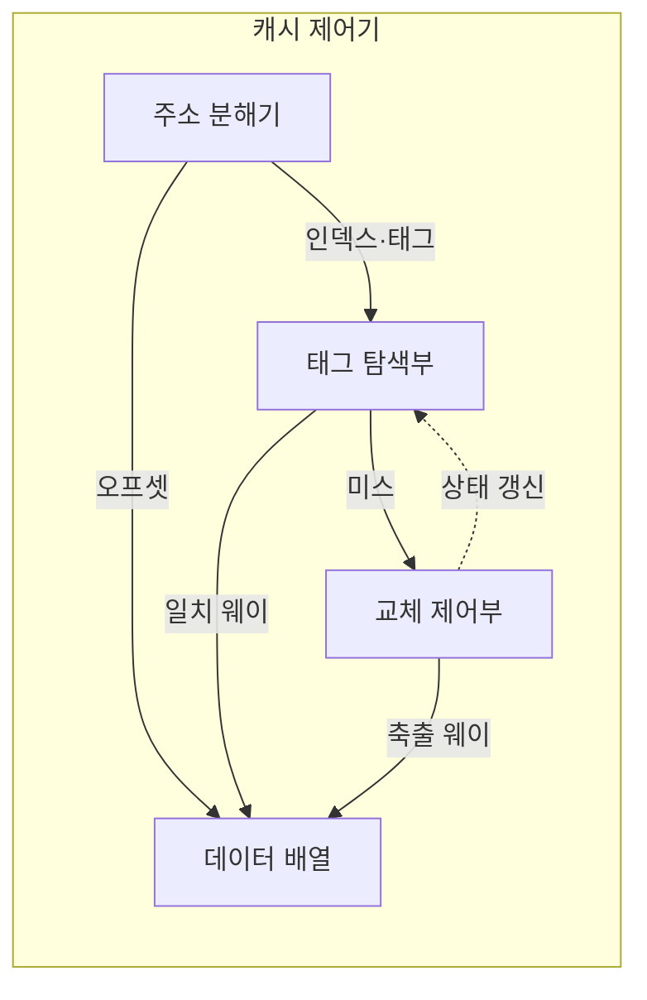

---
sidebar:
  order: 12
  label: "012. 캐시 메모리 구조 — 직접·연관·집합 연관 매핑 (Cache Memory Mapping)"
  badge:
    text: "기출 · 85%"
    variant: note
title: "캐시 메모리 구조 — 직접·연관·집합 연관 매핑 (Cache Memory Mapping)"
date: "2026-07-28T12:38:54+09:00"
tags:
  - "notes-hardware"
weight: 12
extra:
  question_no: "012"
  source_status: "기출"
  source_history: "120회, 125회, 131회, 132회, 134회, 135회"
  priority: 85
  priority_note: "반복 기출, 매핑·지역성·적중률 핵심"
---

## 미리 알고가기

- **캐시 매핑(Cache Mapping)**: 주기억장치 블록을 캐시의 어느 라인에 배치하고 조회 시 몇 개의 태그를 비교할지 정하는 규칙이다
- **캐시 라인(Cache Line)**: 캐시와 주기억장치 사이에서 한 번에 전송하고 태그 단위로 관리하는 고정 크기 데이터 블록
- **연관도(Associativity)**: 메모리 블록 하나가 들어갈 수 있는 후보 라인이 몇 개인지이며, 1이면 직접 매핑이고 전체 라인 수와 같으면 완전 연관이다
- **집합과 웨이(Set and Way)**: 집합은 같은 인덱스를 갖는 후보 라인 묶음이고 웨이는 그 묶음 안의 개별 라인이며, 4-웨이라면 한 집합에 후보가 넷이라는 뜻이다
- **태그·인덱스·오프셋(Tag·Index·Offset)**: 메모리 주소를 셋으로 갈라 인덱스로 어느 집합인지 고르고 태그로 그 집합 안의 어느 블록인지 가려내며 오프셋으로 라인 안 몇 번째 바이트인지 찾는다
- **주소 필드(Address Field)**: 주소를 위 세 역할에 몇 비트씩 떼어 준 구간이며 캐시 용량·라인 크기·연관도가 정해지면 이 폭도 함께 정해진다
- **유효 비트(Valid Bit)**: 그 라인에 실제 의미 있는 데이터가 들어 있는지를 표시하는 한 비트이며, 태그가 우연히 맞아도 이 비트가 꺼져 있으면 미스다
- **캐시 적중(Cache Hit)·캐시 미스(Cache Miss)**: 찾는 데이터가 캐시에 있어 바로 돌려주면 적중, 없어서 아래 계층까지 다녀와야 하면 미스다
- **충돌 미스(Conflict Miss)**: 캐시에 빈자리가 있는데도 그 블록이 갈 수 있는 후보 칸이 이미 다른 블록에 차 있어 어쩔 수 없이 나는 미스
- **적중 시간·미스율·미스 페널티(Hit Time·Miss Rate·Miss Penalty)**: 캐시를 뒤지는 데 걸리는 시간, 전체 접근 중 미스가 난 비율, 미스 한 번에 아래 계층까지 다녀오는 추가 지연이며 이 셋이 평균 접근 시간을 만든다
- **평균 메모리 접근 시간(Average Memory Access Time, AMAT)**: 캐시 적중 시간과 미스율·미스 페널티를 결합해 계산한 평균 메모리 접근 지연
- **지역성(Locality)**: 프로그램이 방금 쓴 주소나 그 근처를 다시 찾는 성질이며, 이것이 강할수록 후보 칸을 늘려 얻는 미스 감소 효과도 커진다
- **직접 매핑(Direct Mapping)**: 메모리 블록을 인덱스로 계산한 하나의 캐시 라인에만 배치하여 태그 하나를 비교하는 방식
- **완전 연관 매핑(Fully Associative Mapping)**: 블록을 아무 칸에나 넣을 수 있게 열어 두는 대신 찾을 때 모든 이름표를 한꺼번에 비교하는 방식
- **집합 연관 매핑(Set-Associative Mapping)**: 인덱스로 집합 하나를 고른 뒤 그 안의 몇 개 웨이만 비교해 앞의 두 방식을 절충한 방식
- **주소 분해기(Address Decoder)**: 들어온 주소를 태그·인덱스·오프셋으로 잘라 각 회로에 나눠 보내는 회로
- **태그 배열(Tag Array)·데이터 배열(Data Array)**: 각 라인의 블록 식별자와 상태를 담아 두는 쪽이 태그 배열, 실제 데이터를 담아 두는 쪽이 데이터 배열이다
- **축출(Eviction)·리필(Refill)**: 새 블록 자리를 만들려고 기존 라인을 내보내는 동작이 축출, 미스 난 블록을 아래 계층에서 받아 채우는 동작이 리필이다
- **교체 정책(Replacement Policy)**: 후보 웨이가 전부 찼을 때 어느 라인을 축출할지 고르는 규칙
- **1단계·2단계 캐시(L1·L2 Cache)**: L1은 코어에 가장 가까운 최소 지연 캐시이고, L2는 더 큰 용량으로 L1 미스를 처리하는 하위 캐시
- **마이크로컨트롤러(Microcontroller Unit, MCU)**: 프로세서·메모리·제어용 주변장치를 하나의 칩에 통합한 제어 장치

## Ⅰ. 개요

- 정의/개념: 메모리 블록의 캐시 배치·탐색 범위를 정해 적중을 판정하는 **매핑 구조**
- 기존 한계: 배치 규칙 없이는 캐시 내 **블록 위치 탐색 불가**

### 쉽게 이해하기 (학습용)

- 캐시 매핑은 메모리 주소의 인덱스로 검색할 라인 집합을 제한하고 태그로 블록을 식별하여, 전체 캐시를 탐색하지 않고도 적중 여부를 빠르게 판정한다

## Ⅱ. 특징

- 블록이 들어갈 **후보 웨이 수**가 곧 연관도
- **적중 시간·미스율**·미스 페널티로 **AMAT** 결정
- 주소 **충돌 집중도**가 높을수록 커지는 연관도 증가 효과

### 쉽게 이해하기 (학습용)

- 캐시를 평가할 때 적중률 하나만 보면 틀리는 이유가 둘째 줄에 있는데, 후보 칸을 늘려 헛걸음 비율을 낮춰도 매번 이름표를 더 많이 비교하느라 한 번의 조회가 길어지면 평균 대기 시간은 오히려 늘 수 있고, 게다가 방금 쓴 물건을 다시 찾는 습관이 없는 프로그램에서는 칸을 늘려도 헛걸음이 줄지 않는다

## Ⅲ. 아키텍처 및 구성요소

| 설계 요소 | 입력·상태 | 역할 |
|:---|:---|:---|
| 주소 분해기 | 메모리 주소 | 태그·인덱스·오프셋 분리 |
| 태그 탐색부 | 인덱스·태그·유효 비트 | 집합 선택과 일치 웨이 판정 |
| 데이터 배열 | 일치 웨이·오프셋 | 요청 데이터 반환 |
| 교체 제어부 | 미스·웨이 상태 | 축출 대상 선정과 리필 상태 갱신 |

> 요약: 인덱스는 **집합**, 태그는 **웨이**, 오프셋은 바이트를 각각 지목

### 쉽게 이해하기 (학습용)

- 인덱스가 집합을 고르고 태그가 웨이를 식별하며 오프셋이 라인 안의 요청 바이트를 선택한다.

## Ⅳ. 운영 고려사항

| 실패 징후 | 완화 방안 | 기대 효과 |
|:---|:---|:---|
| 특정 주소 조합에서 충돌 미스 반복 | 연관도 확대·주소 배치·해시 인덱싱 검토 | 동일 집합 집중 완화 |
| 연관도 증가 후 적중 시간·전력 상승 | 웨이 수와 병렬 태그 비교 범위 조정 | AMAT·전력 균형 |
| 미스 페널티가 평균 지연 지배 | 하위 캐시·프리페치·비차단 리필 적용 | 미스 대기 숨김 |
| 교체 정책이 작업 집합을 반복 축출 | 접근 패턴별 LRU 근사·랜덤 정책 비교 | 불필요한 축출 감소 |

### 쉽게 이해하기 (학습용)

- 적중률만이 아니라 적중 시간, 미스율, 미스 페널티를 합친 AMAT와 전력을 함께 비교해 매핑 방식을 선택한다.

## Ⅴ. 종류 및 비교

| 캐시 매핑 방식 | 직접 매핑 | 완전 연관 매핑 | 집합 연관 매핑 |
|:---|:---|:---|:---|
| 적용 기준 | **적중 지연**을 최소로 눌러야 할 때 | 라인 수가 적은 소형 캐시일 때 | 미스율과 지연을 함께 봐야 할 때 |
| 핵심 특징 | 인덱스가 지정한 **단일 라인** 배치 | 전체 라인이 **단일 집합**인 배치 | 지정 집합의 **여러 웨이** 배치 |
| 한계 | 빈자리가 있어도 나는 **충돌 미스** | 전체 **태그 비교**의 면적·전력 폭증 | 웨이 선택·**교체 정책** 회로 부담 |

> 요약: 직접 매핑의 **충돌**과 완전 연관의 **비교 비용**을 집합 연관이 절충

### 쉽게 이해하기 (학습용)

- 직접 매핑은 충돌 미스가 많고 완전 연관 매핑은 전체 태그 비교 비용이 크므로, 집합 연관 매핑은 제한된 라인 집합에서만 태그를 비교해 충돌률과 회로 비용을 절충한다

## Ⅵ. 실무 사례

1. 소형 **MCU** 캐시는 직접 매핑으로 적중 지연 최소화

### 쉽게 이해하기 (학습용)

- 제어용 소형 칩은 캐시 자체가 작아 이름표를 여러 개 비교할 회로를 넣을 자리도 없고 응답이 한 박자 늦는 것이 곧 제어 실패이므로, 후보를 한 칸으로 못 박아 조회를 가장 짧게 끝낸다

## Ⅶ. 결론

- 캐시 적중 향상을 위해 충돌 미스·비교 비용을 검토하여 **매핑** 활용

### 쉽게 이해하기 (학습용)

- 연관도는 높을수록 좋은 값이 아니라 넘기면 손해로 바뀌는 값이라, 웨이를 하나 더 늘려 줄어드는 헛걸음 손실이 늘어나는 비교 시간과 전력보다 큰 동안에만 올리고 그 지점에서 멈춘다
