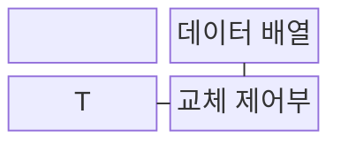
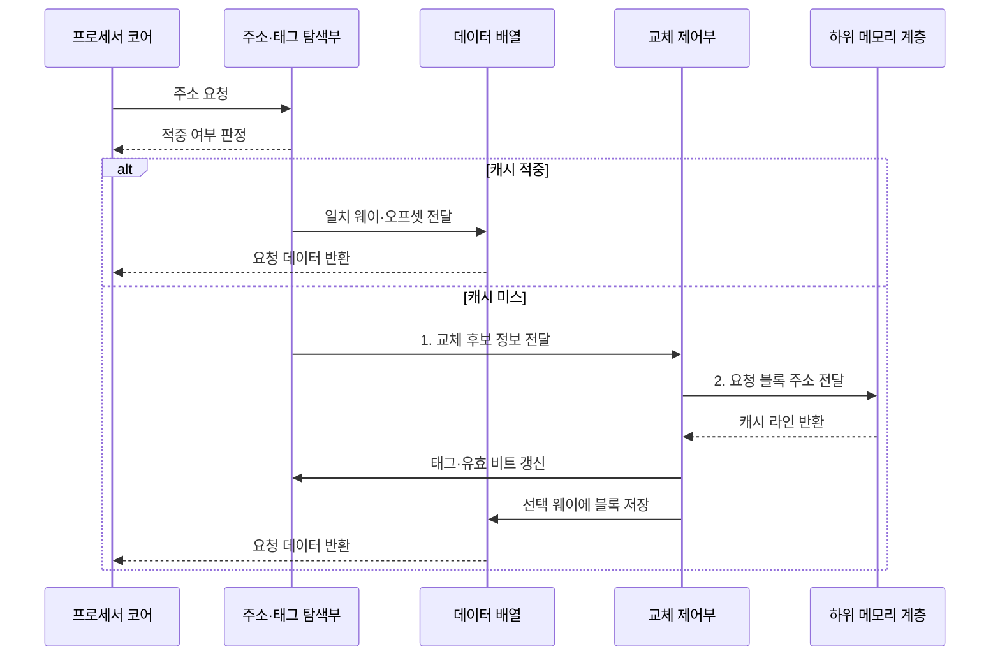

---
sidebar:
  order: 12
  label: "012. 캐시 메모리 구조: 직접·연관·집합 연관 매핑 (Cache Memory Mapping)"
  badge:
    text: "기출 · 85%"
    variant: note
title: "캐시 메모리 구조: 직접·연관·집합 연관 매핑 (Cache Memory Mapping)"
date: "2026-08-02T19:02:00+09:00"
tags:
  - "notes-hardware"
weight: 12
extra:
  question_no: "012"
  source_status: "기출"
  source_history: "120회, 125회, 131회, 132회, 134회, 135회"
  priority: 85
  priority_note: "반복 기출, 매핑·지역성·적중률 핵심"
---

## Ⅰ. 개요

핵심 용어

- **캐시 매핑**: 주기억장치 블록을 캐시의 어느 라인에 배치하고 조회할 태그 범위를 정하는 규칙
- **캐시 라인**: 캐시와 하위 메모리 사이에서 한 번에 전송하고 관리하는 고정 크기 데이터 블록

- 정의/개념: 캐시의 **블록 배치·탐색 범위** 규칙
- 배경/필요성: 전체 캐시 탐색은 **태그 비교 지연•면적** 증가

### 쉽게 이해하기 (학습용)

- 캐시 매핑은 인덱스로 후보 집합을 제한하고 태그로 요청 블록의 적중 여부를 판정한다.

## Ⅱ. 특징

핵심 용어

- **연관도**: 메모리 블록 하나가 배치될 수 있는 후보 캐시 라인의 수
- **AMAT**: 적중 시간과 미스율·미스 페널티를 결합한 평균 메모리 접근 시간
- **충돌 미스**: 빈 라인이 있어도 지정 후보가 모두 차 있어 발생하는 캐시 미스

- 블록이 들어갈 **후보 웨이 수**가 곧 연관도
- **적중 시간·미스율**·미스 페널티로 **AMAT** 결정
- 집합별 **충돌 집중도**가 높을수록 커지는 연관도 증가 효과

$$
AMAT = Hit\ Time + Miss\ Rate \times Miss\ Penalty
$$

> 단일 캐시 단계의 평균 접근 시간 기본식

### 쉽게 이해하기 (학습용)

- 연관도를 높이면 충돌 미스는 줄지만 태그 비교 시간·면적·전력이 증가할 수 있다.

## Ⅲ. 구조 및 구성요소

핵심 용어

- **태그·인덱스·오프셋**: 주소에서 집합을 고르고 블록을 식별하며 라인 안의 바이트를 찾는 세 필드
- **유효 비트**: 캐시 라인에 의미 있는 데이터가 들어 있는지를 표시하는 상태 비트
- **교체 정책**: 후보 웨이가 모두 찼을 때 축출할 라인을 고르는 규칙

| 구성요소 | 책임 |
|:---|:---|
| 주소 분해기 | 주소의 **태그·인덱스·오프셋** 분리 |
| 태그 탐색부 | 집합과 **일치 웨이** 판정 |
| 데이터 배열 | 선택 웨이의 **요청 데이터** 반환 |
| 교체 제어부 | 미스 시 **축출·리필 상태** 갱신 |

### 쉽게 이해하기 (학습용)
- 주소 분해기가 후보를 정하고 태그 탐색부와 데이터 배열이 적중을 처리하며 교체 제어부가 미스를 채운다.

## Ⅳ. 흐름도

핵심 용어

- **캐시 적중·미스**: 요청 데이터가 캐시에 있어 즉시 반환되거나 하위 계층에서 가져와야 하는 상태
- **축출·리필**: 기존 라인을 내보내고 미스가 난 블록을 하위 계층에서 받아 채우는 동작
- **하위 메모리 계층**: 현재 캐시 미스 시 요청을 전달하는 다음 단계 캐시나 주기억장치

**동작 원리**

- **1. 교체 후보 정보 전달**: 미스 후보 상태로 교체 웨이 선택
- **2. 요청 블록 주소 전달**: 하위 계층 반환 블록을 캐시에 리필

### 쉽게 이해하기 (학습용)

- 인덱스가 집합을 고르고 태그가 웨이를 식별하며 오프셋이 라인 안의 요청 바이트를 선택한다.

## Ⅴ. 종류 및 비교

핵심 용어

- **직접 매핑**: 각 메모리 블록을 하나의 캐시 라인에만 배치하는 방식
- **완전 연관 매핑**: 블록을 모든 라인에 배치할 수 있는 대신 전체 태그를 비교하는 방식
- **집합 연관 매핑**: 인덱스로 집합을 고른 뒤 그 안의 여러 웨이를 비교하는 절충 방식

| 캐시 매핑 방식 | 직접 매핑 | 완전 연관 매핑 | 집합 연관 매핑 |
|:---|:---|:---|:---|
| 적용 기준 | **적중 지연**을 최소로 눌러야 할 때 | 라인 수가 적은 소형 캐시일 때 | 미스율과 지연을 함께 봐야 할 때 |
| 핵심 특징 | 인덱스가 지정한 **단일 라인** 배치 | 전체 라인이 **단일 집합**인 배치 | 지정 집합의 **여러 웨이** 배치 |
| 한계 | 빈자리가 있어도 나는 **충돌 미스** | 전체 **태그 비교**의 면적·전력 폭증 | 웨이 선택·**교체 정책** 회로 부담 |

> 요약: 연관도 증가 시 **충돌 미스 감소•태그 비교 비용 증가**

### 쉽게 이해하기 (학습용)

- 집합 연관 매핑은 직접 매핑의 충돌과 완전 연관 매핑의 전체 태그 비교 비용을 절충한다.

## Ⅵ. 실무 고려사항 및 대책

핵심 용어

- **비차단 캐시**: 미스 처리를 기다리는 동안 다른 독립 요청을 계속 처리하는 구조
- **프리페치**: 곧 사용할 것으로 예상되는 블록을 요청 전에 미리 가져오는 기법
- **LRU 근사**: 가장 오래 사용하지 않은 라인을 축출하는 정책을 낮은 비용으로 흉내 내는 방법

| 문제 | 대책 | 효과 |
|:---|:---|:---|
| 특정 주소의 **충돌 미스 반복** | **연관도 확대•주소 배치** 조정 | **동일 집합 집중** 완화 |
| 연관도 증가 후 **지연•전력 상승** | **웨이 수•병렬 태그 비교** 조정 | 목표 **AMAT** 내 전력 증가 제한 |
| **미스 페널티**가 지연 지배 | **L2 캐시•프리페치**와 **비차단 캐시** | **미스 대기** 완화 |
| 작업 집합의 **반복 축출** | **LRU 근사•랜덤 정책** 비교 | **불필요한 축출** 감소 |
| 소형 **MCU 면적•지연** 제약 | **직접 매핑** 적용 가능성 검증 | **단순 회로•짧은 적중 시간** |

### 쉽게 이해하기 (학습용)

- 적중 시간·미스율·미스 페널티를 합친 AMAT와 전력을 함께 비교해야 한다.

## Ⅶ. 결론

핵심 용어

- **적중 지연**: 캐시에서 태그를 비교하고 데이터를 반환하는 데 걸리는 시간
- **태그 비교 비용**: 여러 후보 라인의 태그를 병렬로 확인하는 데 드는 면적·전력·시간

- 최소 지연은 **직접**, 소형은 **완전 연관**, 절충은 집합 연관 선택

### 쉽게 이해하기 (학습용)

- 연관도는 충돌 미스 감소 효과가 태그 비교 시간·전력 비용보다 큰 범위에서 선택한다.
