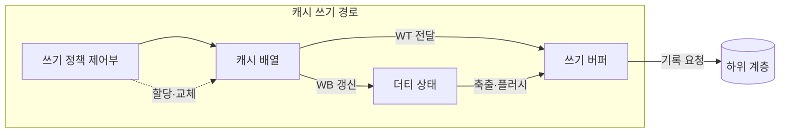
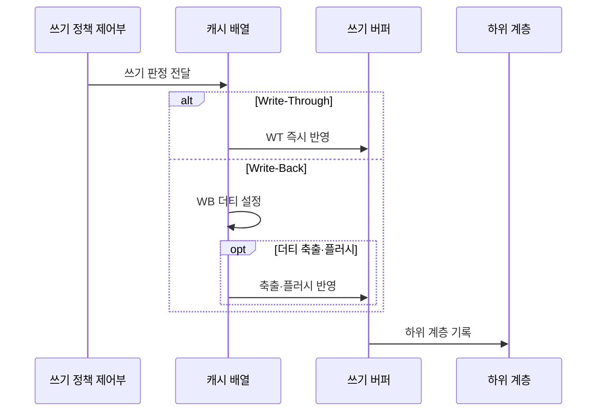

---
sidebar:
  order: 13
  label: "013. 캐시 쓰기 정책 — Write-Through vs Write-Back (Cache Write Policy)"
  badge:
    text: "기출 · 70%"
    variant: note
title: "캐시 쓰기 정책 — Write-Through vs Write-Back (Cache Write Policy)"
date: "2026-07-25T17:45:00+09:00"
tags:
  - "notes-hardware"
weight: 13
extra:
  question_no: "013"
  source_status: "기출"
  source_history: "129회, 135회"
  priority: 70
  priority_note: "반복 기출, 쓰기 일관성·대역폭 절충"
---

## 미리 알고가기

- **캐시 쓰기 정책(Cache Write Policy)**: 메모지에 고친 내용을 그때그때 원장에 옮겨 적을지 메모지를 버릴 때 한꺼번에 옮길지를 정해 두는 규칙이며, 옮기는 시점 하나로 쓰기 지연과 통로 사용량이 함께 달라진다
- **쓰기 통과(Write-Through, WT)**: 캐시에 쓰는 동시에 하위 계층에도 같은 값을 즉시 써서 아래쪽이 늘 최신이 되게 하는 정책
- **쓰기 복귀(Write-Back, WB)**: 캐시에만 쓰고 표시만 해 두었다가 그 라인이 밀려나거나 강제 반영될 때 한 번에 하위 계층으로 내려 쓰는 정책
- **쓰기 지역성(Write Locality)**: 같은 캐시 라인을 짧은 시간 안에 여러 번 고쳐 쓰는 성향이며, 이것이 강할수록 WB가 묶어서 줄여 주는 양도 커진다
- **더티 비트(Dirty Bit)**: 그 캐시 라인이 하위 계층보다 최신이라 아직 내려 쓰지 않았음을 표시하는 한 비트
- **유효 상태(Valid State)**: 그 라인의 태그와 데이터를 지금 써도 되는지를 나타내는 상태이며 더티 표시와 함께 라인 관리를 이룬다
- **캐시 배열(Cache Array)**: 라인의 태그·데이터·유효 상태를 담아 두는 회로 배열
- **쓰기 버퍼(Write Buffer)**: 하위 계층으로 보낼 쓰기 요청을 잠시 담아 두어 프로세서가 기다리지 않게 하는 대기열
- **버퍼 포화(Buffer Saturation)**: 쓰기가 빠져나가는 속도보다 들어오는 속도가 빨라 이 대기열이 꽉 찬 상태이며, 그 뒤의 쓰기는 그대로 멈춰 선다
- **더티 축출(Dirty Eviction)**: 아직 안 내려 쓴 라인을 교체해야 할 때 먼저 그 값을 하위 계층에 기록하는 동작이며, WB에서 가장 늦어지는 순간이다
- **쓰기 할당(Write Allocate, WA)**: 쓰기가 미스 났을 때 그 블록을 일단 캐시로 끌어와 놓는 방식
- **쓰기 비할당(No-Write-Allocate, NWA)**: 쓰기가 미스 나면 캐시에 올리지 않고 하위 계층에 바로 써 버리는 방식
- **하위 계층(Lower Level)**: 이 캐시보다 프로세서에서 멀고 더 크지만 느린 다음 캐시나 주기억장치이며 변경분이 최종적으로 도착할 곳이다
- **쓰기 트래픽(Write Traffic)**: 캐시에서 하위 계층으로 실제로 나가는 쓰기 요청과 데이터의 양
- **쓰기 순서(Write Ordering)**: 여러 쓰기가 하위 계층에서 보이는 순서이며, 버퍼가 이 순서를 바꾸면 장치나 다른 프로세서가 있을 수 없는 중간 상태를 보게 된다
- **캐시 플러시(Cache Flush)**: 아직 안 내려 쓴 더티 라인을 강제로 하위 계층에 반영하는 동작
- **직접 메모리 접근(Direct Memory Access, DMA)**: 장치가 프로세서를 거치지 않고 스스로 메모리를 읽고 쓰는 방식
- **비일관성 DMA(Non-coherent DMA)**: 프로세서 캐시와 장치의 메모리 접근을 하드웨어가 자동으로 맞춰 주지 않는 DMA이며, 보내기 전에 더티 라인을 플러시하지 않으면 장치가 옛 값을 읽어 간다

## Ⅰ. 개요

- **정의/개념**: 하위 계층 반영 시점으로 쓰기 지연·트래픽을 조절하는 **캐시 정책**
- **기존 한계**: 반영 시점을 정하지 않으면 **쓰기 트래픽·불일치** 통제 불가

### 쉽게 이해하기 (학습용)

- 메모지에 고친 값을 원장에 언제 옮길지 정해 두지 않으면 매번 옮기다 통로가 막히거나 영영 안 옮겨 원장이 옛 값으로 남는 두 사고 중 하나가 반드시 나는데, 답안이 배경 자리에 이 통제 불가를 적은 이유는 이 정책이 성능 기법이 아니라 지연과 정합 중 어느 쪽을 내줄지 고르는 계약이기 때문이다

## Ⅱ. 특징

- 반영 시점과 **미스 할당**의 독립 조합 가능
- **쓰기 지역성**이 높을수록 커지는 WB 병합 효과
- **더티 비트** 유무가 하위 계층 최신성 보장 여부 결정

### 쉽게 이해하기 (학습용)

- 언제 옮길지와 없는 값을 고칠 때 메모지를 새로 뜰지는 서로 다른 손잡이라 네 가지 조합이 다 가능하고, 같은 줄을 열 번 고치는 코드라면 아홉 번의 옮겨 적기가 통째로 사라지며, 표시를 남기지 않는 쪽은 원장이 늘 최신이라 남이 읽어도 안전한 대신 그 안전값을 매번 통로로 지불한다

## Ⅲ. 아키텍처 및 구성요소

| 설계 요소 | 설명 |
|:---|:---|
| 쓰기 정책 제어부 | **WT·WB**와 쓰기 할당 방식의 동시 결정 |
| 캐시 배열 | 라인의 태그·데이터와 **유효 상태** 보관 |
| 더티 상태 | 하위 계층보다 최신인 라인의 **미반영 표시** |
| 쓰기 버퍼 | 반영 요청을 모아 **하위 계층** 전달 |

> 요약: **더티 상태**를 두는 순간 반영 시점이 축출까지 지연 가능

### 쉽게 이해하기 (학습용)

- 더티 상태 칸이 있느냐 없느냐가 그림의 갈림길인데, 이 칸이 없으면 고친 값이 곧장 버퍼로 흘러 원장까지 가고 이 칸이 있으면 값이 여기 머물러 있다가 자리를 비켜 줘야 할 때에야 버퍼로 내려가므로 같은 배선에서 두 정책이 갈린다

## Ⅳ. 원리 및 절차 흐름도

| 절차 | 설명 |
|:---|:---|
| 쓰기 판정 전달 | 적중 여부와 **쓰기 할당** 방식 확정 |
| WT 즉시 반영 | 캐시 갱신과 동시에 **하위 쓰기** 발행 |
| WB 더티 설정 | 캐시만 갱신하고 **더티 비트** 표시 |
| 축출·플러시 반영 | 교체·강제 시점의 **더티 라인** 기록 |
| 하위 계층 기록 | 버퍼 순서대로 **쓰기 순서** 보장 반영 |

> 요약: 반영 경로는 같고 **버퍼 진입 시점**만 정책에 따라 분기

### 쉽게 이해하기 (학습용)

- 두 갈래가 갈라졌다가 맨 아래에서 다시 한 줄로 합쳐지는 것이 요점인데, 원장에 적는 마지막 동작 자체는 어느 쪽이든 똑같고 다만 그 동작이 고칠 때마다 일어나느냐 자리를 비켜 줄 때 몰아서 일어나느냐만 다르므로, 총 쓰기 양이 아니라 언제 몰리느냐가 성능을 가른다

## Ⅴ. 종류 및 비교

| 캐시 쓰기 정책 | Write-Through | Write-Back |
|:---|:---|:---|
| 적용 기준 | 장치·타 코어가 메모리를 직접 읽을 때 | 같은 라인 **반복 갱신**이 잦을 때 |
| 핵심 특징 | 매 쓰기의 **하위 계층 즉시 반영** | 축출 시점까지 **쓰기 병합** 후 반영 |
| 한계 | **쓰기 버퍼 포화**와 순서 역전 위험 | 전원 차단 시 **더티 데이터** 유실 |

> 요약: WT의 **트래픽 부담**을 WB가 병합으로 덜되 정합 책임을 인수

### 쉽게 이해하기 (학습용)

- 두 한계 칸이 정반대라는 점이 선택을 가르는데, 매번 옮기는 쪽은 통로가 막혀 손이 멈추는 것이 위험이고 모아 옮기는 쪽은 통로는 한가하지만 아직 안 옮긴 값이 메모지에만 있어 정전이나 남의 조회 앞에서 사라지거나 옛 값으로 읽히는 것이 위험이다

## Ⅵ. 실무 사례

1. 반복 갱신 영역은 **WB**로 하위 계층 쓰기 병합
2. 비일관성 DMA 송신 전 **더티 라인 플러시** 선행

### 쉽게 이해하기 (학습용)

- 누적 카운터나 임시 버퍼처럼 같은 자리를 계속 고쳐 쓰는 영역은 매번 원장에 옮기면 같은 줄을 수천 번 적는 셈이므로, 표시만 해 두었다가 마지막 값 하나만 내려 쓴다
- 네트워크 카드가 스스로 메모리를 읽어 가는 구조에서는 프로세서가 캐시에만 써 둔 최신 값을 장치가 못 보므로, 보내기 직전에 그 영역의 더티 라인을 강제로 내려 써 놓고 넘긴다

## Ⅶ. 결론

- **쓰기 재사용**과 장치 공유 여부로 WT·WB·플러시 시점 선택

### 쉽게 이해하기 (학습용)

- 같은 자리를 다시 고칠 일이 많은지와 그 메모리를 남이 직접 읽어 가는지 두 가지만 보면 되는데, 앞이 참이면 모아서 내려 쓰고 뒤가 참이면 넘기기 전에 반드시 먼저 내려 써 둔다
