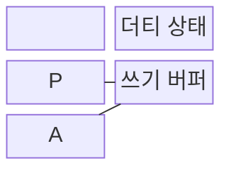
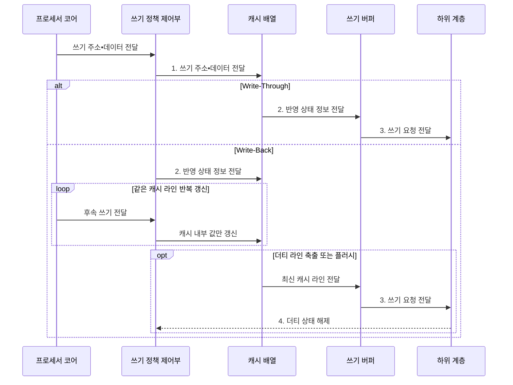

---
sidebar:
  order: 13
  label: "013. 캐시 쓰기 정책: Write-Through vs Write-Back (Cache Write Policy)"
  badge:
    text: "기출 • 70%"
    variant: note
title: "캐시 쓰기 정책: Write-Through vs Write-Back (Cache Write Policy)"
date: "2026-08-03T09:07:03+09:00"
tags:
  - "notes-hardware"
weight: 13
extra:
  question_no: "013"
  source_status: "기출"
  source_history: "129회, 135회"
  priority: 70
  priority_note: "반복 기출, 쓰기 일관성•대역폭 절충"
---

## Ⅰ. 개요

핵심 용어

- **캐시 쓰기 정책**: 캐시의 변경 데이터를 하위 메모리에 언제 반영할지 정하는 규칙
- **쓰기 트래픽**: 캐시에서 하위 계층으로 실제 전송되는 쓰기 요청과 데이터의 양
- **미반영 위험**: 캐시에만 남은 최신값이 전원 장애나 장치 접근 전에 하위 메모리에 기록되지 않을 위험

- 정의/개념: 캐시 쓰기를 **하위 메모리에 반영하는 시점** 의 정책
- 배경/필요성: 즉시 반영은 **쓰기 트래픽**, 지연 반영은 **미반영 위험** 증가

#### 한줄 요약

- 캐시 쓰기 정책은 하위 계층 반영 시점을 정해 쓰기 지연•대역폭•정합성을 조절한다.

## Ⅱ. 특징

핵심 용어

- **쓰기 할당•비할당**: 쓰기 미스 블록을 캐시에 적재한 뒤 갱신하거나 하위 계층에 직접 기록하는 방식
- **쓰기 지역성**: 같은 캐시 라인을 짧은 시간 안에 반복해서 갱신하는 성향
- **더티 비트**: 캐시 라인이 하위 계층보다 최신이며 아직 반영되지 않았음을 표시하는 상태 비트
- **WB 병합**: Write-Back 캐시에서 같은 라인의 여러 갱신을 합쳐 축출 때 최종값만 기록하는 효과

- 반영 시점과 **쓰기 할당•비할당** 의 독립 조합
- **쓰기 지역성** 이 높을수록 커지는 WB 병합 효과
- **더티 비트** 로 미반영 라인을 식별해 축출 쓰기 결정

#### 한줄 요약

- 반영 시점과 미스 할당은 독립 정책이며 WB는 반복 갱신의 하위 계층 트래픽을 줄인다.

## Ⅲ. 구조 및 구성요소

핵심 용어

- **캐시 배열**: 라인의 태그•데이터•유효 상태를 보관하는 회로 배열
- **쓰기 버퍼**: 하위 계층으로 보낼 쓰기 요청을 잠시 저장해 프로세서 대기를 줄이는 대기열
- **버퍼 포화**: 쓰기 유입이 배출보다 빨라 쓰기 버퍼가 가득 찬 상태
- **쓰기 정책 제어부**: 적중•미스와 설정된 WT•WB 및 할당 방식에 따라 캐시와 하위 계층의 갱신 경로를 결정하는 회로
- **더티 상태**: 캐시 라인이 하위 계층보다 최신이어서 축출 전에 기록해야 함을 나타내는 상태

| 구성요소 | 책임 |
|:---|:---|
| 쓰기 정책 제어부 | WT•WB•**할당 방식** 결정 |
| 캐시 배열 | 캐시 라인 **저장•갱신** |
| 더티 상태 | 최신 미반영 **라인 식별** |
| 쓰기 버퍼 | 하위 계층 **반영 지연 은폐** |

#### 한줄 요약
- 정책 제어부가 반영 시점을 정하고 캐시•더티 상태•쓰기 버퍼가 최신값과 대기 요청을 관리한다.

## Ⅳ. 흐름도

핵심 용어

- **Write-Through**: 캐시를 갱신할 때마다 하위 메모리에도 즉시 값을 반영하는 정책
- **Write-Back**: 캐시에 먼저 기록하고 축출이나 플러시 때 하위 계층에 반영하는 정책
- **더티 축출**: 미반영 라인을 교체하기 전에 최신값을 하위 계층에 기록하는 동작
- **캐시 플러시**: 더티 라인의 최신값을 교체 여부와 관계없이 하위 계층에 강제로 기록하는 동작
- **하위 계층**: 현재 캐시 다음에 위치하여 쓰기 요청을 받는 다음 단계 캐시나 주기억장치

**동작 원리**

- **1. 쓰기 주소•데이터 전달**: 캐시 내부값 변경
- **2. 반영 상태 정보 전달**: 버퍼 요청 또는 더티 상태 기록
- **3. 쓰기 요청 전달**: 즉시 또는 축출 시 하위 계층 기록
- **4. 더티 상태 해제**: 하위 기록 확인 후 더티 표시 제거

#### 한줄 요약

- WT는 갱신마다 쓰기 버퍼로 보내고, WB는 더티 상태를 남겨 축출•플러시 시점까지 하위 계층 반영을 미룬다.

## Ⅴ. 종류 및 비교

핵심 용어

- **즉시 가시성**: 캐시 쓰기 직후 하위 계층에서도 최신값을 볼 수 있는 성질
- **쓰기 병합**: 같은 라인의 여러 갱신을 캐시에서 합쳐 최종값만 하위 계층에 기록하는 효과
- **캐시 플러시**: 더티 라인을 강제로 하위 메모리에 반영하는 동작
- **더티 데이터**: 캐시에서 수정됐지만 아직 하위 메모리에 반영되지 않은 최신 데이터
- **반영•복구 절차**: 캐시의 최신값을 하위 계층에 기록하고 장애 뒤 일관된 상태를 회복하는 처리 순서

| 캐시 쓰기 정책 | Write-Through | Write-Back |
|:---|:---|:---|
| 적용 기준 | 단순한 **반영•복구 절차** 우선 | 같은 라인 **반복 갱신** 빈발 |
| 핵심 특징 | 매 쓰기의 **하위 계층 즉시 반영** | 축출 시점까지 **쓰기 병합** 후 반영 |
| 한계 | **쓰기 트래픽 증가•버퍼 포화** | 전원 차단 시 **더티 데이터** 유실 |

> 요약: WT는 즉시 반영, WB는 **쓰기 병합**

#### 한줄 요약

- WT는 반영 절차가 단순하고 WB는 트래픽을 줄이지만 더티 데이터 관리가 필요하다.

## Ⅵ. 실무 고려사항 및 대책

핵심 용어

- **비일관성 DMA**: CPU 캐시와 장치 메모리 접근을 하드웨어가 자동으로 맞추지 않는 DMA
- **메모리 장벽**: 앞선 메모리 접근이 정해진 순서로 관측되도록 완료를 강제하는 동기화 명령
- **비휘발성 보호**: 전원 장애에도 미반영 데이터를 보존하거나 복구할 수 있게 하는 장치와 절차
- **DMA**: 장치가 CPU의 개입 없이 주기억장치와 직접 데이터를 전송하는 방식
- **캐시 정리•무효화**: 송신 전 더티 데이터를 메모리에 쓰고 수신 후 오래된 캐시 사본을 폐기하는 유지 동작
- **버퍼 배출**: 쓰기 버퍼에 대기 중인 요청이 장치나 하위 메모리에 도달할 때까지 완료시키는 동작

| 문제 | 대책 | 효과 |
|:---|:---|:---|
| WT **쓰기 버퍼 포화** | 버퍼 확장•쓰기 병합•**WB 전환** 검토 | **하위 계층 트래픽** 완화 |
| 전원 장애의 **WB 데이터 유실** | **플러시•비휘발성 보호** 절차 | **미반영 데이터** 보존 |
| **비일관성 DMA** 의 오래된 값 | 송신 전 정리•**수신 후 무효화** | **CPU•장치 정합성** 확보 |
| 장치의 **쓰기 순서 오관측** | **메모리 장벽•버퍼 배출** | **장치 제어 정확성** 유지 |
| 반복 갱신 영역의 **쓰기 급증** | **WB 쓰기 병합** 후 최종값 반영 | **쓰기 대역폭** 절감 |

#### 한줄 요약

- 쓰기 지연뿐 아니라 장애 지속성, DMA 정합성, 쓰기 순서를 함께 검토해야 한다.

## Ⅶ. 결론

핵심 용어

- **반영 지연**: 캐시에서 갱신한 값이 하위 계층에 기록되기까지 걸리는 시간
- **정합성 요구**: CPU•장치•하위 메모리가 같은 최신값을 관측해야 하는 조건
- **WT•WB**: 각각 매 쓰기를 즉시 하위 계층에 반영하는 Write-Through와 축출 때 반영하는 Write-Back 정책

- 즉시 가시성은 **WT**, 반복 갱신은 **WB** 선택

#### 한줄 요약

- 반복 갱신과 하위 계층 가시성 요구를 기준으로 WT•WB와 캐시 유지 절차를 선택한다.
