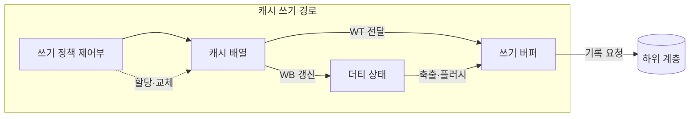

---
sidebar:
  order: 13
  label: "013. 캐시 쓰기 정책 — Write-Through vs Write-Back (Cache Write Policy)"
  badge:
    text: "기출 · 70%"
    variant: note
title: "캐시 쓰기 정책 — Write-Through vs Write-Back (Cache Write Policy)"
date: "2026-07-28T12:40:26+09:00"
tags:
  - "notes-hardware"
weight: 13
extra:
  question_no: "013"
  source_status: "기출"
  source_history: "129회, 135회"
  priority: 70
  priority_note: "반복 기출, 쓰기 일관성·대역폭 절충"
---

## 미리 알고가기

- **캐시 쓰기 정책(Cache Write Policy)**: 캐시의 변경 데이터를 주기억장치에 즉시 반영할지 교체 시 반영할지 정하여 쓰기 지연과 메모리 대역폭을 조절하는 규칙
- **쓰기 통과(Write-Through, WT)**: 캐시 쓰기와 동시에 하위 메모리 계층에도 값을 반영하는 정책
- **쓰기 복귀(Write-Back, WB)**: 캐시에 먼저 기록하고 해당 라인의 축출 또는 강제 반영 시 하위 계층에 기록하는 정책
- **쓰기 지역성(Write Locality)**: 같은 캐시 라인을 짧은 시간 안에 여러 번 고쳐 쓰는 성향이며, 이것이 강할수록 WB가 묶어서 줄여 주는 양도 커진다
- **더티 비트(Dirty Bit)**: 그 캐시 라인이 하위 계층보다 최신이라 아직 내려 쓰지 않았음을 표시하는 한 비트
- **유효 상태(Valid State)**: 그 라인의 태그와 데이터를 지금 써도 되는지를 나타내는 상태이며 더티 표시와 함께 라인 관리를 이룬다
- **캐시 배열(Cache Array)**: 라인의 태그·데이터·유효 상태를 담아 두는 회로 배열
- **쓰기 버퍼(Write Buffer)**: 하위 계층으로 보낼 쓰기 요청을 잠시 담아 두어 프로세서가 기다리지 않게 하는 대기열
- **버퍼 포화(Buffer Saturation)**: 쓰기가 빠져나가는 속도보다 들어오는 속도가 빨라 이 대기열이 꽉 찬 상태이며, 그 뒤의 쓰기는 그대로 멈춰 선다
- **더티 축출(Dirty Eviction)**: 아직 안 내려 쓴 라인을 교체해야 할 때 먼저 그 값을 하위 계층에 기록하는 동작이며, WB에서 가장 늦어지는 순간이다
- **쓰기 할당(Write Allocate, WA)**: 쓰기 미스가 발생한 블록을 캐시에 적재한 뒤 값을 갱신하는 방식
- **쓰기 비할당(No-Write-Allocate, NWA)**: 쓰기 미스 블록을 캐시에 적재하지 않고 하위 계층에 직접 기록하는 방식
- **하위 계층(Lower Level)**: 이 캐시보다 프로세서에서 멀고 더 크지만 느린 다음 캐시나 주기억장치이며 변경분이 최종적으로 도착할 곳이다
- **쓰기 트래픽(Write Traffic)**: 캐시에서 하위 계층으로 실제로 나가는 쓰기 요청과 데이터의 양
- **쓰기 순서(Write Ordering)**: 여러 쓰기가 하위 계층에서 보이는 순서이며, 버퍼가 이 순서를 바꾸면 장치나 다른 프로세서가 있을 수 없는 중간 상태를 보게 된다
- **캐시 플러시(Cache Flush)**: 아직 안 내려 쓴 더티 라인을 강제로 하위 계층에 반영하는 동작
- **직접 메모리 접근(Direct Memory Access, DMA)**: 전용 제어기가 프로세서의 데이터 복사 없이 장치와 메모리 사이를 직접 전송하는 방식
- **비일관성 DMA(Non-coherent DMA)**: 프로세서 캐시와 장치의 메모리 접근을 하드웨어가 자동으로 맞춰 주지 않는 DMA이며, 보내기 전에 더티 라인을 플러시하지 않으면 장치가 옛 값을 읽어 간다

## Ⅰ. 개요

- 정의/개념: 하위 계층 반영 시점으로 쓰기 지연·트래픽을 조절하는 **캐시 정책**
- 기존 한계: 반영 시점을 정하지 않으면 **쓰기 트래픽·불일치** 통제 불가

### 쉽게 이해하기 (학습용)

- 캐시 쓰기 정책은 변경 데이터를 하위 계층에 반영하는 시점을 정하여 쓰기 지연·대역폭과 메모리 정합성 사이의 상충 관계를 통제한다

## Ⅱ. 특징

- 반영 시점과 **미스 할당**의 독립 조합 가능
- **쓰기 지역성**이 높을수록 커지는 WB 병합 효과
- **더티 비트**로 미반영 라인을 식별해 축출 쓰기 결정

### 쉽게 이해하기 (학습용)

- 하위 계층 반영 시점과 쓰기 미스 시 캐시 적재 여부는 독립적으로 선택하며, 쓰기 복귀는 반복 갱신의 전송량을 줄이고 쓰기 통과는 하위 계층의 최신값을 유지한다

## Ⅲ. 아키텍처 및 구성요소

| 설계 요소 | 입력·상태 | 역할 |
|:---|:---|:---|
| 쓰기 정책 제어부 | 적중·미스·정책 설정 | WT·WB와 쓰기 할당 방식 결정 |
| 캐시 배열 | 태그·데이터·유효 상태 | 캐시 라인 저장과 갱신 |
| 더티 상태 | 라인별 미반영 여부 | 하위 계층보다 최신인 라인 식별 |
| 쓰기 버퍼 | 반영 대기 요청 | 하위 계층 쓰기 지연 숨김 |

> 요약: **더티 상태**를 두는 순간 반영 시점이 축출까지 지연 가능

### 쉽게 이해하기 (학습용)

- WT는 갱신마다 쓰기 버퍼로 보내고, WB는 더티 상태를 남겨 축출·플러시 시점까지 하위 계층 반영을 미룬다.

## Ⅳ. 운영 고려사항

| 실패 징후 | 완화 방안 | 기대 효과 |
|:---|:---|:---|
| WT 쓰기 버퍼 포화로 프로세서 정체 | 버퍼 확장·쓰기 병합·WB 적용 구간 검토 | 하위 계층 트래픽 완화 |
| 전원 장애로 WB 더티 데이터 유실 | 플러시·비휘발성 보호·전원 실패 절차 적용 | 미반영 데이터 보존 |
| 비일관성 DMA가 오래된 메모리 값 사용 | 송신 전 캐시 정리·수신 후 무효화 | CPU·장치 데이터 정합성 확보 |
| 장치가 쓰기 순서가 바뀐 중간 상태 관측 | 메모리 장벽·버퍼 배출·순서 규칙 준수 | 장치 제어 정확성 유지 |

### 쉽게 이해하기 (학습용)

- 쓰기 지연과 트래픽뿐 아니라 장애 시 지속성, DMA 정합성과 쓰기 순서를 함께 검토해 정책을 선택해야 한다.

## Ⅴ. 종류 및 비교

| 캐시 쓰기 정책 | Write-Through | Write-Back |
|:---|:---|:---|
| 적용 기준 | 장치·타 코어가 메모리를 직접 읽을 때 | 같은 라인 **반복 갱신**이 잦을 때 |
| 핵심 특징 | 매 쓰기의 **하위 계층 즉시 반영** | 축출 시점까지 **쓰기 병합** 후 반영 |
| 한계 | **쓰기 트래픽 증가·버퍼 포화** | 전원 차단 시 **더티 데이터** 유실 |

> 요약: WT의 **트래픽 부담**을 WB가 병합으로 덜되 정합 책임을 인수

### 쉽게 이해하기 (학습용)

- 쓰기 통과는 메모리 대역폭과 쓰기 지연이 증가하고, 쓰기 복귀는 변경 라인이 캐시에만 존재하므로 전원 장애와 외부 장치 접근 시 정합성 관리가 필요하다

## Ⅵ. 실무 사례

1. 반복 갱신 영역은 **WB**로 하위 계층 쓰기 병합

### 쉽게 이해하기 (학습용)

- 누적 카운터나 임시 버퍼처럼 같은 자리를 계속 고쳐 쓰는 영역은 매번 원장에 옮기면 같은 줄을 수천 번 적는 셈이므로, 표시만 해 두었다가 마지막 값 하나만 내려 쓴다

## Ⅶ. 결론

- 쓰기 효율을 위해 재사용·장치 공유를 검토하여 **쓰기 정책** 활용

### 쉽게 이해하기 (학습용)

- 같은 자리를 다시 고칠 일이 많은지와 그 메모리를 남이 직접 읽어 가는지 두 가지만 보면 되는데, 앞이 참이면 모아서 내려 쓰고 뒤가 참이면 넘기기 전에 반드시 먼저 내려 써 둔다
