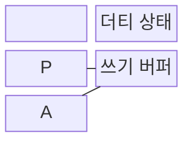
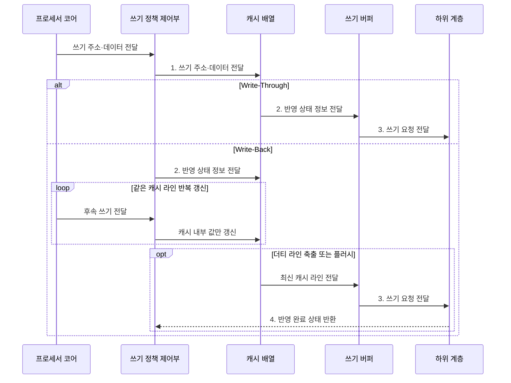

---
sidebar:
  order: 13
  label: "013. 캐시 쓰기 정책: Write-Through vs Write-Back (Cache Write Policy)"
  badge:
    text: "기출 · 70%"
    variant: note
title: "캐시 쓰기 정책: Write-Through vs Write-Back (Cache Write Policy)"
date: "2026-07-30T21:27:28+09:00"
tags:
  - "notes-hardware"
weight: 13
extra:
  question_no: "013"
  source_status: "기출"
  source_history: "129회, 135회"
  priority: 70
  priority_note: "반복 기출, 쓰기 일관성·대역폭 절충"
---

## 미리 알고가기

- **캐시 쓰기 정책(Cache Write Policy)**: 캐시의 변경 데이터를 주기억장치에 즉시 반영할지 교체 시 반영할지 정하여 쓰기 지연과 메모리 대역폭을 조절하는 규칙
- **쓰기 통과(Write-Through, WT)**: 캐시 쓰기와 동시에 하위 메모리 계층에도 값을 반영하는 정책
- **쓰기 복귀(Write-Back, WB)**: 캐시에 먼저 기록하고 해당 라인의 축출 또는 강제 반영 시 하위 계층에 기록하는 정책
- **쓰기 지역성(Write Locality)**: 같은 캐시 라인을 짧은 시간 안에 여러 번 고쳐 쓰는 성향이며, 이것이 강할수록 WB가 묶어서 줄여 주는 양도 커진다
- **더티 비트(Dirty Bit)**: 그 캐시 라인이 하위 계층보다 최신이라 아직 내려 쓰지 않았음을 표시하는 한 비트
- **유효 상태(Valid State)**: 그 라인의 태그와 데이터를 지금 써도 되는지를 나타내는 상태이며 더티 표시와 함께 라인 관리를 이룬다
- **캐시 배열(Cache Array)**: 라인의 태그·데이터·유효 상태를 담아 두는 회로 배열
- **쓰기 버퍼(Write Buffer)**: 하위 계층으로 보낼 쓰기 요청을 잠시 담아 두어 프로세서가 기다리지 않게 하는 대기열
- **버퍼 포화(Buffer Saturation)**: 쓰기가 빠져나가는 속도보다 들어오는 속도가 빨라 이 대기열이 꽉 찬 상태이며, 그 뒤의 쓰기는 그대로 멈춰 선다
- **더티 축출(Dirty Eviction)**: 아직 안 내려 쓴 라인을 교체해야 할 때 먼저 그 값을 하위 계층에 기록하는 동작이며, WB에서 가장 늦어지는 순간이다
- **쓰기 할당(Write Allocate, WA)**: 쓰기 미스가 발생한 블록을 캐시에 적재한 뒤 값을 갱신하는 방식
- **쓰기 비할당(No-Write-Allocate, NWA)**: 쓰기 미스 블록을 캐시에 적재하지 않고 하위 계층에 직접 기록하는 방식
- **하위 계층(Lower Level)**: 이 캐시보다 프로세서에서 멀고 더 크지만 느린 다음 캐시나 주기억장치이며 변경분이 최종적으로 도착할 곳이다
- **쓰기 트래픽(Write Traffic)**: 캐시에서 하위 계층으로 실제로 나가는 쓰기 요청과 데이터의 양
- **쓰기 순서(Write Ordering)**: 여러 쓰기가 하위 계층에서 보이는 순서이며, 버퍼가 이 순서를 바꾸면 장치나 다른 프로세서가 있을 수 없는 중간 상태를 보게 된다
- **캐시 플러시(Cache Flush)**: 아직 안 내려 쓴 더티 라인을 강제로 하위 계층에 반영하는 동작
- **직접 메모리 접근(Direct Memory Access, DMA)**: 전용 제어기가 프로세서의 데이터 복사 없이 장치와 메모리 사이를 직접 전송하는 방식
- **비일관성 DMA(Non-coherent DMA)**: 프로세서 캐시와 장치의 메모리 접근을 하드웨어가 자동으로 맞춰 주지 않는 DMA이며, 보내기 전에 더티 라인을 플러시하지 않으면 장치가 옛 값을 읽어 간다

## Ⅰ. 개요

- 정의/개념: 캐시 쓰기를 **하위 메모리에 반영하는 시점**의 정책
- 배경/필요성: 고정 반영 시점은 **쓰기 트래픽•미반영 위험** 절충 불가

### 쉽게 이해하기 (학습용)

- 캐시 쓰기 정책은 하위 계층 반영 시점을 정해 쓰기 지연·대역폭·정합성을 조절한다.

## Ⅱ. 특징

- 반영 시점과 **쓰기 할당•비할당**의 독립 조합
- **쓰기 지역성**이 높을수록 커지는 WB 병합 효과
- **더티 비트**로 미반영 라인을 식별해 축출 쓰기 결정

### 쉽게 이해하기 (학습용)

- 반영 시점과 미스 할당은 독립 정책이며 WB는 반복 갱신의 하위 계층 트래픽을 줄인다.

## Ⅲ. 구조 및 구성요소

| 구성요소 | 책임 |
|:---|:---|
| 쓰기 정책 제어부 | WT·WB·**할당 방식** 결정 |
| 캐시 배열 | 캐시 라인 **저장·갱신** |
| 더티 상태 | 최신 미반영 **라인 식별** |
| 쓰기 버퍼 | 하위 계층 **반영 지연 은폐** |

### 쉽게 이해하기 (학습용)
- 정책 제어부가 반영 시점을 정하고 캐시·더티 상태·쓰기 버퍼가 최신값과 대기 요청을 관리한다.

## Ⅳ. 흐름도

**동작 원리**

- **1. 쓰기 주소·데이터 전달**: 캐시 내부값 변경
- **2. 반영 상태 정보 전달**: 버퍼 요청 또는 더티 상태 기록
- **3. 쓰기 요청 전달**: 즉시 또는 축출 시 하위 계층 기록
- **4. 반영 완료 상태 반환**: 하위 기록 확인 후 더티 표시 제거

### 쉽게 이해하기 (학습용)

- WT는 갱신마다 쓰기 버퍼로 보내고, WB는 더티 상태를 남겨 축출·플러시 시점까지 하위 계층 반영을 미룬다.

## Ⅴ. 종류 및 비교

| 캐시 쓰기 정책 | Write-Through | Write-Back |
|:---|:---|:---|
| 적용 기준 | 단순한 **반영·복구 절차** 우선 | 같은 라인 **반복 갱신** 빈발 |
| 핵심 특징 | 매 쓰기의 **하위 계층 즉시 반영** | 축출 시점까지 **쓰기 병합** 후 반영 |
| 한계 | **쓰기 트래픽 증가·버퍼 포화** | 전원 차단 시 **더티 데이터** 유실 |

> 요약: WT는 즉시 반영, WB는 **쓰기 병합**

### 쉽게 이해하기 (학습용)

- WT는 반영 절차가 단순하고 WB는 트래픽을 줄이지만 더티 데이터 관리가 필요하다.

## Ⅵ. 실무 고려사항 및 대책

| 고려사항 | 대책 | 효과 |
|:---|:---|:---|
| WT **쓰기 버퍼 포화** | 버퍼 확장·쓰기 병합·**WB 전환** 검토 | **하위 계층 트래픽** 완화 |
| 전원 장애의 **WB 데이터 유실** | **플러시•비휘발성 보호** 절차 | **미반영 데이터** 보존 |
| **비일관성 DMA**의 오래된 값 | 송신 전 정리·**수신 후 무효화** | **CPU•장치 정합성** 확보 |
| 장치의 **쓰기 순서 오관측** | **메모리 장벽•버퍼 배출** | **장치 제어 정확성** 유지 |
| 반복 갱신 영역의 **쓰기 급증** | **WB 쓰기 병합** 후 최종값 반영 | **쓰기 대역폭** 절감 |

### 쉽게 이해하기 (학습용)

- 쓰기 지연뿐 아니라 장애 지속성, DMA 정합성, 쓰기 순서를 함께 검토해야 한다.

## Ⅶ. 결론

- 즉시 가시성은 **WT**, 반복 갱신은 **WB** 선택

### 쉽게 이해하기 (학습용)

- 반복 갱신과 하위 계층 가시성 요구를 기준으로 WT·WB와 캐시 유지 절차를 선택한다.
