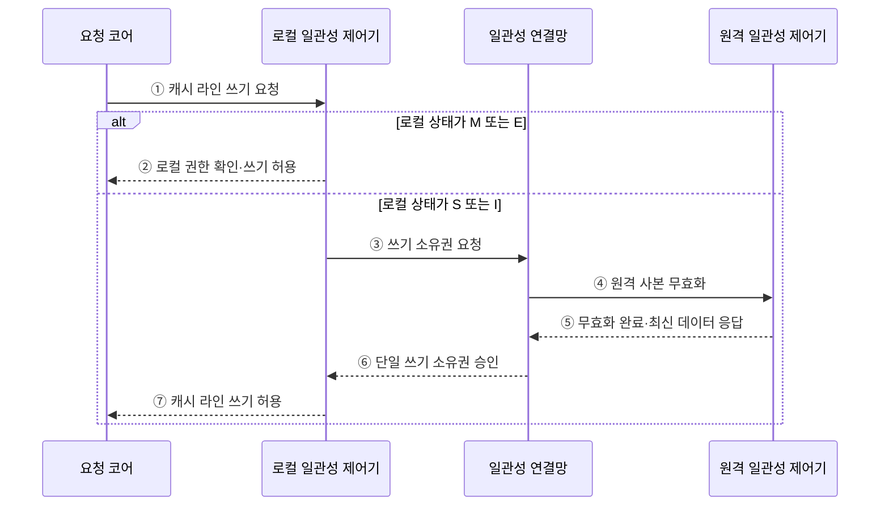

---
sidebar:
  order: 14
  label: "014. 캐시 일관성 프로토콜 — MESI·MOESI (Cache Coherence Protocol)"
  badge:
    text: "기출 · 70%"
    variant: note
title: "캐시 일관성 프로토콜 — MESI·MOESI (Cache Coherence Protocol)"
date: "2026-07-29T00:26:00+09:00"
tags:
  - "notes-hardware"
weight: 14
extra:
  question_no: "014"
  source_status: "기출"
  source_history: "123회, 135회"
  priority: 70
  priority_note: "MESI 상태 전이와 불변식의 반복 기출 주제"
---

## 미리 알고가기

- **캐시 일관성 프로토콜(Cache Coherence Protocol)**: 여러 코어의 캐시 사본 상태를 제어하여 동일 메모리 주소의 최신값과 단일 쓰기 권한을 보장하는 하드웨어 규약
- **캐시 라인(Cache Line)**: 상태와 소유권을 이 단위로 붙여 관리하는 고정 크기 블록이며, 변수 하나가 아니라 이 덩어리째 회수된다
- **MESI 프로토콜**: 캐시 라인의 권한과 변경 여부를 수정·독점·공유·무효의 네 상태로 관리하는 일관성 프로토콜
- **MOESI 프로토콜**: MESI에 소유 상태를 추가하여 변경된 데이터를 메모리에 기록하기 전에 캐시 간 직접 공유할 수 있게 한 프로토콜
- **단일 작성자·다중 독자 불변식(Single-writer, Multiple-reader Invariant)**: 한 라인에 대해 쓸 수 있는 사본은 어느 순간에도 최대 하나이고, 쓰는 사본이 없을 때만 읽는 사본이 여럿일 수 있다는 규칙
- **쓰기 전파(Write Propagation)**: 한 코어가 고친 값이 같은 주소를 읽는 다른 코어에도 반드시 전달되어 옛 값을 읽지 않게 하는 성질
- **쓰기 직렬화(Write Serialization)**: 같은 주소에 대한 여러 쓰기를 모든 코어가 똑같은 순서로 보게 만드는 성질이며, 이것이 깨지면 코어마다 값의 역사가 달라진다
- **소유권(Ownership)**: 라인을 고칠 권한과 최신 값을 남에게 제공할 책임이며, 한 시점에 한 캐시만 가진다
- **무효화(Invalidation)**: 쓰기 전에 다른 캐시가 가진 사본의 사용 권한을 거둬들이는 동작
- **더티 라인(Dirty Line)**: 메모리 원본보다 최신이라 아직 내려 쓰지 않은 캐시 라인
- **로컬 요청·원격 요청(Local·Remote Request)**: 이 캐시의 코어가 낸 접근이 로컬, 다른 코어가 낸 접근이 원격이며 상태 전이의 원인은 이 둘로 나뉜다
- **상태 비트(State Bits)**: 라인마다 위 상태를 부호화해 저장하는 비트이며 지금 읽어도 되는지 고쳐도 되는지를 이 값으로 판정한다
- **일관성 연결망(Coherence Interconnect)**: 코어의 캐시들 사이에 읽기·소유권·무효화 요청과 데이터를 실어 나르는 통신 경로
- **거짓 공유(False Sharing)**: 서로 상관 없는 변수 둘이 같은 라인에 놓여, 각자 자기 변수만 고쳐도 상대 사본이 계속 무효화되는 현상
- **캐시 라인 패딩(Cache-line Padding)**: 독립 변수 사이에 빈 공간을 끼워 서로 다른 라인에 놓이게 만들어 거짓 공유를 없애는 배치 기법
- **더티 공유 워크로드(Dirty-sharing Workload)**: 한 코어가 고친 값을 다른 코어가 곧바로 읽어 가는 일이 잦은 작업 특성이며, MOESI의 직접 전달 이득이 가장 큰 조건이다
- **무통신 전이(Silent Transition)**: 다른 캐시에 사본이 없다는 권한이 이미 확인된 상태에서 연결망 메시지 없이 로컬 상태만 바꾸는 전이

## Ⅰ. 개요

- 정의/개념: 사본별 **소유권 상태**로 쓰기 전파를 강제하는 일관성 규약
- 기존 한계: 사설 캐시 사본끼리 **최신값·쓰기 권한** 조정 불가

### 쉽게 이해하기 (학습용)

- 여러 코어가 동일 메모리 블록을 캐시에 보관하면 서로 다른 값을 읽을 수 있으므로, 일관성 프로토콜은 단일 쓰기 권한과 최신값 전파를 보장한다

## Ⅱ. 특징

- **단일 작성자·다중 독자** 불변식으로 쓰기 사본 단일화
- **쓰기 직렬화**로 모든 코어의 관측 순서 통일
- 무효화 단위가 변수가 아닌 **캐시 라인** 전체

### 쉽게 이해하기 (학습용)

- 하나의 캐시만 쓰기 권한을 갖고 상태 전이가 모든 코어에 같은 순서로 관측되면 일관성이 유지되지만, 라인 단위 무효화로 서로 다른 변수가 함께 제거되는 거짓 공유가 발생할 수 있다

## Ⅲ. 아키텍처

**도표안 A — 구조도**

**도표안 B — 쓰기 권한 획득 시퀀스**

| 구성요소 | 책임 |
|:---|:---|
| 캐시 라인·상태비트 | **읽기·쓰기 권한** 보관 |
| 일관성 제어기 | 상태 전이와 **소유권** 판정 |
| 일관성 연결망 | 요청·무효화·**데이터 전달** |
| 공유 메모리 계층 | 원본 보관과 **더티 축출** 수용 |

### 동작 원리

1. **① 캐시 라인 쓰기 요청**: 요청 코어는 수정할 주소를 로컬 일관성 제어기에 전달한다.
2. **② 로컬 권한 확인·쓰기 허용**: 라인이 M이면 이미 단일 쓰기 권한이 있고 E이면 다른 사본이 없으므로 연결망 통신 없이 M으로 전이해 쓸 수 있다.
3. **③ 쓰기 소유권 요청**: 라인이 S이거나 I이면 로컬 제어기는 다른 사본의 권한을 회수하거나 데이터를 받아오기 위해 연결망에 소유권을 요청한다.
4. **④ 원격 사본 무효화**: 일관성 연결망은 동일 라인을 보유한 원격 캐시에 무효화 요청을 전달한다.
5. **⑤ 무효화 완료·최신 데이터 응답**: 원격 제어기는 사본을 I 상태로 바꾸고, 자신이 최신 더티 데이터를 보유했다면 데이터와 함께 완료를 응답한다.
6. **⑥ 단일 쓰기 소유권 승인**: 모든 원격 응답이 모이면 연결망은 로컬 제어기에 단일 쓰기 권한을 부여한다.
7. **⑦ 캐시 라인 쓰기 허용**: 로컬 제어기는 라인을 M 상태로 확정하고 요청 코어가 값을 갱신하도록 허용한다.

> 요약: **상태비트**가 각 사본의 읽기·쓰기 권한을 국소적으로 증명

### 쉽게 이해하기 (학습용)

- 각 캐시 라인은 현재 읽기·쓰기 권한과 변경 여부를 상태 비트로 보관하고, 현재 상태로 요청을 처리할 수 없을 때만 일관성 트랜잭션으로 권한을 전환한다

## Ⅳ. 종류 및 비교

| 일관성 프로토콜 | MESI | MOESI |
|:---|:---|:---|
| 적용 기준 | **더티 공유**가 드문 경우 | 수정값의 즉시 공유가 잦은 경우 |
| 핵심 특징 | 공유 전 **메모리 반영** | **소유 상태**의 직접 전달 |
| 한계 | 공유 시 **메모리 트래픽** | 소유 사본의 **반영 책임** |

> 요약: MOESI는 소유 상태로 메모리 왕복 절감

### 쉽게 이해하기 (학습용)

- 두 규약이 갈리는 지점은 고친 종이를 남에게 보여 줄 때 반드시 중앙 원장에 먼저 옮겨 적어야 하느냐인데, MESI는 그 절차를 강제해 규칙이 단순한 대신 보여 줄 때마다 중앙까지 다녀오고, MOESI는 가진 사람이 그대로 건네되 대신 그 사람이 나중에 원장에 옮길 책임을 계속 지고 다닌다

## Ⅴ. 실무 고려사항 및 대책

| 고려사항 | 대책 | 효과 |
|:---|:---|:---|
| 공유 라인의 **무효화 왕복** | 소유권 지역화·데이터 분할 | **일관성 트래픽** 감소 |
| 독립 변수의 **거짓 공유** | 라인 패딩·코어별 배치 | 불필요한 **사본 회수** 방지 |
| 더티 공유의 **메모리 왕복** | MOESI·캐시 간 전달 | **최신값 지연** 감소 |
| 드문 전이의 **데이터 불일치** | 불변식·전이 스트레스 검증 | **프로토콜 정확성** 확보 |

### 쉽게 이해하기 (학습용)

- 생산자 코어가 고친 데이터를 소비자 코어가 곧바로 읽어 가는 구조에서는 중앙 메모리를 거치면 왕복이 두 번이므로, 가진 캐시가 옆 캐시에 바로 넘기고 원장 반영은 나중으로 미룬다

## Ⅵ. 결론

- 캐시 일관성을 위해 더티 공유·전송을 검토하여 **MESI·MOESI** 활용

### 쉽게 이해하기 (학습용)

- 고친 값을 옆 코어가 얼마나 자주 읽어 가는지 하나만 재면 규약 선택이 갈리고, 그 값이 남의 변수와 같은 라인에 있는지까지 보면 배치를 어떻게 떼어 놓을지도 함께 정해진다
