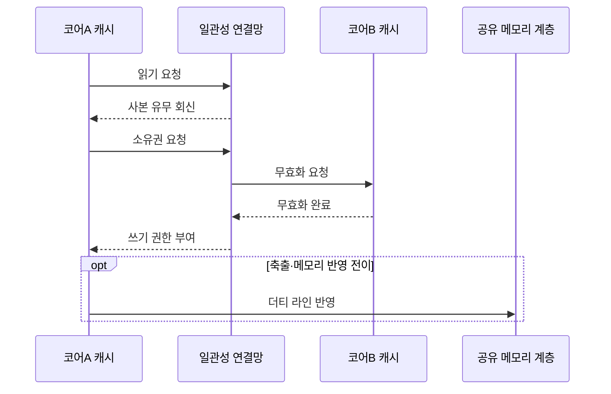

---
sidebar:
  order: 14
  label: "014. 캐시 일관성 프로토콜 — MESI·MOESI (Cache Coherence Protocol)"
  badge:
    text: "기출 · 70%"
    variant: note
title: "캐시 일관성 프로토콜 — MESI·MOESI (Cache Coherence Protocol)"
date: "2026-07-27T23:59:59+09:00"
tags:
  - "notes-hardware"
weight: 14
extra:
  question_no: "014"
  source_status: "기출"
  source_history: "123회, 135회"
  priority: 70
  priority_note: "MESI 상태 전이와 불변식의 반복 기출 주제"
---

## 미리 알고가기

- **캐시 일관성 프로토콜(Cache Coherence Protocol)**: 같은 장부를 여러 사람이 사본으로 나눠 가졌을 때 고칠 사람은 반드시 한 명이고 나머지 사본은 그 순간 회수된다는 규칙을 하드웨어가 상태 표시로 강제하는 규약이며, 그래야 어느 코어에서 읽어도 같은 최신값이 나온다
- **캐시 라인(Cache Line)**: 상태와 소유권을 이 단위로 붙여 관리하는 고정 크기 블록이며, 변수 하나가 아니라 이 덩어리째 회수된다
- **MESI 프로토콜**: ‘메시’로 읽으며 수정(Modified)·독점(Exclusive)·공유(Shared)·무효(Invalid) 네 상태로 라인 권한을 표시하고, M은 나만 가진 고친 사본, E는 나만 가진 안 고친 사본, S는 여럿이 가진 안 고친 사본, I는 쓸 수 없는 사본을 뜻한다
- **MOESI 프로토콜**: ‘모에시’로 읽으며 MESI에 소유(Owned) 상태를 더한 것이고, O는 고쳐 놓은 값을 여럿이 읽는 동안 메모리에 내려 쓸 책임을 진 사본 하나를 뜻해 캐시끼리 직접 건네줄 수 있게 한다
- **단일 작성자·다중 독자 불변식(Single-writer, Multiple-reader Invariant)**: 한 라인에 대해 쓸 수 있는 사본은 어느 순간에도 최대 하나이고, 쓰는 사본이 없을 때만 읽는 사본이 여럿일 수 있다는 규칙
- **쓰기 전파(Write Propagation)**: 한 코어가 고친 값이 같은 주소를 읽는 다른 코어에도 반드시 전달되어 옛 값을 읽지 않게 하는 성질
- **쓰기 직렬화(Write Serialization)**: 같은 주소에 대한 여러 쓰기를 모든 코어가 똑같은 순서로 보게 만드는 성질이며, 이것이 깨지면 코어마다 값의 역사가 달라진다
- **소유권(Ownership)**: 라인을 고칠 권한과 최신 값을 남에게 제공할 책임이며, 한 시점에 한 캐시만 가진다
- **무효화(Invalidation)**: 쓰기 전에 다른 캐시가 가진 사본의 사용 권한을 거둬들이는 동작
- **더티 라인(Dirty Line)**: 메모리 원본보다 최신이라 아직 내려 쓰지 않은 캐시 라인
- **로컬 요청·원격 요청(Local·Remote Request)**: 이 캐시의 코어가 낸 접근이 로컬, 다른 코어가 낸 접근이 원격이며 상태 전이의 원인은 이 둘로 나뉜다
- **상태 비트(State Bits)**: 라인마다 위 상태를 부호화해 저장하는 비트이며 지금 읽어도 되는지 고쳐도 되는지를 이 값으로 판정한다
- **일관성 연결망(Coherence Interconnect)**: 코어의 캐시들 사이에 읽기·소유권·무효화 요청과 데이터를 실어 나르는 통신 경로
- **거짓 공유(False Sharing)**: 서로 상관 없는 변수 둘이 같은 라인에 놓여, 각자 자기 변수만 고쳐도 상대 사본이 계속 무효화되는 현상
- **캐시 라인 패딩(Cache-line Padding)**: 독립 변수 사이에 빈 공간을 끼워 서로 다른 라인에 놓이게 만들어 거짓 공유를 없애는 배치 기법
- **더티 공유 워크로드(Dirty-sharing Workload)**: 한 코어가 고친 값을 다른 코어가 곧바로 읽어 가는 일이 잦은 작업 특성이며, MOESI의 직접 전달 이득이 가장 큰 조건이다

## Ⅰ. 개요

- 정의/개념: 사본별 **소유권 상태**로 쓰기 전파를 강제하는 일관성 규약
- 기존 한계: 사설 캐시 사본끼리 **최신값·쓰기 권한** 조정 불가

### 쉽게 이해하기 (학습용)

- 같은 장부를 넷이 복사해 가진 사무실에서 아무 표시도 없으면 두 사람이 같은 칸을 동시에 고쳐 놓고 서로 자기 것이 맞다고 우기게 되는데, 답안이 배경 자리에 이 조정 불가를 적은 이유는 이 규약이 속도를 위한 장치가 아니라 사본을 나눠 가진 대가로 반드시 치러야 하는 정합 장치이기 때문이다

## Ⅱ. 특징

- **단일 작성자·다중 독자** 불변식으로 쓰기 사본 단일화
- **쓰기 직렬화**로 모든 코어의 관측 순서 통일
- 무효화 단위가 변수가 아닌 **캐시 라인** 전체

### 쉽게 이해하기 (학습용)

- 고칠 사람이 한 명뿐이고 고침의 순서가 모두에게 같게 보이면 어느 자리에서 읽어도 같은 역사가 나오는데, 다만 권한 회수가 장부 한 줄이 아니라 종이 한 장 단위로 일어나므로 옆 사람이 같은 종이의 다른 줄만 고쳐도 내 사본이 통째로 회수된다

## Ⅲ. 아키텍처 및 구성요소

| 설계 요소 | 설명 |
|:---|:---|
| 캐시 라인·상태비트 | 블록별 데이터와 **MESI·MOESI 상태** 보관 |
| 일관성 제어기 | **로컬·원격 요청**에 따른 상태 전이 판정 |
| 일관성 연결망 | 읽기·**소유권·무효화** 요청과 데이터 전달 |
| 공유 메모리 계층 | 메모리 원본 보관과 **더티 반영** 수용 |

> 요약: **상태비트**가 각 사본의 읽기·쓰기 권한을 국소적으로 증명

### 쉽게 이해하기 (학습용)

- 중앙에 원본 장부가 있어도 매번 거기까지 물어보면 느리므로 각 사본 귀퉁이에 지금 내 권한이 무엇인지를 글자 하나로 적어 두고, 그 글자만 보고 곧바로 읽거나 고치되 글자가 모자랄 때만 복도의 담당자를 불러 권한을 새로 받는다

## Ⅳ. 원리 및 절차 흐름도

| 절차 | 설명 |
|:---|:---|
| 읽기 요청 | **무효(I)** 사본 보유 코어의 라인 인출 요청 |
| 사본 유무 회신 | 단독이면 **독점(E)**, 공유면 **공유(S)** 부여 |
| 소유권 요청 | 로컬 쓰기 전 **수정(M)** 권한 요구 |
| 무효화 요청 | 타 코어 사본의 **사용 권한 회수** 지시 |
| 무효화 완료 | 회수 확인으로 **단일 작성자** 성립 |
| 쓰기 권한 부여 | 요청자만 **수정(M)** 상태로 전이 |
| 더티 라인 반영 | 축출·공유 전환 시 **메모리 원본** 갱신 |

> 요약: 쓰기 전 **무효화 왕복**이 단일 작성자 불변식을 성립

### 쉽게 이해하기 (학습용)

- 가운데 세 줄의 왕복이 이 절의 값이자 비용인데, 고치기 전에 남의 사본을 회수했다는 확인이 돌아와야만 권한이 떨어지므로 안전은 보장되지만 그 확인이 오갈 동안 쓰기가 멈춰 있어 코어가 늘수록 이 왕복이 곧 병목이 된다

## Ⅴ. 종류 및 비교

| 일관성 프로토콜 | MESI | MOESI |
|:---|:---|:---|
| 적용 기준 | 코어 간 **더티 공유**가 드물 때 | 고친 값을 옆 코어가 곧바로 읽을 때 |
| 핵심 특징 | 공유 전환 시 **메모리 반영** 선행 | **소유(O)** 사본이 캐시 간 직접 전달 |
| 한계 | 공유 때마다 **메모리 쓰기 트래픽** | O 사본 교체 시 **반영 책임** 이전 부담 |

> 요약: MESI의 **메모리 왕복**을 MOESI가 소유 상태로 흡수

### 쉽게 이해하기 (학습용)

- 두 규약이 갈리는 지점은 고친 종이를 남에게 보여 줄 때 반드시 중앙 원장에 먼저 옮겨 적어야 하느냐인데, MESI는 그 절차를 강제해 규칙이 단순한 대신 보여 줄 때마다 중앙까지 다녀오고, MOESI는 가진 사람이 그대로 건네되 대신 그 사람이 나중에 원장에 옮길 책임을 계속 지고 다닌다

## Ⅵ. 실무 사례

1. **더티 공유 워크로드**는 MOESI로 캐시 간 직접 전달

### 쉽게 이해하기 (학습용)

- 생산자 코어가 고친 데이터를 소비자 코어가 곧바로 읽어 가는 구조에서는 중앙 메모리를 거치면 왕복이 두 번이므로, 가진 캐시가 옆 캐시에 바로 넘기고 원장 반영은 나중으로 미룬다

## Ⅶ. 결론

- **더티 공유 빈도**로 MESI·MOESI와 라인 배치 결정

### 쉽게 이해하기 (학습용)

- 고친 값을 옆 코어가 얼마나 자주 읽어 가는지 하나만 재면 규약 선택이 갈리고, 그 값이 남의 변수와 같은 라인에 있는지까지 보면 배치를 어떻게 떼어 놓을지도 함께 정해진다
