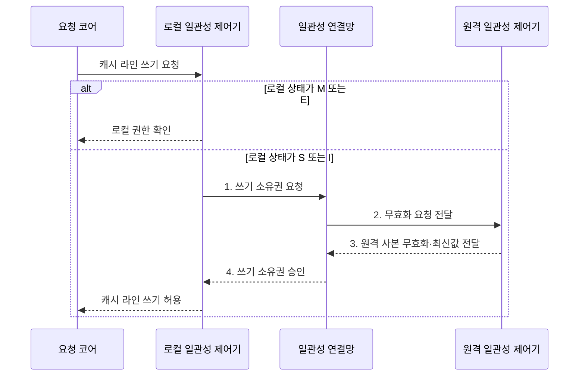

---
sidebar:
  order: 14
  label: "014. 캐시 일관성 프로토콜: MESI·MOESI (Cache Coherence Protocol)"
  badge:
    text: "기출 · 70%"
    variant: note
title: "캐시 일관성 프로토콜: MESI·MOESI (Cache Coherence Protocol)"
date: "2026-08-02T19:04:00+09:00"
tags:
  - "notes-hardware"
weight: 14
extra:
  question_no: "014"
  source_status: "기출"
  source_history: "123회, 135회"
  priority: 70
  priority_note: "MESI 상태 전이와 불변식의 반복 기출 주제"
---

## Ⅰ. 개요

핵심 용어

- **캐시 일관성 프로토콜**: 여러 코어의 캐시 사본 상태를 제어해 최신값과 단일 쓰기 권한을 보장하는 규약
- **소유권**: 캐시 라인을 수정하고 최신값을 제공할 수 있는 단일 권한과 책임

- 정의/개념: **소유권 상태** 기반 캐시 사본 일관성 규약
- 배경/필요성: 상태 규약 없이는 복제 캐시가 **서로 다른 최신값** 보유

### 쉽게 이해하기 (학습용)

- 여러 코어가 동일 메모리 블록을 캐시에 보관하면 서로 다른 값을 읽을 수 있으므로, 일관성 프로토콜은 단일 쓰기 권한과 최신값 전파를 보장한다

## Ⅱ. 특징

핵심 용어

- **단일 작성자·다중 독자 불변식**: 쓰기 가능한 사본은 하나만 존재하고 쓰기 사본이 없을 때만 읽기 사본을 여러 개 허용하는 규칙
- **쓰기 직렬화**: 같은 주소의 여러 쓰기를 모든 코어가 동일한 순서로 관측하게 하는 성질
- **거짓 공유**: 독립 변수가 같은 캐시 라인에 있어 서로의 쓰기가 불필요한 무효화를 일으키는 현상

- **단일 작성자·다중 독자** 불변식으로 쓰기 사본 단일화
- **쓰기 직렬화**로 모든 코어의 관측 순서 통일
- 무효화 단위가 변수가 아닌 **캐시 라인** 전체

### 쉽게 이해하기 (학습용)

- 하나의 캐시만 쓰기 권한을 갖고 상태 전이가 모든 코어에 같은 순서로 관측되면 일관성이 유지되지만, 라인 단위 무효화로 서로 다른 변수가 함께 제거되는 거짓 공유가 발생할 수 있다

## Ⅲ. 구조 및 구성요소

핵심 용어

- **상태 비트**: 캐시 라인의 읽기·쓰기 권한과 변경 여부를 부호화한 비트
- **일관성 제어기**: 로컬·원격 요청에 따라 라인 상태와 소유권 전이를 결정하는 회로
- **일관성 연결망**: 캐시 사이의 소유권·무효화 요청과 최신 데이터를 전달하는 통신 경로

| 구성요소 | 책임 |
|:---|:---|
| 캐시 라인·상태비트 | **읽기·쓰기 권한** 보관 |
| 일관성 제어기 | 상태 전이와 **소유권 판정** |
| 일관성 연결망 | 요청·무효화·**데이터 전달** |
| 공유 메모리 계층 | 원본 보관과 **더티 축출** 수용 |

### 쉽게 이해하기 (학습용)
- 상태 비트와 제어기가 권한을 판단하고 연결망과 메모리 계층이 무효화와 최신값 전달을 수행한다.

## Ⅳ. 흐름도

핵심 용어

- **무효화**: 쓰기 전에 다른 캐시가 가진 사본의 사용 권한을 회수하는 동작
- **쓰기 소유권 요청**: 공유 또는 무효 상태의 코어가 독점 수정 권한을 얻기 위해 보내는 요청
- **최신값 전달**: 메모리보다 최신인 더티 사본을 요청 코어에 제공하는 동작

**동작 원리**

- **1. 쓰기 소유권 요청**: S·I 사본 회수 요청
- **2. 무효화 요청 전달**: 원격 읽기 권한 제거
- **3. 원격 사본 무효화·최신값 전달**: 원격 읽기 권한 회수와 최신 사본 제공
- **4. 쓰기 소유권 승인**: 단일 독점 권한 부여

### 쉽게 이해하기 (학습용)

- 각 캐시 라인은 현재 읽기·쓰기 권한과 변경 여부를 상태 비트로 보관하고, 현재 상태로 요청을 처리할 수 없을 때만 일관성 트랜잭션으로 권한을 전환한다

## Ⅴ. 종류 및 비교

핵심 용어

- **MESI**: 수정·독점·공유·무효의 네 상태로 캐시 라인을 관리하는 프로토콜
- **MOESI**: MESI에 소유 상태를 추가해 더티 데이터를 메모리 반영 전에 직접 공유하는 프로토콜
- **소유 상태**: 최신 더티 데이터를 제공하면서 메모리 반영 책임을 유지하는 MOESI 상태

| 일관성 프로토콜 | MESI | MOESI |
|:---|:---|:---|
| 적용 기준 | **더티 공유**가 드문 경우 | 수정값의 즉시 공유가 잦은 경우 |
| 핵심 특징 | 공유 전 **메모리 반영** | **소유 상태**의 직접 전달 |
| 한계 | 공유 시 **메모리 트래픽** | 소유 사본의 **반영 책임** |

> 요약: MOESI는 소유 상태로 메모리 왕복 절감

### 쉽게 이해하기 (학습용)

- MESI는 더티 라인을 공유 상태로 바꿀 때 메모리도 최신으로 만들지만, MOESI는 소유 캐시가 최신값과 추후 반영 책임을 유지해 메모리 쓰기를 미룬다.

## Ⅵ. 실무 고려사항 및 대책

핵심 용어

- **캐시 라인 패딩**: 독립 변수를 서로 다른 라인에 배치하도록 빈 공간을 추가하는 기법
- **소유권 지역화**: 특정 데이터를 주로 한 코어가 수정하게 배치해 권한 이동을 줄이는 방법
- **전이 스트레스 검증**: 드문 상태 전이와 요청 경합을 반복 생성해 프로토콜 불변식을 확인하는 시험

| 문제 | 대책 | 효과 |
|:---|:---|:---|
| 공유 라인의 **무효화 왕복** | **소유권 지역화•데이터 분할** | **일관성 트래픽** 감소 |
| 독립 변수의 **거짓 공유** | **캐시 라인 패딩•코어별 배치** | 불필요한 **사본 회수** 방지 |
| 더티 공유의 **메모리 왕복** | **MOESI•캐시 간 전달** | **최신값 지연** 감소 |
| 드문 전이의 **데이터 불일치** | **불변식•전이 스트레스** 검증 | **프로토콜 정확성** 확보 |

### 쉽게 이해하기 (학습용)

- 더티 공유가 잦으면 MOESI의 소유 상태로 최신값을 전달하고 메모리 반영을 미뤄 트래픽을 줄인다.

## Ⅶ. 결론

핵심 용어

- **더티 공유**: 한 코어가 수정한 값을 다른 코어가 메모리 반영 전에 곧바로 읽는 접근 패턴
- **메모리 왕복**: 최신 데이터를 공유하기 위해 캐시에서 메모리로 쓴 뒤 다시 읽는 통신 비용

- 더티 공유가 드물면 **MESI**, 잦으면 **MOESI** 선택

### 쉽게 이해하기 (학습용)

- 고친 값을 옆 코어가 얼마나 자주 읽어 가는지 하나만 재면 규약 선택이 갈리고, 그 값이 남의 변수와 같은 라인에 있는지까지 보면 배치를 어떻게 떼어 놓을지도 함께 정해진다
