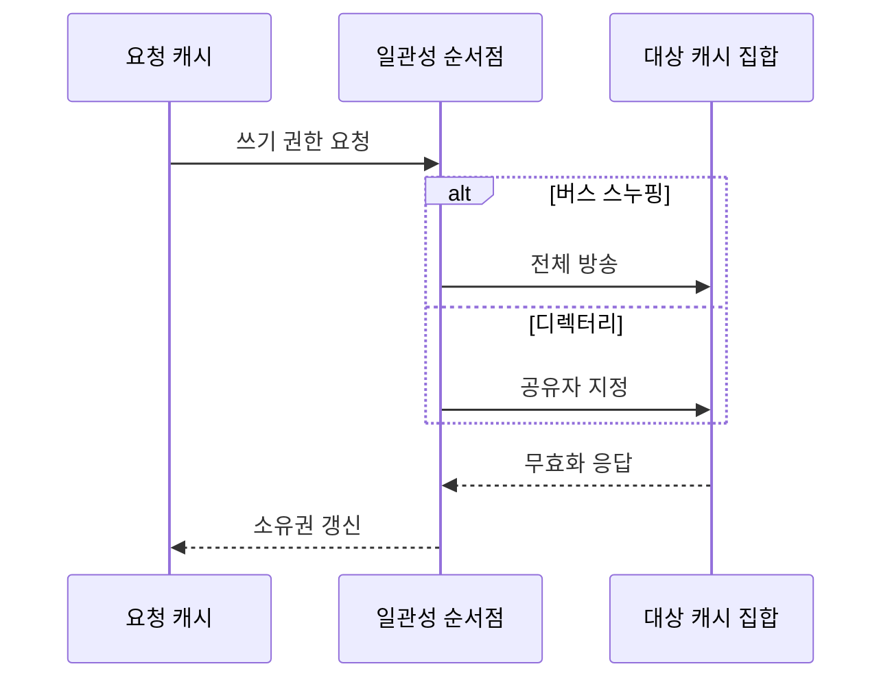

---
sidebar:
  order: 15
  label: "015. 버스 스누핑·디렉터리 기반 일관성 (Bus Snooping Directory Coherence)"
  badge:
    text: "기출 · 50%"
    variant: note
title: "버스 스누핑·디렉터리 기반 일관성 (Bus Snooping Directory Coherence)"
date: "2026-07-27T23:59:59+09:00"
tags:
  - "notes-hardware"
weight: 15
extra:
  question_no: "015"
  source_status: "기출"
  source_history: "123회"
  priority: 50
  priority_note: "방송 트래픽과 디렉터리 비용의 선택 주제"
---

## 미리 알고가기

- **캐시 일관성 구현 방식(Coherence Implementation)**: 공유 버스에 일관성 요청을 방송하는 스누핑 방식과 공유자 정보를 조회해 관련 노드에만 전달하는 디렉터리 방식으로 구분된다
- **캐시 일관성(Cache Coherence)**: 여러 캐시에 복제된 같은 라인이 서로 다른 값을 갖지 않도록 쓰기 전파와 관찰 순서를 맞추는 성질
- **캐시 라인(Cache Line)**: 데이터와 일관성 상태를 함께 묶어 관리하는 고정 크기 블록
- **버스 스누핑(Bus Snooping)**: 모든 캐시가 공유 버스에 오가는 주소 요청을 엿듣고 자기 사본과 관련 있으면 스스로 반응하는 방식
- **공유 버스(Shared Bus)**: 여러 캐시가 하나의 통신 경로를 함께 써서 같은 요청을 동시에 듣게 되는 매체이며 스누핑이 성립하는 전제다
- **버스 중재기(Bus Arbiter)**: 동시에 들어온 버스 사용 요청 중 하나만 통과시켜 전송 순서를 정하는 제어기
- **스누프 제어기(Snoop Controller)**: 버스 위 주소를 감시하다 자기 라인이면 상태를 바꾸고 무효화·데이터 응답을 보내는 캐시 회로
- **방송(Broadcast)**: 대상을 미리 찾지 않고 한 요청을 연결된 모든 캐시에 그대로 전달하는 방식
- **홈 디렉터리(Home Directory)**: 블록마다 지금 누가 소유자이고 누가 사본을 들고 있는지 적어 두는 명단이며 그 블록의 담당 위치에 놓인다
- **소유자·공유자(Owner and Sharer)**: 최신 수정본을 가진 캐시가 소유자, 읽기 사본만 가진 캐시가 공유자다
- **메타데이터(Metadata)**: 데이터 자체가 아니라 그 데이터가 어디 있고 누가 무슨 권한을 갖는지를 적어 둔 관리 정보이며 디렉터리가 차지하는 용량이 곧 이 비용이다
- **점대점 인터커넥트(Point-to-point Interconnect)**: 보낼 노드와 받을 노드를 지정해 메시지를 전달하는 연결망이며 명단이 지목한 캐시에만 연락할 수 있게 해 준다
- **노드(Node)**: 인터커넥트에서 주소를 갖고 요청과 데이터를 주고받는 코어·캐시·메모리 제어기 같은 통신 단위
- **무효화(Invalidation)**: 쓰기 전에 다른 캐시가 가진 사본의 사용 권한을 거둬들이는 동작
- **무효화 응답(Invalidation Acknowledgement)**: 사본을 실제로 버렸음을 알리는 완료 메시지이며, 이것이 전부 모여야 쓰기 권한이 나간다
- **배타적 쓰기 권한(Exclusive Write Permission)**: 그 라인을 고칠 수 있는 캐시가 오직 하나임을 보장하는 권한
- **일관성 순서점(Coherence Serialization Point)**: 같은 라인에 대한 요청들의 전역 순서를 한 곳에서 확정하는 지점이며, 스누핑에서는 버스가 디렉터리 방식에서는 홈 디렉터리가 맡는다
- **버스 포화(Bus Saturation)**: 방송량이 공유 버스의 전송 한계에 닿아 코어를 더 붙여도 대기만 늘어나는 상태
- **디렉터리 조회 지연(Directory Lookup Latency)**: 명단에서 소유자·공유자를 찾는 데 드는 추가 시간이며 지정 전달 방식이 치르는 값이다
- **소켓(Socket)**: 프로세서 패키지가 보드에 꽂히는 물리 단위이며, 여러 소켓이면 캐시와 메모리가 물리적으로 떨어져 놓인다
- **불균일 메모리 접근(Non-Uniform Memory Access, NUMA)**: 메모리 위치에 따라 로컬·원격 접근 지연이 달라지는 다중 소켓 구조
- **시스템온칩(System on Chip, SoC)**: 프로세서·메모리 제어기·주변장치를 하나의 칩에 통합한 시스템

## Ⅰ. 개요

- 정의/개념: 방송 관찰·공유자 추적으로 사본 위치를 찾는 **캐시 일관성** 구현 방식
- 기존 한계: 사본 보유 캐시를 모르면 **무효화 대상** 특정 불가

### 쉽게 이해하기 (학습용)

- 고칠 권한을 받으려면 남의 사본을 전부 회수했다는 확인이 필요한데 누가 들고 있는지 모르면 회수 요청을 어디로 보낼지부터 막히므로, 답안이 배경 자리에 이 못 찾음을 적은 이유는 이 문서의 두 방식이 규칙의 차이가 아니라 사본 위치를 찾는 방법의 차이이기 때문이다

## Ⅱ. 특징

- 같은 라인 요청을 **일관성 순서점** 하나로 직렬화
- **무효화 응답** 수합 후에만 배타적 쓰기 권한 부여
- 사본 위치를 **방송 관찰** 또는 **명단 조회**로 이원 확인

### 쉽게 이해하기 (학습용)

- 두 방식 모두 고치기 전에 남의 사본을 회수했다는 확인을 모아야 한다는 규칙은 똑같고 그 순서를 한 곳에서 정한다는 것도 같으며, 오직 회수 요청을 전원에게 뿌릴지 명단을 뒤져 해당자에게만 보낼지에서만 갈린다

## Ⅲ. 아키텍처 및 구성요소

| 설계 요소 | 설명 |
|:---|:---|
| 공유 버스·중재기 | 요청 **직렬화**와 전체 캐시 방송 매체 |
| 스누프 제어기 집합 | 버스 주소 관찰과 **무효화·데이터 응답** |
| 홈 디렉터리 | 블록별 **소유자·공유자** 명단 유지 |
| 점대점 인터커넥트 | 지목된 **노드**에만 요청·데이터 전달 |

> 요약: 순서점이 **버스**인지 **홈 디렉터리**인지가 두 구조를 가름

### 쉽게 이해하기 (학습용)

- 두 상자가 서로 이어져 있지 않은 것이 그림의 요지인데, 한쪽은 모두가 같은 복도를 쓰기 때문에 복도 자체가 순서를 정해 주고 다른 쪽은 복도가 갈라져 있어 순서를 정해 줄 명단 담당자를 따로 세워야 하므로, 부품 구성이 애초에 다른 두 설계다

## Ⅳ. 원리 및 절차 흐름도

| 절차 | 설명 |
|:---|:---|
| 쓰기 권한 요청 | 수정 대상 라인의 **배타적 쓰기 권한** 요구 |
| 전체 방송 | **스누프 제어기** 전체에 요청 전달 |
| 공유자 지정 | **홈 디렉터리** 명단의 대상 사본만 선별 |
| 무효화 응답 | 사본 폐기 확인의 **완료 응답** 수합 |
| 소유권 갱신 | 요청자 권한 부여와 **명단·상태** 반영 |

> 요약: 탐색 방식만 갈리고 **무효화 확인** 뒤 권한 부여는 공통

### 쉽게 이해하기 (학습용)

- 가운데 갈림 구간만 두 갈래이고 위아래 세 줄이 하나로 이어져 있는 것이 이 절의 핵심인데, 권한을 요청하고 회수 확인을 모아 권한을 받는 뼈대는 동일하므로 두 방식의 성능 차이는 규칙이 아니라 가운데 한 걸음을 몇 명에게 보내느냐에서만 나온다

## Ⅴ. 종류 및 비교

| 일관성 구현 방식 | 버스 스누핑 | 디렉터리 방식 |
|:---|:---|:---|
| 적용 기준 | 코어가 **공유 버스** 하나에 다 붙을 때 | 다중 소켓처럼 연결망이 갈릴 때 |
| 핵심 특징 | 전체 캐시의 **방송** 관찰과 자율 판정 | 명단 기반 **지정 전달** |
| 한계 | 코어 증가에 따른 **버스 포화** | **메타데이터** 공간과 조회 지연 |

> 요약: 스누핑의 **방송 한계**를 디렉터리가 명단 비용으로 대체

### 쉽게 이해하기 (학습용)

- 두 한계가 서로 다른 자원을 먹는다는 점이 선택을 가르는데, 외치는 방식은 사람이 늘수록 목소리가 겹쳐 복도가 먼저 터지고 명단 방식은 복도는 한가하지만 명단을 둘 공간과 그것을 뒤지는 시간이 매번 붙는다

## Ⅵ. 실무 사례

1. 소규모 **SoC**는 공유 버스 스누핑으로 일관성 유지

### 쉽게 이해하기 (학습용)

- 코어가 네댓 개뿐인 칩에서는 모두가 같은 복도에 붙어 있어 외치는 값이 싸므로, 명단을 따로 두는 회로와 공간을 아끼고 그냥 전원에게 뿌린다

## Ⅶ. 결론

- 일관성 확장을 위해 방송량·공유자를 검토하여 **디렉터리** 활용

### 쉽게 이해하기 (학습용)

- 코어를 몇 개까지 붙일 수 있느냐가 곧 이 전환 시점이라, 복도가 아직 여유로우면 외치는 쪽이 싸고 복도가 꽉 차 코어를 더 붙여도 대기만 늘기 시작하면 명단 비용을 치르더라도 지정 전달로 갈아탄다
