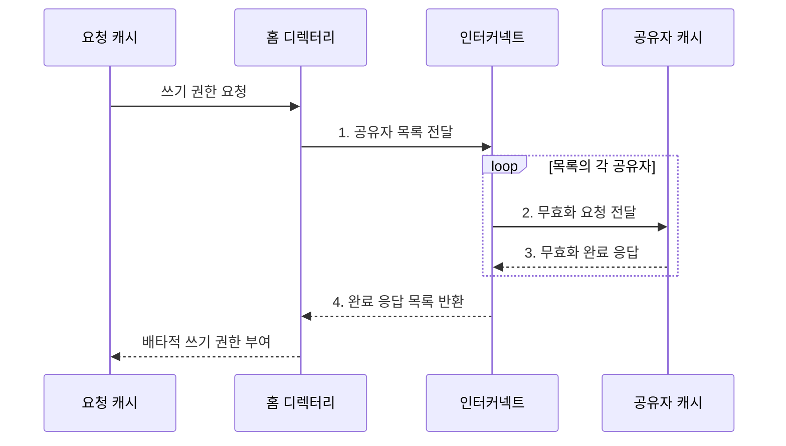

---
sidebar:
  order: 15
  label: "015. 버스 스누핑·디렉터리 기반 일관성 (Bus Snooping Directory Coherence)"
  badge:
    text: "기출 · 50%"
    variant: note
title: "버스 스누핑·디렉터리 기반 일관성 (Bus Snooping Directory Coherence)"
date: "2026-07-30T21:28:48+09:00"
tags:
  - "notes-hardware"
weight: 15
extra:
  question_no: "015"
  source_status: "기출"
  source_history: "123회"
  priority: 50
  priority_note: "방송 트래픽과 디렉터리 비용의 선택 주제"
---

## 미리 알고가기

- **캐시 일관성 구현 방식(Coherence Implementation)**: 공유 버스에 일관성 요청을 방송하는 스누핑 방식과 공유자 정보를 조회해 관련 노드에만 전달하는 디렉터리 방식으로 구분된다
- **캐시 일관성(Cache Coherence)**: 여러 캐시에 복제된 같은 라인이 서로 다른 값을 갖지 않도록 쓰기 전파와 관찰 순서를 맞추는 성질
- **캐시 라인(Cache Line)**: 데이터와 일관성 상태를 함께 묶어 관리하는 고정 크기 블록
- **버스 스누핑(Bus Snooping)**: 모든 캐시가 공유 버스에 오가는 주소 요청을 엿듣고 자기 사본과 관련 있으면 스스로 반응하는 방식
- **공유 버스(Shared Bus)**: 여러 캐시가 하나의 통신 경로를 함께 써서 같은 요청을 동시에 듣게 되는 매체이며 스누핑이 성립하는 전제다
- **버스 중재기(Bus Arbiter)**: 동시에 들어온 버스 사용 요청 중 하나만 통과시켜 전송 순서를 정하는 제어기
- **스누프 제어기(Snoop Controller)**: 버스 위 주소를 감시하다 자기 라인이면 상태를 바꾸고 무효화·데이터 응답을 보내는 캐시 회로
- **방송(Broadcast)**: 대상을 미리 찾지 않고 한 요청을 연결된 모든 캐시에 그대로 전달하는 방식
- **홈 디렉터리(Home Directory)**: 블록마다 지금 누가 소유자이고 누가 사본을 들고 있는지 적어 두는 명단이며 그 블록의 담당 위치에 놓인다
- **소유자·공유자(Owner and Sharer)**: 최신 수정본을 가진 캐시가 소유자, 읽기 사본만 가진 캐시가 공유자다
- **메타데이터(Metadata)**: 데이터 자체가 아니라 그 데이터가 어디 있고 누가 무슨 권한을 갖는지를 적어 둔 관리 정보이며 디렉터리가 차지하는 용량이 곧 이 비용이다
- **점대점 인터커넥트(Point-to-point Interconnect)**: 보낼 노드와 받을 노드를 지정해 메시지를 전달하는 연결망이며 명단이 지목한 캐시에만 연락할 수 있게 해 준다
- **노드(Node)**: 인터커넥트에서 주소를 갖고 요청과 데이터를 주고받는 코어·캐시·메모리 제어기 같은 통신 단위
- **무효화(Invalidation)**: 쓰기 전에 다른 캐시가 가진 사본의 사용 권한을 거둬들이는 동작
- **무효화 응답(Invalidation Acknowledgement)**: 사본을 실제로 버렸음을 알리는 완료 메시지이며, 이것이 전부 모여야 쓰기 권한이 나간다
- **배타적 쓰기 권한(Exclusive Write Permission)**: 그 라인을 고칠 수 있는 캐시가 오직 하나임을 보장하는 권한
- **일관성 순서점(Coherence Serialization Point)**: 같은 라인에 대한 요청들의 전역 순서를 한 곳에서 확정하는 지점이며, 스누핑에서는 버스가 디렉터리 방식에서는 홈 디렉터리가 맡는다
- **버스 포화(Bus Saturation)**: 방송량이 공유 버스의 전송 한계에 닿아 코어를 더 붙여도 대기만 늘어나는 상태
- **디렉터리 조회 지연(Directory Lookup Latency)**: 명단에서 소유자·공유자를 찾는 데 드는 추가 시간이며 지정 전달 방식이 치르는 값이다
- **소켓(Socket)**: 프로세서 패키지가 보드에 꽂히는 물리 단위이며, 여러 소켓이면 캐시와 메모리가 물리적으로 떨어져 놓인다
- **불균일 메모리 접근(Non-Uniform Memory Access, NUMA)**: 메모리 위치에 따라 로컬·원격 접근 지연이 달라지는 다중 소켓 구조
- **시스템온칩(System on Chip, SoC)**: 프로세서·메모리 제어기·주변장치를 하나의 칩에 통합한 시스템
- **희소·제한 디렉터리**: 실제 공유자만 압축하거나 추적 가능한 공유자 수를 제한해 메타데이터를 줄이는 방식

## Ⅰ. 개요

- 정의/개념: **버스 감시나 공유자 추적**으로 일관성을 유지하는 방식
- 배경/필요성: 사본 위치 미추적 시 **선택적 무효화 불가**

### 쉽게 이해하기 (학습용)

- 쓰기 권한을 얻으려면 다른 사본을 모두 무효화해야 하므로, 스누핑과 디렉터리는 사본 위치를 찾는 방식에서 갈린다.

## Ⅱ. 특징

- 같은 라인 요청을 **일관성 순서점** 하나로 직렬화
- **무효화 응답** 수합 후에만 배타적 쓰기 권한 부여
- 사본 위치를 **방송 관찰** 또는 **명단 조회**로 이원 확인

### 쉽게 이해하기 (학습용)

- 두 방식 모두 무효화 완료를 모은 뒤 쓰기를 허용하며, 요청을 전체에 방송할지 공유자에게만 보낼지가 다르다.

## Ⅲ. 구조 및 구성요소

| 구성요소 | 책임 |
|:---|:---|
| 공유 버스·중재기 | 요청 직렬화와 **전체 방송** |
| 스누프 제어기 | 사본 **무효화·데이터 응답** |
| 홈 디렉터리 | **소유자·공유자** 추적 |
| 점대점 인터커넥트 | 관련 노드에 **지정 전달** |

### 쉽게 이해하기 (학습용)
- 스누핑은 버스와 제어기가 전체에 알리고 디렉터리는 명단과 인터커넥트로 관련 캐시에만 전달한다.

## Ⅳ. 흐름도

**동작 원리**

- **1. 공유자 목록 전달**: 대상 캐시 명단 전달
- **2. 무효화 요청 전달**: 지정 캐시의 읽기 권한 제거
- **3. 무효화 완료 응답**: 제거 완료 통보
- **4. 완료 응답 목록 반환**: 대상별 무효화 완료 확인

### 쉽게 이해하기 (학습용)

- 스누핑은 공유 버스가 순서를 정하고, 디렉터리는 홈 노드가 공유자와 소유권을 관리한다

## Ⅴ. 종류 및 비교

| 일관성 구현 방식 | 버스 스누핑 | 디렉터리 방식 |
|:---|:---|:---|
| 적용 기준 | 소규모 **공유 버스** | 다중 소켓·대규모 노드 |
| 핵심 특징 | 전체 캐시의 **방송 관찰** | 명단 기반 **지정 전달** |
| 한계 | 코어 증가의 **버스 포화** | **메타데이터·조회 지연** |

> 요약: 스누핑의 **방송 한계**를 디렉터리가 명단 비용으로 대체

### 쉽게 이해하기 (학습용)

- 스누핑은 노드 증가 시 방송 경로가 포화되고, 디렉터리는 방송을 줄이는 대신 명단 용량과 조회 지연을 부담한다.

## Ⅵ. 실무 고려사항 및 대책

| 고려사항 | 대책 | 효과 |
|:---|:---|:---|
| 방송 증가의 **버스 포화** | **스누핑 계층화•디렉터리 전환** | **코어 확장성** 확보 |
| 공유자 비트맵의 **용량 증가** | **희소•제한 디렉터리** 적용 | **메타데이터** 절감 |
| 홈 집중의 **원격 조회 지연** | 주소 해싱·**NUMA 인지 배치** | **부하·지연** 감소 |
| 응답 누락의 **상태 교착** | **타임아웃•재시도**와 상태 전이 검증 | **정합성•활성** 보장 |

### 쉽게 이해하기 (학습용)

- 코어가 네댓 개뿐인 칩에서는 모두가 같은 복도에 붙어 있어 외치는 값이 싸므로, 명단을 따로 두는 회로와 공간을 아끼고 그냥 전원에게 뿌린다

## Ⅶ. 결론

- 소규모 공유 버스는 **스누핑**, 방송 포화는 **디렉터리** 선택

### 쉽게 이해하기 (학습용)

- 소규모 공유 버스는 스누핑을 쓰고, 방송 포화로 확장성이 막히면 디렉터리의 지정 전달로 전환한다.
