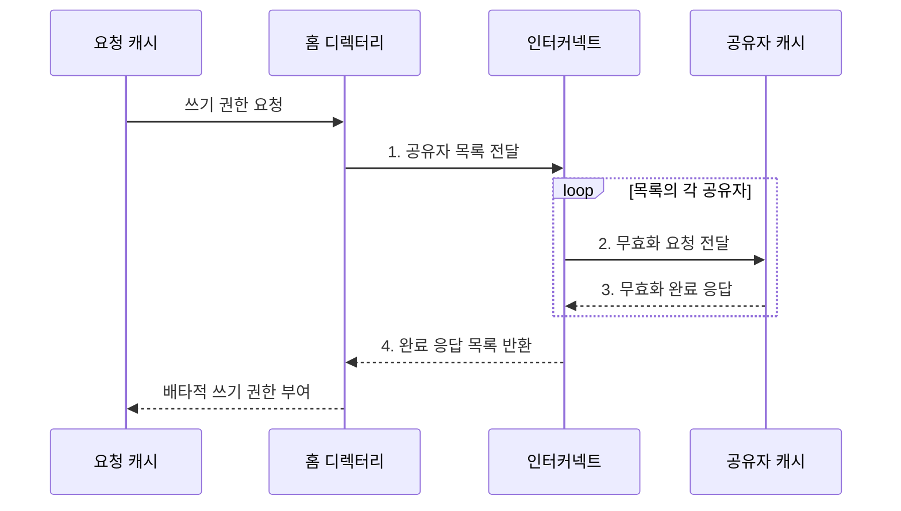

---
sidebar:
  order: 15
  label: "015. 버스 스누핑·디렉터리 기반 일관성 (Bus Snooping Directory Coherence)"
  badge:
    text: "기출 · 50%"
    variant: note
title: "버스 스누핑·디렉터리 기반 일관성 (Bus Snooping Directory Coherence)"
date: "2026-08-02T10:35:00+09:00"
tags:
  - "notes-hardware"
weight: 15
extra:
  question_no: "015"
  source_status: "기출"
  source_history: "123회"
  priority: 50
  priority_note: "방송 트래픽과 디렉터리 비용의 선택 주제"
---

## Ⅰ. 개요

핵심 용어

- **캐시 일관성 구현**: 복제된 캐시 라인의 최신값과 쓰기 순서를 맞추도록 요청을 전달하고 사본을 추적하는 방식
- **선택적 무효화**: 쓰기 대상 라인의 사본을 가진 캐시에만 권한 회수 요청을 보내는 동작

- 정의/개념: **버스 감시나 공유자 추적**으로 일관성을 유지하는 방식
- 배경/필요성: 사본 위치 미추적 시 **선택적 무효화 불가**

### 쉽게 이해하기 (학습용)

- 쓰기 권한을 얻으려면 다른 사본을 모두 무효화해야 하므로, 스누핑과 디렉터리는 사본 위치를 찾는 방식에서 갈린다.

## Ⅱ. 특징

핵심 용어

- **일관성 순서점**: 같은 라인에 대한 요청의 전역 순서를 확정하는 버스나 홈 디렉터리
- **무효화 응답**: 캐시가 사본을 실제로 버렸음을 알리는 완료 메시지
- **배타적 쓰기 권한**: 특정 캐시 하나만 해당 라인을 수정할 수 있도록 보장하는 권한

- 같은 라인 요청을 **일관성 순서점** 하나로 직렬화
- **무효화 응답** 수합 후에만 배타적 쓰기 권한 부여
- 사본 위치를 **방송 관찰** 또는 **명단 조회**로 이원 확인

### 쉽게 이해하기 (학습용)

- 두 방식 모두 무효화 완료를 모은 뒤 쓰기를 허용하며, 요청을 전체에 방송할지 공유자에게만 보낼지가 다르다.

## Ⅲ. 구조 및 구성요소

핵심 용어

- **버스 중재기·스누프 제어기**: 버스 요청 순서를 정하고 모든 캐시가 관련 주소 요청에 반응하게 하는 회로
- **홈 디렉터리**: 블록마다 최신 소유자와 읽기 공유자 명단을 보관하는 관리 구조
- **점대점 인터커넥트**: 송수신 노드를 지정해 관련 캐시에만 메시지를 전달하는 연결망

| 구성요소 | 책임 |
|:---|:---|
| 공유 버스·중재기 | 요청 직렬화와 **전체 방송** |
| 스누프 제어기 | 사본 **무효화·데이터 응답** |
| 홈 디렉터리 | **소유자·공유자** 추적 |
| 점대점 인터커넥트 | 관련 노드에 **지정 전달** |

### 쉽게 이해하기 (학습용)
- 스누핑은 버스와 제어기가 전체에 알리고 디렉터리는 명단과 인터커넥트로 관련 캐시에만 전달한다.

## Ⅳ. 흐름도

핵심 용어

- **소유자·공유자**: 최신 수정본을 가진 캐시와 읽기 사본만 가진 캐시
- **공유자 목록**: 쓰기 전 무효화 요청을 보내야 할 캐시들의 명단
- **완료 응답 수합**: 모든 대상 캐시의 무효화 확인을 모은 뒤 쓰기 권한을 내주는 절차

**동작 원리**

- **1. 공유자 목록 전달**: 대상 캐시 명단 전달
- **2. 무효화 요청 전달**: 지정 캐시의 읽기 권한 제거
- **3. 무효화 완료 응답**: 제거 완료 통보
- **4. 완료 응답 목록 반환**: 대상별 무효화 완료 확인

### 쉽게 이해하기 (학습용)

- 스누핑은 공유 버스가 순서를 정하고, 디렉터리는 홈 노드가 공유자와 소유권을 관리한다

## Ⅴ. 종류 및 비교

핵심 용어

- **버스 스누핑**: 공유 버스의 요청을 모든 캐시가 관찰하고 자기 사본과 관련되면 반응하는 방식
- **디렉터리 방식**: 공유자 정보를 조회해 관련 노드에만 요청을 지정 전달하는 방식
- **메타데이터**: 소유자·공유자와 권한 상태를 기록하는 관리 정보

| 일관성 구현 방식 | 버스 스누핑 | 디렉터리 방식 |
|:---|:---|:---|
| 적용 기준 | 소규모 **공유 버스** | 다중 소켓·대규모 노드 |
| 핵심 특징 | 전체 캐시의 **방송 관찰** | 명단 기반 **지정 전달** |
| 한계 | 코어 증가의 **버스 포화** | **메타데이터·조회 지연** |

> 요약: 스누핑의 **방송 한계**를 디렉터리가 명단 비용으로 대체

### 쉽게 이해하기 (학습용)

- 스누핑은 노드 증가 시 방송 경로가 포화되고, 디렉터리는 방송을 줄이는 대신 명단 용량과 조회 지연을 부담한다.

## Ⅵ. 실무 고려사항 및 대책

핵심 용어

- **버스 포화**: 방송량이 공유 버스의 전송 한계에 도달해 코어를 늘려도 대기만 증가하는 상태
- **희소·제한 디렉터리**: 실제 공유자만 압축하거나 추적 수를 제한해 메타데이터를 줄이는 구조
- **NUMA 인지 배치**: 데이터와 처리 코어를 가까운 메모리 노드에 배치해 원격 지연을 줄이는 방법

| 문제 | 대책 | 효과 |
|:---|:---|:---|
| 방송 증가의 **버스 포화** | **스누핑 계층화•디렉터리 전환** | **코어 확장성** 확보 |
| 공유자 비트맵의 **용량 증가** | **희소•제한 디렉터리** 적용 | **메타데이터** 절감 |
| 홈 집중의 **원격 조회 지연** | 주소 해싱·**NUMA 인지 배치** | **부하·지연** 감소 |
| 응답 누락의 **상태 교착** | **타임아웃•재시도**와 상태 전이 검증 | **정합성•활성** 보장 |

### 쉽게 이해하기 (학습용)

- 코어가 네댓 개뿐인 칩에서는 모두가 같은 복도에 붙어 있어 외치는 값이 싸므로, 명단을 따로 두는 회로와 공간을 아끼고 그냥 전원에게 뿌린다

## Ⅶ. 결론

핵심 용어

- **방송 확장성**: 모든 캐시에 요청을 보내는 방식이 노드 증가에도 처리량을 유지하는 능력
- **지정 전달**: 디렉터리가 알려 준 소유자와 공유자에게만 일관성 메시지를 보내는 방식

- 소규모 공유 버스는 **스누핑**, 방송 포화는 **디렉터리** 선택

### 쉽게 이해하기 (학습용)

- 소규모 공유 버스는 스누핑을 쓰고, 방송 포화로 확장성이 막히면 디렉터리의 지정 전달로 전환한다.
