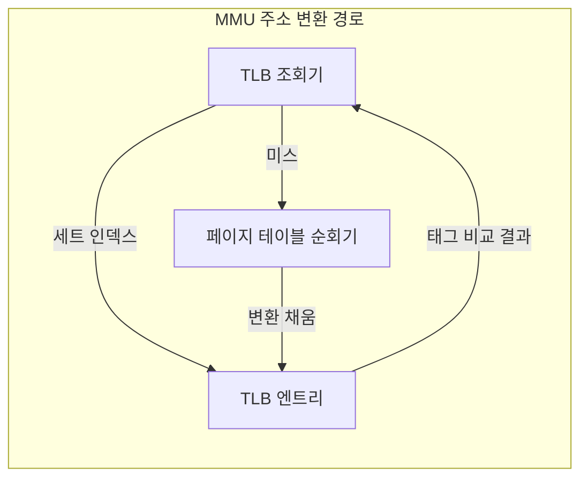
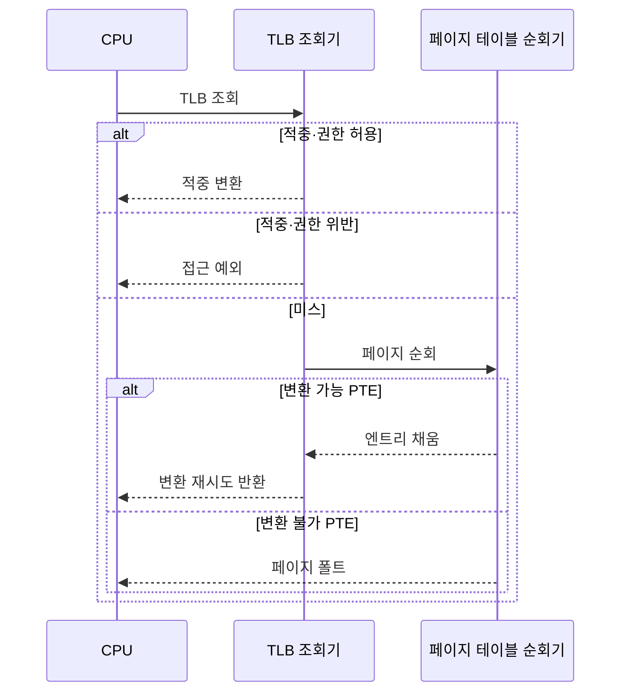

---
sidebar:
  order: 16
  label: "016. TLB 변환 색인 버퍼 (Translation Lookaside Buffer)"
  badge:
    text: "기출 · 70%"
    variant: note
title: "TLB 변환 색인 버퍼 (Translation Lookaside Buffer)"
date: "2026-07-27T23:59:59+09:00"
tags:
  - "notes-hardware"
weight: 16
extra:
  question_no: "016"
  source_status: "기출"
  source_history: "135회, 137회"
  priority: 70
  priority_note: "반복 기출·TLB 미스 원인 판별"
---

## 미리 알고가기

- **변환 색인 버퍼(Translation Lookaside Buffer, TLB)**: ‘티엘비’로 읽고 영문 머리글자를 딴 약어이며, 최근 가상 페이지의 변환 결과를 담아 페이지 테이블 순회를 줄이는 주소 변환 캐시다
- **메모리 관리 장치(Memory Management Unit, MMU)**: ‘엠엠유’로 읽고 영문 머리글자를 딴 약어이며, 가상 주소를 물리 주소로 바꾸고 접근 권한을 검사하는 장치다
- **가상 주소·물리 주소(Virtual·Physical Address)**: 프로세스가 자기 세상에서 보는 주소가 가상 주소, 메모리 칩에서 실제로 가리키는 자리가 물리 주소다
- **가상 페이지 번호(Virtual Page Number, VPN)**: ‘브이피엔’으로 읽고 영문 머리글자를 딴 약어이며, 가상 주소 상위 비트로 변환할 페이지를 식별한다
- **물리 페이지 번호(Physical Page Number, PPN)**: ‘피피엔’으로 읽고 영문 머리글자를 딴 약어이며, 변환 결과인 물리 페이지 프레임을 식별한다
- **페이지 오프셋(Page Offset)**: 주소의 하위 비트로 페이지 안에서 몇 번째 바이트인지를 나타내며 변환 없이 그대로 물려 쓴다
- **TLB 엔트리(TLB Entry)**: VPN 태그와 주소 공간 식별자, 그에 대응하는 PPN과 접근 권한·유효 상태를 한 줄로 묶어 둔 항목
- **TLB 세트 인덱스(TLB Set Index)**: VPN의 일부 비트로 후보 엔트리 묶음을 먼저 고르는 값
- **TLB 적중·TLB 미스(TLB Hit·TLB Miss)**: 쪽지에서 바로 찾으면 적중, 없어 주소록을 뒤져야 하면 미스다
- **페이지 테이블 항목(Page Table Entry, PTE)**: ‘피티이’로 읽고 영문 머리글자를 딴 약어이며, PPN·유효 상태·접근 권한을 담는 변환 항목이다
- **다단계 페이지 테이블(Multi-level Page Table)**: 주소록을 한 권으로 두면 너무 커지므로 VPN 비트를 나눠 색인 책을 여러 층으로 쌓아 둔 구조
- **페이지 테이블 순회(Page Table Walk)**: 그 여러 층을 한 단씩 따라 내려가 최종 PTE를 찾는 동작이며, 단이 깊을수록 메모리 접근이 그만큼 늘어난다
- **페이지 테이블 순회기(Page Table Walker)**: 미스가 났을 때 이 순회를 대신 수행하고 찾은 변환을 TLB에 채워 넣는 회로
- **주소 공간 식별자(Address Space Identifier, ASID)**: ‘에이시드’로 읽고 영문 머리글자를 단어처럼 읽는 약어이며, TLB 엔트리가 속한 프로세스 주소 공간을 식별한다
- **문맥 전환(Context Switch)**: 실행 대상을 한 프로세스에서 다른 프로세스로 바꾸는 동작이며, ASID가 없으면 이때마다 TLB가 무효화된다
- **TLB 도달 범위(TLB Reach)**: 엔트리 수와 페이지 크기를 곱해 나오는, TLB가 한 번에 덮을 수 있는 총 주소 범위
- **작업 집합(Working Set)**: 프로세스가 지금 반복해서 건드리는 페이지 묶음이며, 이것이 도달 범위를 넘으면 변환이 계속 밀려나 미스가 급증한다
- **대형 페이지(Large Page)**: 기본 페이지보다 큰 변환 단위이며, 엔트리 하나가 더 넓은 영역을 덮게 해 도달 범위를 키운다
- **접근 예외(Access Exception)**: 변환은 있지만 읽기·쓰기·실행 권한을 어겼을 때 발생하는 예외
- **페이지 폴트(Page Fault)**: 변환 자체를 만들 수 없어 운영체제가 개입해야 하는 예외
- **비상주·미매핑·보호 위반**: 페이지가 저장장치로 내려가 있어 다시 올려야 하는 상태, 애초에 대응하는 물리 자리가 없는 상태, 허용되지 않은 접근을 시도한 상태로 페이지 폴트의 원인을 가른다
- **입출력(Input/Output, I/O)**: ‘아이오’로 읽고 입력·출력의 영문 머리글자를 빗금으로 구분한 표기이며, 저장장치·주변 장치와 데이터를 이동하는 작업이다
- **메모리 데이터베이스(In-memory Database)**: 데이터를 주기억장치에 올려 두고 처리하는 데이터베이스이며 작업 집합이 커서 도달 범위 문제가 먼저 드러나는 사례다

## Ⅰ. 개요

- 정의/개념: 최근 주소 변환을 재사용해 순회를 생략하는 **MMU 캐시**
- 기존 한계: 변환 캐시 없이는 접근마다 **다단계 순회** 반복

### 쉽게 이해하기 (학습용)

- 주소록이 여러 층이면 실제 데이터를 읽기 전에 층마다 메모리를 조회해야 하므로, TLB는 데이터가 아니라 최근 주소 변환을 재사용해 이 순회 비용을 줄인다

## Ⅱ. 특징

- 최근 변환 재사용으로 **페이지 순회** 지연 회피
- 태그·**ASID**·권한을 함께 비교하는 변환 보호
- 엔트리 수와 페이지 크기가 정하는 **TLB 도달 범위**

### 쉽게 이해하기 (학습용)

- 쪽지가 아무리 빨라도 적을 수 있는 줄 수가 정해져 있어서 지금 자주 쓰는 페이지 묶음이 그 줄 수와 페이지 크기를 곱한 범위를 넘어서는 순간 적자마자 밀려나기를 되풀이하게 되므로, TLB 성능은 회로 속도가 아니라 이 덮는 범위가 작업 집합을 담느냐로 갈린다

## Ⅲ. 아키텍처 및 구성요소

| 설계 요소 | 설명 |
|:---|:---|
| TLB 조회기 | **세트 인덱스** 선택 후 태그·ASID 비교 |
| TLB 엔트리 | **VPN 태그·ASID**와 PPN·권한·유효 상태 보관 |
| 페이지 테이블 순회기 | 미스 시 **PTE** 탐색과 엔트리 채움 |

> 요약: 미스 경로만 **순회기**로 빠지고 적중 경로는 MMU 내부 종결

### 쉽게 이해하기 (학습용)

- 화살표가 조회기와 엔트리 사이에서 짧게 왕복하다가 한 갈래만 아래 순회기로 빠지는 모양이 곧 성능 구조인데, 대부분의 접근은 이 짧은 왕복에서 끝나 메모리를 건드리지 않고 오직 밀려난 변환만 아래로 내려가 주소록을 다시 뒤진다

## Ⅳ. 원리 및 절차 흐름도

| 절차 | 설명 |
|:---|:---|
| TLB 조회 | **VPN** 기준 세트 선택과 태그·ASID 비교 |
| 적중 변환 | **PPN**과 페이지 오프셋 결합으로 물리 주소 확정 |
| 접근 예외 | 변환은 있으나 **권한 위반**인 접근 차단 |
| 페이지 순회 | **다단계 페이지 테이블**의 PTE 탐색 |
| 엔트리 채움 | 유효 PTE 적재 후 **변환 재시도** |
| 변환 재시도 반환 | 새 엔트리의 PPN으로 **물리 주소** 반환 |
| 페이지 폴트 | **비상주·미매핑** 시 운영체제 처리 위임 |

> 요약: 변환 없음은 **순회**로, 변환 불가는 **운영체제**로 분기

### 쉽게 이해하기 (학습용)

- 두 번 갈라지는 이 그림이 곧 문제 진단표인데, 첫 갈림은 쪽지에 있느냐 없느냐라 하드웨어가 알아서 메우고 둘째 갈림은 주소록에 아예 줄이 없느냐라 운영체제를 깨워야 하므로, 같은 느림이라도 어느 갈림에서 났는지에 따라 손댈 곳이 완전히 달라진다

## Ⅴ. 종류 및 비교

| 주소 변환 실패 | TLB 미스 | 페이지 폴트 |
|:---|:---|:---|
| 적용 기준 | **페이지 순회**만으로 변환 가능할 때 | 운영체제의 적재·종료 판정이 필요할 때 |
| 핵심 특징 | TLB에 일치 **유효 변환** 부재 | PTE의 **비상주·미매핑·보호 위반** |
| 한계 | 반복 순회에 따른 **변환 지연** 누적 | 예외 처리와 **저장장치 I/O** 대기 |

> 요약: 순회로 메워지면 **하드웨어**, 못 메우면 **운영체제** 소관

### 쉽게 이해하기 (학습용)

- 이름은 둘 다 못 찾음이지만 값이 자릿수부터 다른데, 앞은 주소록을 몇 번 더 뒤지는 수십 나노초짜리 일이고 뒤는 디스크에서 페이지를 올려 오는 수십 마이크로초 이상짜리 일이라, 미스율을 볼 때 이 둘을 한 숫자로 묶으면 원인 진단이 통째로 어긋난다

## Ⅵ. 실무 사례

1. 메모리 데이터베이스는 **대형 페이지**로 TLB 도달 범위 확대

### 쉽게 이해하기 (학습용)

- 수십 기가바이트를 메모리에 올려 두고 훑는 데이터베이스는 4킬로바이트짜리 변환으로는 쪽지가 아무리 커도 범위를 못 덮으므로, 한 줄이 2메가바이트를 가리키게 바꿔 같은 줄 수로 수백 배 넓은 영역을 덮는다

## Ⅶ. 결론

- 잦은 **TLB 미스**는 도달 범위·ASID 적용부터 진단

### 쉽게 이해하기 (학습용)

- 변환이 느리다고 캐시를 키우는 것이 답이 아니라, 지금 쓰는 페이지 묶음이 쪽지가 덮는 범위를 넘었는지와 프로세스를 바꿀 때마다 쪽지를 지우고 있는지 두 가지를 먼저 확인해야 손댈 곳이 나온다
