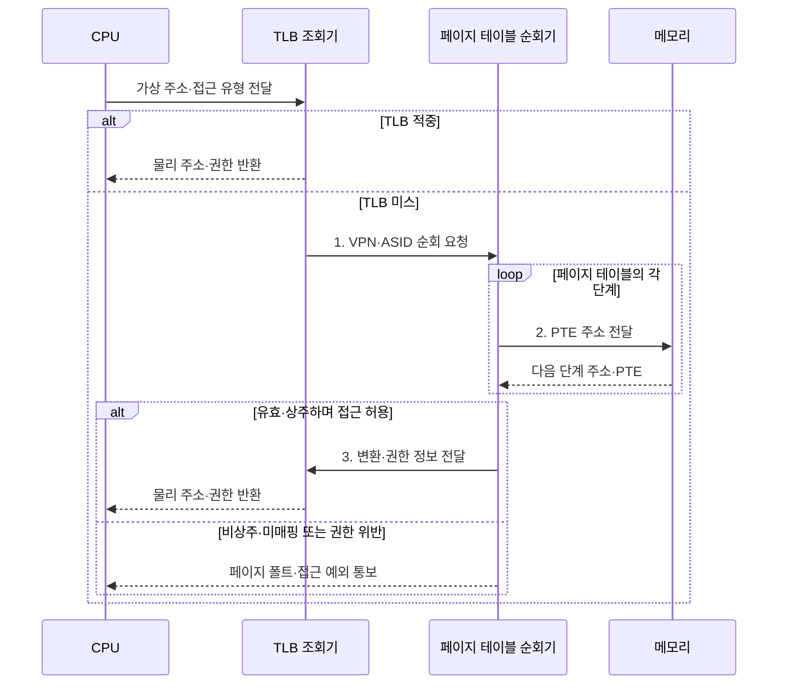

---
sidebar:
  order: 16
  label: "016. TLB 변환 색인 버퍼 (Translation Lookaside Buffer)"
  badge:
    text: "기출 · 70%"
    variant: note
title: "TLB 변환 색인 버퍼 (Translation Lookaside Buffer)"
date: "2026-08-02T10:36:00+09:00"
tags:
  - "notes-hardware"
weight: 16
extra:
  question_no: "016"
  source_status: "기출"
  source_history: "135회, 137회"
  priority: 70
  priority_note: "반복 기출·TLB 미스 원인 판별"
---

## Ⅰ. 개요

핵심 용어

- **TLB**: 최근 가상 페이지의 물리 주소 변환 결과를 저장해 페이지 테이블 순회를 줄이는 MMU 캐시
- **MMU**: 가상 주소를 물리 주소로 변환하고 페이지 접근 권한을 검사하는 하드웨어

- 정의/개념: 최근 주소 변환을 재사용하는 **MMU 캐시**
- 배경/필요성: 접근별 **다단계 페이지 순회** 감소

### 쉽게 이해하기 (학습용)

- 주소록이 여러 층이면 실제 데이터를 읽기 전에 층마다 메모리를 조회해야 하므로, TLB는 데이터가 아니라 최근 주소 변환을 재사용해 이 순회 비용을 줄인다

## Ⅱ. 특징

핵심 용어

- **ASID**: TLB 엔트리가 어느 프로세스의 주소 공간에 속하는지 구분하는 식별자
- **TLB 도달 범위**: 엔트리 수와 페이지 크기의 곱으로 TLB가 한 번에 덮는 주소 범위
- **작업 집합**: 프로세스가 현재 반복적으로 접근하는 페이지들의 집합

- 최근 변환 재사용으로 **페이지 순회** 지연 회피
- 태그·**ASID**·권한을 함께 비교하는 변환 보호
- 엔트리 수와 페이지 크기가 정하는 **TLB 도달 범위**

$$
TLB\ Reach = TLB\ Entry\ Count \times Page\ Size
$$

> 단일 페이지 크기의 도달 범위 기본식

### 쉽게 이해하기 (학습용)

- 작업 집합이 TLB 도달 범위를 넘으면 변환이 계속 축출되므로, 엔트리 수와 페이지 크기가 미스율을 좌우한다.

## Ⅲ. 구조 및 구성요소

핵심 용어

- **VPN·PPN**: 가상 주소의 페이지 번호와 변환 결과인 물리 페이지 프레임 번호
- **TLB 엔트리**: VPN·ASID와 대응 PPN·권한·유효 상태를 함께 보관하는 항목
- **페이지 테이블 순회기**: TLB 미스 시 페이지 테이블을 탐색하고 변환을 TLB에 채우는 회로

| 구성요소 | 책임 |
|:---|:---|
| TLB 조회기 | **VPN·ASID·권한** 비교 |
| TLB 엔트리 | 최근 **VPN-PPN 변환** 보관 |
| 페이지 테이블 순회기 | PTE 탐색과 **엔트리 채움** |

### 쉽게 이해하기 (학습용)
- 조회기와 엔트리가 최근 변환을 처리하고 미스일 때만 순회기가 페이지 테이블을 탐색한다.

## Ⅳ. 흐름도

핵심 용어

- **TLB 적중·미스**: 변환을 TLB에서 즉시 찾거나 페이지 테이블 순회가 필요한 상태
- **PTE**: 물리 페이지 번호와 유효·상주·접근 권한을 저장하는 페이지 테이블 항목
- **페이지 오프셋**: 페이지 안의 바이트 위치를 나타내며 주소 변환 없이 유지되는 하위 비트

**동작 원리**

- **1. VPN·ASID 순회 요청**: 미스 변환 탐색
- **2. PTE 주소 전달**: 다단계 페이지 테이블 항목 조회
- **3. 변환·권한 정보 전달**: 유효 변환을 TLB 엔트리에 저장

### 쉽게 이해하기 (학습용)

- 적중은 조회기와 엔트리에서 끝나고, 미스만 페이지 테이블 순회기로 넘어간다

## Ⅴ. 종류 및 비교

핵심 용어

- **페이지 테이블 순회**: 다단계 페이지 테이블을 따라 최종 PTE를 찾는 하드웨어 동작
- **페이지 폴트**: 비상주·미매핑·보호 위반을 운영체제에 알리는 예외
- **접근 예외**: 주소 변환이나 권한 검사가 실패했을 때 발생하는 CPU 예외

| 주소 변환 실패 | TLB 미스 | 페이지 폴트 |
|:---|:---|:---|
| 적용 기준 | **페이지 순회**만으로 변환 가능할 때 | 운영체제의 적재·종료 판정이 필요할 때 |
| 핵심 특징 | TLB에 일치 **유효 변환** 부재 | PTE의 **비상주·미매핑·보호 위반** |
| 한계 | 반복 순회에 따른 **변환 지연** 누적 | 예외 처리와 **저장장치 I/O** 대기 |

> 요약: 순회로 메워지면 **하드웨어**, 못 메우면 **운영체제** 소관

### 쉽게 이해하기 (학습용)

- TLB 미스는 하드웨어 순회로 변환을 채우지만, 페이지 폴트는 운영체제가 적재·매핑·권한을 처리한다.

## Ⅵ. 실무 고려사항 및 대책

핵심 용어

- **대형 페이지**: 기본 페이지보다 큰 변환 단위로 엔트리당 도달 범위를 늘리는 페이지
- **페이지 순회 캐시**: 상위 단계 PTE를 저장해 TLB 미스의 메모리 접근 수를 줄이는 캐시
- **선택적 무효화**: 문맥이나 매핑 변경 시 영향받는 TLB 엔트리만 제거하는 방법

| 문제 | 대책 | 효과 |
|:---|:---|:---|
| 작업 집합의 **도달 범위 초과** | **페이지 크기•미스율** 동시 측정 | **용량 미스** 식별 |
| 문맥 전환의 **전체 무효화** | **ASID•선택적 무효화** | 전환 후 **미스 감소** |
| 다단계 순회의 **메모리 병목** | **페이지 순회 캐시•지역성** 개선 | **미스 지연** 감소 |
| 대형 페이지의 **단편화** | **대상 선별•예약량** 감시 | 목표 도달 범위 내 **단편화 제한** |

### 쉽게 이해하기 (학습용)

- 수십 기가바이트를 메모리에 올려 두고 훑는 데이터베이스는 4킬로바이트짜리 변환으로는 쪽지가 아무리 커도 범위를 못 덮으므로, 한 줄이 2메가바이트를 가리키게 바꿔 같은 줄 수로 수백 배 넓은 영역을 덮는다

## Ⅶ. 결론

핵심 용어

- **용량 미스**: 작업 집합의 변환 수가 TLB 엔트리 범위를 넘어 반복 축출되는 현상
- **전환 미스**: 문맥 전환 때 TLB를 비워 새 프로세스의 변환을 다시 채우며 발생하는 미스

- 도달 범위 초과는 **대형 페이지**, 전환 미스는 **ASID** 적용

### 쉽게 이해하기 (학습용)

- 변환이 느리다고 캐시를 키우는 것이 답이 아니라, 지금 쓰는 페이지 묶음이 쪽지가 덮는 범위를 넘었는지와 프로세스를 바꿀 때마다 쪽지를 지우고 있는지 두 가지를 먼저 확인해야 손댈 곳이 나온다
