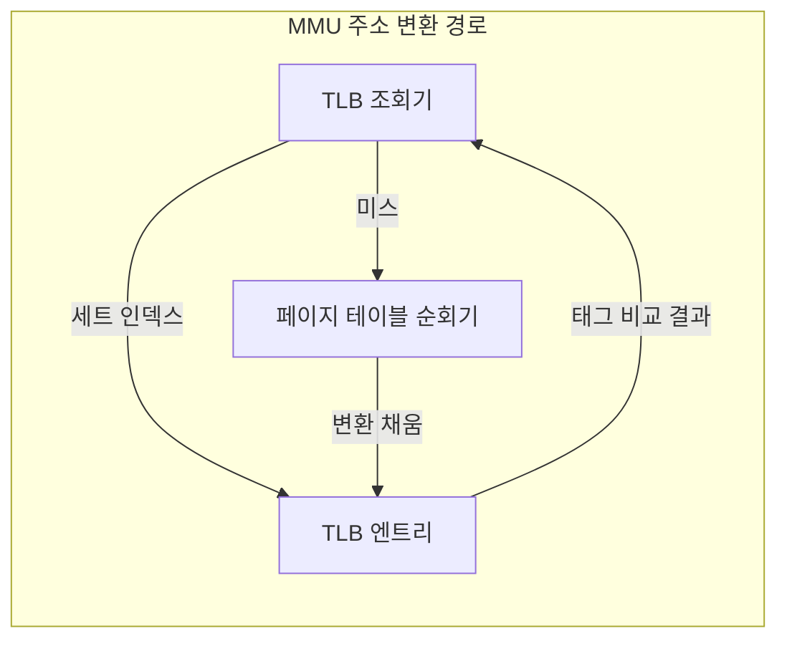
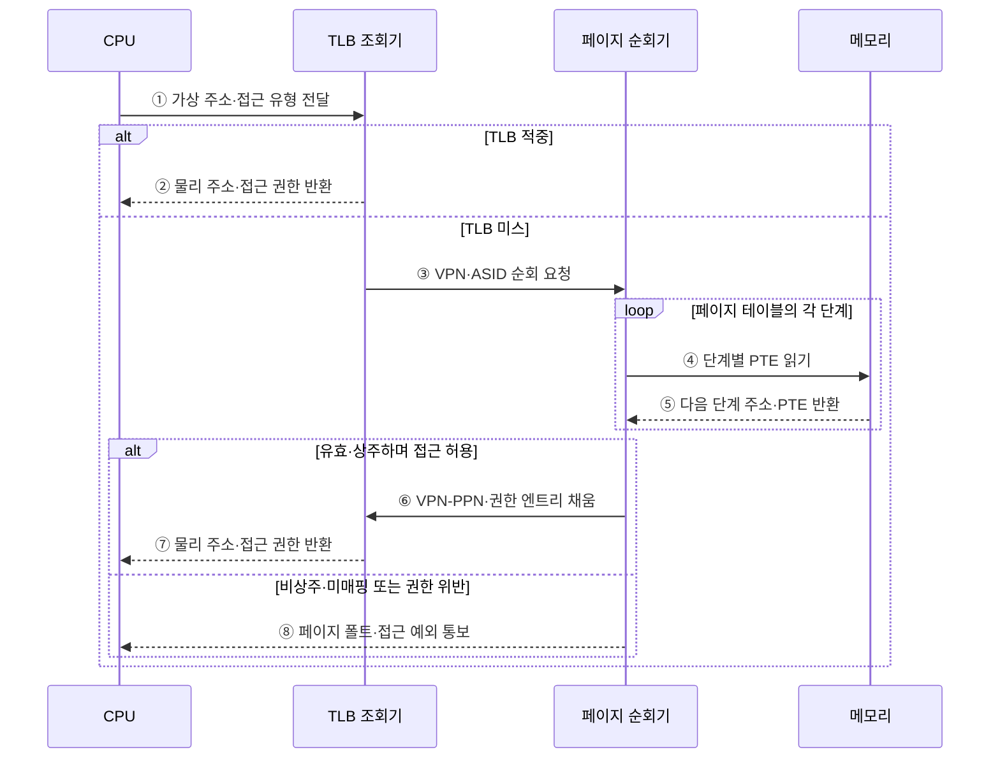

---
sidebar:
  order: 16
  label: "016. TLB 변환 색인 버퍼 (Translation Lookaside Buffer)"
  badge:
    text: "기출 · 70%"
    variant: note
title: "TLB 변환 색인 버퍼 (Translation Lookaside Buffer)"
date: "2026-07-29T00:39:00+09:00"
tags:
  - "notes-hardware"
weight: 16
extra:
  question_no: "016"
  source_status: "기출"
  source_history: "135회, 137회"
  priority: 70
  priority_note: "반복 기출·TLB 미스 원인 판별"
---

## 미리 알고가기

- **변환 색인 버퍼(Translation Lookaside Buffer, TLB)**: 최근 가상 페이지의 주소 변환 결과를 저장하여 페이지 테이블 순회 횟수를 줄이는 주소 변환 캐시다
- **메모리 관리 장치(Memory Management Unit, MMU)**: 가상 주소를 물리 주소로 변환하고 페이지 접근 권한을 검사하는 하드웨어
- **가상 주소·물리 주소(Virtual·Physical Address)**: 프로세스가 자기 세상에서 보는 주소가 가상 주소, 메모리 칩에서 실제로 가리키는 자리가 물리 주소다
- **가상 페이지 번호(Virtual Page Number, VPN)**: 가상 주소의 상위 비트로 주소 변환 대상 페이지를 식별하는 번호
- **물리 페이지 번호(Physical Page Number, PPN)**: 주소 변환 결과인 물리 메모리의 페이지 프레임을 식별하는 번호
- **페이지 오프셋(Page Offset)**: 주소의 하위 비트로 페이지 안에서 몇 번째 바이트인지를 나타내며 변환 없이 그대로 물려 쓴다
- **TLB 엔트리(TLB Entry)**: VPN 태그와 주소 공간 식별자, 그에 대응하는 PPN과 접근 권한·유효 상태를 한 줄로 묶어 둔 항목
- **TLB 세트 인덱스(TLB Set Index)**: VPN의 일부 비트로 후보 엔트리 묶음을 먼저 고르는 값
- **TLB 적중·TLB 미스(TLB Hit·TLB Miss)**: 쪽지에서 바로 찾으면 적중, 없어 주소록을 뒤져야 하면 미스다
- **페이지 테이블 항목(Page Table Entry, PTE)**: 물리 페이지 번호·유효 상태·접근 권한을 저장하는 주소 변환 항목
- **다단계 페이지 테이블(Multi-level Page Table)**: 주소록을 한 권으로 두면 너무 커지므로 VPN 비트를 나눠 색인 책을 여러 층으로 쌓아 둔 구조
- **페이지 테이블 순회(Page Table Walk)**: 그 여러 층을 한 단씩 따라 내려가 최종 PTE를 찾는 동작이며, 단이 깊을수록 메모리 접근이 그만큼 늘어난다
- **페이지 테이블 순회기(Page Table Walker)**: 미스가 났을 때 이 순회를 대신 수행하고 찾은 변환을 TLB에 채워 넣는 회로
- **주소 공간 식별자(Address Space Identifier, ASID)**: TLB 엔트리가 어느 프로세스의 가상 주소 공간에 속하는지 구분하는 식별자
- **문맥 전환(Context Switch)**: 실행 대상을 한 프로세스에서 다른 프로세스로 바꾸는 동작이며, ASID가 없으면 이때마다 TLB가 무효화된다
- **TLB 도달 범위(TLB Reach)**: 엔트리 수와 페이지 크기를 곱해 나오는, TLB가 한 번에 덮을 수 있는 총 주소 범위
- **작업 집합(Working Set)**: 프로세스가 지금 반복해서 건드리는 페이지 묶음이며, 이것이 도달 범위를 넘으면 변환이 계속 밀려나 미스가 급증한다
- **대형 페이지(Large Page)**: 기본 페이지보다 큰 변환 단위이며, 엔트리 하나가 더 넓은 영역을 덮게 해 도달 범위를 키운다
- **접근 예외(Access Exception)**: 변환은 있지만 읽기·쓰기·실행 권한을 어겼을 때 발생하는 예외
- **페이지 폴트(Page Fault)**: 변환 자체를 만들 수 없어 운영체제가 개입해야 하는 예외
- **비상주·미매핑·보호 위반**: 페이지가 저장장치로 내려가 있어 다시 올려야 하는 상태, 애초에 대응하는 물리 자리가 없는 상태, 허용되지 않은 접근을 시도한 상태로 페이지 폴트의 원인을 가른다
- **입출력(Input/Output, I/O)**: 프로세서·메모리와 저장장치·주변장치 사이에서 명령과 데이터를 전달하는 작업
- **메모리 데이터베이스(In-memory Database)**: 데이터를 주기억장치에 올려 두고 처리하는 데이터베이스이며 작업 집합이 커서 도달 범위 문제가 먼저 드러나는 사례다
- **페이지 순회 캐시(Page-walk Cache)**: 상위 단계 페이지 테이블 항목을 저장해 TLB 미스의 순회 접근 수를 줄이는 캐시

## Ⅰ. 개요

- 정의/개념: 최근 주소 변환을 재사용해 순회를 생략하는 **MMU 캐시**
- 기존 한계: 변환 캐시 없이는 접근마다 **다단계 순회** 반복

### 쉽게 이해하기 (학습용)

- 주소록이 여러 층이면 실제 데이터를 읽기 전에 층마다 메모리를 조회해야 하므로, TLB는 데이터가 아니라 최근 주소 변환을 재사용해 이 순회 비용을 줄인다

## Ⅱ. 특징

- 최근 변환 재사용으로 **페이지 순회** 지연 회피
- 태그·**ASID**·권한을 함께 비교하는 변환 보호
- 엔트리 수와 페이지 크기가 정하는 **TLB 도달 범위**

$$
TLB\ Reach = TLB\ Entry\ Count \times Page\ Size
$$

> 단일 페이지 크기를 사용하는 기본 근사식이며, 여러 페이지 크기를 지원하면 크기별 유효 엔트리 수를 나누어 계산한다.

### 쉽게 이해하기 (학습용)

- 쪽지가 아무리 빨라도 적을 수 있는 줄 수가 정해져 있어서 지금 자주 쓰는 페이지 묶음이 그 줄 수와 페이지 크기를 곱한 범위를 넘어서는 순간 적자마자 밀려나기를 되풀이하게 되므로, TLB 성능은 회로 속도가 아니라 이 덮는 범위가 작업 집합을 담느냐로 갈린다

## Ⅲ. 아키텍처

**도표안 A — 구조도**

**도표안 B — TLB 적중·미스 주소 변환 시퀀스**

| 구성요소 | 책임 |
|:---|:---|
| TLB 조회기 | **VPN·ASID·권한** 비교 |
| TLB 엔트리 | 최근 **VPN-PPN 변환** 보관 |
| 페이지 테이블 순회기 | PTE 탐색과 **엔트리 채움** |

### 동작 원리

1. **① 가상 주소·접근 유형 전달**: CPU는 가상 주소와 읽기·쓰기·실행 중 어떤 접근인지 TLB 조회기에 전달한다.
2. **② 물리 주소·접근 권한 반환**: VPN·ASID가 유효 엔트리와 일치하면 저장된 PPN에 페이지 오프셋을 결합하고 접근 권한을 함께 반환한다.
3. **③ VPN·ASID 순회 요청**: 일치하는 엔트리가 없으면 조회기는 페이지 테이블 순회기에 현재 주소 공간의 변환 탐색을 요청한다.
4. **④ 단계별 PTE 읽기**: 순회기는 VPN의 단계별 인덱스로 각 페이지 테이블 항목의 메모리 주소를 계산해 읽는다.
5. **⑤ 다음 단계 주소·PTE 반환**: 메모리는 다음 단계 페이지 테이블 주소 또는 최종 PPN·권한이 담긴 PTE를 반환한다.
6. **⑥ VPN-PPN·권한 엔트리 채움**: 최종 PTE가 유효하고 접근이 허용되면 순회기는 변환과 권한을 TLB에 저장한다.
7. **⑦ 물리 주소·접근 권한 반환**: 새 엔트리의 PPN과 원래 오프셋을 결합해 CPU에 물리 주소를 반환한다.
8. **⑧ 페이지 폴트·접근 예외 통보**: 페이지가 비상주·미매핑 상태이거나 권한을 위반하면 운영체제가 처리할 예외를 발생시킨다.

> 요약: 미스 경로만 **순회기**로 빠지고 적중 경로는 MMU 내부 종결

### 쉽게 이해하기 (학습용)

- 적중은 조회기와 엔트리에서 끝나고, 미스만 페이지 테이블 순회기로 넘어간다

## Ⅳ. 종류 및 비교

| 주소 변환 실패 | TLB 미스 | 페이지 폴트 |
|:---|:---|:---|
| 적용 기준 | **페이지 순회**만으로 변환 가능할 때 | 운영체제의 적재·종료 판정이 필요할 때 |
| 핵심 특징 | TLB에 일치 **유효 변환** 부재 | PTE의 **비상주·미매핑·보호 위반** |
| 한계 | 반복 순회에 따른 **변환 지연** 누적 | 예외 처리와 **저장장치 I/O** 대기 |

> 요약: 순회로 메워지면 **하드웨어**, 못 메우면 **운영체제** 소관

### 쉽게 이해하기 (학습용)

- 이름은 둘 다 못 찾음이지만 값이 자릿수부터 다른데, 앞은 주소록을 몇 번 더 뒤지는 수십 나노초짜리 일이고 뒤는 디스크에서 페이지를 올려 오는 수십 마이크로초 이상짜리 일이라, 미스율을 볼 때 이 둘을 한 숫자로 묶으면 원인 진단이 통째로 어긋난다

## Ⅴ. 실무 고려사항 및 대책

| 고려사항 | 대책 | 효과 |
|:---|:---|:---|
| 작업 집합의 **도달 범위 초과** | 페이지 크기·미스율 동시 측정 | **용량 미스** 식별 |
| 문맥 전환의 **전체 무효화** | ASID·선택적 무효화 | 전환 후 **미스 감소** |
| 다단계 순회의 **메모리 병목** | 순회 캐시·지역성 개선 | **미스 지연** 감소 |
| 대형 페이지의 **단편화** | 대상 선별·예약량 감시 | 범위·**메모리 효율** 균형 |

### 쉽게 이해하기 (학습용)

- 수십 기가바이트를 메모리에 올려 두고 훑는 데이터베이스는 4킬로바이트짜리 변환으로는 쪽지가 아무리 커도 범위를 못 덮으므로, 한 줄이 2메가바이트를 가리키게 바꿔 같은 줄 수로 수백 배 넓은 영역을 덮는다

## Ⅵ. 결론

- 주소 변환 지연을 줄이기 위해 도달 범위·ASID를 검토하여 **TLB** 활용

### 쉽게 이해하기 (학습용)

- 변환이 느리다고 캐시를 키우는 것이 답이 아니라, 지금 쓰는 페이지 묶음이 쪽지가 덮는 범위를 넘었는지와 프로세스를 바꿀 때마다 쪽지를 지우고 있는지 두 가지를 먼저 확인해야 손댈 곳이 나온다
