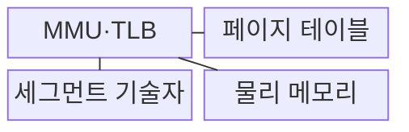
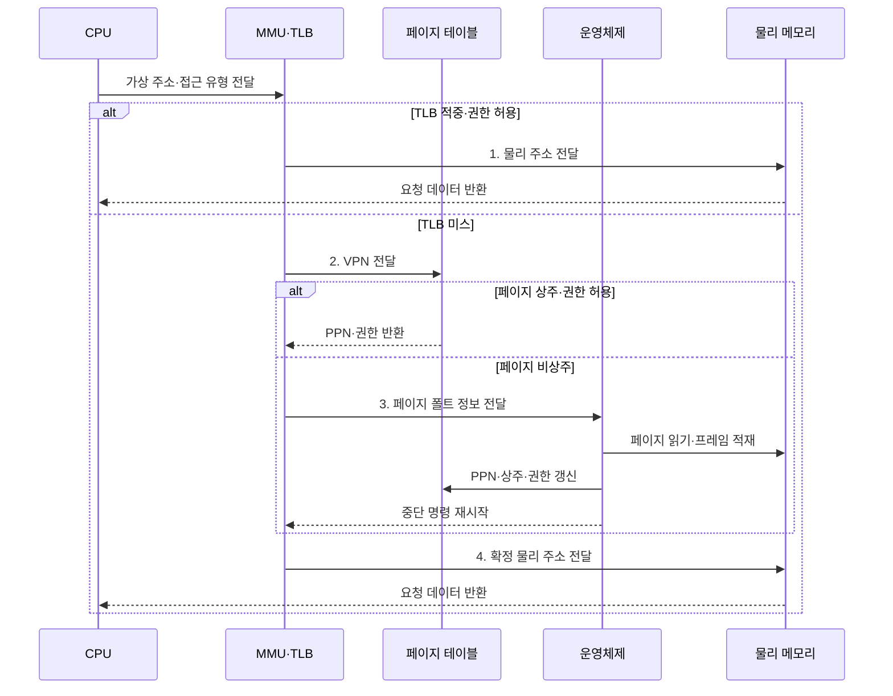

---
sidebar:
  order: 17
  label: "017. 가상 메모리: 페이징·세그멘테이션 (Virtual Memory Paging Segmentation)"
  badge:
    text: "기출 · 70%"
    variant: note
title: "가상 메모리: 페이징·세그멘테이션 (Virtual Memory Paging Segmentation)"
date: "2026-08-02T19:07:00+09:00"
tags:
  - "notes-hardware"
weight: 17
extra:
  question_no: "017"
  source_status: "기출"
  source_history: "120회, 125회, 138회"
  priority: 70
  priority_note: "반복 기출·주소 변환 방식 판별"
---

## Ⅰ. 개요

핵심 용어

- **가상 메모리**: 프로세스별 독립 주소 공간을 물리 프레임에 매핑해 격리와 요구 적재를 제공하는 방식
- **물리 프레임**: 물리 메모리를 페이지와 같은 고정 크기로 나눈 실제 저장 단위
- **페이징•세그멘테이션(Paging•Segmentation)**: 가상 메모리 주소를 고정 크기 페이지•프레임 또는 가변 길이 논리 영역의 기준 주소•한계로 변환하는 방식
- **접근 격리**: 한 프로세스가 권한 없는 다른 프로세스의 물리 메모리를 읽거나 쓰지 못하도록 차단하는 성질

- 정의/개념: 페이징이나 세그멘테이션으로 가상 주소를 **물리 메모리에 매핑**하는 메모리 추상화 방식
- 배경/필요성: 물리 주소 직접 노출은 **프로세스 간 접근 격리** 불가

#### 한줄 요약

- 프로세스가 물리 주소를 직접 사용하면 다른 프로세스의 메모리에 접근할 수 있으므로, 가상 메모리는 프로세스별 주소 공간과 페이지 접근 권한으로 메모리를 격리한다

## Ⅱ. 특징

핵심 용어

- **가상 주소 공간**: 각 프로세스가 독립적으로 사용하는 논리 주소 범위
- **요구 페이징**: 모든 페이지를 미리 올리지 않고 실제 참조 시점에 물리 메모리에 적재하는 방식
- **비상주 페이지**: 주소 공간에는 존재하지만 현재 물리 프레임에 올라와 있지 않은 페이지
- **보조기억장치**: 비상주 페이지를 보관하고 페이지 폴트 때 주기억장치로 읽어 오는 SSD·디스크 등의 저장장치

- 프로세스별 **독립 가상 주소 공간** 으로 접근 격리
- 가상·물리 분리로 **비상주 페이지** 까지 주소화
- 참조 시점에만 프레임을 잡는 **요구 페이징**

#### 한줄 요약

- 프로세스별 가상 주소 공간은 상호 접근을 차단하고, 보조기억장치까지 포함한 주소 공간을 제공하며, 요구 페이징으로 실제 참조하는 페이지만 물리 메모리에 적재한다

## Ⅲ. 구조 및 구성요소

핵심 용어

- **MMU·TLB**: 주소를 변환하고 권한을 검사하며 최근 변환을 캐시하는 하드웨어
- **PTE**: 물리 페이지 번호·상주 여부·접근 권한을 저장하는 페이지 테이블 항목
- **세그먼트 기술자**: 논리 영역의 기준 주소·한계·접근 권한을 저장하는 항목
- **PPN**: 가상 페이지가 매핑된 물리 페이지 프레임을 식별하는 물리 페이지 번호
- **페이지 테이블**: 가상 페이지별 물리 프레임 번호와 상주 상태·접근 권한을 기록하는 자료 구조

| 구성요소 | 책임 |
|:---|:---|
| MMU·TLB | 주소 변환 캐시와 **권한 검사** |
| 페이지 테이블 | **PPN·상주·권한** 제공 |
| 세그먼트 기술자 | **기준·한계·권한** 제공 |
| 물리 메모리 | **물리 프레임 데이터** 제공 |

#### 한줄 요약
- MMU가 페이지 테이블이나 세그먼트 기술자를 조회해 가상 주소를 물리 메모리 위치로 바꾼다.

## Ⅳ. 흐름도

핵심 용어

- **페이지 폴트**: 비상주 페이지 접근을 운영체제에 알려 적재와 매핑 갱신을 요청하는 예외
- **권한 검사**: 읽기·쓰기·실행 접근이 페이지나 세그먼트에 허용됐는지 확인하는 처리
- **명령 재시작**: 페이지 적재와 매핑 갱신 후 중단된 메모리 접근을 다시 실행하는 동작
- **VPN·PPN**: 각각 가상 주소의 페이지 번호와 변환된 물리 페이지 프레임 번호
- **TLB 적중·미스**: 주소 변환을 TLB에서 즉시 찾거나 페이지 테이블을 조회해야 하는 상태

**동작 원리**

- **1. 물리 주소 전달**: 적중 변환으로 메모리 접근
- **2. VPN 전달**: 페이지 테이블에서 PTE 탐색
- **3. 페이지 폴트 정보 전달**: 운영체제의 페이지 적재·PTE 갱신
- **4. 확정 물리 주소 전달**: 중단 명령의 메모리 접근 재시작

#### 한줄 요약

- MMU는 페이징에서는 고정 크기 페이지 테이블을, 세그멘테이션에서는 가변 길이 세그먼트의 기준 주소·한계 정보를 참조하여 주소를 변환한다

## Ⅴ. 종류 및 비교

핵심 용어

- **페이징**: 주소 공간을 고정 크기 페이지로 나눠 비연속 물리 프레임에 배치하는 방식
- **세그멘테이션**: 코드·데이터·스택 같은 가변 논리 영역을 기준 주소와 한계로 변환하는 방식
- **내부·외부 단편화**: 고정 블록 내부의 자투리 낭비와 가변 영역 사이의 흩어진 빈 공간
- **오프셋**: 페이지나 세그먼트 안의 위치를 나타내며 기준 번호나 주소만 변환한 뒤 그대로 더하는 주소 하위 부분

| 주소 변환 방식 | 페이징 | 세그멘테이션 |
|:---|:---|:---|
| 적용 기준 | 범용 **요구 적재** 로 물리 자리를 흩어 쓸 때 | 코드·스택 등 **논리 경계** 별 권한이 갈릴 때 |
| 핵심 특징 | 고정 크기 페이지의 **비연속 프레임** 배치 | 가변 논리 영역의 **기준·한계** 변환 |
| 한계 | 페이지 자투리의 **내부 단편화** | 연속 자리를 못 잡는 **외부 단편화** |

> 요약: 두 방식 모두 상위 필드만 변환하고 **오프셋** 은 그대로 유지

#### 한줄 요약

- 페이징은 VPN을 프레임 번호로 바꿔 비연속 배치하고, 세그멘테이션은 기준 주소에 오프셋을 더해 연속 영역에 배치한다.

## Ⅵ. 실무 고려사항 및 대책

핵심 용어

- **쓰레싱**: 작업 집합보다 프레임이 부족해 계산보다 페이지 입출력에 더 많은 시간을 쓰는 상태
- **주·부 페이지 폴트**: 저장장치 I/O가 필요한 폴트와 메모리 안의 프레임을 매핑만 하는 폴트
- **읽기 전용 공유 프레임**: 여러 프로세스가 같은 라이브러리 코드를 안전하게 함께 쓰도록 쓰기를 금지한 물리 페이지
- **사전 적재·워밍업**: 실제 요청 전에 예상 페이지를 메모리에 올리고 자주 쓰는 경로를 실행해 초기 폴트를 줄이는 방법
- **최소 권한·TLB 무효화**: 필요한 접근 권한만 부여하고 변경된 매핑의 오래된 TLB 변환을 제거하는 보호 절차
- **공유 라이브러리**: 여러 프로세스가 공통으로 사용하는 코드로 읽기 전용 물리 프레임을 함께 매핑할 수 있다.

| 문제 | 대책 | 효과 |
|:---|:---|:---|
| 작업 집합 초과의 **쓰레싱** | **주•부 폴트** 측정과 한도 조정 | 저장장치 **I/O 감소** |
| 초기 구간의 **폴트 폭증** | **사전 적재•워밍업** 조정 | **초기 지연** 완화 |
| 매핑·권한 오류의 **격리 훼손** | **최소 권한•TLB 무효화** 검증 | **메모리 보호** 유지 |
| 페이지·세그먼트 **단편화** | **크기•배치** 와 사용률 관찰 | **메모리 활용률** 개선 |
| 프로세스별 **공유 라이브러리 중복 적재** | **읽기 전용 페이지•공유 프레임** 매핑 | **물리 메모리 사용량** 절감 |

#### 한줄 요약

- 같은 라이브러리를 쓰는 프로세스가 수십 개여도 코드는 고쳐지지 않으므로, 물리 프레임 한 벌만 올려 두고 각 주소 공간에서 그것을 가리키게 하되 쓰기는 막아 서로를 오염시키지 못하게 한다

## Ⅶ. 결론

핵심 용어

- **요구 적재**: 실제 접근한 데이터만 물리 메모리에 올려 공간을 절약하는 운용 방식
- **논리 권한 경계**: 코드·데이터·스택 같은 영역마다 서로 다른 범위와 접근 권한을 적용하는 구분
- **페이징·세그멘테이션**: 각각 고정 크기 페이지의 요구 적재와 가변 논리 영역별 기준·한계·권한 관리를 제공하는 방식

- 요구 적재는 **페이징**, 논리 권한 경계는 **세그멘테이션** 선택

#### 한줄 요약

- 빈자리를 활용하며 필요한 만큼만 올리면 페이징을 선택하고, 영역별 권한과 경계 검사가 목적이면 세그멘테이션을 선택한다.
