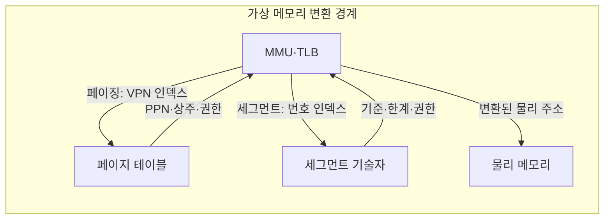

---
sidebar:
  order: 17
  label: "017. 가상 메모리 — 페이징·세그멘테이션 (Virtual Memory Paging Segmentation)"
  badge:
    text: "기출 · 70%"
    variant: note
title: "가상 메모리 — 페이징·세그멘테이션 (Virtual Memory Paging Segmentation)"
date: "2026-07-28T12:44:11+09:00"
tags:
  - "notes-hardware"
weight: 17
extra:
  question_no: "017"
  source_status: "기출"
  source_history: "120회, 125회, 138회"
  priority: 70
  priority_note: "반복 기출·주소 변환 방식 판별"
---

## 미리 알고가기

- **가상 메모리(Virtual Memory)**: 프로세스마다 독립된 가상 주소 공간을 제공하고 이를 물리 프레임으로 변환하여 주소 격리와 요구 적재를 지원하는 메모리 관리 방식
- **가상 주소 공간(Virtual Address Space)**: 한 프로세스가 자기 것이라 믿고 쓰는 독립 주소 범위이며, 실제 물리 메모리보다 넓게 잡을 수도 있다
- **물리 프레임(Physical Frame)**: 물리 메모리를 페이지와 같은 고정 크기로 잘라 둔 자리이며 가상 페이지가 실제로 얹히는 곳이다
- **메모리 관리 장치(Memory Management Unit, MMU)**: 가상 주소를 물리 주소로 변환하고 접근 권한을 검사하는 하드웨어
- **변환 색인 버퍼(Translation Lookaside Buffer, TLB)**: 최근 주소 변환 결과를 저장하여 페이지 테이블 조회를 줄이는 MMU 내부 캐시
- **페이징(Paging)**: 주소 공간을 고정 크기 페이지로 잘라 같은 크기 프레임 아무 곳에나 흩어 얹는 변환 방식
- **세그멘테이션(Segmentation)**: 코드·데이터·스택처럼 용도별 논리 영역을 통째로 두고 기준 주소와 한계로 변환하는 방식
- **가상 페이지 번호(Virtual Page Number, VPN)**: 가상 주소의 상위 비트로 페이지 테이블의 변환 항목을 찾는 번호
- **물리 페이지 번호(Physical Page Number, PPN)**: 주소 변환 결과로 선택된 물리 메모리 프레임의 번호
- **페이지 오프셋(Page Offset)**: 주소의 하위 비트로 페이지 안 위치를 나타내며 변환 없이 그대로 물려 쓴다
- **주소 필드 표기**: 도표의 `VPN | 페이지 오프셋`처럼 세로선은 한 주소를 상위·하위 비트 구간으로 나눠 보여 주는 표기이며, 세로선 왼쪽만 변환되고 오른쪽은 그대로 남는다는 뜻이다
- **페이지 테이블 항목(Page Table Entry, PTE)**: 물리 페이지 번호·상주 여부·접근 권한을 저장하는 주소 변환 항목
- **세그먼트 번호(Segment Number)·세그먼트 기술자(Segment Descriptor)**: 어느 논리 영역인지 고르는 색인과 그 영역의 시작 주소·한계·권한을 담은 항목이며, 물리 주소는 기준 주소에 오프셋을 더해 만든다
- **접근 권한(Access Permission)**: 그 페이지나 세그먼트에 허용된 읽기·쓰기·실행 종류이며 MMU가 변환과 동시에 검사한다
- **상주(Resident)·비상주(Non-resident)**: 페이지가 지금 물리 프레임에 올라와 있으면 상주, 저장장치로 내려가 있어 다시 올려야 하면 비상주다
- **요구 페이징(Demand Paging)**: 미리 다 올리지 않고 실제로 참조된 페이지만 그때 프레임에 올리는 방식
- **페이지 폴트(Page Fault)**: 비상주 페이지를 건드려 그 명령을 멈추고 운영체제에 적재를 맡기는 예외이며, 처리 후 같은 명령을 다시 실행한다
- **보호 예외(Protection Exception)**: 아예 매핑이 없거나 범위·권한을 어긴 접근에서 발생해 그 접근을 끝내는 예외
- **작업 집합(Working Set)**: 지금 프로세스가 반복해 참조하는 페이지 묶음이며, 이것이 확보된 프레임보다 크면 올린 페이지가 바로 다시 밀려난다
- **쓰레싱(Thrashing)**: 그 밀려남이 되풀이되어 실제 계산보다 페이지를 올렸다 내렸다 하는 시간이 더 커진 상태
- **내부 단편화(Internal Fragmentation)**: 고정 크기 페이지의 마지막 자투리가 비어 버려 생기는 낭비
- **외부 단편화(External Fragmentation)**: 가변 크기 영역 사이사이에 작은 빈틈이 흩어져 총합은 충분한데 연속 자리를 못 잡는 현상
- **공유 라이브러리(Shared Library)**: 여러 프로세스가 함께 쓰는 코드 묶음이며 같은 물리 프레임을 각 주소 공간에 겹쳐 매핑해 메모리를 아낀다
- **읽기 전용 페이지(Read-only Page)**: 읽기만 허용하고 쓰기를 막아 여러 프로세스가 같은 코드 프레임을 안전하게 공유하게 하는 단위

## Ⅰ. 개요

- 정의/개념: 가상 주소를 **물리 프레임**에 매핑해 격리·요구 적재를 제공하는 방식
- 기존 한계: 물리 주소 직접 사용은 프로세스 **격리·재배치** 제약

### 쉽게 이해하기 (학습용)

- 프로세스가 물리 주소를 직접 사용하면 다른 프로세스의 메모리에 접근할 수 있으므로, 가상 메모리는 프로세스별 주소 공간과 페이지 접근 권한으로 메모리를 격리한다

## Ⅱ. 특징

- 프로세스별 **독립 가상 주소 공간**으로 접근 격리
- 가상·물리 분리로 **비상주 페이지**까지 주소화
- 참조 시점에만 프레임을 잡는 **요구 페이징**

### 쉽게 이해하기 (학습용)

- 프로세스별 가상 주소 공간은 상호 접근을 차단하고, 보조기억장치까지 포함한 주소 공간을 제공하며, 요구 페이징으로 실제 참조하는 페이지만 물리 메모리에 적재한다

## Ⅲ. 아키텍처 및 구성요소

| 설계 요소 | 입력·상태 | 역할 |
|:---|:---|:---|
| MMU·TLB | 가상 주소·최근 변환 | 주소 분해·변환 캐시·권한 검사 |
| 페이지 테이블 | VPN | PPN·상주·권한 제공 |
| 세그먼트 기술자 | 세그먼트 번호 | 기준·한계·권한 제공 |
| 물리 메모리 | 변환된 물리 주소 | 물리 프레임 데이터 제공 |

> 요약: **MMU**가 두 변환 표 중 하나를 조회해 물리 주소 확정

### 쉽게 이해하기 (학습용)

- MMU는 페이징에서는 고정 크기 페이지 테이블을, 세그멘테이션에서는 가변 길이 세그먼트의 기준 주소·한계 정보를 참조하여 주소를 변환한다

## Ⅳ. 운영 고려사항

| 운영 위험 | 대응 | 기대 효과 |
|:---|:---|:---|
| 작업 집합이 프레임을 초과해 쓰레싱 발생 | 주요·부 페이지 폴트와 작업 집합을 측정하고 메모리 한도 조정 | 불필요한 저장장치 I/O 감소 |
| 요구 페이징 초기 구간의 폴트 폭증 | 사전 적재·워밍업 범위를 워크로드별 조정 | 초기 지연 완화 |
| 잘못된 매핑·권한으로 격리 훼손 | 최소 권한과 매핑 변경 시 TLB 무효화 검증 | 메모리 보호 유지 |
| 페이지 내부 또는 세그먼트 외부 단편화 | 페이지 크기·세그먼트 배치와 실제 사용률 관찰 | 메모리 활용률 개선 |

### 쉽게 이해하기 (학습용)

- 페이지 폴트가 복구 가능한 비상주인지, 종료해야 할 미매핑·권한 위반인지 먼저 구분한다

## Ⅴ. 종류 및 비교

| 주소 변환 방식 | 페이징 | 세그멘테이션 |
|:---|:---|:---|
| 적용 기준 | 범용 **요구 적재**로 물리 자리를 흩어 쓸 때 | 코드·스택 등 **논리 경계**별 권한이 갈릴 때 |
| 핵심 특징 | 고정 크기 페이지의 **비연속 프레임** 배치 | 가변 논리 영역의 **기준·한계** 변환 |
| 한계 | 페이지 자투리의 **내부 단편화** | 연속 자리를 못 잡는 **외부 단편화** |

> 요약: 두 방식 모두 상위 필드만 변환하고 **오프셋**은 그대로 유지

### 쉽게 이해하기 (학습용)

- 두 상자를 나란히 놓고 보면 오른쪽 끝 오프셋이 양쪽 다 손대지 않고 넘어간다는 공통점이 먼저 보이고, 갈리는 것은 왼쪽을 표에서 찾아 통째로 바꿔 끼우느냐 시작 주소를 받아 더하느냐뿐이라 페이징은 빈 프레임 아무 데나 얹을 수 있고 세그멘테이션은 반드시 연속된 자리를 잡아야 한다

## Ⅵ. 실무 사례

1. 공유 라이브러리는 **읽기 전용 페이지**를 프로세스별 공동 매핑

### 쉽게 이해하기 (학습용)

- 같은 라이브러리를 쓰는 프로세스가 수십 개여도 코드는 고쳐지지 않으므로, 물리 프레임 한 벌만 올려 두고 각 주소 공간에서 그것을 가리키게 하되 쓰기는 막아 서로를 오염시키지 못하게 한다

## Ⅶ. 결론

- 메모리 추상화를 위해 배치·논리 경계를 검토하여 **가상 메모리** 활용

### 쉽게 이해하기 (학습용)

- 빈자리를 아무 데나 주워 쓰며 필요한 만큼만 올리는 것이 목적이면 같은 크기로 잘라 흩는 쪽을 고르고, 코드와 스택처럼 영역마다 권한을 다르게 걸고 경계를 넘는 접근을 잡아내는 것이 목적이면 시작과 길이를 적어 두는 쪽을 고른다
