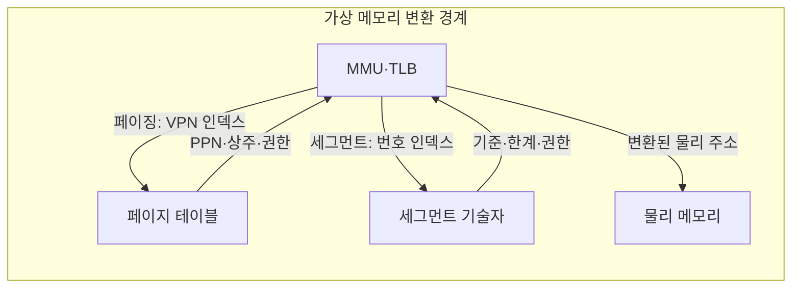
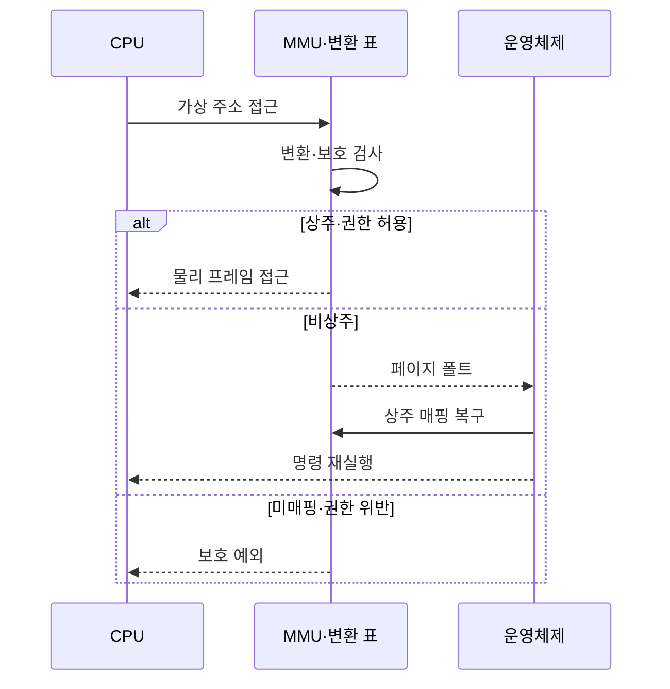
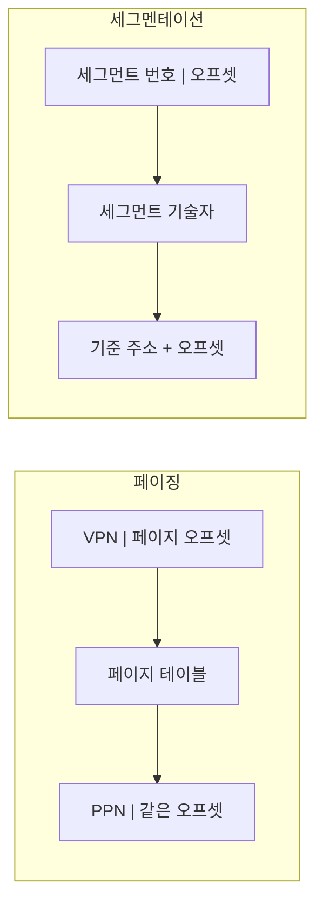

---
sidebar:
  order: 17
  label: "017. 가상 메모리 — 페이징·세그멘테이션 (Virtual Memory Paging Segmentation)"
  badge:
    text: "기출 · 70%"
    variant: note
title: "가상 메모리 — 페이징·세그멘테이션 (Virtual Memory Paging Segmentation)"
date: "2026-07-27T23:59:59+09:00"
tags:
  - "notes-hardware"
weight: 17
extra:
  question_no: "017"
  source_status: "기출"
  source_history: "120회, 125회, 138회"
  priority: 70
  priority_note: "반복 기출·주소 변환 방식 판별"
---

## 미리 알고가기

- **가상 메모리(Virtual Memory)**: 세입자마다 101호부터 시작하는 자기 호수를 쓰게 해 놓고 관리소가 그 호수를 실제 건물의 방이나 지하 창고 자리로 바꿔 주듯, 프로세스마다 독립된 가상 주소를 주고 그것을 물리 프레임으로 바꿔 격리와 요구 적재를 함께 얻는 방식
- **가상 주소 공간(Virtual Address Space)**: 한 프로세스가 자기 것이라 믿고 쓰는 독립 주소 범위이며, 실제 물리 메모리보다 넓게 잡을 수도 있다
- **물리 프레임(Physical Frame)**: 물리 메모리를 페이지와 같은 고정 크기로 잘라 둔 자리이며 가상 페이지가 실제로 얹히는 곳이다
- **메모리 관리 장치(Memory Management Unit, MMU)**: ‘엠엠유’로 읽고 영문 머리글자를 딴 약어이며, 가상 주소 변환과 접근 권한 검사를 수행하는 하드웨어다
- **변환 색인 버퍼(Translation Lookaside Buffer, TLB)**: ‘티엘비’로 읽고 영문 머리글자를 딴 약어이며, 최근 주소 변환을 저장하는 MMU 내부 캐시다
- **페이징(Paging)**: 주소 공간을 고정 크기 페이지로 잘라 같은 크기 프레임 아무 곳에나 흩어 얹는 변환 방식
- **세그멘테이션(Segmentation)**: 코드·데이터·스택처럼 용도별 논리 영역을 통째로 두고 기준 주소와 한계로 변환하는 방식
- **가상 페이지 번호(Virtual Page Number, VPN)**: ‘브이피엔’으로 읽고 영문 머리글자를 딴 약어이며, 가상 주소 상위 비트로 페이지 테이블 색인이 된다
- **물리 페이지 번호(Physical Page Number, PPN)**: ‘피피엔’으로 읽고 영문 머리글자를 딴 약어이며, 변환 결과인 물리 프레임 번호다
- **페이지 오프셋(Page Offset)**: 주소의 하위 비트로 페이지 안 위치를 나타내며 변환 없이 그대로 물려 쓴다
- **주소 필드 표기**: 도표의 `VPN | 페이지 오프셋`처럼 세로선은 한 주소를 상위·하위 비트 구간으로 나눠 보여 주는 표기이며, 세로선 왼쪽만 변환되고 오른쪽은 그대로 남는다는 뜻이다
- **페이지 테이블 항목(Page Table Entry, PTE)**: ‘피티이’로 읽고 영문 머리글자를 딴 약어이며, PPN·상주 여부·접근 권한을 담는 변환 항목이다
- **세그먼트 번호(Segment Number)·세그먼트 기술자(Segment Descriptor)**: 어느 논리 영역인지 고르는 색인과 그 영역의 시작 주소·한계·권한을 담은 항목이며, 물리 주소는 기준 주소에 오프셋을 더해 만든다
- **접근 권한(Access Permission)**: 그 페이지나 세그먼트에 허용된 읽기·쓰기·실행 종류이며 MMU가 변환과 동시에 검사한다
- **상주(Resident)·비상주(Non-resident)**: 페이지가 지금 물리 프레임에 올라와 있으면 상주, 저장장치로 내려가 있어 다시 올려야 하면 비상주다
- **요구 페이징(Demand Paging)**: 미리 다 올리지 않고 실제로 참조된 페이지만 그때 프레임에 올리는 방식
- **페이지 폴트(Page Fault)**: 비상주 페이지를 건드려 그 명령을 멈추고 운영체제에 적재를 맡기는 예외이며, 처리 후 같은 명령을 다시 실행한다
- **보호 예외(Protection Exception)**: 아예 매핑이 없거나 범위·권한을 어긴 접근에서 발생해 그 접근을 끝내는 예외
- **작업 집합(Working Set)**: 지금 프로세스가 반복해 참조하는 페이지 묶음이며, 이것이 확보된 프레임보다 크면 올린 페이지가 바로 다시 밀려난다
- **쓰레싱(Thrashing)**: 그 밀려남이 되풀이되어 실제 계산보다 페이지를 올렸다 내렸다 하는 시간이 더 커진 상태
- **내부 단편화(Internal Fragmentation)**: 고정 크기 페이지의 마지막 자투리가 비어 버려 생기는 낭비
- **외부 단편화(External Fragmentation)**: 가변 크기 영역 사이사이에 작은 빈틈이 흩어져 총합은 충분한데 연속 자리를 못 잡는 현상
- **공유 라이브러리(Shared Library)**: 여러 프로세스가 함께 쓰는 코드 묶음이며 같은 물리 프레임을 각 주소 공간에 겹쳐 매핑해 메모리를 아낀다
- **읽기 전용 페이지(Read-only Page)**: 읽기만 허용하고 쓰기를 막아 여러 프로세스가 같은 코드 프레임을 안전하게 공유하게 하는 단위

## Ⅰ. 개요

- 정의/개념: 가상 주소를 **물리 프레임**에 매핑해 격리·요구 적재를 제공하는 방식
- 기존 한계: 물리 주소 직접 사용은 프로세스 **격리·재배치** 제약

### 쉽게 이해하기 (학습용)

- 세입자들이 실제 방 번호를 그대로 들고 다니면 남의 방 번호를 적어 넣는 순간 그 방 짐을 헤집을 수 있고 방이 꽉 차면 새 세입자를 아예 못 받는데, 답안이 배경 자리에 이 격리 불가를 적은 이유는 가상 메모리가 메모리를 넓혀 주는 기술이기 이전에 남의 메모리를 못 건드리게 만드는 기술이기 때문이다

## Ⅱ. 특징

- 프로세스별 **독립 가상 주소 공간**으로 접근 격리
- 가상·물리 분리로 **비상주 페이지**까지 주소화
- 참조 시점에만 프레임을 잡는 **요구 페이징**

### 쉽게 이해하기 (학습용)

- 세입자마다 101호부터 시작하는 자기 호수표를 주면 남의 호수를 부를 방법 자체가 없어 격리가 공짜로 따라오고, 관리소 장부에 창고 자리까지 호수로 적어 둘 수 있어 방보다 많은 짐을 주소로 부를 수 있으며, 실제로 찾는 짐만 그때 방으로 올려 놓으므로 안 쓰는 짐이 방을 차지하지 않는다

## Ⅲ. 아키텍처 및 구성요소

| 설계 요소 | 설명 |
|:---|:---|
| MMU·TLB | 주소 분해와 **변환 캐시**·권한 검사 수행 |
| 페이지 테이블 | VPN 색인으로 **PPN·상주·권한** 조회 |
| 세그먼트 기술자 | 세그먼트 번호로 **기준·한계·권한** 조회 |
| 물리 메모리 | 변환된 주소의 **물리 프레임** 제공 |

> 요약: **MMU**가 두 변환 표 중 하나를 조회해 물리 주소 확정

### 쉽게 이해하기 (학습용)

- 가운데 MMU에서 화살표가 위아래 두 표로 각각 뻗고 다시 돌아오는 모양이 이 절의 요지인데, 관리소 자체는 같고 참조하는 장부가 같은 크기 방 배치표냐 용도별 구역 기준표냐만 갈리므로 두 방식은 부품을 새로 만드는 것이 아니라 장부를 바꿔 끼우는 관계다

## Ⅳ. 원리 및 절차 흐름도

| 절차 | 설명 |
|:---|:---|
| 가상 주소 접근 | **VPN**·오프셋 또는 세그먼트 번호·오프셋 제출 |
| 변환·보호 검사 | TLB·변환 표로 상주·범위·**접근 권한** 확인 |
| 물리 프레임 접근 | **PPN**과 오프셋 결합으로 프레임 도달 |
| 페이지 폴트 | **비상주** 판정 시 운영체제로 처리 위임 |
| 상주 매핑 복구 | 프레임 확보·페이지 적재 후 **PTE** 갱신 |
| 명령 재실행 | 중단 지점부터 **주소 변환** 재시도 |
| 보호 예외 | 미매핑·범위·권한 위반의 **접근 종료** |

> 요약: 비상주는 **재실행**으로 복구되고 권한 위반만 즉시 종료

### 쉽게 이해하기 (학습용)

- 두 갈래가 정반대로 끝나는 것이 이 절의 핵심인데, 짐이 창고에 있을 뿐이면 방으로 옮겨 놓고 아까 그 요청을 처음부터 다시 시켜 아무 일 없었던 듯 진행되지만 애초에 그 호수를 쓸 자격이 없었으면 다시 시켜도 같은 결과이므로 그 자리에서 끊는다

## Ⅴ. 종류 및 비교

| 주소 변환 방식 | 페이징 | 세그멘테이션 |
|:---|:---|:---|
| 적용 기준 | 범용 **요구 적재**로 물리 자리를 흩어 쓸 때 | 코드·스택 등 **논리 경계**별 권한이 갈릴 때 |
| 핵심 특징 | 고정 크기 페이지의 **비연속 프레임** 배치 | 가변 논리 영역의 **기준·한계** 변환 |
| 한계 | 페이지 자투리의 **내부 단편화** | 연속 자리를 못 잡는 **외부 단편화** |

> 요약: 두 방식 모두 상위 필드만 변환하고 **오프셋**은 그대로 유지

### 쉽게 이해하기 (학습용)

- 두 상자를 나란히 놓고 보면 오른쪽 끝 오프셋이 양쪽 다 손대지 않고 넘어간다는 공통점이 먼저 보이고, 갈리는 것은 왼쪽을 표에서 찾아 통째로 바꿔 끼우느냐 시작 주소를 받아 더하느냐뿐이라 페이징은 빈 프레임 아무 데나 얹을 수 있고 세그멘테이션은 반드시 연속된 자리를 잡아야 한다

## Ⅵ. 실무 사례

1. 공유 라이브러리는 **읽기 전용 페이지**를 프로세스별 공동 매핑
2. 과부하 서버는 동시 실행 수 축소로 **쓰레싱** 완화

### 쉽게 이해하기 (학습용)

- 같은 라이브러리를 쓰는 프로세스가 수십 개여도 코드는 고쳐지지 않으므로, 물리 프레임 한 벌만 올려 두고 각 주소 공간에서 그것을 가리키게 하되 쓰기는 막아 서로를 오염시키지 못하게 한다
- 프로세스를 더 띄울수록 처리량이 오르다가 어느 지점부터 급락하는데, 각자의 작업 집합 합이 물리 프레임을 넘겨 서로의 페이지를 밀어내기 시작한 것이므로 동시 실행 수를 줄여 각자 몫을 확보해 준다

## Ⅶ. 결론

- 물리 자리를 흩어 쓰면 **페이징**, 논리 경계 보호면 **세그멘테이션**

### 쉽게 이해하기 (학습용)

- 빈자리를 아무 데나 주워 쓰며 필요한 만큼만 올리는 것이 목적이면 같은 크기로 잘라 흩는 쪽을 고르고, 코드와 스택처럼 영역마다 권한을 다르게 걸고 경계를 넘는 접근을 잡아내는 것이 목적이면 시작과 길이를 적어 두는 쪽을 고른다
