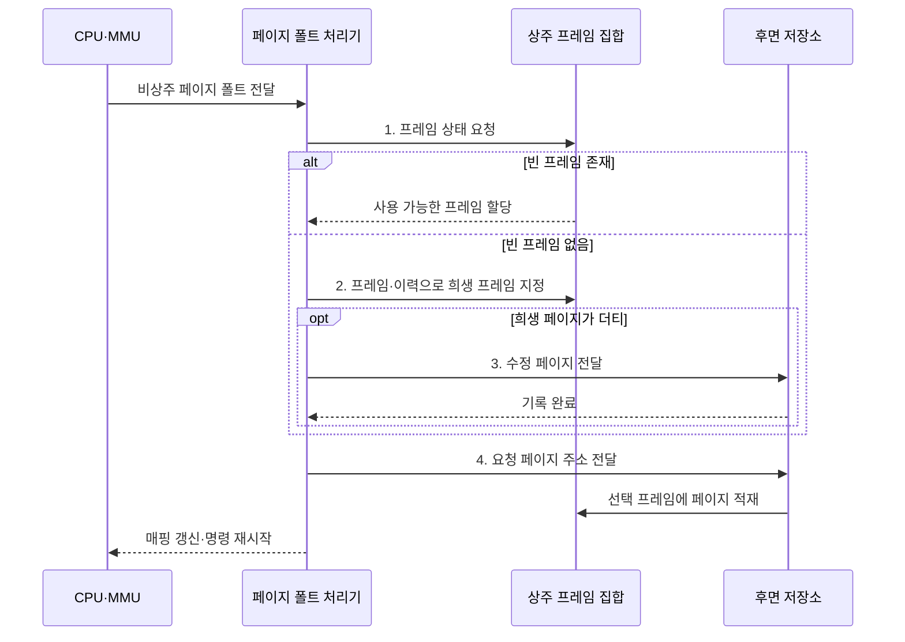

---
sidebar:
  order: 18
  label: "018. 페이지 교체 알고리즘: OPT·FIFO·LRU·LFU (Page Replacement)"
  badge:
    text: "미출 · 50%"
    variant: note
title: "페이지 교체 알고리즘: OPT·FIFO·LRU·LFU (Page Replacement)"
date: "2026-08-02T19:08:00+09:00"
tags:
  - "notes-hardware"
weight: 18
extra:
  question_no: "018"
  source_status: "미출"
  source_history: ""
  priority: 50
  priority_note: "교체 기법 선택과 벨라디 이상 비교"
---

## Ⅰ. 개요

핵심 용어

- **페이지 교체**: 빈 물리 프레임이 없을 때 희생 페이지를 선택해 요청 페이지의 공간을 확보하는 정책
- **희생 페이지**: 새 페이지를 적재할 프레임을 만들기 위해 퇴출하는 기존 페이지

- 정의/개념: 프레임 포화 시 **희생 페이지 선택** 정책
- 배경/필요성: 무작위 퇴출은 재참조 페이지 제거로 **폴트•I/O 증가**

#### 한줄 요약

- 가득 찬 책장에서 다시 볼 가능성이 낮은 책을 치우되 메모가 있으면 먼저 보관한다

## Ⅱ. 특징

핵심 용어

- **참조 지역성**: 최근 또는 반복 참조한 페이지를 가까운 미래에 다시 사용할 가능성이 높은 성질
- **참조 이력**: 적재 순서·최근 참조 시각·횟수·참조 비트 등 교체 판단에 쓰는 정보
- **더티 페이지**: 메모리에서 수정돼 퇴출 전에 후면 저장소에 기록해야 하는 페이지

- **지역성 이력**에 따른 재사용 가능성이 낮은 희생 페이지 선택
- 정교한 이력의 **교체 예측력·갱신 비용** 동시 증가
- 참조 순서에 따른 **폴트 수**, 더티 비율에 따른 저장장치 쓰기 증가

#### 한줄 요약

- 앞으로 볼 책을 모르므로 기록이 자세할수록 선택은 좋아지지만 관리가 늘어난다

## Ⅲ. 구조 및 구성요소

핵심 용어

- **상주 프레임 집합**: 현재 프로세스의 페이지가 적재된 물리 프레임 묶음
- **교체 선택기**: 정책과 참조 이력에 따라 희생 페이지를 결정하는 운영체제 구성요소
- **후면 저장소**: 비상주 페이지를 보관하고 더티 페이지를 기록하는 저장장치 영역

| 구성요소 | 책임 |
|:---|:---|
| 상주 프레임 집합 | 현재 **페이지·더티 상태** 제공 |
| 참조 이력 | 적재·최근·횟수·비트 **판단 근거** 제공 |
| 교체 선택기 | 정책에 따른 **희생 페이지** 결정 |
| 저장소 I/O | 더티 기록과 **요청 페이지 적재** |

#### 한줄 요약
- 프레임과 참조 이력으로 희생 페이지를 고르고 저장소 I/O가 변경분 기록과 새 페이지 적재를 수행한다.

## Ⅳ. 흐름도

핵심 용어

- **페이지 폴트 처리기**: 비상주 접근을 받아 프레임 확보·페이지 적재·매핑 갱신을 수행하는 운영체제 루틴
- **프레임 매핑**: 가상 페이지와 물리 프레임의 대응 관계
- **원자 갱신**: 중간의 불일치 상태가 외부에 보이지 않도록 PTE와 프레임 정보를 한 단위로 변경하는 처리

**동작 원리**

- **1. 프레임 상태 요청**: 즉시 사용 공간 확인
- **2. 희생 프레임 지정**: 프레임·이력에 교체 정책을 적용해 대상 결정
- **3. 수정 페이지 전달**: 더티값을 후면 저장소에 기록
- **4. 요청 페이지 주소 전달**: 후면 저장소의 페이지 조회

#### 한줄 요약

- 페이지 목록과 참조 기록으로 희생 페이지를 선택하고 변경 페이지는 보조기억장치에 기록한다

## Ⅴ. 종류 및 비교

핵심 용어

- **OPT·FIFO**: 미래에 가장 늦게 참조될 페이지 또는 가장 먼저 적재된 페이지를 퇴출하는 정책
- **LRU·LFU**: 가장 오래 참조하지 않았거나 참조 횟수가 가장 적은 페이지를 퇴출하는 정책
- **벨라디 이상**: FIFO에서 프레임 수를 늘렸는데도 페이지 폴트가 증가할 수 있는 현상

| 판단 기준 | OPT | FIFO | LRU | LFU |
|:---|:---|:---|:---|:---|
| 적용 기준 | **오프라인 최적 폴트** 기준 | 최소 **추적 비용** | 강한 **시간 지역성** | 안정적 **반복 빈도** |
| 핵심 특징 | 가장 늦은 **미래 참조** | 가장 이른 **적재 순서** | 가장 오래된 **최근 참조** | 가장 낮은 **참조 횟수** |
| 한계 | **미래 참조** 확인 불가 | **벨라디 이상** | **최근성 갱신 비용** | **과거 횟수 잔존** |

> 요약: **OPT•FIFO•LRU•LFU** 비교로 정책 선택

#### 한줄 요약

- OPT와 비교해 부하에 맞는 참조 기준을 선택한다

## Ⅵ. 실무 고려사항 및 대책

핵심 용어

- **Clock 알고리즘**: 참조 비트와 원형 포인터로 최근 사용 페이지를 한 차례 보호하는 LRU 근사
- **재사용 거리**: 같은 페이지의 두 참조 사이에 접근한 서로 다른 페이지 수
- **쓰레싱**: 프레임 부족으로 같은 페이지를 반복 퇴출·재적재하며 I/O가 급증하는 상태

| 문제 | 대책 | 효과 |
|:---|:---|:---|
| 워크로드 변화로 **페이지 폴트율 상승** | 정책별 **폴트율•재사용 거리** 비교 | 적합한 **교체 정책** 선택 |
| 더티 페이지 퇴출로 **쓰기 지연 증가** | **백그라운드 기록•더티 비율** 조정 | **동기 I/O 지연** 완화 |
| 정확한 **LRU•LFU 이력 비용** 증가 | **Clock•샘플링**과 카운터 감쇠 적용 | 재사용 예측을 유지하며 **이력 갱신 비용** 감소 |
| 프레임 부족으로 **쓰레싱 발생** | **작업 집합•프레임 한도** 조정 | **반복 퇴출•재적재** 감소 |
| 퇴출·적재 후 **PTE 매핑 불일치** | **PTE•프레임 매핑** 원자 갱신 | **주소 변환 정확성** 확보 |

> Clock은 참조 비트로 **LRU를 저비용 근사**

#### 한줄 요약

- 폴트율·더티 쓰기·이력 비용을 함께 측정하고, Clock의 참조 비트로 최근 페이지를 한 차례 보호한다.

## Ⅶ. 결론

핵심 용어

- **시간 지역성**: 최근 참조한 페이지를 다시 사용할 가능성이 높은 접근 특성
- **반복 빈도**: 일정 기간 페이지가 참조된 횟수로 장기적으로 자주 쓰는 페이지를 구분하는 기준

- 시간 지역성은 **LRU•Clock**, 반복 빈도는 **LFU** 선택

#### 한줄 요약

- 실제 이용 습관과 기록 비용에 맞는 규칙을 선택한다
