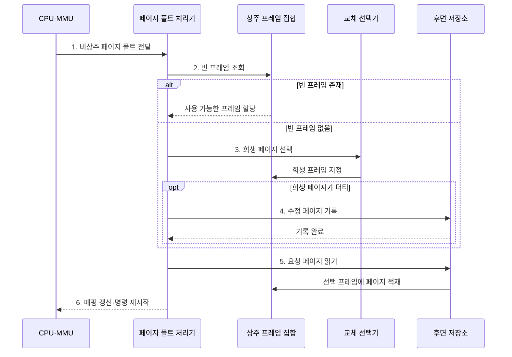

---
sidebar:
  order: 18
  label: "018. 페이지 교체 알고리즘: OPT·FIFO·LRU·LFU (Page Replacement)"
  badge:
    text: "미출 · 50%"
    variant: note
title: "페이지 교체 알고리즘: OPT·FIFO·LRU·LFU (Page Replacement)"
date: "2026-07-28T12:44:37+09:00"
tags:
  - "notes-hardware"
weight: 18
extra:
  question_no: "018"
  source_status: "미출"
  source_history: ""
  priority: 50
  priority_note: "교체 기법 선택과 벨라디 이상 비교"
---

## 미리 알고가기

- **페이지 교체(Page Replacement)**: 빈 프레임이 없을 때 희생 페이지를 선택해 요청 페이지 공간을 확보하는 정책
- **희생 페이지(Victim Page)**: 요청 페이지 공간을 위해 퇴출할 페이지
- **참조 지역성(Reference Locality)**: 최근·반복 참조 페이지를 다시 찾는 성질
- **수정 페이지(Dirty Page)**: 퇴출 전 후면 저장소에 기록할 페이지
- **최적 페이지 교체(Optimal Page Replacement, OPT)**: 미래에 가장 늦게 다시 참조될 페이지를 퇴출하는 비교 기준
- **선입선출(First In, First Out, FIFO)**: 가장 먼저 적재한 페이지부터 퇴출하는 정책
- **최소 최근 사용(Least Recently Used, LRU)**: 가장 오래 참조하지 않은 페이지를 퇴출하는 정책
- **최소 빈도 사용(Least Frequently Used, LFU)**: 참조 횟수가 가장 적은 페이지를 퇴출하는 정책
- **벨라디 이상(Belady's Anomaly)**: FIFO의 프레임 증가에도 폴트가 늘어나는 현상
- **클록(Clock) 알고리즘**: 참조 비트·원형 포인터로 LRU 근사
- **운영체제(Operating System, OS)**: 메모리·프로세스·장치를 관리하고 페이지 교체를 수행하는 소프트웨어
- **페이지 폴트(Page Fault)**: 요청한 가상 페이지가 물리 프레임에 없어 운영체제가 저장장치에서 적재해야 하는 동기 예외로 교체 정책이 줄이려는 비용
- **후면 저장소(Backing Store)**: 물리 메모리에 상주하지 않는 페이지를 보관하는 저장장치 영역으로 더티 페이지를 기록하고 요청 페이지를 읽는 대상
- **상주 프레임 집합(Resident Frame Set)**: 현재 프로세스의 페이지가 적재된 물리 프레임 묶음으로 빈 프레임이 없으면 희생 페이지를 선택
- **참조 이력(Reference History)**: 페이지의 적재 순서·최근 참조 시각·참조 횟수·참조 비트를 기록한 정보로 정책별 희생 선택 기준
- **참조 비트(Reference Bit)**: 페이지가 최근 접근됐는지를 나타내는 비트로 Clock 알고리즘이 1이면 지우고 한 차례 퇴출을 유예
- **원형 포인터(Circular Pointer)**: 프레임 목록의 끝에서 처음으로 돌아가며 순환하는 위치 표시자로 Clock 알고리즘이 다음 검사 대상을 가리킴
- **시간 지역성(Temporal Locality)**: 최근 참조한 페이지를 가까운 미래에 다시 참조할 가능성이 높은 성질로 LRU·Clock이 재사용을 예측하는 근거
- **오프라인 최적 기준(Offline Optimal Baseline)**: 전체 미래 참조열을 미리 아는 조건에서 계산한 최소 페이지 폴트 수로 실제 알고리즘의 성능을 비교하는 기준
- **페이지 테이블 항목(Page Table Entry, PTE)**: 물리 프레임 번호·상주·권한 상태를 담는 항목
- **입출력(Input/Output, I/O)**: 메모리와 저장장치 사이에서 데이터를 이동하는 작업
- **프레임 매핑(Frame Mapping)**: 가상 페이지와 물리 프레임의 대응 관계로 퇴출·적재 뒤 PTE를 갱신해 주소 변환에 반영

## Ⅰ. 개요

- 정의/개념: 프레임 포화 시 **희생 페이지 선택** 정책
- 배경/필요성: 불필요한 **페이지 폴트·저장장치 I/O** 감소

### 쉽게 이해하기 (학습용)

- 가득 찬 책장에서 다시 볼 가능성이 낮은 책을 치우되 메모가 있으면 먼저 보관한다

## Ⅱ. 특징

- 지역성 이력으로 재사용 가능성이 낮은 쪽을 버린다
- 자세한 이력은 예측력과 갱신 비용을 함께 높인다
- 참조 순서는 같은 프레임의 폴트 수를 바꾼다
- 더티 희생 페이지는 저장장치 쓰기를 추가한다

### 쉽게 이해하기 (학습용)

- 앞으로 볼 책을 모르므로 기록이 자세할수록 선택은 좋아지지만 관리가 늘어난다

## Ⅲ. 구조 및 구성요소

| 구성요소 | 책임 |
|:---|:---|
| 상주 프레임 집합 | 현재 **페이지·더티 상태** 제공 |
| 참조 이력 | 적재·최근·횟수·비트 **판단 근거** 제공 |
| 교체 선택기 | 정책에 따른 **희생 페이지** 결정 |
| 저장소 I/O | 더티 기록과 **요청 페이지 적재** |

### 쉽게 이해하기 (학습용)
- 프레임과 참조 이력으로 희생 페이지를 고르고 저장소 I/O가 변경분 기록과 새 페이지 적재를 수행한다.

## Ⅳ. 흐름도

**동작 원리**

- **1. 비상주 페이지 폴트 전달**: OS로 제어 전환
- **2. 빈 프레임 조회**: 즉시 사용 공간 확인
- **3. 희생 페이지 선택**: 정책·이력 기반 결정
- **4. 수정 페이지 기록**: 더티값 저장
- **5. 요청 페이지 읽기**: 후면 저장소 조회
- **6. 매핑 갱신·명령 재시작**: PTE 반영·재실행

### 쉽게 이해하기 (학습용)

- 페이지 목록과 참조 기록으로 희생 페이지를 선택하고 변경 페이지는 보조기억장치에 기록한다

## Ⅴ. 종류 및 비교

| 판단 기준 | OPT | FIFO | LRU | LFU |
|:---|:---|:---|:---|:---|
| 적용 기준 | 오프라인 최적 폴트 기준 | 최소한의 추적 비용 | 강한 시간 지역성 | 안정적인 반복 빈도 |
| 핵심 특징 | 가장 늦은 미래 참조 | 가장 이른 적재 | 가장 오래된 참조 | 가장 낮은 참조 횟수 |
| 한계 | 미래 참조 확인 불가 | **벨라디 이상** | 최근성 갱신 비용 | 과거 횟수 잔존 |

### 쉽게 이해하기 (학습용)

- OPT와 비교해 부하에 맞는 참조 기준을 선택한다

## Ⅵ. 실무 고려사항 및 대책

| 고려사항 | 대책 | 효과 |
|:---|:---|:---|
| 워크로드 변화로 페이지 폴트율 상승 | 정책별 폴트율과 재사용 거리를 비교 | 적합한 교체 정책 선택 |
| 더티 페이지 퇴출로 쓰기 지연 증가 | 백그라운드 기록과 더티 비율 임계치 조정 | 동기 I/O 지연 완화 |
| 정확한 LRU·LFU 이력 관리 비용 증가 | Clock·샘플링·카운터 감쇠 적용 | 예측력과 관리 비용 균형 |
| 프레임 부족으로 쓰레싱 발생 | 작업 집합 관찰과 프레임 할당·메모리 한도 조정 | 반복 퇴출·재적재 감소 |

> Clock은 참조 비트로 **LRU를 저비용 근사**

### 쉽게 이해하기 (학습용)

- 폴트율·더티 쓰기·이력 비용을 함께 측정하고, Clock의 참조 비트로 최근 페이지를 한 차례 보호한다.

## Ⅶ. 결론

- **폴트율·더티 쓰기·이력 비용** 기반 교체 정책 선택

### 쉽게 이해하기 (학습용)

- 실제 이용 습관과 기록 비용에 맞는 규칙을 선택한다
