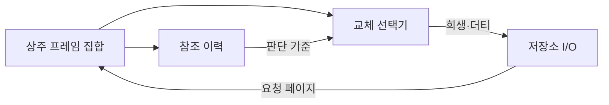
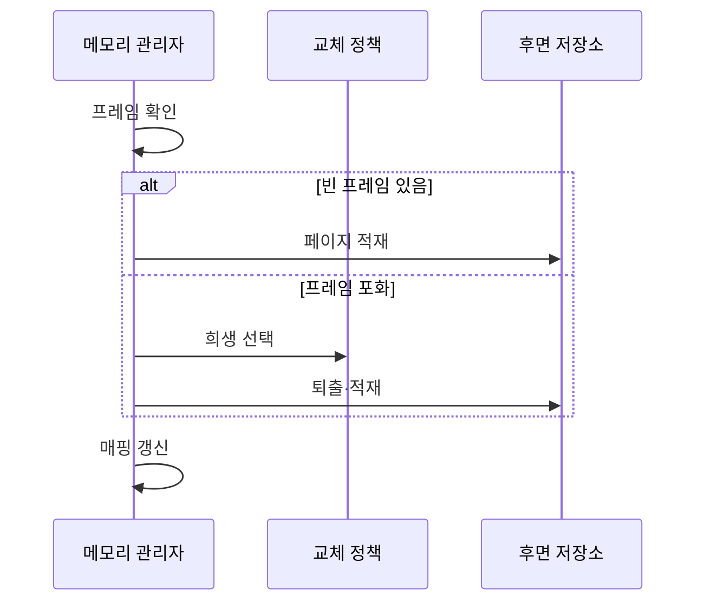

---
sidebar:
  order: 18
  label: "018. 페이지 교체 알고리즘 — OPT·FIFO·LRU·LFU (Page Replacement)"
  badge:
    text: "미출제 · 50%"
    variant: note
title: "페이지 교체 알고리즘 — OPT·FIFO·LRU·LFU (Page Replacement)"
date: "2026-07-25T01:19:00+09:00"
tags:
  - "notes-hardware"
weight: 18
extra:
  question_no: "018"
  source_status: "미출제"
  source_history: ""
  priority: 50
  priority_note: "교체 기법 선택과 벨라디 이상 비교"
---

## 미리 알고가기

- **페이지 교체(Page Replacement)**: 빈 프레임이 없을 때 희생 페이지를 선택해 요청 페이지 공간을 확보하는 정책
- **희생 페이지(Victim Page)**: 요청 페이지 공간을 위해 퇴출할 페이지
- **참조 지역성(Reference Locality)**: 최근·반복 참조 페이지를 다시 찾는 성질
- **수정 페이지(Dirty Page)**: 퇴출 전 후면 저장소에 기록할 페이지
- **최적 페이지 교체(Optimal Page Replacement, OPT, 옵트)**: 영문 핵심 단어의 첫 글자를 따 OPT로 표기하며 미래에 가장 늦게 다시 참조될 페이지를 퇴출하는 비교 기준
- **선입선출(First In, First Out, FIFO, 파이포)**: 영문 각 단어의 첫 글자를 따 FIFO로 표기하며 가장 먼저 적재한 페이지부터 퇴출하는 정책
- **최소 최근 사용(Least Recently Used, LRU, 엘알유)**: 영문 각 단어의 첫 글자를 따 LRU로 표기하며 가장 오래 참조하지 않은 페이지를 퇴출하는 정책
- **최소 빈도 사용(Least Frequently Used, LFU, 엘에프유)**: 영문 각 단어의 첫 글자를 따 LFU로 표기하며 참조 횟수가 가장 적은 페이지를 퇴출하는 정책
- **벨라디 이상(Belady's Anomaly)**: FIFO의 프레임 증가에도 폴트가 늘어나는 현상
- **클록(Clock) 알고리즘**: 참조 비트·원형 포인터로 LRU 근사
- **운영체제(Operating System, OS, 오에스)**: 영문 각 단어의 첫 글자를 따 OS로 표기하며 메모리·프로세스·장치를 관리하고 페이지 교체를 수행하는 소프트웨어
- **페이지 폴트(Page Fault)**: 요청한 가상 페이지가 물리 프레임에 없어 운영체제가 저장장치에서 적재해야 하는 동기 예외로 교체 정책이 줄이려는 비용
- **후면 저장소(Backing Store)**: 물리 메모리에 상주하지 않는 페이지를 보관하는 저장장치 영역으로 더티 페이지를 기록하고 요청 페이지를 읽는 대상
- **상주 프레임 집합(Resident Frame Set)**: 현재 프로세스의 페이지가 적재된 물리 프레임 묶음으로 빈 프레임이 없으면 희생 페이지를 선택
- **참조 이력(Reference History)**: 페이지의 적재 순서·최근 참조 시각·참조 횟수·참조 비트를 기록한 정보로 정책별 희생 선택 기준
- **참조 비트(Reference Bit)**: 페이지가 최근 접근됐는지를 나타내는 비트로 Clock 알고리즘이 1이면 지우고 한 차례 퇴출을 유예
- **원형 포인터(Circular Pointer)**: 프레임 목록의 끝에서 처음으로 돌아가며 순환하는 위치 표시자로 Clock 알고리즘이 다음 검사 대상을 가리킴
- **시간 지역성(Temporal Locality)**: 최근 참조한 페이지를 가까운 미래에 다시 참조할 가능성이 높은 성질로 LRU·Clock이 재사용을 예측하는 근거
- **오프라인 최적 기준(Offline Optimal Baseline)**: 전체 미래 참조열을 미리 아는 조건에서 계산한 최소 페이지 폴트 수로 실제 알고리즘의 성능을 비교하는 기준
- **페이지 테이블 항목(Page Table Entry, PTE, 피티이)**: 영문 각 단어의 첫 글자를 따 PTE로 표기하며 물리 프레임 번호·상주·권한 상태를 담는 항목
- **입출력(Input/Output, I/O, 아이 오)**: 입력과 출력을 빗금으로 묶는 관례에 따라 I/O로 표기하며 메모리와 저장장치 사이에서 데이터를 이동하는 작업
- **프레임 매핑(Frame Mapping)**: 가상 페이지와 물리 프레임의 대응 관계로 퇴출·적재 뒤 PTE를 갱신해 주소 변환에 반영

## Ⅰ. 개요

- 정의/개념: 프레임 포화 시 희생 페이지를 선택해 요청 공간을 확보하는 정책
- **배경/필요성**: 프레임 포화가 퇴출 I/O를 유발해 희생 선택 기준 필요

### 쉽게 이해하기 (학습용)

- 가득 찬 책장에서 다시 볼 가능성이 낮은 책을 치우되 메모가 있으면 먼저 보관한다

## Ⅱ. 특징

- 지역성 이력으로 재사용 가능성이 낮은 쪽을 버린다
- 자세한 이력은 예측력과 갱신 비용을 함께 높인다
- 참조 순서는 같은 프레임의 폴트 수를 바꾼다
- 더티 희생 페이지는 저장장치 쓰기를 추가한다

### 쉽게 이해하기 (학습용)

- 앞으로 볼 책을 모르므로 기록이 자세할수록 선택은 좋아지지만 관리가 늘어난다

## Ⅲ. 아키텍처 및 구성요소

| 설계 요소 | 설명 |
|:---|:---|
| 상주 프레임 집합 | 페이지·참조·더티 상태 보관 |
| 참조 이력 | 적재 순서·최근 시각·횟수·비트 기록 |
| 교체 선택기 | 정책과 참조 이력으로 희생 페이지 결정 |
| 저장소 I/O | 더티 페이지 기록·요청 페이지 적재 |

> 요약: 참조 이력으로 희생을 선택하고 더티면 기록

### 쉽게 이해하기 (학습용)

- 페이지 목록과 참조 기록으로 희생 페이지를 선택하고 변경 페이지는 보조기억장치에 기록한다

## Ⅳ. 원리 및 절차 흐름도

| 절차 | 설명 |
|:---|:---|
| 프레임 확인 | 물리 메모리의 빈 프레임 탐색 |
| 페이지 적재 | 빈 프레임에 요청 페이지 읽기 |
| 희생 선택 | 정책과 참조 이력으로 희생 결정 |
| 퇴출·적재 | 더티면 기록 후 요청 페이지 읽기 |
| 매핑 갱신 | 기존 매핑 무효화·새 PTE 반영 |

> 요약: 빈 프레임은 적재, 포화면 희생 퇴출 후 매핑 갱신

### 쉽게 이해하기 (학습용)

- 빈자리가 없으면 기록으로 책을 선택해 메모를 보관한 뒤 새 책을 꽂는다

## Ⅴ. 종류 및 비교

| 판단 기준 | OPT | FIFO | LRU | LFU |
|:---|:---|:---|:---|:---|
| 핵심 특징 | 가장 늦은 미래 참조 | 가장 이른 적재 | 가장 오래된 참조 | 가장 낮은 참조 횟수 |
| 적용 기준 | 오프라인 최적 폴트 기준 | 최소한의 추적 비용 | 강한 시간 지역성 | 안정적인 반복 빈도 |
| 주요 위험 | 미래 참조를 알 수 없음 | 벨라디 이상 가능 | 최근성 갱신 비용 | 과거 횟수 잔존 |

### 쉽게 이해하기 (학습용)

- OPT와 비교해 부하에 맞는 참조 기준을 선택한다

## Ⅵ. 실무 사례

1. 범용 OS는 Clock으로 LRU를 낮은 비용으로 근사

### 쉽게 이해하기 (학습용)

- 원형 포인터가 참조 표시된 페이지를 한 번 건너뛰어 최근 페이지를 남긴다

## Ⅶ. 결론

- OPT는 기준, 시간 지역성은 LRU·Clock, 빈도는 LFU

### 쉽게 이해하기 (학습용)

- 실제 이용 습관과 기록 비용에 맞는 규칙을 선택한다
