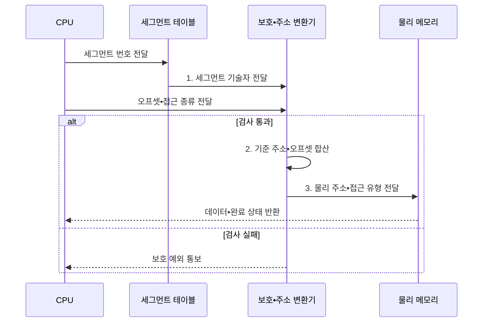

---
sidebar:
  order: 19
  label: "019. 세그멘테이션 (Segmentation)"
  badge:
    text: "기출 • 30%"
    variant: note
title: "세그멘테이션 (Segmentation)"
date: "2026-08-03T08:48:47+09:00"
tags:
  - "notes-hardware"
weight: 19
extra:
  question_no: "019"
  source_status: "기출"
  source_history: "126회"
  priority: 30
  priority_note: "페이징과의 비교 축"
---

## Ⅰ. 개요

핵심 용어

- **세그멘테이션(Segmentation)**: 주소 공간을 코드•데이터•스택 같은 가변 길이 논리 영역으로 나눠 변환•보호하는 메모리 관리 방식
- **논리 권한 경계**: 프로그램의 영역별로 서로 다른 범위와 읽기•쓰기•실행 권한을 적용하는 구분
- **평면 주소 공간**: 코드•데이터•스택을 별도 논리 영역으로 구분하지 않고 하나의 연속 주소 범위로 다루는 구조

- 정의/개념: 가변 크기 논리 영역별로 **주소를 변환•보호하는 방식**
- 배경/필요성: 평면 주소 공간은 논리 영역별 **경계•권한 표현 불가**

#### 한줄 요약

- 세그멘테이션은 코드•데이터•스택의 논리 경계와 권한을 하드웨어가 검사하도록 주소 공간을 영역별로 나눈다.

## Ⅱ. 특징

핵심 용어

- **2차원 주소**: 세그먼트 번호와 그 영역 내부 오프셋으로 구성한 논리 주소
- **기준 주소•한계**: 세그먼트가 시작하는 물리 위치와 허용 가능한 최대 오프셋 범위
- **독립 성장**: 코드•데이터•스택 영역이 서로의 크기와 무관하게 확장되는 성질
- **단일 단계 변환**: 기술자에서 기준 주소를 찾고 오프셋을 더해 한 번에 물리 주소를 만드는 변환 방식

- **2차원 주소** 로 논리 영역과 내부 위치 분리
- 영역별 **한계•권한** 부여로 독립 성장 지원
- 기준 주소 덧셈으로 끝나는 **단일 단계 변환**

#### 한줄 요약

- 세그먼트 번호로 영역의 기준•한계•권한을 찾고 오프셋을 더하므로 영역별 보호와 독립 성장을 지원한다.

## Ⅲ. 구조 및 구성요소

핵심 용어

- **세그먼트 기술자**: 한 영역의 기준 주소•한계•존재 여부•접근 권한을 담은 항목
- **보호 검사기**: 세그먼트 존재•범위•접근 권한을 확인하는 회로
- **주소 생성기**: 검사를 통과한 기준 주소에 오프셋을 더해 물리 주소를 만드는 회로
- **세그먼트 테이블**: 세그먼트 번호를 색인으로 각 논리 영역의 기술자를 저장하는 표

| 구성요소 | 책임 |
|:---|:---|
| 세그먼트 테이블 | **기준•한계•권한** 제공 |
| 보호 검사기 | 존재•범위•**권한 위반** 판정 |
| 주소 생성기 | 검증 주소의 **물리 주소** 산출 |

#### 한줄 요약
- 세그먼트 테이블이 영역 정보를 제공하고 보호 검사기를 통과한 주소만 생성기가 물리 위치로 바꾼다.

## Ⅳ. 흐름도

핵심 용어

- **세그먼트 번호•오프셋**: 변환할 논리 영역을 고르는 값과 그 영역 안의 바이트 위치
- **보호 예외**: 영역 부재•범위 초과•권한 위반 시 메모리 접근을 중단하는 예외
- **접근 유형**: CPU가 요청한 읽기•쓰기•실행 동작의 종류
- **보호•주소 변환기**: 기술자의 존재•한계•권한을 검사하고 기준 주소와 오프셋을 합산하는 하드웨어

**동작 원리**

- **1. 세그먼트 기술자 전달**: 기준•한계•권한 제공
- **2. 기준 주소•오프셋 합산**: 보호 검사를 통과한 논리 주소를 물리 주소로 변환
- **3. 물리 주소•접근 유형 전달**: 기준•오프셋 합산 후 메모리 접근

#### 한줄 요약

- 보호 검사기가 범위와 권한을 확인한 주소만 물리 주소 생성기로 전달한다

## Ⅴ. 종류 및 비교

핵심 용어

- **외부 단편화**: 가변 크기 영역 사이에 빈틈이 흩어져 충분한 총공간에도 연속 자리를 확보하지 못하는 현상
- **페이징**: 주소 공간을 고정 크기로 나눠 비연속 물리 프레임에 배치하는 방식
- **내부 단편화**: 고정 크기 페이지의 마지막 자투리가 사용되지 않아 생기는 낭비
- **결합 방식**: 세그먼트로 논리 영역과 권한을 나누고 각 영역 내부를 페이지로 다시 나누는 세그먼트-페이징 구조

| 주소 변환 방식 | 세그멘테이션 | 페이징 |
|:---|:---|:---|
| 적용 기준 | 영역마다 **접근 권한** 이 갈릴 때 | 물리 자리를 흩어 써야 할 때 |
| 핵심 특징 | 가변 논리 영역의 **기준•한계** 변환 | 고정 페이지의 **비연속 프레임** 배치 |
| 한계 | 연속 자리를 요구하는 **외부 단편화** | 자투리가 남는 **내부 단편화** |

> 요약: 페이징이 연속 배치 제약 해소

#### 한줄 요약

- 세그멘테이션은 외부 단편화, 페이징은 내부 단편화를 만들며, 결합 방식은 영역별 보호와 비연속 배치를 함께 얻는다.

## Ⅵ. 실무 고려사항 및 대책

핵심 용어

- **세그먼트-페이징**: 논리 영역으로 권한을 나눈 뒤 내부를 고정 페이지로 잘라 비연속 배치하는 결합 방식
- **가드 영역**: 스택•힙 경계에 둔 접근 불가 구간으로 범위 침범을 예외로 탐지하는 영역
- **TLB 지역성**: 반복 사용하는 주소 변환이 TLB에 남아 결합 변환의 조회 지연을 줄이는 성질
- **최소 권한•경계값 시험**: 영역에 필요한 권한만 부여하고 한계 직전•직후 주소의 허용과 예외 처리를 검증하는 방법
- **표 지역성**: 가까운 주소의 세그먼트•페이지 표 항목을 반복 조회해 캐시에 남을 가능성이 높은 성질

| 문제 | 대책 | 효과 |
|:---|:---|:---|
| 가변 배치의 **외부 단편화** | **세그먼트 내부 페이징** | **연속 공간 요구** 완화 |
| 스택•힙의 **성장 충돌** | 성장 한계•**가드 영역** 적용 | **경계 침범** 조기 방지 |
| 기술자 **권한 설정 오류** | **최소 권한•경계값 시험** | **보호 예외 정확성** 확보 |
| 결합 변환의 **조회 비용** | **TLB•표 지역성** 개선 | **주소 변환 지연** 감소 |

#### 한줄 요약

- 프로그램이 내민 주소를 먼저 구역 표로 검사해 권한과 경계를 확인한 뒤, 그렇게 나온 주소를 다시 페이지 표로 넘겨 실제 프레임에 흩어 얹으므로 경계 보호와 자리 활용을 함께 얻는다

## Ⅶ. 결론

핵심 용어

- **연속 공간 요구**: 세그먼트 전체를 물리 메모리의 이어진 한 구간에 배치해야 하는 제약
- **비연속 배치**: 세그먼트 내부 페이지를 떨어진 물리 프레임에 나누어 놓는 방식
- **세그먼트-페이징**: 논리 권한 경계는 세그먼트로 유지하고 내부 페이지는 비연속 프레임에 배치하는 결합 방식

- 권한 경계와 외부 단편화 공존 시 **세그먼트-페이징** 적용

#### 한줄 요약

- 코드와 스택에 서로 다른 권한을 걸어야 하면 구역으로 나누되, 그 구역을 메모리에 통째로 앉히려 하지 말고 같은 크기 칸으로 다시 잘라 흩어 놓아야 빈틈 때문에 자리를 못 잡는 일이 없다
