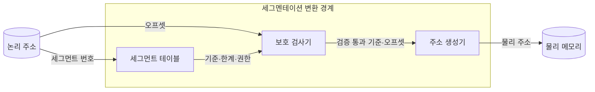
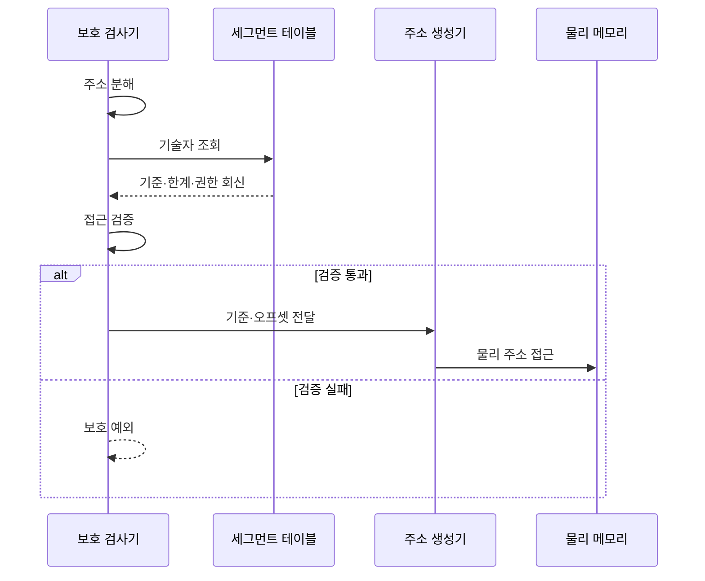

---
sidebar:
  order: 19
  label: "019. 세그멘테이션 (Segmentation)"
  badge:
    text: "기출 · 30%"
    variant: note
title: "세그멘테이션 (Segmentation)"
date: "2026-07-26T09:00:00+09:00"
tags:
  - "notes-hardware"
weight: 19
extra:
  question_no: "019"
  source_status: "기출"
  source_history: "126회"
  priority: 30
  priority_note: "페이징과의 비교 축"
---

## 미리 알고가기

- **세그멘테이션(Segmentation)**: 건물을 똑같은 크기 칸으로 자르지 않고 사무실·창고·계단처럼 쓰임새대로 크기가 다른 구역으로 나눈 뒤 구역마다 출입 권한을 따로 거는 것처럼, 주소 공간을 코드·데이터·스택 같은 가변 논리 영역으로 나눠 영역별 보호와 공유를 제공하는 변환 방식
- **논리 주소·물리 주소(Logical·Physical Address)**: 프로그램이 세그먼트 번호와 오프셋으로 내미는 주소가 논리 주소, 그것을 변환해 얻는 실제 메모리 위치가 물리 주소다
- **세그먼트 번호·오프셋(Segment Number and Offset)**: 어느 구역인지 고르는 값이 번호, 그 구역 안에서 몇 바이트째인지가 오프셋이다
- **2차원 주소(Two-dimensional Address)**: 주소 하나를 구역 좌표와 구역 내부 좌표라는 두 값으로 제시하는 구조이며, 페이징이 한 줄로 이어진 주소를 잘라 쓰는 것과 근본이 다른 점이다
- **세그먼트 테이블(Segment Table)**: 세그먼트 번호를 색인으로 그 구역의 기술자를 찾아 주는 변환 표
- **세그먼트 기술자(Segment Descriptor)**: 한 구역의 기준 주소·한계·존재 여부·접근 권한을 담은 항목
- **기준 주소·한계(Base and Limit)**: 그 구역이 실제 메모리에서 시작하는 자리가 기준 주소, 오프셋이 넘어서면 안 되는 크기가 한계다
- **존재 비트(Present Bit)**: 그 기술자가 지금 실제로 쓸 수 있는 영역을 가리키는지 표시하는 비트
- **보호 검사기(Protection Checker)**: 구역이 존재하는지, 오프셋이 한계 안인지, 요청한 접근이 권한에 맞는지를 검사해 통과 여부를 정하는 회로
- **주소 생성기(Address Generator)**: 검사를 통과한 기준 주소에 오프셋을 더해 물리 주소를 만들어 내는 회로
- **보호 예외(Protection Exception)**: 구역이 없거나 오프셋이 한계를 넘거나 권한을 어겼을 때 그 접근을 중단시키는 예외
- **독립 성장(Independent Growth)**: 스택이 늘어난다고 코드 영역을 밀어낼 필요가 없듯 각 구역이 다른 구역 크기와 무관하게 늘어날 수 있는 성질
- **외부 단편화(External Fragmentation)**: 크기가 제각각인 구역을 넣고 빼다 보면 사이사이에 작은 빈틈이 흩어져, 총합은 충분한데 연속된 자리를 못 잡는 현상
- **페이징(Paging)**: 주소 공간을 고정 크기 페이지로 잘라 비연속 프레임에 흩어 얹는 방식이며, 세그멘테이션이 요구하는 연속 자리 문제를 없애 준다
- **내부 단편화(Internal Fragmentation)**: 고정 크기 페이지의 마지막 자투리가 비어 생기는 낭비이며, 페이징이 외부 단편화 대신 떠안는 손실이다
- **세그먼트-페이징 결합(Segmented Paging)**: 구역으로 권한을 나눈 뒤 그 구역 내부를 다시 고정 페이지로 잘라 배치해 두 방식의 장점을 함께 쓰는 구조
- **x86 32비트**: 초기 8086 계열과 호환되는 명령어 집합의 32비트 세대이며, 세그먼트 변환을 먼저 하고 그 결과에 페이징을 다시 적용하는 대표 구현이다

## Ⅰ. 개요

- **정의/개념**: 가변 논리 영역별 보호·공유를 제공하는 **주소 변환 방식**
- **기존 한계**: 단일 선형 공간에서는 코드·스택별 **권한 분리 불가**

### 쉽게 이해하기 (학습용)

- 주소가 0번부터 끝까지 한 줄로만 이어져 있으면 어디까지가 실행할 코드이고 어디부터가 고쳐 쓸 데이터인지 하드웨어가 알 길이 없어 데이터 자리에 심어 둔 값이 그대로 실행되는데, 답안이 배경 자리에 이 못 나눔을 적은 이유는 세그멘테이션이 공간을 아끼려는 기법이 아니라 경계를 하드웨어에 알려 주려는 기법이기 때문이다

## Ⅱ. 특징

- **2차원 주소**로 논리 영역과 내부 위치 분리
- 영역별 **한계·권한** 부여로 독립 성장 지원
- 기준 주소 덧셈으로 끝나는 **단일 단계 변환**

### 쉽게 이해하기 (학습용)

- 주소를 구역 번호와 그 안 거리라는 두 값으로 내밀게 하면 하드웨어가 구역마다 다른 크기와 출입 권한을 걸 수 있고 스택이 늘어도 코드 구역을 밀 필요가 없으며, 변환 자체는 표에서 시작 자리를 받아 거리를 더하는 덧셈 한 번이라 층층이 내려가는 표 순회가 없다

## Ⅲ. 아키텍처 및 구성요소

| 설계 요소 | 설명 |
|:---|:---|
| 세그먼트 테이블 | 번호별 **기준·한계·존재·권한** 기술자 보관 |
| 보호 검사기 | **존재·범위·권한** 위반 여부 판정 |
| 주소 생성기 | 기준 주소와 오프셋 합으로 **물리 주소** 산출 |

> 요약: **보호 검사기**를 통과한 주소만 생성기로 진입

### 쉽게 이해하기 (학습용)

- 검사기가 표와 생성기 사이를 가로막고 서 있는 배치가 곧 이 방식의 값인데, 구역 정보를 받아 든 뒤에도 거리가 그 구역 크기를 넘거나 권한이 안 맞으면 주소를 아예 만들지 않으므로 잘못된 접근이 메모리에 닿기 전에 끊긴다

## Ⅳ. 원리 및 절차 흐름도

| 절차 | 설명 |
|:---|:---|
| 주소 분해 | **세그먼트 번호**와 오프셋 분리 |
| 기술자 조회 | 번호를 색인으로 한 **세그먼트 기술자** 인출 |
| 기준·한계·권한 회신 | **존재 비트**를 포함한 구역 정보 반환 |
| 접근 검증 | 오프셋의 **한계 초과** 여부와 권한 검사 |
| 기준·오프셋 전달 | 검증 통과분만 **주소 생성기** 진입 |
| 물리 주소 접근 | **기준 주소** 합산 결과의 메모리 접근 |
| 보호 예외 | 미존재·범위·권한 위반의 **접근 중단** |

> 요약: **한계 검사**가 통과해야만 물리 주소가 존재

### 쉽게 이해하기 (학습용)

- 페이징과 달리 여기서는 거리 값 자체가 검사 대상이라는 점이 중요한데, 페이징에서는 오프셋이 페이지 크기 안이라는 것이 비트 폭으로 이미 보장되지만 구역 크기가 제각각인 여기서는 표에서 받은 한계와 일일이 비교해 봐야만 넘었는지를 알 수 있다

## Ⅴ. 종류 및 비교

| 주소 변환 방식 | 세그멘테이션 | 페이징 |
|:---|:---|:---|
| 적용 기준 | 영역마다 **접근 권한**이 갈릴 때 | 물리 자리를 흩어 써야 할 때 |
| 핵심 특징 | 가변 논리 영역의 **기준·한계** 변환 | 고정 페이지의 **비연속 프레임** 배치 |
| 한계 | 연속 자리를 요구하는 **외부 단편화** | 자투리가 남는 **내부 단편화** |

> 요약: 세그멘테이션의 **연속 자리 요구**를 페이징이 흩어 배치로 해소

### 쉽게 이해하기 (학습용)

- 두 한계가 정반대 자리에서 생긴다는 점이 곧 둘을 겹쳐 쓰는 이유인데, 크기가 제각각인 구역은 사이사이 빈틈이 남아 큰 구역을 못 넣고 같은 크기 칸은 마지막 칸이 늘 조금 비므로, 권한은 구역으로 나누고 실제 자리 배치는 같은 크기 칸으로 하면 앞의 빈틈이 사라진다

## Ⅵ. 실무 사례

1. **x86 32비트**는 세그먼트 변환 결과에 페이징을 다시 적용

### 쉽게 이해하기 (학습용)

- 프로그램이 내민 주소를 먼저 구역 표로 검사해 권한과 경계를 확인한 뒤, 그렇게 나온 주소를 다시 페이지 표로 넘겨 실제 프레임에 흩어 얹으므로 경계 보호와 자리 활용을 함께 얻는다

## Ⅶ. 결론

- 논리 경계 보호는 **세그먼트**, 실제 배치는 **페이징** 결합

### 쉽게 이해하기 (학습용)

- 코드와 스택에 서로 다른 권한을 걸어야 하면 구역으로 나누되, 그 구역을 메모리에 통째로 앉히려 하지 말고 같은 크기 칸으로 다시 잘라 흩어 놓아야 빈틈 때문에 자리를 못 잡는 일이 없다
