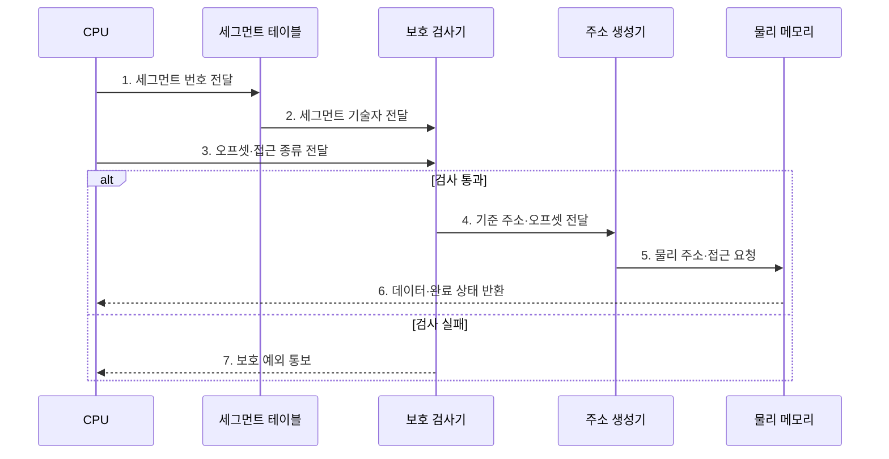

---
sidebar:
  order: 19
  label: "019. 세그멘테이션 (Segmentation)"
  badge:
    text: "기출 · 30%"
    variant: note
title: "세그멘테이션 (Segmentation)"
date: "2026-07-29T00:52:00+09:00"
tags:
  - "notes-hardware"
weight: 19
extra:
  question_no: "019"
  source_status: "기출"
  source_history: "126회"
  priority: 30
  priority_note: "페이징과의 비교 축"
---

## 미리 알고가기

- **세그멘테이션(Segmentation)**: 주소 공간을 코드·데이터·스택과 같은 가변 길이의 논리 영역으로 나누고 세그먼트별 보호와 공유를 제공하는 메모리 관리 방식
- **논리 주소·물리 주소(Logical·Physical Address)**: 프로그램이 세그먼트 번호와 오프셋으로 내미는 주소가 논리 주소, 그것을 변환해 얻는 실제 메모리 위치가 물리 주소다
- **세그먼트 번호·오프셋(Segment Number and Offset)**: 어느 구역인지 고르는 값이 번호, 그 구역 안에서 몇 바이트째인지가 오프셋이다
- **2차원 주소(Two-dimensional Address)**: 주소 하나를 구역 좌표와 구역 내부 좌표라는 두 값으로 제시하는 구조이며, 페이징이 한 줄로 이어진 주소를 잘라 쓰는 것과 근본이 다른 점이다
- **세그먼트 테이블(Segment Table)**: 세그먼트 번호를 색인으로 그 구역의 기술자를 찾아 주는 변환 표
- **세그먼트 기술자(Segment Descriptor)**: 한 구역의 기준 주소·한계·존재 여부·접근 권한을 담은 항목
- **기준 주소·한계(Base and Limit)**: 그 구역이 실제 메모리에서 시작하는 자리가 기준 주소, 오프셋이 넘어서면 안 되는 크기가 한계다
- **존재 비트(Present Bit)**: 그 기술자가 지금 실제로 쓸 수 있는 영역을 가리키는지 표시하는 비트
- **보호 검사기(Protection Checker)**: 구역이 존재하는지, 오프셋이 한계 안인지, 요청한 접근이 권한에 맞는지를 검사해 통과 여부를 정하는 회로
- **주소 생성기(Address Generator)**: 검사를 통과한 기준 주소에 오프셋을 더해 물리 주소를 만들어 내는 회로
- **보호 예외(Protection Exception)**: 구역이 없거나 오프셋이 한계를 넘거나 권한을 어겼을 때 그 접근을 중단시키는 예외
- **독립 성장(Independent Growth)**: 스택이 늘어난다고 코드 영역을 밀어낼 필요가 없듯 각 구역이 다른 구역 크기와 무관하게 늘어날 수 있는 성질
- **외부 단편화(External Fragmentation)**: 크기가 제각각인 구역을 넣고 빼다 보면 사이사이에 작은 빈틈이 흩어져, 총합은 충분한데 연속된 자리를 못 잡는 현상
- **페이징(Paging)**: 주소 공간을 고정 크기 페이지로 잘라 비연속 프레임에 흩어 얹는 방식이며, 세그멘테이션이 요구하는 연속 자리 문제를 없애 준다
- **내부 단편화(Internal Fragmentation)**: 고정 크기 페이지의 마지막 자투리가 비어 생기는 낭비이며, 페이징이 외부 단편화 대신 떠안는 손실이다
- **세그먼트-페이징 결합(Segmented Paging)**: 구역으로 권한을 나눈 뒤 그 구역 내부를 다시 고정 페이지로 잘라 배치해 두 방식의 장점을 함께 쓰는 구조
- **x86 32비트**: 논리 주소를 세그먼트로 변환한 뒤 다시 페이징을 적용하는 대표적인 세그멘테이션 구현
- **가드 영역(Guard Region)**: 접근 불가 영역을 경계에 두어 스택·힙의 범위 침범을 예외로 탐지하는 구간

## Ⅰ. 개요

- 정의/개념: 가변 크기 논리 영역별로 **주소를 변환·보호하는 방식**
- 배경/필요성: 논리 영역별 **경계·권한 표현**

### 쉽게 이해하기 (학습용)

- 세그멘테이션은 코드·데이터·스택의 논리 경계와 권한을 하드웨어가 검사하도록 주소 공간을 영역별로 나눈다.

## Ⅱ. 특징

- **2차원 주소**로 논리 영역과 내부 위치 분리
- 영역별 **한계·권한** 부여로 독립 성장 지원
- 기준 주소 덧셈으로 끝나는 **단일 단계 변환**

### 쉽게 이해하기 (학습용)

- 세그먼트 번호로 영역의 기준·한계·권한을 찾고 오프셋을 더하므로 영역별 보호와 독립 성장을 지원한다.

## Ⅲ. 구조 및 구성요소

| 구성요소 | 책임 |
|:---|:---|
| 세그먼트 테이블 | **기준·한계·권한** 제공 |
| 보호 검사기 | 존재·범위·**권한 위반** 판정 |
| 주소 생성기 | 검증 주소의 **물리 주소** 산출 |

### 쉽게 이해하기 (학습용)
- 세그먼트 테이블이 영역 정보를 제공하고 보호 검사기를 통과한 주소만 생성기가 물리 위치로 바꾼다.

## Ⅳ. 흐름도

**동작 원리**

- **1. 세그먼트 번호 전달**: 논리 영역 선택
- **2. 세그먼트 기술자 전달**: 기준·한계·권한 제공
- **3. 오프셋·접근 종류 전달**: 위치·유형 제공
- **4. 기준 주소·오프셋 전달**: 검증 주소 전달
- **5. 물리 주소·접근 요청**: 기준·오프셋 합산
- **6. 데이터·완료 상태 반환**: 접근 결과 전달
- **7. 보호 예외 통보**: 검사 실패 전달

### 쉽게 이해하기 (학습용)

- 보호 검사기가 범위와 권한을 확인한 주소만 물리 주소 생성기로 전달한다

## Ⅴ. 종류 및 비교

| 주소 변환 방식 | 세그멘테이션 | 페이징 |
|:---|:---|:---|
| 적용 기준 | 영역마다 **접근 권한**이 갈릴 때 | 물리 자리를 흩어 써야 할 때 |
| 핵심 특징 | 가변 논리 영역의 **기준·한계** 변환 | 고정 페이지의 **비연속 프레임** 배치 |
| 한계 | 연속 자리를 요구하는 **외부 단편화** | 자투리가 남는 **내부 단편화** |

> 요약: 페이징이 연속 배치 제약 해소

### 쉽게 이해하기 (학습용)

- 세그멘테이션은 외부 단편화, 페이징은 내부 단편화를 만들며, 결합 방식은 영역별 보호와 비연속 배치를 함께 얻는다.

## Ⅵ. 실무 고려사항 및 대책

| 고려사항 | 대책 | 효과 |
|:---|:---|:---|
| 가변 배치의 **외부 단편화** | 세그먼트 내부 페이징 | **연속 공간 요구** 완화 |
| 스택·힙의 **성장 충돌** | 성장 한계·가드 영역 | **경계 침범** 조기 차단 |
| 기술자 **권한 설정 오류** | 최소 권한·경계값 시험 | **보호 예외** 정확성 확보 |
| 결합 변환의 **조회 비용** | TLB·표 지역성 개선 | **주소 변환 지연** 감소 |

### 쉽게 이해하기 (학습용)

- 프로그램이 내민 주소를 먼저 구역 표로 검사해 권한과 경계를 확인한 뒤, 그렇게 나온 주소를 다시 페이지 표로 넘겨 실제 프레임에 흩어 얹으므로 경계 보호와 자리 활용을 함께 얻는다

## Ⅶ. 결론

- **권한 경계·외부 단편화·변환 지연** 기반 적용

### 쉽게 이해하기 (학습용)

- 코드와 스택에 서로 다른 권한을 걸어야 하면 구역으로 나누되, 그 구역을 메모리에 통째로 앉히려 하지 말고 같은 크기 칸으로 다시 잘라 흩어 놓아야 빈틈 때문에 자리를 못 잡는 일이 없다
