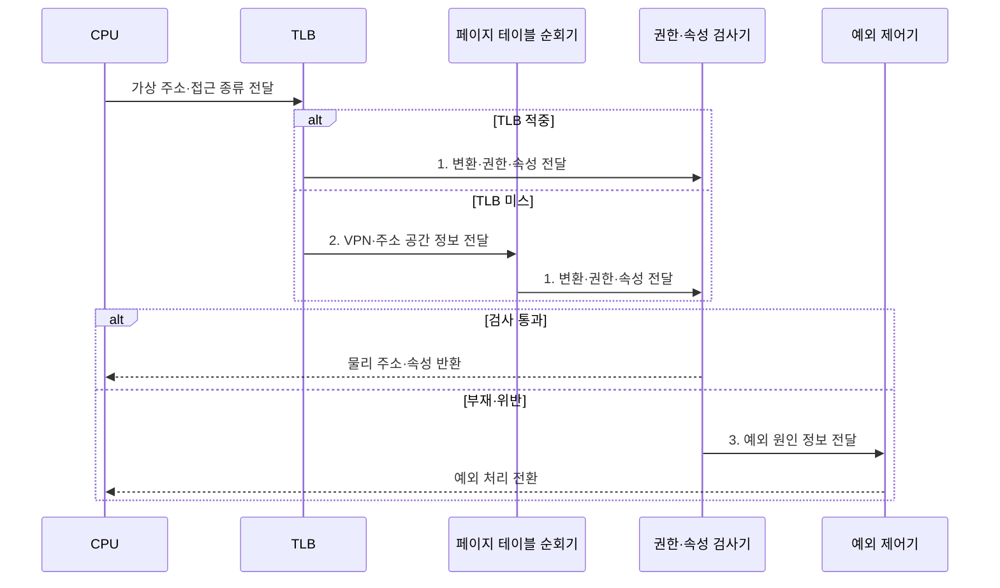

---
sidebar:
  order: 20
  label: "020. MMU 메모리 관리 장치 (Memory Management Unit)"
  badge:
    text: "기출 · 70%"
    variant: note
title: "MMU 메모리 관리 장치 (Memory Management Unit)"
date: "2026-08-02T19:10:00+09:00"
tags:
  - "notes-hardware"
weight: 20
extra:
  question_no: "020"
  source_status: "기출"
  source_history: "135회, 137회"
  priority: 70
  priority_note: "주소 변환·보호 경계의 반복 기출 주제"
---

## Ⅰ. 개요

핵심 용어

- **메모리 관리 장치(Memory Management Unit, MMU)**: 모든 메모리 접근에서 가상 주소를 물리 주소로 변환하고 페이지 권한을 검사하는 하드웨어
- **접근 격리**: 한 프로세스가 다른 프로세스나 커널의 메모리에 허가 없이 접근하지 못하게 하는 보호

- 정의/개념: 가상 주소를 변환하고 **접근 권한**을 검사하는 하드웨어
- 배경/필요성: 소프트웨어만으로는 모든 메모리 접근에 **권한 검사 강제 불가**

#### 한줄 요약

- MMU는 모든 메모리 접근이 통과하는 하드웨어 경계에서 주소 변환과 권한 검사를 강제한다.

## Ⅱ. 특징

핵심 용어

- **가상 주소·물리 주소**: 프로세스가 사용하는 논리 주소와 실제 메모리 위치를 가리키는 주소
- **페이지 권한**: 페이지에 허용된 읽기·쓰기·실행 접근의 종류
- **TLB**: 최근 주소 변환 결과와 접근 권한을 저장하는 하드웨어 캐시

- 주소 변환으로 **가상 배치·물리 프레임** 분리
- 매 접근마다 강제되는 **페이지 권한 검사**
- **TLB**로 변환 결과를 재사용하는 계층 구조

#### 한줄 요약

- MMU는 가상 주소와 물리 배치를 분리하고, TLB에 최근 변환을 보관해 페이지 테이블 조회를 줄인다.

## Ⅲ. 구조 및 구성요소

핵심 용어

- **페이지 테이블 순회기**: TLB 미스 때 다단계 PTE를 읽어 변환을 찾고 TLB를 채우는 장치
- **권한·속성 검사기**: 요청 접근과 PTE의 권한·캐시·공유·실행 속성을 대조하는 회로
- **예외 제어기**: 매핑 부재나 권한 위반을 CPU의 예외 처리 흐름으로 전달하는 구성요소

| 구성요소 | 책임 |
|:---|:---|
| TLB | 최근 **PFN·권한** 조회 |
| 페이지 테이블 순회기 | PTE 탐색과 **TLB 채움** |
| 권한·속성 검사기 | 접근 권한·**메모리 속성** 대조 |
| 예외 제어기 | 부재·위반의 **예외 전달** |

#### 한줄 요약
- TLB와 순회기가 주소를 찾고 검사기가 권한을 확인하며 실패는 예외 제어기로 전달한다.

## Ⅳ. 흐름도

핵심 용어

- **TLB 미스**: 필요한 주소 변환이 TLB에 없어 페이지 테이블을 순회해야 하는 상태
- **PTE**: 물리 프레임 번호와 접근 권한·메모리 속성을 저장하는 주소 변환 항목
- **페이지 폴트**: 매핑 부재·무효·권한 위반으로 운영체제 처리가 필요한 예외

**동작 원리**

- **1. 변환·권한·속성 전달**: 검사기에 주소 변환 결과 제공
- **2. VPN·주소 공간 정보 전달**: 페이지 테이블 순회로 PTE 탐색
- **3. 예외 원인 정보 전달**: 부재·위반을 예외 처리 경로로 전환

#### 한줄 요약

- TLB 적중과 페이지 순회 결과 모두 같은 권한·속성 검사기를 통과해야 한다

## Ⅴ. 종류 및 비교

핵심 용어

- **MPU**: 주소 변환 없이 미리 설정한 메모리 영역의 접근 권한을 검사하는 장치
- **실시간 예측성**: 메모리 접근과 예외 처리 지연이 정해진 시간 한도 안에 머무는 성질
- **요구 페이징**: 실제 참조할 때 페이지를 물리 메모리에 적재하는 동적 메모리 방식

| 메모리 보호 장치 | MMU | MPU |
|:---|:---|:---|
| 적용 기준 | 범용 **OS**·가상화로 주소 공간을 나눌 때 | **실시간 시스템**의 지연 변동을 막을 때 |
| 핵심 특징 | 가상 주소 변환과 **페이지 단위 보호** | 변환 없는 **고정 영역 권한 검사** |
| 한계 | 미스 시 **페이지 순회** 지연 변동 | 동적 매핑·**요구 페이징** 미지원 |

> 요약: MMU는 동적 주소, MPU는 고정 영역

#### 한줄 요약

- MMU는 프로세스마다 주소 공간을 바꾸고 페이지를 필요할 때 적재할 수 있지만 순회 지연이 생기며, MPU는 고정 영역 권한만 검사해 지연은 예측하기 쉽지만 동적 매핑과 요구 적재를 제공하지 않는다

## Ⅵ. 실무 고려사항 및 대책

핵심 용어

- **TLB 슛다운**: 페이지 테이블 변경 후 다른 코어의 오래된 TLB 엔트리까지 무효화하는 동기화 절차
- **중첩 페이징·결합 TLB**: 게스트와 호스트 주소를 두 단계로 변환하고 그 최종 결과를 캐시하는 가상화 구조
- **대형 페이지**: 엔트리 하나가 더 넓은 주소 범위를 덮어 TLB 미스와 순회 수를 줄이는 변환 단위

| 문제 | 대책 | 효과 |
|:---|:---|:---|
| TLB 미스의 **순회 병목** | 지연 측정·**대형 페이지** 선별 | **변환 비용** 감소 |
| 변경 후 **오래된 엔트리** | 범위 무효화·**TLB 슛다운** 검증 | **변환•권한 일치** |
| **중첩 페이징**의 순회 증폭 | **결합 TLB•대형 페이지** 적용 | **2단계 지연** 완화 |
| 실시간 경로의 **폴트 변동** | **메모리 고정•MPU** 적용 | **응답 예측성** 확보 |

#### 한줄 요약

- 수십 기가바이트를 훑는 데이터베이스는 작은 페이지로는 안내표가 아무리 많아도 범위를 못 덮으므로, 항목 하나가 훨씬 넓은 구역을 맡게 바꿔 대장 조회 자체를 줄인다

## Ⅶ. 결론

핵심 용어

- **동적 주소 격리**: 프로세스마다 바뀌는 페이지 매핑으로 독립 주소 공간을 제공하는 보호 방식
- **고정 영역 보호**: 미리 정한 메모리 범위의 권한을 변환 없이 검사해 일정한 지연을 제공하는 방식

- 동적 주소 격리는 **MMU**, 고정 실시간 보호는 **MPU** 선택

#### 한줄 요약

- 동적 주소 공간과 요구 적재는 MMU, 고정 지연의 영역 보호는 MPU를 선택한다.
