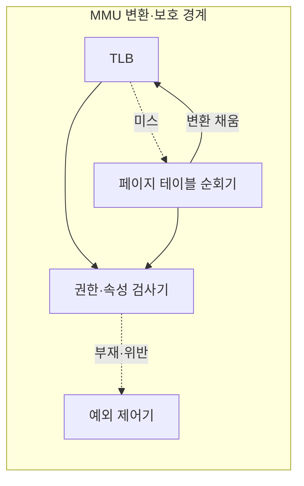
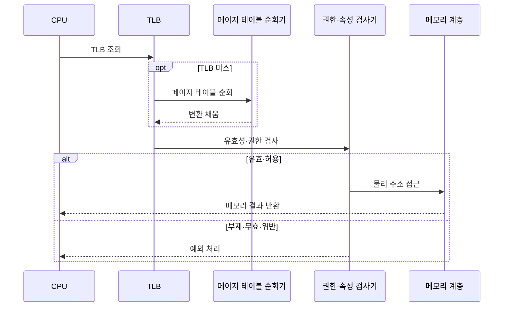

---
sidebar:
  order: 20
  label: "020. MMU 메모리 관리 장치 (Memory Management Unit)"
  badge:
    text: "기출 · 70%"
    variant: note
title: "MMU 메모리 관리 장치 (Memory Management Unit)"
date: "2026-07-27T23:59:59+09:00"
tags:
  - "notes-hardware"
weight: 20
extra:
  question_no: "020"
  source_status: "기출"
  source_history: "135회, 137회"
  priority: 70
  priority_note: "주소 변환·보호 경계의 반복 기출 주제"
---

## 미리 알고가기

- **메모리 관리 장치(Memory Management Unit, MMU)**: ‘엠엠유’로 읽고 영문 머리글자를 딴 약어이며, 가상 주소를 물리 주소로 변환하면서 접근 권한도 검사하는 하드웨어다
- **가상 주소·물리 주소(Virtual·Physical Address)**: 프로세스가 쓰는 주소가 가상 주소, 실제 메모리 위치가 물리 주소이며 MMU가 페이지 번호만 바꾸고 오프셋은 그대로 붙인다
- **가상 페이지 번호(Virtual Page Number, VPN)·물리 프레임 번호(Physical Frame Number, PFN)**: ‘브이피엔·피에프엔’으로 읽고 각 영문 머리글자를 딴 약어이며, 변환의 입력 페이지와 출력 프레임 번호다
- **페이지 테이블 항목(Page Table Entry, PTE)**: ‘피티이’로 읽고 영문 머리글자를 딴 약어이며, PFN·접근 권한·메모리 속성을 담는 변환 항목이다
- **변환 색인 버퍼(Translation Lookaside Buffer, TLB)**: ‘티엘비’로 읽고 영문 머리글자를 딴 약어이며, 최근 변환과 권한을 저장하는 하드웨어 캐시다
- **TLB 미스(TLB Miss)**: 찾는 변환이 캐시에 없어 페이지 테이블까지 내려가야 하는 상태
- **페이지 테이블 순회기(Page Table Walker)**: 그때 다단계 표의 PTE를 차례로 읽어 변환을 찾고 TLB에 채워 넣는 장치
- **메모리 속성(Memory Attribute)**: 그 영역이 캐시에 담겨도 되는지, 여러 코어가 공유하는지, 실행이 허용되는지 같은 성질
- **권한·속성 검사기(Permission and Attribute Checker)**: PTE가 허용한 읽기·쓰기·실행과 메모리 속성을 실제 요청과 대조해 통과시킬지 예외를 낼지 정하는 회로
- **예외 제어기(Exception Controller)**: 매핑이 없거나 권한을 어겼다는 판정을 프로세서의 예외 처리 흐름으로 넘기는 구성요소
- **페이지 폴트(Page Fault)**: 매핑이 없거나 무효이거나 권한을 어겨 운영체제 처리가 필요한 예외
- **메모리 보호 장치(Memory Protection Unit, MPU)**: ‘엠피유’로 읽고 영문 머리글자를 딴 약어이며, 주소 변환 없이 설정된 영역의 접근 권한만 검사하는 장치다
- **임베디드 시스템(Embedded System)**: 정해진 기능만 수행하도록 장치에 내장된 컴퓨터이며, 실행할 코드가 고정돼 있어 주소 변환보다 영역 보호가 중요하다
- **실시간 시스템(Real-time System)**: 정해진 시간 안에 반드시 응답해야 하는 시스템이며, 페이지 폴트처럼 언제 튈지 모르는 지연을 피하려고 고정 메모리 구성을 고른다
- **운영체제(Operating System, OS)**: ‘오에스’로 읽고 영문 머리글자를 딴 약어이며, 프로세스·메모리·장치와 페이지 테이블을 관리하는 소프트웨어다
- **하이퍼바이저(Hypervisor)**: 여러 가상 머신에 물리 자원을 나눠 주고 주소 변환까지 중재하는 가상화 계층
- **가상 머신(Virtual Machine, VM)**: ‘브이엠’으로 읽고 영문 머리글자를 딴 약어이며, 하이퍼바이저가 물리 자원을 분리해 제공하는 독립 실행 환경이다
- **게스트 주소·호스트 주소(Guest·Host Address)**: 가상 머신 안 운영체제가 보는 주소가 게스트 주소, 실제 시스템이 관리하는 주소가 호스트 주소다
- **중첩 페이징(Nested Paging)**: 게스트 변환과 호스트 변환을 하드웨어가 두 단계로 이어서 수행하는 구조이며, 표를 두 벌 순회해야 해 미스 비용이 배로 든다
- **결합 TLB(Combined TLB)**: 그 두 단계를 거친 최종 결과를 한 항목에 담아 두어 두 번의 순회를 한 번의 조회로 줄이는 캐시
- **대형 페이지(Large Page)**: 기본 페이지보다 큰 변환 단위이며 항목 하나가 더 넓은 범위를 덮어 미스와 순회를 함께 줄인다

## Ⅰ. 개요

- 정의/개념: 가상 주소 변환과 **페이지 접근 보호**를 함께 수행하는 장치
- 기존 한계: 소프트웨어 권한 검사는 모든 메모리 접근 강제 한계

### 쉽게 이해하기 (학습용)

- 소프트웨어가 매번 이 주소를 봐도 되는지 스스로 검사하게 하면 검사 코드를 건너뛴 명령 하나에 격리가 통째로 뚫리는데, 답안이 배경 자리에 이 검사 지점 없음을 적은 이유는 MMU의 값이 주소를 바꾸는 데 있는 것이 아니라 모든 접근이 반드시 지나가는 길목 하나를 하드웨어로 만들어 준 데 있기 때문이다

## Ⅱ. 특징

- 주소 변환으로 **가상 배치·물리 프레임** 분리
- 매 접근마다 강제되는 **페이지 권한 검사**
- **TLB**로 변환 결과를 재사용하는 계층 구조

### 쉽게 이해하기 (학습용)

- 안내데스크를 반드시 거치게 해 놓으면 방문객이 부르는 호실과 실제 방 배치를 마음대로 갈라놓을 수 있고 출입 자격도 매번 확인되지만, 매번 두꺼운 대장을 뒤지면 데스크가 병목이 되므로 방금 확인한 몇 건을 데스크 위에 놓아 두고 먼저 본다

## Ⅲ. 아키텍처 및 구성요소

| 설계 요소 | 설명 |
|:---|:---|
| TLB | 최근 **VPN·PFN** 대응과 권한의 변환 캐시 |
| 페이지 테이블 순회기 | 미스 시 **PTE** 계층 탐색과 TLB 채움 |
| 권한·속성 검사기 | PTE 권한·**메모리 속성**과 요청 대조 |
| 예외 제어기 | 매핑 부재·권한 위반의 **예외 전달** |

> 요약: 변환 경로가 갈려도 **권한·속성 검사기**는 단일 통과 지점

### 쉽게 이해하기 (학습용)

- 캐시에서 왔든 표를 뒤져 왔든 화살표가 결국 검사기 한 칸으로 모이는 배치가 요지인데, 빠른 길로 왔다고 검사를 건너뛰게 만들면 그 경로가 곧 보안 구멍이 되므로 어느 길로 온 변환이든 같은 문을 통과해야 한다

## Ⅳ. 원리 및 절차 흐름도

| 절차 | 설명 |
|:---|:---|
| TLB 조회 | **VPN** 기준 최근 변환·권한 검색 |
| 페이지 테이블 순회 | 미스 시 **PTE** 계층 탐색 |
| 변환 채움 | 찾은 **PFN**·권한의 TLB 적재 |
| 유효성·권한 검사 | PTE 권한·속성과 **요청 종류** 대조 |
| 물리 주소 접근 | PFN과 오프셋 결합 후 **메모리 계층** 요청 |
| 메모리 결과 반환 | 허용된 읽기·쓰기의 **처리 결과** 반환 |
| 예외 처리 | 매핑 부재·무효·위반의 **예외 전환** |

> 요약: 미스는 **순회**로 메워지고 권한 위반만 예외로 상승

### 쉽게 이해하기 (학습용)

- 캐시에 없다는 것과 권한이 없다는 것이 완전히 다른 사건이라는 점이 이 절의 핵심인데, 앞은 대장을 뒤져 채워 넣으면 아무 일 없이 진행되고 뒤는 몇 번을 다시 물어도 같은 답이므로 그 자리에서 위로 올려 운영체제가 판단하게 한다

## Ⅴ. 종류 및 비교

| 메모리 보호 장치 | MMU | MPU |
|:---|:---|:---|
| 적용 기준 | 범용 **OS**·가상화로 주소 공간을 나눌 때 | **실시간 시스템**의 지연 변동을 막을 때 |
| 핵심 특징 | 가상 주소 변환과 **페이지 단위 보호** | 변환 없는 **고정 영역 권한 검사** |
| 한계 | 미스 시 **페이지 순회** 지연 변동 | 동적 매핑·**요구 페이징** 미지원 |

> 요약: MMU는 **동적 주소 공간**, MPU는 고정 영역의 **지연 예측성**

### 쉽게 이해하기 (학습용)

- MMU는 프로세스마다 주소 공간을 바꾸고 페이지를 필요할 때 적재할 수 있지만 순회 지연이 생기며, MPU는 고정 영역 권한만 검사해 지연은 예측하기 쉽지만 동적 매핑과 요구 적재를 제공하지 않는다

## Ⅵ. 실무 사례

1. 데이터베이스 서버는 **대형 페이지**로 TLB 미스·순회 감소
2. 하이퍼바이저는 **결합 TLB**로 가상 머신 중첩 순회 완화

### 쉽게 이해하기 (학습용)

- 수십 기가바이트를 훑는 데이터베이스는 작은 페이지로는 안내표가 아무리 많아도 범위를 못 덮으므로, 항목 하나가 훨씬 넓은 구역을 맡게 바꿔 대장 조회 자체를 줄인다
- 가상 머신 안에서는 게스트 표와 호스트 표를 두 번 뒤져야 해 미스 한 번의 값이 배로 뛰므로, 두 단계를 거친 최종 결과를 한 항목에 담아 두고 다음부터는 한 번 조회로 끝낸다

## Ⅶ. 결론

- 주소 공간 격리가 필요하면 **MMU**, 지연 예측성이면 **MPU**

### 쉽게 이해하기 (학습용)

- 프로세스마다 독립된 주소 공간을 주고 필요할 때 올려 쓰는 것이 목적이면 변환 장치를 쓰고, 응답 시간이 한 번도 튀면 안 되는 제어 장비라면 변환을 포기하고 정해진 구역의 출입만 검사하는 쪽을 고른다
