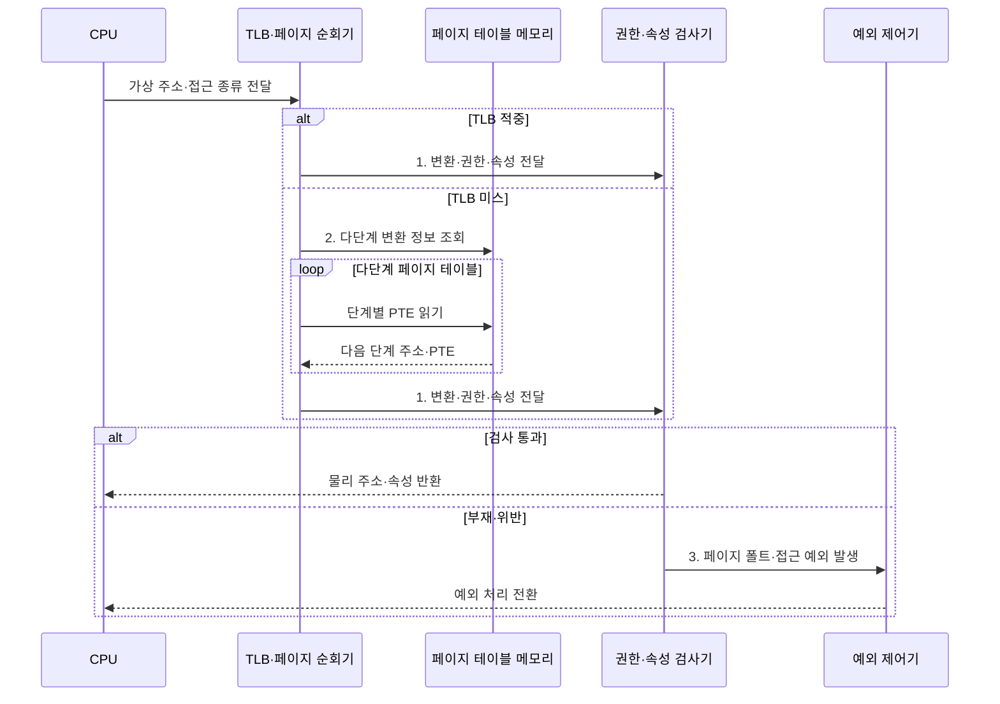

---
sidebar:
  order: 20
  label: "020. MMU 메모리 관리 장치 (Memory Management Unit)"
  badge:
    text: "기출 · 70%"
    variant: note
title: "MMU 메모리 관리 장치 (Memory Management Unit)"
date: "2026-07-30T18:41:28+09:00"
tags:
  - "notes-hardware"
weight: 20
extra:
  question_no: "020"
  source_status: "기출"
  source_history: "135회, 137회"
  priority: 70
  priority_note: "주소 변환·보호 경계의 반복 기출 주제"
---

## 미리 알고가기

- **메모리 관리 장치(Memory Management Unit, MMU)**: 가상 주소를 물리 주소로 변환하고 페이지별 접근 권한을 검사하는 하드웨어다
- **가상 주소·물리 주소(Virtual·Physical Address)**: 프로세스가 쓰는 주소가 가상 주소, 실제 메모리 위치가 물리 주소이며 MMU가 페이지 번호만 바꾸고 오프셋은 그대로 붙인다
- **가상 페이지 번호(Virtual Page Number, VPN)·물리 프레임 번호(Physical Frame Number, PFN)**: 각각 주소 변환의 입력 가상 페이지와 출력 물리 프레임을 식별하는 번호
- **페이지 테이블 항목(Page Table Entry, PTE)**: 물리 프레임 번호·접근 권한·메모리 속성을 저장하는 주소 변환 항목
- **변환 색인 버퍼(Translation Lookaside Buffer, TLB)**: 최근 주소 변환 결과와 접근 권한을 저장하는 하드웨어 캐시
- **TLB 미스(TLB Miss)**: 찾는 변환이 캐시에 없어 페이지 테이블까지 내려가야 하는 상태
- **페이지 테이블 순회기(Page Table Walker)**: 그때 다단계 표의 PTE를 차례로 읽어 변환을 찾고 TLB에 채워 넣는 장치
- **메모리 속성(Memory Attribute)**: 그 영역이 캐시에 담겨도 되는지, 여러 코어가 공유하는지, 실행이 허용되는지 같은 성질
- **권한·속성 검사기(Permission and Attribute Checker)**: PTE가 허용한 읽기·쓰기·실행과 메모리 속성을 실제 요청과 대조해 통과시킬지 예외를 낼지 정하는 회로
- **예외 제어기(Exception Controller)**: 매핑이 없거나 권한을 어겼다는 판정을 프로세서의 예외 처리 흐름으로 넘기는 구성요소
- **페이지 폴트(Page Fault)**: 매핑이 없거나 무효이거나 권한을 어겨 운영체제 처리가 필요한 예외
- **메모리 보호 장치(Memory Protection Unit, MPU)**: 주소 변환 없이 사전에 설정한 메모리 영역의 접근 권한을 검사하는 장치
- **임베디드 시스템(Embedded System)**: 정해진 기능만 수행하도록 장치에 내장된 컴퓨터이며, 실행할 코드가 고정돼 있어 주소 변환보다 영역 보호가 중요하다
- **실시간 시스템(Real-time System)**: 정해진 시간 안에 반드시 응답해야 하는 시스템이며, 페이지 폴트처럼 언제 튈지 모르는 지연을 피하려고 고정 메모리 구성을 고른다
- **운영체제(Operating System, OS)**: 프로세스·메모리·장치를 관리하고 페이지 테이블을 구성하는 시스템 소프트웨어
- **하이퍼바이저(Hypervisor)**: 여러 가상 머신에 물리 자원을 나눠 주고 주소 변환까지 중재하는 가상화 계층
- **가상 머신(Virtual Machine, VM)**: 하이퍼바이저가 물리 자원을 분할·격리하여 제공하는 독립 실행 환경
- **게스트 주소·호스트 주소(Guest·Host Address)**: 가상 머신 안 운영체제가 보는 주소가 게스트 주소, 실제 시스템이 관리하는 주소가 호스트 주소다
- **중첩 페이징(Nested Paging)**: 게스트 변환과 호스트 변환을 하드웨어가 두 단계로 이어서 수행하는 구조이며, 표를 두 벌 순회해야 해 미스 비용이 배로 든다
- **결합 TLB(Combined TLB)**: 그 두 단계를 거친 최종 결과를 한 항목에 담아 두어 두 번의 순회를 한 번의 조회로 줄이는 캐시
- **대형 페이지(Large Page)**: 기본 페이지보다 큰 변환 단위이며 항목 하나가 더 넓은 범위를 덮어 미스와 순회를 함께 줄인다
- **TLB 슛다운(TLB Shootdown)**: 페이지 테이블 변경 뒤 다른 코어의 오래된 TLB 엔트리까지 무효화하는 동기화 절차

## Ⅰ. 개요

- 정의/개념: **가상 주소 변환·접근 보호** 하드웨어
- 배경/필요성: 모든 메모리 접근의 **권한 검사 강제**

### 쉽게 이해하기 (학습용)

- MMU는 모든 메모리 접근이 통과하는 하드웨어 경계에서 주소 변환과 권한 검사를 강제한다.

## Ⅱ. 특징

- 주소 변환으로 **가상 배치·물리 프레임** 분리
- 매 접근마다 강제되는 **페이지 권한 검사**
- **TLB**로 변환 결과를 재사용하는 계층 구조

### 쉽게 이해하기 (학습용)

- MMU는 가상 주소와 물리 배치를 분리하고, TLB에 최근 변환을 보관해 페이지 테이블 조회를 줄인다.

## Ⅲ. 구조 및 구성요소

| 구성요소 | 책임 |
|:---|:---|
| TLB | 최근 **PFN·권한** 조회 |
| 페이지 테이블 순회기 | PTE 탐색과 **TLB 채움** |
| 권한·속성 검사기 | 접근 권한·**메모리 속성** 대조 |
| 예외 제어기 | 부재·위반의 **예외 전달** |

### 쉽게 이해하기 (학습용)
- TLB와 순회기가 주소를 찾고 검사기가 권한을 확인하며 실패는 예외 제어기로 전달한다.

## Ⅳ. 흐름도

**동작 원리**

- **1. 변환·권한·속성 전달**: 검사기로 전달
- **2. 다단계 변환 정보 조회**: 가상 페이지 번호를 따라 페이지 테이블 항목 탐색
- **3. 페이지 폴트·접근 예외 발생**: 부재·위반을 예외 처리 경로로 전환

### 쉽게 이해하기 (학습용)

- TLB 적중과 페이지 순회 결과 모두 같은 권한·속성 검사기를 통과해야 한다

## Ⅴ. 종류 및 비교

| 메모리 보호 장치 | MMU | MPU |
|:---|:---|:---|
| 적용 기준 | 범용 **OS**·가상화로 주소 공간을 나눌 때 | **실시간 시스템**의 지연 변동을 막을 때 |
| 핵심 특징 | 가상 주소 변환과 **페이지 단위 보호** | 변환 없는 **고정 영역 권한 검사** |
| 한계 | 미스 시 **페이지 순회** 지연 변동 | 동적 매핑·**요구 페이징** 미지원 |

> 요약: MMU는 동적 주소, MPU는 고정 영역

### 쉽게 이해하기 (학습용)

- MMU는 프로세스마다 주소 공간을 바꾸고 페이지를 필요할 때 적재할 수 있지만 순회 지연이 생기며, MPU는 고정 영역 권한만 검사해 지연은 예측하기 쉽지만 동적 매핑과 요구 적재를 제공하지 않는다

## Ⅵ. 실무 고려사항 및 대책

| 고려사항 | 대책 | 효과 |
|:---|:---|:---|
| TLB 미스의 **순회 병목** | 지연 측정·대형 페이지 선별 | **변환 비용** 감소 |
| 변경 후 **오래된 엔트리** | 범위 무효화·**TLB 슛다운** 검증 | **변환·권한 일치** |
| **중첩 페이징**의 순회 증폭 | **결합 TLB**·대형 페이지 | **2단계 지연** 완화 |
| 실시간 경로의 **폴트 변동** | 메모리 고정·MPU 적용 | **응답 예측성** 확보 |

### 쉽게 이해하기 (학습용)

- 수십 기가바이트를 훑는 데이터베이스는 작은 페이지로는 안내표가 아무리 많아도 범위를 못 덮으므로, 항목 하나가 훨씬 넓은 구역을 맡게 바꿔 대장 조회 자체를 줄인다

## Ⅶ. 결론

- 동적 주소 격리는 **MMU**, 고정 실시간 보호는 **MPU** 선택

### 쉽게 이해하기 (학습용)

- 프로세스마다 독립된 주소 공간을 주고 필요할 때 올려 쓰는 것이 목적이면 변환 장치를 쓰고, 응답 시간이 한 번도 튀면 안 되는 제어 장비라면 변환을 포기하고 정해진 구역의 출입만 검사하는 쪽을 고른다
