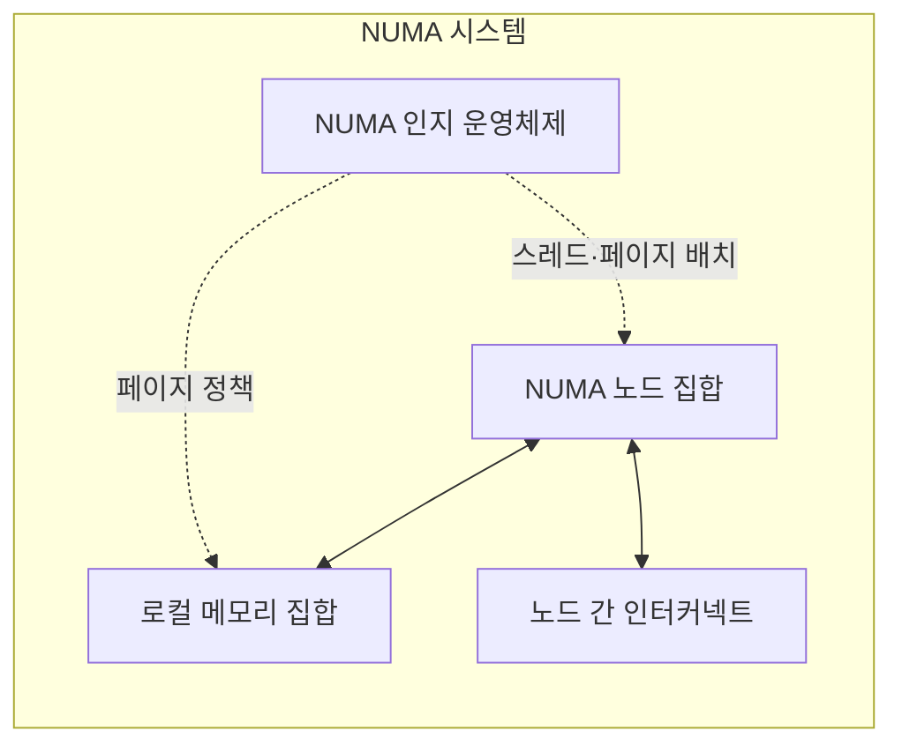
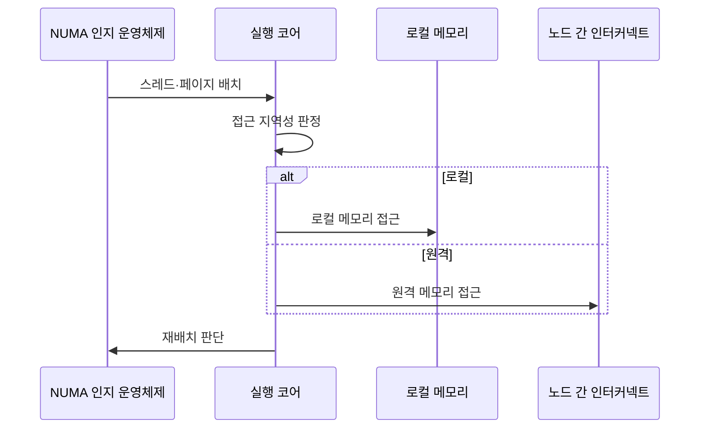

---
sidebar:
  order: 21
  label: "021. NUMA 비균등 메모리 접근 (Non-Uniform Memory Access)"
  badge:
    text: "미출제 · 50%"
    variant: note
title: "NUMA 비균등 메모리 접근 (Non-Uniform Memory Access)"
date: "2026-07-25T01:25:00+09:00"
tags:
  - "notes-hardware"
weight: 21
extra:
  question_no: "021"
  source_status: "미출제"
  source_history: ""
  priority: 50
  priority_note: "스레드·페이지 지역성의 핵심 선택 주제"
---

## 미리 알고가기

- **불균일 메모리 접근(Non-Uniform Memory Access, NUMA)**: 메모리를 노드별로 분산하여 로컬·원격 메모리의 접근 지연이 달라지는 다중 프로세서 구조
- **NUMA 노드(NUMA Node)**: CPU·메모리를 묶은 운영체제 지역성 도메인
- **중앙처리장치(Central Processing Unit, CPU, 시피유)**: 영문 각 단어의 첫 글자를 따 CPU로 표기하며 명령을 실행하고 NUMA에서 스레드의 실행 노드를 정하는 장치
- **로컬·원격 메모리**: 실행 노드의 직접 메모리와 다른 노드 메모리
- **최초 접근 정책(First-Touch Policy)**: 처음 접근한 노드에 물리 페이지를 배치하는 정책
- **CPU 친화도(CPU Affinity)**: 스레드 실행 코어를 특정 노드에 제한하는 정책
- **페이지 마이그레이션(Page Migration)**: 페이지를 접근 코어에 가까운 노드로 이동
- **캐시 일관 비균일 메모리 접근(Cache-Coherent Non-Uniform Memory Access, ccNUMA)**: 노드별 메모리 접근 지연은 다르지만 공유 주소 공간의 캐시 일관성을 하드웨어로 유지하는 NUMA 구조
- **균일 메모리 접근(Uniform Memory Access, UMA, 우마)**: 영문 각 단어의 첫 글자를 따 UMA로 표기하며 모든 프로세서가 같은 지연으로 공유 메모리에 접근하는 구조
- **동적 랜덤 접근 메모리(Dynamic Random-Access Memory, DRAM, 디램)**: 영문 각 단어의 첫 글자를 따 DRAM으로 표기하며 전하를 주기적으로 복원하는 주기억장치용 메모리
- **노드 간 인터커넥트(Inter-node Interconnect)**: 서로 다른 NUMA 노드의 원격 메모리 요청과 응답을 운반하는 연결망
- **메모리 제어기·채널(Memory Controller·Channel)**: 메모리 제어기는 주소와 명령 타이밍을 관리하고 채널은 노드의 DRAM과 데이터를 전송하는 독립 경로
- **다중 소켓(Multi-socket)**: 둘 이상의 프로세서 패키지 접속부를 한 시스템에 구성해 각 소켓의 코어와 로컬 메모리를 NUMA 노드로 묶는 구조
- **누마 인지 운영체제(NUMA-aware Operating System)**: 스레드 친화도와 물리 페이지 위치를 함께 관리해 원격 메모리 접근을 줄이는 시스템 소프트웨어
- **데이터베이스 워커·버퍼 풀(Database Worker·Buffer Pool)**: 워커는 질의를 실행하는 스레드이고 버퍼 풀은 자주 쓰는 데이터 페이지를 보관하는 메모리 영역으로서 같은 NUMA 노드에 배치하면 원격 접근이 줄어든다.
- **자동 누마 균형(Automatic NUMA Balancing)**: 운영체제가 페이지 접근 패턴을 관찰해 스레드나 페이지를 더 가까운 노드로 재배치하는 기능

## Ⅰ. 개요

- 정의/개념: 메모리를 노드별 분산해 용량·대역폭을 확장하는 구조
- 기존 한계: 모든 프로세서가 단일 메모리 경로를 공유하면 코어 증가에 따라 대역폭 경합과 접근 지연이 커져 확장성이 제한된다.

### 쉽게 이해하기 (학습용)

- 직원과 자료를 여러 지점에 두며 다른 지점 자료는 전용 통로로 받는다

## Ⅱ. 특징

- 노드별 메모리는 용량·대역폭을 확장한다
- 로컬 접근은 원격 접근보다 지연이 짧다
- 원격 접근은 인터커넥트 경합·지연을 높인다
- 스레드·페이지 배치가 응답 성능을 좌우한다

### 쉽게 이해하기 (학습용)

- 지점을 늘려도 직원과 자료가 떨어지면 전용 통로 대기로 느려진다

## Ⅲ. 아키텍처 및 구성요소

| 구성요소 | 설명 |
|:---|:---|
| NUMA 노드 집합 | 코어·캐시·메모리 제어기의 지역성 도메인 |
| 로컬 메모리 집합 | 노드별 직접 연결 DRAM과 메모리 채널 |
| 노드 간 인터커넥트 | 원격 메모리 요청·응답 전달 경로 |
| NUMA 인지 운영체제 | 스레드 친화도·페이지 배치·이동 정책 |

> 요약: 운영체제가 지역성을 맞추고 원격 요청만 연결망을 거친다

### 쉽게 이해하기 (학습용)

- 배치 담당자가 직원과 자료를 같은 지점에 두고 원격 요청만 통로로 보낸다

## Ⅳ. 원리 및 절차 흐름도

| 절차 | 설명 |
|:---|:---|
| 스레드·페이지 배치 | 친화도·최초 접근 정책으로 초기 위치 결정 |
| 접근 지역성 판정 | 현재 실행 노드와 페이지 소속 노드 비교 |
| 로컬 메모리 접근 | 실행 노드의 직접 연결 메모리 사용 |
| 원격 메모리 접근 | 인터커넥트로 다른 노드 메모리 사용 |
| 재배치 판단 | 원격 비율·이동 비용으로 유지·이동 선택 |

> 요약: 원격 접근이 누적되면 스레드나 페이지를 가까운 노드로 옮긴다

### 쉽게 이해하기 (학습용)

- 다른 지점 자료를 자주 찾으면 직원이나 자료를 가까운 지점으로 옮긴다

## Ⅴ. 종류 및 비교

| 판단 기준 | NUMA | UMA |
|:---|:---|:---|
| 핵심 특징 | 노드별 메모리·용량·대역폭 확장 | 단일 공유 경로·일관된 지연 |
| 적용 기준 | 다중 소켓·용량·대역폭 확장 | 소규모·단순 메모리 관리 |
| 주요 위험 | 원격 지연·배치 민감도 | 공유 경로 경합·확장 한계 |

> 요약: 확장성과 대역폭은 NUMA, 단순 관리는 UMA가 적합하다

### 쉽게 이해하기 (학습용)

- 큰 조직은 지점형 메모리, 작은 조직은 중앙형 메모리가 단순하다

## Ⅵ. 실무 사례

1. 데이터베이스: 워커·버퍼 풀을 같은 NUMA 노드에 고정

### 쉽게 이해하기 (학습용)

- 데이터베이스 직원과 자주 쓰는 자료를 같은 지점에 고정한다

## Ⅶ. 결론

- 용량·대역폭 확장은 NUMA, 스레드·페이지는 같은 노드

### 쉽게 이해하기 (학습용)

- 지점을 늘리되 직원과 자료를 가까이 두어 전용 통로 사용을 줄인다
