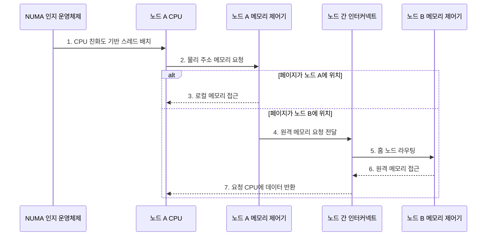

---
sidebar:
  order: 21
  label: "021. NUMA 비균등 메모리 접근 (Non-Uniform Memory Access)"
  badge:
    text: "미출 · 50%"
    variant: note
title: "NUMA 비균등 메모리 접근 (Non-Uniform Memory Access)"
date: "2026-07-28T12:46:21+09:00"
tags:
  - "notes-hardware"
weight: 21
extra:
  question_no: "021"
  source_status: "미출"
  source_history: ""
  priority: 50
  priority_note: "스레드·페이지 지역성의 핵심 선택 주제"
---

## 미리 알고가기

- **불균일 메모리 접근(Non-Uniform Memory Access, NUMA)**: 메모리를 노드별로 분산하여 로컬·원격 메모리의 접근 지연이 달라지는 다중 프로세서 구조
- **NUMA 노드(NUMA Node)**: CPU·메모리를 묶은 운영체제 지역성 도메인
- **중앙처리장치(Central Processing Unit, CPU)**: 명령을 실행하고 NUMA에서 스레드의 실행 노드를 정하는 장치
- **로컬·원격 메모리**: 실행 노드의 직접 메모리와 다른 노드 메모리
- **최초 접근 정책(First-Touch Policy)**: 처음 접근한 노드에 물리 페이지를 배치하는 정책
- **CPU 친화도(CPU Affinity)**: 스레드 실행 코어를 특정 노드에 제한하는 정책
- **페이지 마이그레이션(Page Migration)**: 페이지를 접근 코어에 가까운 노드로 이동
- **캐시 일관 비균일 메모리 접근(Cache-Coherent Non-Uniform Memory Access, ccNUMA)**: 노드별 메모리 접근 지연은 다르지만 공유 주소 공간의 캐시 일관성을 하드웨어로 유지하는 NUMA 구조
- **균일 메모리 접근(Uniform Memory Access, UMA)**: 모든 프로세서가 같은 지연으로 공유 메모리에 접근하는 구조
- **동적 랜덤 접근 메모리(Dynamic Random-Access Memory, DRAM)**: 전하를 주기적으로 복원하는 주기억장치용 메모리
- **노드 간 인터커넥트(Inter-node Interconnect)**: 서로 다른 NUMA 노드의 원격 메모리 요청과 응답을 운반하는 연결망
- **메모리 제어기·채널(Memory Controller·Channel)**: 메모리 제어기는 주소와 명령 타이밍을 관리하고 채널은 노드의 DRAM과 데이터를 전송하는 독립 경로
- **다중 소켓(Multi-socket)**: 둘 이상의 프로세서 패키지 접속부를 한 시스템에 구성해 각 소켓의 코어와 로컬 메모리를 NUMA 노드로 묶는 구조
- **누마 인지 운영체제(NUMA-aware Operating System)**: 스레드 친화도와 물리 페이지 위치를 함께 관리해 원격 메모리 접근을 줄이는 시스템 소프트웨어
- **데이터베이스 워커·버퍼 풀(Database Worker·Buffer Pool)**: 워커는 질의를 실행하는 스레드이고 버퍼 풀은 자주 쓰는 데이터 페이지를 보관하는 메모리 영역으로서 같은 NUMA 노드에 배치하면 원격 접근이 줄어든다.
- **자동 누마 균형(Automatic NUMA Balancing)**: 운영체제가 페이지 접근 패턴을 관찰해 스레드나 페이지를 더 가까운 노드로 재배치하는 기능

## Ⅰ. 개요

- 정의/개념: 노드별 **로컬 메모리**로 용량과 대역폭을 늘린 구조
- 배경/필요성: 단일 메모리 경로의 **경합·지연** 완화

### 쉽게 이해하기 (학습용)

- 직원과 자료를 여러 지점에 두며 다른 지점 자료는 전용 통로로 받는다

## Ⅱ. 특징

- 노드별 **로컬 메모리**에 따른 용량·대역폭 확장
- **원격 메모리** 접근에 따른 인터커넥트 경합·지연 증가
- 스레드·페이지의 **NUMA 친화 배치**가 좌우하는 응답 성능

### 쉽게 이해하기 (학습용)

- 지점을 늘려도 직원과 자료가 떨어지면 전용 통로 대기로 느려진다

## Ⅲ. 구조 및 구성요소

| 구성요소 | 책임 |
|:---|:---|
| NUMA 노드 집합 | 지역 **연산·캐시** 제공 |
| 로컬 메모리 집합 | 노드별 **DRAM·채널** 제공 |
| 노드 간 인터커넥트 | 원격 요청·응답 **전달** |
| NUMA 인지 운영체제 | 스레드·페이지 **배치·이동** |

### 쉽게 이해하기 (학습용)
- 운영체제가 스레드와 페이지를 같은 노드에 배치하고 원격 접근만 인터커넥트로 전달한다.

## Ⅳ. 흐름도

**동작 원리**

- **1. CPU 친화도 기반 스레드 배치**: 가까운 CPU 선택
- **2. 물리 주소 메모리 요청**: 로컬 제어기 전달
- **3. 로컬 메모리 접근**: 직접 연결 DRAM 응답
- **4. 원격 메모리 요청 전달**: 인터커넥트 전달
- **5. 홈 노드 라우팅**: 주소 담당 노드 선택
- **6. 원격 메모리 접근**: 홈 노드 DRAM 응답
- **7. 요청 CPU에 데이터 반환**: 원격 응답 전달

### 쉽게 이해하기 (학습용)

- 배치 담당자가 직원과 자료를 같은 지점에 두고 원격 요청만 통로로 보낸다

## Ⅴ. 종류 및 비교

| 판단 기준 | NUMA | UMA |
|:---|:---|:---|
| 적용 기준 | 다중 소켓·용량·대역폭 확장 | 소규모·단순 메모리 관리 |
| 핵심 특징 | 노드별 메모리·용량·대역폭 확장 | 단일 공유 경로·일관된 지연 |
| 한계 | 원격 지연·**배치 민감도** | 공유 경로 경합·**확장 한계** |

> 요약: 확장은 NUMA, 단순 관리는 UMA

### 쉽게 이해하기 (학습용)

- 큰 조직은 지점형 메모리, 작은 조직은 중앙형 메모리가 단순하다

## Ⅵ. 실무 고려사항 및 대책

| 고려사항 | 대책 | 효과 |
|:---|:---|:---|
| 스레드와 페이지 분리로 원격 접근률 상승 | CPU 친화도와 페이지 노드별 사용량을 함께 관찰 | 로컬 접근 비율 증가 |
| 단일 초기화 스레드로 최초 접근 배치 편향 | 실제 처리 스레드가 병렬 초기화하도록 구성 | 페이지 균등 분산 |
| 자동 균형의 잦은 페이지 이동 | 마이그레이션 임계치·주기와 이동 비용 조정 | 재배치 진동 감소 |
| 원격 트래픽으로 인터커넥트 포화 | 워커·버퍼 풀 분할과 노드별 복제 검토 | 대역폭 경합 완화 |

> 사례: 워커·버퍼 풀을 같은 노드에 배치

### 쉽게 이해하기 (학습용)

- 이동 비용과 접근 지속성을 확인하고 데이터베이스 워커와 버퍼 풀을 같은 노드에 배치한다.

## Ⅶ. 결론

- **로컬 접근률·원격 지연·링크 사용률** 기반 배치

### 쉽게 이해하기 (학습용)

- 지점을 늘리되 직원과 자료를 가까이 두어 전용 통로 사용을 줄인다
