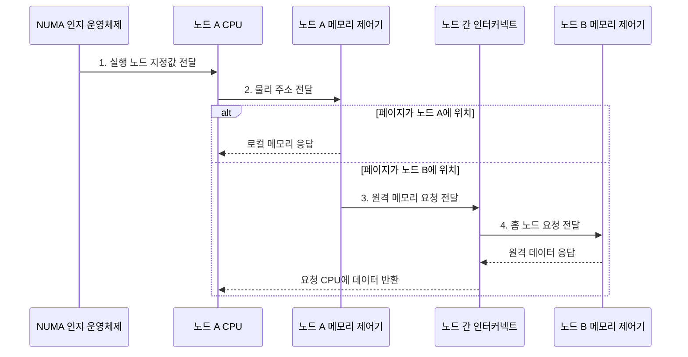

---
sidebar:
  order: 21
  label: "021. NUMA 비균등 메모리 접근 (Non-Uniform Memory Access)"
  badge:
    text: "미출 • 50%"
    variant: note
title: "NUMA 비균등 메모리 접근 (Non-Uniform Memory Access)"
date: "2026-08-05T00:45:06+09:00"
tags:
  - "notes-hardware"
weight: 21
extra:
  question_no: "021"
  source_status: "미출"
  source_history: ""
  priority: 50
  priority_note: "스레드•페이지 지역성의 핵심 선택 주제"
---

## Ⅰ. 개요

<details><summary>핵심 용어</summary>

- **NUMA**: Non-Uniform Memory Access, 노드 위치에 따라 접근 지연이 다른 구조
- **NUMA 노드**: CPU 코어와 로컬 메모리를 묶은 운영체제의 지역성 도메인
- **메모리 경합**: 여러 CPU의 요청이 같은 메모리 경로나 제어기에 몰려 대기 시간이 늘어나는 현상

</details>

- 정의/개념: CPU와 메모리를 노드별로 분산해 **로컬•원격 메모리 접근 지연** 이 다른 다중 프로세서 구조
- 배경/필요성: 단일 메모리 경로의 **경합•지연** 완화

#### 한줄 요약

- 직원과 자료를 여러 지점에 두며 다른 지점 자료는 전용 통로로 받는다

## Ⅱ. 특징

<details><summary>핵심 용어</summary>

- **CPU**: Central Processing Unit, 프로그램 명령을 실행하는 중앙 처리 장치
- **로컬 메모리**: 실행 CPU와 같은 NUMA 노드에 연결된 메모리
- **원격 메모리**: 실행 CPU와 다른 NUMA 노드에 연결된 메모리
- **ccNUMA**: Cache-Coherent NUMA, 공유 주소 공간의 캐시 일관성을 유지하는 구조
- **노드 간 인터커넥트**: 원격 메모리 요청과 응답을 노드 사이에서 운반하는 연결망
- **캐시 일관성**: 여러 노드의 캐시가 같은 메모리 블록에 대해 최신값과 단일 쓰기 권한을 유지하는 성질

</details>

- 노드별 **로컬 메모리** 에 따른 용량•대역폭 확장
- **원격 메모리** 접근에 따른 인터커넥트 경합•지연 증가
- **ccNUMA** 공유 주소 공간의 캐시 일관성 유지

#### 한줄 요약

- 지점을 늘려도 직원과 자료가 떨어지면 전용 통로 대기로 느려진다

## Ⅲ. 구조 및 구성요소

<details><summary>핵심 용어</summary>

- **메모리 제어기**: 메모리 주소와 명령 타이밍을 관리하는 구성요소
- **메모리 채널**: 메모리 제어기와 DRAM 사이에서 데이터를 전송하는 경로
- **NUMA 인지 운영체제**: 스레드 실행 위치와 물리 페이지 배치를 함께 관리하는 운영체제
- **페이지 마이그레이션**: 자주 접근하는 CPU에 가까운 노드로 물리 페이지를 옮기는 동작
- **DRAM**: Dynamic Random Access Memory, 주기적 재충전이 필요한 주기억장치

</details>

```text
                  [NUMA 인지 운영체제]
                            |
                            |
[로컬 메모리] -- [NUMA 노드] -- [노드 간 인터커넥트]
```

선의 의미: NUMA 노드가 로컬 메모리와 노드 간 연결망에 결합되고, 운영체제가 노드의 배치 정책을 관리하는 정적 구조다.

| 구성요소 | 책임 |
|:---|:---|
| NUMA 노드 | 지역 **연산•캐시** 제공 |
| 로컬 메모리 | 노드별 **DRAM•채널** 제공 |
| 노드 간 인터커넥트 | 원격 요청•응답 **전달** |
| NUMA 인지 운영체제 | 스레드•페이지 **배치•이동** |

#### 한줄 요약
- 운영체제가 스레드와 페이지를 같은 노드에 배치하고 원격 접근만 인터커넥트로 전달한다.

## Ⅳ. 흐름도

<details><summary>핵심 용어</summary>

- **CPU 친화도**: 스레드가 실행할 코어 또는 NUMA 노드를 제한하는 정책
- **홈 노드**: 특정 물리 주소의 메모리를 실제로 보유하고 요청을 처리하는 노드
- **원격 메모리 요청**: 로컬 노드에 없는 페이지를 인터커넥트로 다른 노드에서 읽는 접근
- **실행 노드 지정값**: CPU 친화도 정책에 따라 스레드가 실행할 코어나 NUMA 노드를 나타내는 정보

</details>



**동작 원리**

- **1. 실행 노드 지정값 전달**: CPU 친화도에 맞는 실행 코어 지정
- **2. 물리 주소 전달**: 주소로 로컬•원격 위치 판정
- **3. 원격 메모리 요청 전달**: 인터커넥트 전달
- **4. 홈 노드 요청 전달**: 주소 담당 노드의 DRAM 접근

#### 한줄 요약

- 배치 담당자가 직원과 자료를 같은 지점에 두고 원격 요청만 통로로 보낸다

## Ⅴ. 종류 및 비교

<details><summary>핵심 용어</summary>

- **UMA**: Uniform Memory Access, 모든 프로세서의 공유 메모리 접근 지연이 같은 구조
- **다중 소켓**: 둘 이상의 프로세서 패키지와 각 소켓의 로컬 메모리를 노드로 구성한 시스템
- **배치 민감도**: 스레드와 페이지 위치에 따라 성능이 크게 달라지는 NUMA의 특성
- **확장 한계**: 공유 메모리 경로의 대역폭과 중재 능력 때문에 프로세서 수를 늘려도 성능이 더 증가하지 않는 지점

</details>

| 메모리 구조 | NUMA | UMA |
|:---|:---|:---|
| 적용 기준 | 다중 소켓•**용량•대역폭 확장** | 소규모 **단순 메모리 관리** |
| 핵심 특징 | 노드별 메모리•**용량•대역폭 확장** | 단일 공유 경로•**일관된 지연** |
| 한계 | 원격 지연•**배치 민감도** | 공유 경로 경합•**확장 한계** |

> 요약: 확장은 NUMA, 단순 관리는 UMA

#### 한줄 요약

- 큰 조직은 지점형 메모리, 작은 조직은 중앙형 메모리가 단순하다

## Ⅵ. 실무 고려사항 및 대책

<details><summary>핵심 용어</summary>

- **최초 접근 정책**: 페이지를 처음 접근한 CPU의 NUMA 노드에 물리 메모리를 배치하는 정책
- **자동 NUMA 균형**: 접근 패턴을 관찰해 스레드나 페이지를 가까운 노드로 자동 재배치하는 기능
- **워커 지역화**: 질의 실행 스레드를 담당 데이터와 같은 노드에 두는 배치
- **버퍼 풀 지역화**: 자주 쓰는 데이터 페이지를 처리 노드에 두는 배치
- **병렬 초기화**: 실제 처리 스레드들이 각자 사용할 페이지를 처음 접근해 여러 NUMA 노드에 고르게 배치하는 방법
- **마이그레이션 임계치**: 페이지 이동을 시작할 원격 접근량 기준
- **마이그레이션 주기**: 페이지 접근 패턴을 다시 평가하는 시간 간격
- **재배치 진동**: 접근 패턴 변화나 낮은 임계치 때문에 페이지가 노드 사이를 반복 이동하는 현상

</details>

| 문제 | 대책 | 효과 |
|:---|:---|:---|
| 스레드와 페이지 분리로 **원격 접근률** 상승 | **CPU 친화도•페이지 위치** 함께 관찰 | **로컬 접근 비율** 증가 |
| 단일 초기화 스레드의 **최초 접근 배치 편향** | 실제 처리 스레드의 **병렬 초기화** | **페이지 균등 분산** |
| 자동 균형의 잦은 **페이지 이동** | **마이그레이션 임계치•주기** 조정 | **재배치 진동** 감소 |
| 원격 트래픽으로 **인터커넥트 포화** | **워커•버퍼 풀** 분할과 노드별 복제 | **대역폭 경합** 완화 |

> 사례: 워커•버퍼 풀을 같은 노드에 배치

#### 한줄 요약

- 이동 비용과 접근 지속성을 확인하고 데이터베이스 워커와 버퍼 풀을 같은 노드에 배치한다.

## Ⅶ. 결론

<details><summary>핵심 용어</summary>

- **용량 확장**: 노드를 추가해 전체 메모리 용량을 늘리는 효과
- **대역폭 확장**: 노드를 추가해 독립 메모리 채널 처리량을 늘리는 효과
- **일관 지연**: 어느 프로세서에서 접근해도 메모리 응답 시간이 같은 특성

</details>

- 다중 소켓 확장은 **NUMA**, 소규모 일관 지연은 **UMA** 선택

#### 한줄 요약

- 지점을 늘리되 직원과 자료를 가까이 두어 전용 통로 사용을 줄인다
