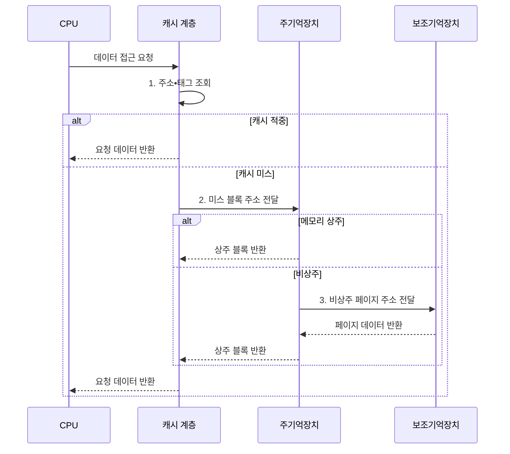

---
sidebar:
  order: 22
  label: "022. 메모리 계층 구조 (Memory Hierarchy)"
  badge:
    text: "기출 • 50%"
    variant: note
title: "메모리 계층 구조 (Memory Hierarchy)"
date: "2026-08-04T10:50:00+09:00"
tags:
  - "notes-hardware"
weight: 22
extra:
  question_no: "022"
  source_status: "기출"
  source_history: "123회"
  priority: 50
  priority_note: "속도•용량•비용 절충의 핵심 구조"
---

## Ⅰ. 개요

핵심 용어

- **메모리 계층**: 지연•용량•비트당 비용이 다른 저장장치를 단계적으로 조합하는 구조
- **지역성**: 최근 사용한 데이터나 그 주변 주소를 가까운 미래에 다시 접근하는 성질

- 정의/개념: 접근 지역성을 활용해 지연•용량•비트당 비용이 다른 저장장치를 단계적으로 조합한 **계층 구조**
- 배경/필요성: 저지연 저장장치만으로 **대용량•저비용 시스템을 구성하기 어려움**

#### 한줄 요약

- 빠른 저장장치는 작고 비싸므로, 메모리 계층은 속도•용량•비용이 다른 장치를 조합한다.

## Ⅱ. 특징

핵심 용어

- **시간 지역성**: 방금 사용한 데이터를 가까운 미래에 다시 접근하는 성질
- **공간 지역성**: 사용한 데이터의 인접 주소를 가까운 미래에 접근하는 성질
- **적중률**: 요청 데이터를 현재 계층에서 찾은 접근의 비율
- **미스율**: 요청 데이터를 현재 계층에서 찾지 못한 접근의 비율
- **평균 메모리 접근 시간(Average Memory Access Time, AMAT)**: 적중 시간에 미스율과 미스 페널티의 곱을 더한 평균 접근 시간
- **미스 페널티**: 현재 계층의 미스 뒤 하위 계층에서 데이터 블록을 가져오는 추가 지연

- 상위 계층일수록 짧은 지연•작은 용량•**높은 단가**
- **시간•공간 지역성** 이 상위 계층 적중률 좌우
- **적중 시간+미스율×미스 페널티** 로 AMAT 결정

$$
AMAT = Hit\ Time + Miss\ Rate \times Miss\ Penalty
$$

> 다음 계층의 AMAT는 미스 페널티에 포함

#### 한줄 요약

- 시간•공간 지역성이 적중률을 만들지만, 평균 지연은 적중 시간과 미스 페널티까지 함께 봐야 한다.

## Ⅲ. 구조 및 구성요소

핵심 용어

- **레지스터(Register)**: CPU 내부에서 현재 명령의 피연산자를 보관하는 저장 공간
- **SRAM**: Static Random-Access Memory, 캐시 블록을 보관하는 고속 메모리
- **동적 임의 접근 메모리(Dynamic Random-Access Memory, DRAM) 주기억장치**: 실행 중인 코드와 데이터를 큰 용량으로 제공하는 휘발성 메모리
- **솔리드 스테이트 드라이브(Solid-State Drive, SSD) 보조기억장치**: 비상주 페이지와 영구 데이터를 보관하는 비휘발성 저장장치
- **중앙 처리 장치(Central Processing Unit, CPU)**: 명령을 실행하고 레지스터와 캐시 계층을 가장 가까이 사용하는 연산 장치

| 구성요소 | 책임 |
|:---|:---|
| 레지스터 | 현재 명령의 **피연산자** 제공 |
| 캐시 계층 | 재사용 **SRAM 블록** 보관 |
| 주기억장치 | 실행 중 **코드•데이터** 제공 |
| 보조기억장치 | 비상주•영구 **데이터 보관** |

#### 한줄 요약

- 접근 빈도가 높은 데이터일수록 CPU와 가까운 저장 계층에 배치한다.

## Ⅳ. 흐름도

핵심 용어

- **캐시 블록**: 하위 계층에서 상위 계층으로 한 번에 전송하고 교체하는 연속 데이터 단위
- **미스 페널티**: 현재 계층에서 못 찾아 하위 계층을 조회하고 블록을 가져오는 추가 지연
- **비상주 페이지**: 주소 공간에는 존재하지만 현재 주기억장치에 올라와 있지 않은 페이지

**동작 원리**

- **1. 주소•태그 조회**: 캐시 배열에서 주소에 대응하는 태그와 블록 확인
- **2. 미스 블록 주소 전달**: 주기억장치에서 블록 조회
- **3. 비상주 페이지 주소 전달**: 보조기억장치에서 페이지 조회

#### 한줄 요약

- 상위 계층 미스가 인접 하위 계층으로 차례로 전파되므로, 더 아래까지 내려갈수록 접근 지연이 누적된다.

## Ⅴ. 종류 및 비교

핵심 용어

- **작업 집합**: 프로그램이 현재 집중적으로 반복 접근하는 코드와 데이터의 묶음
- **반복 교체**: 작업 집합이 계층 용량보다 커서 가져온 블록이 재사용 전에 계속 밀려나는 현상
- **비트당 비용**: 저장 용량 한 비트를 구현하는 데 드는 하드웨어 비용

| 계층 배치 위치 | 상위 계층 | 하위 계층 |
|:---|:---|:---|
| 적용 기준 | **작업 집합** 이 계층 용량 안일 때 | 접근 빈도가 낮고 총량이 클 때 |
| 핵심 특징 | 짧은 지연•작은 용량•**높은 단가** | 긴 지연•큰 용량•**낮은 단가** |
| 한계 | 용량 초과 시 **반복 교체** 손실 | 접근 시 **미스 페널티** 직격 |

> 요약: 상위 배치는 **작업 집합** 이 담길 때만 이득으로 성립

#### 한줄 요약

- 두 칸을 견주면 상위 배치가 무조건 좋은 것이 아님이 보이는데, 책상에 올려 둔 서류가 책상 넓이를 넘어서면 새로 올릴 때마다 다른 것을 치워야 해서 올리고 치우는 일만 되풀이하게 되므로, 담길 만큼만 올리고 나머지는 아예 아래에 두는 편이 낫다

## Ⅵ. 실무 고려사항 및 대책

핵심 용어

- **캐시 블로킹**: 큰 계산을 캐시에 들어가는 조각으로 나눠 조각 안에서 데이터를 반복 재사용하는 최적화
- **선인출**: 사용할 것으로 예상한 데이터를 요청 전에 미리 가져오는 기법
- **캐시 오염**: 잘못 가져온 데이터가 유용한 캐시 블록을 밀어내는 현상
- **데이터 온도**: 최근 접근 빈도로 데이터를 뜨거움과 차가움으로 구분하는 계층 배치 기준
- **선인출 정확도**: 미리 가져온 블록 중 실제 사용된 비율
- **오염률**: 선인출 데이터가 유용한 캐시 블록을 밀어낸 비율

| 문제 | 대책 | 효과 |
|:---|:---|:---|
| 용량보다 큰 **작업 집합** | **캐시 블로킹**•계층별 미스율 측정 | **반복 교체** 식별 |
| 적중률 대비 긴 **미스 페널티** | **AMAT•계층 지연** 관찰 | **평균 지연** 평가 |
| 과도한 선인출의 **캐시 오염** | **정확도•오염률** 조정 | **대역폭 낭비** 감소 |
| 확장 계층의 **지연 변동** | **데이터 온도**별 배치•이동 기준 | 용량 확대 시 **평균 접근 지연 증가 제한** |

#### 한줄 요약

- 큰 행렬을 통째로 훑으면 한 줄을 다 보기도 전에 앞부분이 밀려나 재사용이 사라지므로, 캐시에 들어가는 정사각형 조각으로 잘라 그 안에서 곱셈을 다 끝낸 뒤 다음 조각으로 넘어간다

## Ⅶ. 결론

핵심 용어

- **재사용 데이터**: 가까운 시간 안에 같은 값이나 블록을 다시 접근할 가능성이 높은 데이터
- **일회성 데이터**: 한 번 순차적으로 읽은 뒤 다시 사용할 가능성이 낮은 데이터

- 재사용 데이터는 **상위 계층**, 일회성 데이터는 **하위 계층** 배치

#### 한줄 요약

- 데이터가 크냐 작냐가 아니라 같은 것을 다시 건드릴 일이 있느냐가 배치를 정하므로, 한 번 훑고 버릴 자료는 아무리 급해도 아래에 두고 조금씩이라도 반복해서 보는 자료를 위로 올린다
