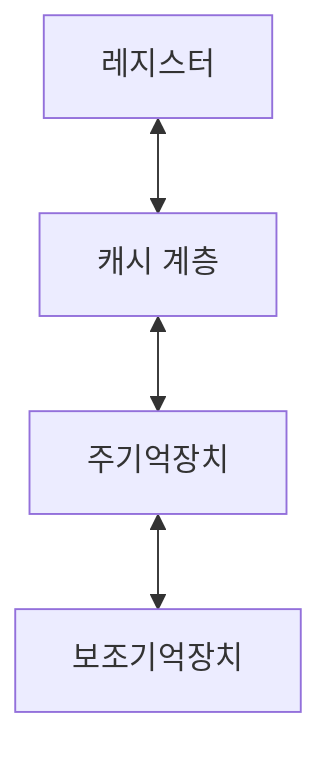
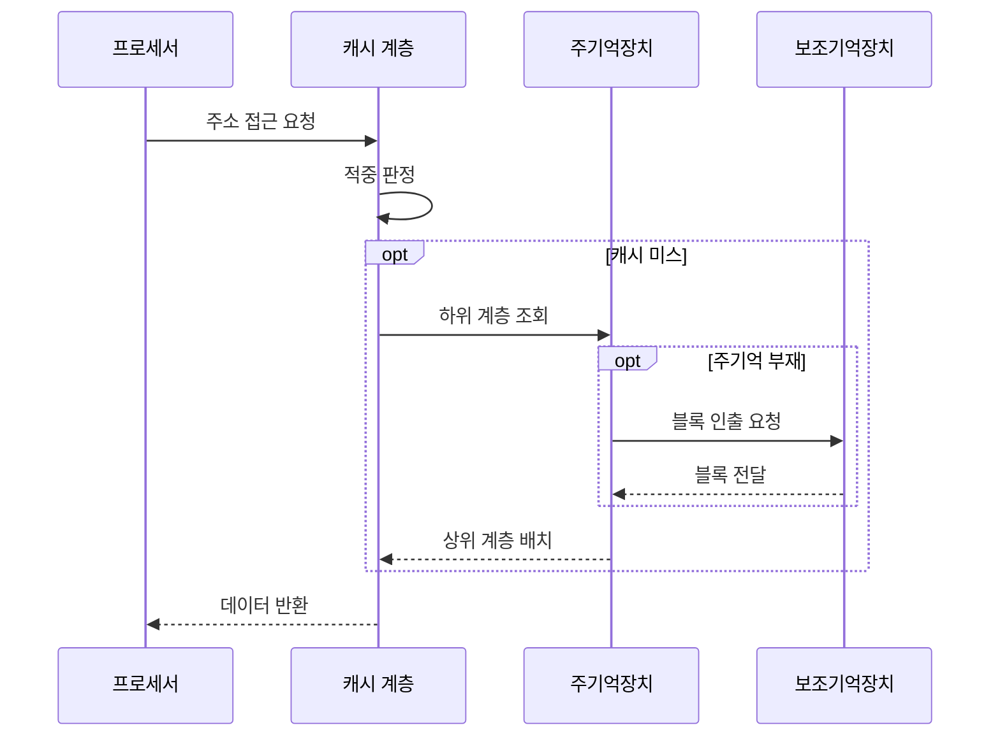

---
sidebar:
  order: 22
  label: "022. 메모리 계층 구조 (Memory Hierarchy)"
  badge:
    text: "기출 · 50%"
    variant: note
title: "메모리 계층 구조 (Memory Hierarchy)"
date: "2026-07-27T23:59:59+09:00"
tags:
  - "notes-hardware"
weight: 22
extra:
  question_no: "022"
  source_status: "기출"
  source_history: "123회"
  priority: 50
  priority_note: "속도·용량·비용 절충의 핵심 구조"
---

## 미리 알고가기

- **메모리 계층(Memory Hierarchy)**: 지연·용량·비트당 비용이 다른 저장장치를 계층화하고 지역성이 높은 데이터를 상위 계층에 배치하는 구조
- **시간 지역성(Temporal Locality)**: 방금 쓴 데이터를 곧 다시 쓸 가능성이 높다는 성질
- **공간 지역성(Spatial Locality)**: 방금 쓴 주소의 바로 옆을 곧 쓸 가능성이 높다는 성질이며, 그래서 한 바이트가 아니라 블록째 끌어올린다
- **캐시 블록(Cache Block)**: 하위 계층에서 상위로 한꺼번에 끌어올려 저장하고 교체하는 연속 데이터 단위
- **적중률(Hit Rate)·미스율(Miss Rate)**: 지금 계층에서 바로 찾은 비율과 못 찾은 비율이며 둘을 더하면 1이다
- **미스 페널티(Miss Penalty)**: 못 찾았을 때 아래 계층까지 다녀와 블록을 끌어올리는 데 드는 추가 지연
- **평균 메모리 접근 시간(Average Memory Access Time, AMAT)**: 적중 시간에 미스율과 미스 페널티의 곱을 더하여 구한 평균 접근 지연
- **레지스터(Register)**: 명령이 직접 이름을 대고 읽고 쓰는 가장 작고 빠른 프로세서 내부 저장 공간
- **정적 랜덤 접근 메모리(Static Random-Access Memory, SRAM)**: 래치로 비트를 유지하여 빠르지만 셀 면적이 커서 주로 캐시에 사용하는 메모리
- **래치(Latch)**: 출력을 입력으로 되먹여 상태를 스스로 붙들고 있는 회로
- **동적 랜덤 접근 메모리(Dynamic Random-Access Memory, DRAM)**: 커패시터 전하를 주기적으로 복원하며 높은 집적도를 제공하는 주기억장치
- **솔리드 스테이트 드라이브(Solid-State Drive, SSD)**: 플래시 메모리로 비휘발성 대용량 저장을 제공하는 보조기억장치
- **비휘발성(Non-volatility)**: 전원이 끊겨도 저장한 값이 남아 있는 성질
- **작업 집합(Working Set)**: 프로그램이 지금 집중해서 건드리는 코드와 데이터 묶음이며, 이것이 캐시보다 크면 끌어올리자마자 밀려난다
- **캐시 블로킹(Cache Blocking)**: 큰 계산을 캐시에 들어가는 크기로 잘라 그 조각 안에서 반복 재사용한 뒤 다음 조각으로 넘어가는 최적화 기법
- **행렬 연산(Matrix Operation)**: 행과 열로 놓인 수치를 계산하는 작업이며 같은 값을 여러 번 곱해 쓰므로 블로킹 효과가 큰 대표 사례다
- **컴퓨트 익스프레스 링크 메모리(Compute Express Link Memory, CXL Memory)**: CXL 인터커넥트로 외부 메모리를 연결하여 호스트의 메모리 용량을 확장하는 계층

## Ⅰ. 개요

- 정의/개념: **지역성**에 따라 저장 계층을 쌓아 지연·용량·비용을 절충한 구조
- 기존 한계: 단일 저장 기술로는 **지연·용량·비용** 동시 충족 불가

### 쉽게 이해하기 (학습용)

- 모든 데이터를 레지스터만큼 빠른 소자에 담으면 값이 감당이 안 되고 전부 디스크에 담으면 프로세서가 놀게 되는데, 답안이 배경 자리에 이 셋 중 둘밖에 못 얻는 사정을 적은 이유는 계층 구조가 더 좋은 소자를 찾아낸 결과가 아니라 어느 소자도 셋을 다 못 준다는 사실에서 나온 타협이기 때문이다

## Ⅱ. 특징

- 상위 계층일수록 짧은 지연·작은 용량·**높은 단가**
- **시간·공간 지역성**이 상위 계층 적중률 좌우
- **적중 시간+미스율×미스 페널티**로 AMAT 결정

### 쉽게 이해하기 (학습용)

- 계층이 성립하는 근거가 둘째 줄에 있는데, 방금 쓴 것을 곧 다시 쓰고 그 옆자리도 곧 쓴다는 습관이 없다면 위에 올려 둔 것이 매번 헛것이 되어 계층 자체가 무의미해지고, 게다가 헛걸음이 드물어도 한 번의 값이 크면 평균은 그 한 번에 끌려가므로 적중률만 보고 좋다고 말할 수 없다

## Ⅲ. 아키텍처 및 구성요소

| 설계 요소 | 설명 |
|:---|:---|
| 레지스터 | 명령이 직접 지정하는 **최고속 저장 공간** |
| 캐시 계층 | 재사용 블록을 담는 **SRAM** 기반 계층 |
| 주기억장치 | 실행 중 코드·데이터를 담는 **DRAM** 영역 |
| 보조기억장치 | **비휘발성** 대용량 보관을 맡는 SSD 계층 |

> 요약: 인접 계층끼리만 주고받아 **블록 단위** 이동이 아래로 전파

### 쉽게 이해하기 (학습용)

- 화살표가 한 칸씩만 위아래로 이어지고 레지스터에서 디스크로 곧장 가는 선이 없다는 점이 요지인데, 어느 계층도 두 단계 아래를 직접 부르지 않고 바로 아래에만 물어보므로 아래로 내려갈수록 값이 누적돼 맨 아래까지 내려가는 한 번이 그렇게 비싸진다

## Ⅳ. 원리 및 절차 흐름도

| 절차 | 설명 |
|:---|:---|
| 주소 접근 요청 | 명령이 지정한 주소의 **데이터 요구** |
| 적중 판정 | 요청 **캐시 블록**의 존재·유효 확인 |
| 하위 계층 조회 | 한 단계 아래 계층으로만 **요청 전달** |
| 블록 인출 요청 | **비휘발성** 계층에서 원본 블록 요구 |
| 블록 전달 | 확보한 블록의 **상위 전달** |
| 상위 계층 배치 | 재사용 대비 **교체 후 적재** |
| 데이터 반환 | 적중 데이터의 **프로세서 전달** |

> 요약: 미스 깊이가 깊을수록 **미스 페널티**가 계층 수만큼 누적

### 쉽게 이해하기 (학습용)

- 상위 계층에서 미스가 발생할수록 하위 계층의 추가 접근 지연이 누적되므로, 동일한 미스라도 데이터가 발견되는 계층에 따라 평균 메모리 접근 시간이 크게 달라진다

## Ⅴ. 종류 및 비교

| 계층 배치 위치 | 상위 계층 | 하위 계층 |
|:---|:---|:---|
| 적용 기준 | **작업 집합**이 계층 용량 안일 때 | 접근 빈도가 낮고 총량이 클 때 |
| 핵심 특징 | 짧은 지연·작은 용량·**높은 단가** | 긴 지연·큰 용량·**낮은 단가** |
| 한계 | 용량 초과 시 **반복 교체** 손실 | 접근 시 **미스 페널티** 직격 |

> 요약: 상위 배치는 **작업 집합**이 담길 때만 이득으로 성립

### 쉽게 이해하기 (학습용)

- 두 칸을 견주면 상위 배치가 무조건 좋은 것이 아님이 보이는데, 책상에 올려 둔 서류가 책상 넓이를 넘어서면 새로 올릴 때마다 다른 것을 치워야 해서 올리고 치우는 일만 되풀이하게 되므로, 담길 만큼만 올리고 나머지는 아예 아래에 두는 편이 낫다

## Ⅵ. 실무 사례

1. 행렬 연산은 **캐시 블로킹**으로 작업 집합 재사용

### 쉽게 이해하기 (학습용)

- 큰 행렬을 통째로 훑으면 한 줄을 다 보기도 전에 앞부분이 밀려나 재사용이 사라지므로, 캐시에 들어가는 정사각형 조각으로 잘라 그 안에서 곱셈을 다 끝낸 뒤 다음 조각으로 넘어간다

## Ⅶ. 결론

- 접근 지연 최소화를 위해 재사용·용량을 검토하여 **메모리 계층** 활용

### 쉽게 이해하기 (학습용)

- 데이터가 크냐 작냐가 아니라 같은 것을 다시 건드릴 일이 있느냐가 배치를 정하므로, 한 번 훑고 버릴 자료는 아무리 급해도 아래에 두고 조금씩이라도 반복해서 보는 자료를 위로 올린다
