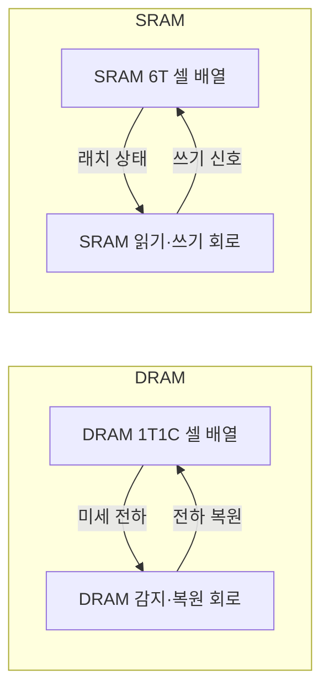
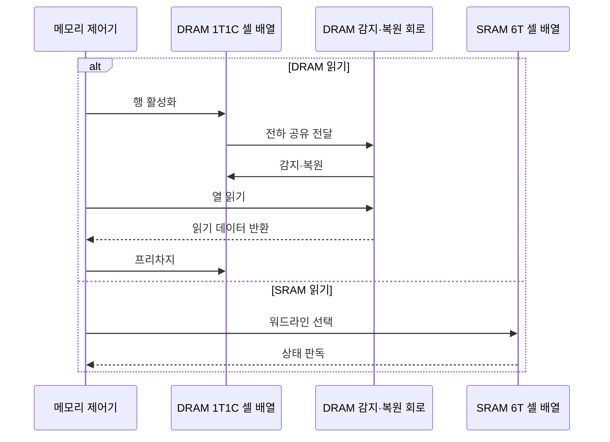

---
sidebar:
  order: 23
  label: "023. DRAM과 SRAM 비교 (DRAM vs SRAM)"
  badge:
    text: "기출 · 50%"
    variant: note
title: "DRAM과 SRAM 비교 (DRAM vs SRAM)"
date: "2026-07-27T23:59:59+09:00"
tags:
  - "notes-hardware"
weight: 23
extra:
  question_no: "023"
  source_status: "기출"
  source_history: "125회"
  priority: 50
  priority_note: "셀 구조·지연·밀도 비교"
---

## 미리 알고가기

- **DRAM과 SRAM**: 한 비트를 물통에 담긴 물의 양으로 기억하느냐 스위치가 어느 쪽으로 넘어가 있느냐로 기억하느냐의 차이이며, 물통은 작아서 많이 놓을 수 있지만 물이 새어 계속 채워 줘야 하고 스위치는 자리를 많이 차지하지만 볼 때마다 그대로 서 있다
- **동적 랜덤 접근 메모리(Dynamic Random-Access Memory, DRAM)**: ‘디램’으로 읽고 영문 머리글자를 단어처럼 읽는 약어이며, 커패시터 전하를 주기적으로 복원하는 고밀도 메모리다
- **정적 랜덤 접근 메모리(Static Random-Access Memory, SRAM)**: ‘에스램’으로 읽고 영문 머리글자를 단어처럼 읽는 약어이며, 래치로 비트를 유지해 복원이 필요 없는 고속 메모리다
- **1T1C 셀(One Transistor One Capacitor Cell)**: ‘원 티 원 씨 셀’로 읽으며 접근 트랜지스터 하나와 커패시터 하나로 DRAM 비트 하나를 담는 구조
- **6T 셀(Six Transistor Cell)**: ‘식스 티 셀’로 읽고 트랜지스터 수를 T 앞에 쓴 표기이며, 트랜지스터 4개의 교차 결합 인버터 2개와 접근 트랜지스터 2개로 SRAM 비트를 유지한다
- **인버터(Inverter)**: 입력의 논릿값을 뒤집어 내보내는 회로이며 둘을 서로 물리면 값이 스스로 유지되는 래치가 된다
- **워드라인(Word Line)**: 한 행의 접근 트랜지스터를 한꺼번에 여는 선
- **비트라인(Bit Line)**: 열린 셀의 값을 읽고 쓰는 신호가 오가는 선
- **감지 증폭기(Sense Amplifier)**: 셀 전하가 비트라인에 만든 아주 작은 전압 차를 판별 가능한 크기로 키우는 회로
- **복원(Restore)**: DRAM은 읽는 순간 전하가 비트라인으로 흩어지므로, 감지한 값을 그 셀에 곧바로 다시 써 넣어야 하는 동작
- **리프레시(Refresh)**: 읽지 않아도 새어 나가는 전하를 메우려고 모든 행을 주기적으로 열었다 닫는 동작
- **프리차지(Precharge)**: 다음 행을 열기 전에 비트라인 전압을 중간값으로 되돌려 놓는 준비 동작
- **비파괴 판독(Non-destructive Read)**: 읽어도 저장 상태가 무너지지 않아 다시 써 넣을 필요가 없는 판독이며 SRAM의 성질이다
- **행·열(Row·Column)**: 워드라인으로 한꺼번에 열리는 셀 묶음이 행, 그중 실제로 내보낼 위치를 고르는 것이 열이다
- **데이터 버스(Data Bus)**: 선택한 열의 읽기·쓰기 데이터를 메모리 제어기와 주고받는 병렬 신호 경로
- **휘발성(Volatility)**: 전원이 끊기면 저장한 값이 사라지는 성질이며 두 메모리 모두 해당한다
- **L1 캐시(Level 1 Cache)**: ‘엘 원 캐시’로 읽고 Level과 첫 계층 번호를 결합한 표기이며, 코어에 가장 가까워 SRAM으로 만드는 캐시다

## Ⅰ. 개요

- **정의/개념**: 전하 셀과 래치 셀로 용량·지연을 나눠 맡는 **휘발성 메모리**
- **기존 한계**: 단일 셀 구조로는 **고밀도·저지연** 동시 확보 불가

### 쉽게 이해하기 (학습용)

- 셀을 작게 만들면 한 비트를 담을 힘도 작아져 읽을 때마다 증폭하고 다시 채워야 하고 셀을 크게 만들면 읽기는 즉시 끝나지만 같은 면적에 훨씬 적게 들어가는데, 답안이 배경 자리에 이 못 겸함을 적은 이유는 두 메모리가 경쟁 제품이 아니라 계층의 서로 다른 칸을 맡는 짝이기 때문이다

## Ⅱ. 특징

- DRAM **1T1C 셀**의 고밀도와 낮은 비트 단가
- SRAM **6T 래치**의 비파괴 판독과 짧은 지연
- 전원 차단 시 값이 사라지는 공통 **휘발성**

### 쉽게 이해하기 (학습용)

- 부품 수 하나와 여섯이라는 차이가 밀도와 속도를 동시에 갈라 버리는데, 소자 하나짜리는 같은 웨이퍼에 수십 배 많이 찍어 낼 수 있어 기가바이트를 싸게 만들고 여섯 개짜리는 값이 비싼 대신 읽을 때 증폭도 복원도 없이 스위치 방향만 보면 끝나며, 둘 다 전기가 끊기면 기억이 사라진다는 점만은 같다

## Ⅲ. 아키텍처 및 구성요소

| 설계 요소 | 설명 |
|:---|:---|
| DRAM 1T1C 셀 배열 | 접근 트랜지스터와 **커패시터 전하**로 비트 보관 |
| DRAM 감지·복원 회로 | **감지 증폭기** 증폭 후 셀 전하 재기록 |
| SRAM 6T 셀 배열 | 교차 결합 **인버터 래치**로 비트 유지 |
| SRAM 읽기·쓰기 회로 | **워드라인·비트라인** 기반 래치 상태 입출력 |

> 요약: DRAM만 읽기 경로에 **복원 회귀선**이 필요

### 쉽게 이해하기 (학습용)

- 왼쪽 상자에만 셀로 되돌아가는 화살표가 하나 더 있는 것이 두 메모리의 값 차이를 그대로 보여 주는데, 물통을 들여다보는 순간 물이 쏟아지므로 본 값을 곧바로 다시 부어 놓아야 하고 그 되붓는 시간이 매 읽기에 붙는다

## Ⅳ. 원리 및 절차 흐름도

| 절차 | 설명 |
|:---|:---|
| 행 활성화 | **워드라인** 개방으로 행 전체 셀 연결 |
| 전하 공유 전달 | 셀 전하가 만든 **미세 전압 차** 전달 |
| 감지·복원 | 증폭된 값의 판독과 **셀 재기록** |
| 열 읽기 | 선택 열 결과의 **데이터 버스** 출력 |
| 읽기 데이터 반환 | 선택 열의 증폭 결과를 제어기에 반환 |
| 프리차지 | 비트라인 평형화로 **다음 행 준비** |
| 워드라인 선택 | 래치의 **비트라인 연결** |
| 상태 판독 | 래치 값의 **비파괴 판독** |

> 요약: DRAM은 한 읽기에 **복원·프리차지**까지 묶여 지연 누적

### 쉽게 이해하기 (학습용)

- 같은 읽기인데 위쪽은 다섯 걸음이고 아래쪽은 두 걸음이라는 것이 이 절의 전부인데, 물통 쪽은 열고·재고·되붓고·꺼내고·비트라인을 되돌려 놓기까지 해야 다음 행을 건드릴 수 있으므로 이 뒤처리가 곧 연속 접근 사이의 최소 간격이 된다

## Ⅴ. 종류 및 비교

| 휘발성 메모리 | DRAM | SRAM |
|:---|:---|:---|
| 적용 기준 | 기가바이트급 용량이 우선일 때 | 나노초급 **접근 지연**이 우선일 때 |
| 핵심 특징 | **1T1C 셀** 고밀도와 낮은 비트 단가 | **6T 래치**의 즉시 판독 |
| 한계 | **복원·리프레시**에 묶이는 접근 간격 | 셀 면적에 따른 **높은 비트 단가** |

> 요약: 용량을 얻으면 **복원 지연**, 지연을 얻으면 **단가**를 부담

### 쉽게 이해하기 (학습용)

- 두 한계가 각각 시간과 돈이라는 다른 화폐로 청구된다는 점이 선택을 가르는데, 싼 쪽은 매 읽기마다 되붓는 시간을 내야 하고 빠른 쪽은 같은 용량을 만들려면 면적과 값을 수십 배 내야 하므로 어느 자원이 더 빠듯한지가 곧 답이다

## Ⅵ. 실무 사례

1. 서버 주기억장치는 **DRAM 채널**을 늘려 대용량 구성
2. 프로세서 **L1 캐시**는 SRAM으로 최저 지연 확보

### 쉽게 이해하기 (학습용)

- 서버 한 대에 수백 기가바이트를 담아야 하는데 래치 셀로는 값도 면적도 감당이 안 되므로, 작은 전하 셀을 촘촘히 심은 모듈을 여러 채널에 나눠 꽂아 용량과 대역폭을 함께 늘린다
- 코어 바로 옆 캐시는 한두 클록 안에 답이 나와야 하므로 증폭과 되붓기가 끼어들 여유가 없고, 그래서 값이 비싸도 스위치 방향을 그대로 읽는 셀을 쓴다

## Ⅶ. 결론

- 용량이 우선이면 **DRAM**, 접근 지연이 우선이면 **SRAM**

### 쉽게 이해하기 (학습용)

- 같은 자리에 무엇을 넣을지는 그 계층이 몇 나노초 안에 답해야 하는지로 갈리고, 그 시간 제약이 느슨한 계층부터는 값이 싼 쪽으로 내려 용량을 벌어야 전체 비용이 맞는다
