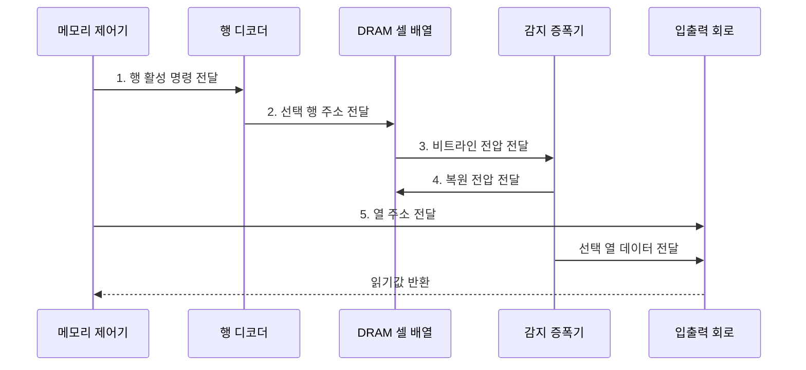

---
sidebar:
  order: 23
  label: "023. DRAM과 SRAM 비교 (DRAM vs SRAM)"
  badge:
    text: "기출 · 50%"
    variant: note
title: "DRAM과 SRAM 비교 (DRAM vs SRAM)"
date: "2026-08-02T10:43:00+09:00"
tags:
  - "notes-hardware"
weight: 23
extra:
  question_no: "023"
  source_status: "기출"
  source_history: "125회"
  priority: 50
  priority_note: "셀 구조·지연·밀도 비교"
---

## Ⅰ. 개요

핵심 용어

- **동적 임의 접근 메모리(Dynamic Random-Access Memory, DRAM)·정적 임의 접근 메모리(Static Random-Access Memory, SRAM)**: 전하 셀로 고밀도를 얻는 메모리와 래치 셀로 짧은 지연을 얻는 휘발성 메모리
- **휘발성**: 전원이 끊기면 저장한 값이 사라지는 성질

- 정의/개념: **전하 셀** 기반 DRAM은 고밀도를, **래치 셀** 기반 SRAM은 짧은 지연을 구현하는 휘발성 메모리
- 배경/필요성: 단일 셀 구조로는 **고밀도•저지연 동시 확보 곤란**

#### 한줄 요약

- DRAM은 용량을, SRAM은 접근 속도를 담당하여 메모리 계층의 서로 다른 위치에 배치된다.

## Ⅱ. 특징

핵심 용어

- **1T1C 셀**: 트랜지스터 하나와 커패시터 하나로 DRAM 1비트를 저장하는 구조
- **6T 래치**: 교차 결합 인버터와 접근 트랜지스터로 SRAM 상태를 유지하는 구조
- **비파괴 판독**: 읽어도 저장 상태가 무너지지 않아 복원이 필요 없는 SRAM의 판독 특성
- **동적 임의 접근 메모리(Dynamic Random-Access Memory, DRAM)·정적 임의 접근 메모리(Static Random-Access Memory, SRAM)**: 각각 전하 셀과 래치 셀을 사용하는 휘발성 메모리

- DRAM의 **1T1C 셀** 기반 고밀도와 낮은 비트 단가
- SRAM의 **6T 래치** 기반 비파괴 판독과 짧은 지연
- 전원 차단 시 값이 사라지는 공통 **휘발성**

#### 한줄 요약

- DRAM은 1T1C로 밀도를 높이지만 판독 후 복원이 필요하고, SRAM은 6T 래치로 상태를 유지해 복원 없이 빠르게 읽는다.

## Ⅲ. 구조 및 구성요소

핵심 용어

- **워드라인·비트라인**: 셀 행을 선택하고 읽기·쓰기 신호를 전달하는 배선
- **감지 증폭기**: DRAM 셀의 미세한 비트라인 전압 차를 논리값으로 증폭하는 회로
- **복원**: 파괴적 판독 후 감지한 값을 DRAM 셀에 다시 기록하는 동작
- **동적 임의 접근 메모리(Dynamic Random-Access Memory, DRAM)·정적 임의 접근 메모리(Static Random-Access Memory, SRAM)**: 각각 감지·복원 회로와 래치 유지 회로를 사용하는 메모리

| 구성요소 | 책임 |
|:---|:---|
| DRAM 1T1C 셀 배열 | **고밀도 전하 비트** 보관 |
| DRAM 감지·복원 회로 | 전압 증폭·**전하 재기록** |
| SRAM 6T 셀 배열 | **비파괴 래치 상태** 유지 |
| SRAM 읽기·쓰기 회로 | 워드·비트라인 **입출력** |

#### 한줄 요약

- DRAM은 전하를 복원하고 SRAM은 래치 상태를 유지하도록 회로가 나뉜다.

## Ⅳ. 흐름도

핵심 용어

- **행 활성**: 선택한 DRAM 행의 셀을 비트라인과 연결하는 동작
- **열 선택**: 활성화한 행에서 실제로 입출력할 데이터 위치를 고르는 동작
- **프리차지**: 다음 행을 열기 전에 비트라인 전압을 기준 상태로 되돌리는 준비 동작
- **동적 임의 접근 메모리(Dynamic Random-Access Memory, DRAM)**: 행 활성·감지·복원을 거쳐 전하 셀의 데이터를 읽는 메모리

**동작 원리**

- **1. 행 활성 명령 전달**: 대상 행 지정
- **2. 선택 행 주소 전달**: 셀을 비트라인에 연결
- **3. 비트라인 전압 전달**: 미세 전압 판별
- **4. 복원 전압 전달**: 판독값을 셀 전하로 재기록
- **5. 열 주소 전달**: 출력할 열 지정

#### 한줄 요약

- DRAM은 판독이 셀 전하를 훼손하므로 감지한 값을 즉시 복원하지만, SRAM은 래치 상태가 유지된다.

## Ⅴ. 종류 및 비교

핵심 용어

- **리프레시**: 누설되는 DRAM 셀 전하를 보충하려고 모든 행을 주기적으로 복원하는 동작
- **비트 단가**: 저장 용량 한 비트를 구현하는 데 드는 칩 면적과 제조 비용
- **접근 지연**: 메모리 요청 후 데이터를 읽거나 쓰기까지 걸리는 시간
- **동적 임의 접근 메모리(Dynamic Random-Access Memory, DRAM)·정적 임의 접근 메모리(Static Random-Access Memory, SRAM)**: 각각 용량·비트 단가와 접근 지연에 강점이 있는 휘발성 메모리

| 휘발성 메모리 | DRAM | SRAM |
|:---|:---|:---|
| 적용 기준 | **기가바이트급 용량** 이 우선일 때 | 나노초급 **접근 지연** 이 우선일 때 |
| 핵심 특징 | **1T1C 셀** 고밀도와 낮은 비트 단가 | **6T 래치** 의 즉시 판독 |
| 한계 | 접근 간격을 묶는 **복원·리프레시** | 셀 면적에 따른 **높은 비트 단가** |

> 요약: 용량 선택 시 **복원 지연** 부담, 지연 선택 시 **단가 부담**

#### 한줄 요약

- 필요한 용량과 허용 접근 시간을 기준으로 DRAM과 SRAM의 배치 위치를 정한다.

## Ⅵ. 실무 고려사항 및 대책

핵심 용어

- **행 적중**: 이미 열린 DRAM 행에서 열만 선택해 프리차지와 재활성화를 피하는 접근
- **누설 전력**: 회로가 전환하지 않을 때도 트랜지스터를 통해 소비되는 전력
- **오류 정정 코드(Error-Correcting Code, ECC)**: 추가 검사 비트로 메모리 비트 오류를 검출하고 정정하는 기법
- **동적 임의 접근 메모리(Dynamic Random-Access Memory, DRAM)·정적 임의 접근 메모리(Static Random-Access Memory, SRAM)**: 각각 리프레시 지연과 면적·누설 전력을 관리해야 하는 메모리

| 문제 | 대책 | 효과 |
|:---|:---|:---|
| 메모리 요청을 중단하는 **리프레시** | **분산 실행·온도별 주기** | **지연 급증** 완화 |
| 행 전환의 **프리차지 비용** | **주소 매핑·행 적중** 스케줄 | **유효 대역폭** 증가 |
| SRAM의 **면적•누설 전력** | **크기·연관도·전력 차단** 조정 | 목표 지연 내 **면적•누설 전력 제한** |
| 셀 오류의 **데이터 손상** | ECC 기반 정정과 **오류율·온도 감시** | **비트 오류 검출•정정** |

#### 한줄 요약

- 서버 한 대에 수백 기가바이트를 담아야 하는데 래치 셀로는 값도 면적도 감당이 안 되므로, 작은 전하 셀을 촘촘히 심은 모듈을 여러 채널에 나눠 꽂아 용량과 대역폭을 함께 늘린다

## Ⅶ. 결론

핵심 용어

- **캐시 메모리**: 중앙 처리 장치(Central Processing Unit, CPU) 가까이에서 재사용 데이터를 짧은 지연으로 제공하는 소용량 SRAM 계층
- **정적 임의 접근 메모리(Static Random-Access Memory, SRAM)·동적 임의 접근 메모리(Dynamic Random-Access Memory, DRAM)**: 각각 캐시와 대용량 주기억장치에 사용하는 휘발성 메모리
- **주기억장치**: 실행 중인 대량의 코드와 데이터를 보관하는 고밀도 DRAM 계층

- 캐시는 **SRAM**, 대용량 주기억장치는 **DRAM** 배치

#### 한줄 요약

- 나노초급 응답이 필요한 캐시는 SRAM, 대용량 주기억장치는 DRAM으로 구성한다.
